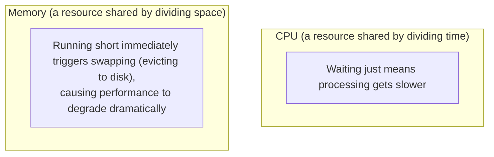
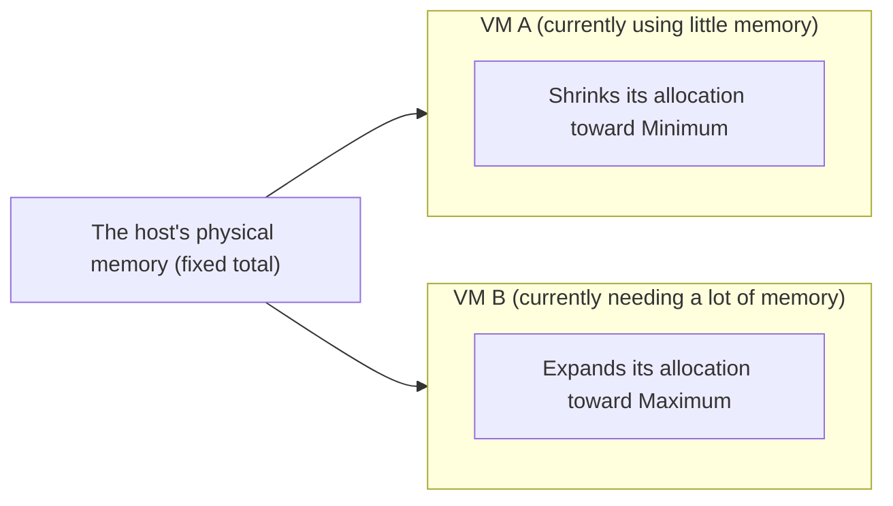

## Introduction

- **What You'll Learn From This Article**: This article answers the question "when building several virtual machines on Hyper-V, what CPU and memory utilization should you design for," through two distinct design axes: **CPU overcommit** and **memory overcommit**. It systematically explains why these two resources differ so much in their tolerance for overcommitting, and what Hyper-V's Dynamic Memory feature actually does.
- **Intended Audience**: This article is aimed at engineers who work with building or operating virtual machines in a Hyper-V environment but who can't concretely explain the criteria for designing CPU and memory resources.
- **Estimated Reading Time**: About 17 minutes

This article is part of the [Top 1% Series' full article guide](/en/sitemap), and the second article in the [Virtualization Fundamentals Series](/en/sitemap#series-list). See [What Is Proxmox VE? Understanding KVM/QEMU Virtualization from the "Top 1%" Perspective](/en/articles/proxmox-internals-guide) for the basic mechanics of virtualization (explained using KVM/QEMU as an example).

## Prerequisites

- **Overcommit**: A state where the total resources assigned to virtual machines exceeds the amount of resources physically present. This is a design technique that relies on the premise that it's rare for every virtual machine to max out its resources at the same time.

## Getting the Big Picture

### CPU and Memory Have Completely Different Tolerances for Overcommitting

When assigning CPU and memory to Hyper-V virtual machines, the starting point for resource design is understanding a key difference in nature between the two: **"overcommitting CPU is common practice, but overcommitting memory requires much more careful design."**

## Fundamentals, Explained Thoroughly

### CPU Overcommit: Tolerance Stemming From Time-Slicing

CPU is a resource shared by having multiple virtual machines' virtual processors (vCPUs) **take turns using a physical CPU core's execution time, in extremely short time slices.** On the premise that **it's rare in practice for every virtual machine to demand 100% CPU at the same time**, **CPU overcommit** — assigning a total vCPU count exceeding the physical core count — is a widely practiced, common design technique.

The specific ratio (how many vCPUs to assign per physical core) **varies significantly depending on the nature of the workload running on the virtual machine.** A workload with low CPU utilization, with only intermittent bursts of processing (a typical business system, for example) can tolerate a relatively high overcommit ratio, but a workload with consistently high CPU utilization (a database server, for example) needs a low overcommit ratio, or a design avoiding overcommit entirely.

### Memory Overcommit: Strictness Stemming From Space-Division

Memory, too, can technically be assigned to virtual machines in a total amount exceeding physical memory, using Hyper-V's **Dynamic Memory** feature. But **unlike CPU, memory triggers serious performance degradation the instant it runs short** — a decisively different characteristic.

If CPU runs short, a virtual machine simply **waits longer in queue (processing slows down)** — that's the extent of the impact. If memory runs short, on the other hand, the OS **evicts infrequently used data to a page file on disk (swapping).** Disk access is orders of magnitude slower than memory access, so **once memory swapping occurs, the entire system's responsiveness degrades dramatically.** This asymmetry is why CPU overcommit is widely accepted, while memory overcommit demands far more careful design.

### How Hyper-V's Dynamic Memory Works

Hyper-V's Dynamic Memory operates based on three values you set for a virtual machine:

| Setting | Meaning |
|---|---|
| **Startup RAM** | The initial amount of memory assigned when the virtual machine boots |
| **Minimum RAM** | The minimum amount of memory it can shrink to while running |
| **Maximum RAM** | The maximum amount of memory it can grow to while running |

Dynamic Memory is a mechanism that **continuously monitors how much memory is actually being used within a virtual machine, and dynamically increases or decreases its memory allocation as needed, within the range from Minimum RAM to Maximum RAM.** This lets memory that's actually sitting idle on one virtual machine get redirected to another virtual machine that needs it, improving the overall efficiency of physical memory usage.

**Setting Minimum RAM too low carries the risk that a virtual machine won't be guaranteed the memory it genuinely needs, potentially triggering swapping.** Even when using Dynamic Memory, it's important to correctly estimate each virtual machine's actual minimum memory requirement.

## The View From the Top 1% Perspective

### Designing With NUMA (Non-Uniform Memory Access) in Mind

Large physical servers use an architecture called **NUMA (Non-Uniform Memory Access)**, where each CPU socket has a dedicated region of memory assigned to it. **If the amount of vCPU and memory assigned to a virtual machine crosses the boundary of a single NUMA node (i.e., it needs to access memory belonging to a different CPU socket), extra access latency can occur, degrading performance.** When designing a large virtual machine, a practical performance consideration is factoring in that host's NUMA layout (physical core count and memory per CPU socket), and assigning resources within a single NUMA node's range wherever possible.

### The Importance of Ongoing Capacity Planning

CPU and memory overcommit ratios aren't a one-time design decision — an operational cycle of **continuously monitoring actual utilization with a performance monitor, and periodically reviewing any gap between what was assumed and what's actually happening**, is important. In practice, adding new virtual machines or a change in an existing workload's characteristics frequently makes an initially designed ratio no longer appropriate.

## Common Misconceptions and Pitfalls

- **Misconception 1: "Virtualizing eliminates the physical CPU/memory constraint itself"**
  Virtualization is a technology for flexibly sharing and distributing resources, but the constraint of the total physically present resources doesn't change. Overcommit is a design technique that leverages the premise that "maxing everything out at once is rare," nothing more.
- **Misconception 2: "Memory can be overcommitted at a similar ratio to CPU"**
  CPU is a resource shared by dividing time, so running short just means slower speed — but memory triggers immediate, serious swapping the moment it runs short, requiring a far more careful overcommit design than CPU.
- **Misconception 3: "Enabling Dynamic Memory automatically solves every memory shortage problem"**
  Dynamic Memory improves the host's overall memory efficiency, but if Minimum RAM is set inappropriately, the risk of swapping still remains.

## The Troubleshooting Perspective

For virtual machine performance issues, the basic approach is to **isolate whether the problem is CPU contention, or memory swapping.**

1. **A specific virtual machine feels sluggish overall**: Check that host's CPU utilization and vCPU wait time (CPU wait), and check whether CPU overcommit has become excessive.
2. **A specific virtual machine is extremely slow, particularly for operations involving disk I/O**: Check whether memory swapping is occurring. If using Dynamic Memory, check whether the Minimum RAM setting is too low relative to what's actually needed.
3. **Only a large virtual machine underperforms expectations**: Check that host's NUMA layout, and whether the assigned vCPU/memory crosses the boundary of a single NUMA node.

### Preventive Measures and Permanent Fixes

- Design the CPU overcommit ratio individually, based on each workload's characteristics (CPU utilization level), rather than applying a single ratio to every virtual machine.
- When using Dynamic Memory, estimate each virtual machine's actual minimum memory requirement ahead of time and reflect it in Minimum RAM.
- Establish an operational cycle of periodically checking actual utilization with a performance monitor and revisiting any gap from the initial design.

## Summary

- CPU is a resource shared by dividing time, so running short just means slower speed, and a relatively high overcommit ratio is widely accepted.
- Memory triggers immediate, serious swapping the moment it runs short, degrading performance dramatically, so it requires a far more careful overcommit design than CPU.
- Hyper-V's Dynamic Memory dynamically adjusts memory allocation based on actual usage, within the range set by Startup RAM, Minimum RAM, and Maximum RAM.
- For a large virtual machine, it's important for performance to factor in the host's NUMA layout and assign resources within a single NUMA node's range.

**What to Keep in Mind From Today**
1. When considering CPU and memory overcommit ratios, keep in mind their tolerances are completely different, and don't decide both using a single criterion.
2. When using Dynamic Memory, always confirm the Minimum RAM setting reflects each virtual machine's actual requirement.

## References

- [Hyper-V Dynamic Memory Overview | Microsoft Learn](https://learn.microsoft.com/en-us/windows-server/virtualization/hyper-v/manage/manage-hyper-v-dynamic-memory)
- [Plan for Hyper-V memory and CPU | Microsoft Learn](https://learn.microsoft.com/en-us/windows-server/virtualization/hyper-v/plan/plan-for-hyper-v-memory)
- [What Is NUMA? | Microsoft Learn](https://learn.microsoft.com/en-us/windows-hardware/drivers/kernel/introduction-to-numa)
