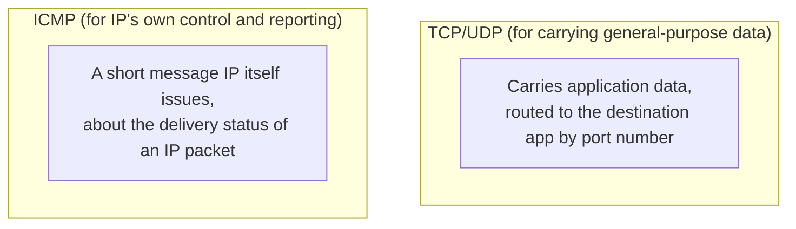
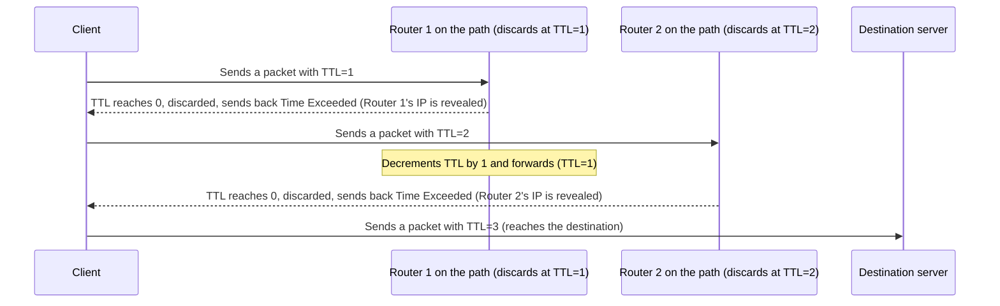

## Introduction

- **What You'll Learn From This Article**: Moving a step beyond understanding "ICMP is the protocol ping uses," this article systematically explains **why ICMP has no port number like TCP/UDP, and why it's treated as part of the network layer itself.** It also covers major message types like Destination Unreachable and Time Exceeded, how `traceroute` uses ICMP to visualize a network path, and the hard-to-diagnose pitfall that ICMP filtering on a firewall can create in practice.
- **Intended Audience**: This article is aimed at engineers who know how to use the `ping` command but who can't concretely explain the ICMP protocol's own structure, or how it's used beyond ping and outage detection.
- **Estimated Reading Time**: About 18 minutes

This article is part of the [Top 1% Series' full article guide](/en/sitemap), and the second article in the [Protocol Fundamentals Series](/en/sitemap#series-list). It assumes you understand the concept of a protocol itself from [Understanding What a Protocol Actually Is From a "Top 1%" Perspective](/en/articles/protocol-design-guide), and the entry point for why ICMP has no port number from [Understanding the Relationship Between TCP/UDP "Sessions" and Port Numbers from a "Top 1%" Perspective](/en/articles/tcp-udp-session-port-guide).

## Prerequisites

- **IP protocol number**: A field in the IP header indicating what protocol the payload is. ICMP is assigned protocol number `1`. See [Understanding the Relationship Between TCP/UDP "Sessions" and Port Numbers from a "Top 1%" Perspective](/en/articles/tcp-udp-session-port-guide) for details.

## Getting the Big Picture

### ICMP Is Inseparable From IP Itself

**ICMP is fundamentally different, in design position, from the transport-layer protocols (TCP/UDP) meant to carry general-purpose application data. ICMP's job is, in effect, IP's own error-reporting and control-message mechanism, letting the IP network itself report whether delivery "succeeded or failed."**

**The reason ICMP has no port number, unlike TCP/UDP, isn't a mere specification limitation — it stems from a fundamental difference in role: it's not "a mechanism for delivering data to an application," it's "a mechanism for reporting the IP network's own state."**

## Fundamentals, Explained Thoroughly

### The Structure of an ICMP Message

An ICMP message has a much simpler structure compared to a TCP/UDP header.

| Field | Content |
|---|---|
| **Type** | The message's broad category (Echo Request, Destination Unreachable, and so on) |
| **Code** | A subtype further dividing the Type |
| **Checksum** | For detecting message corruption |
| **Type-specific data** | Accompanying information, differing by Type |

**There's no port number field at all.** An ICMP message directly reports the delivery status of an IP packet back to its source (or a related device), so the concept of routing to a per-application destination simply isn't needed.

### Major ICMP Message Types

| Type | Name | Purpose |
|---|---|---|
| 8 / 0 | Echo Request / Echo Reply | The core of the `ping` command — confirming whether a remote host is alive (reachable) |
| 3 | Destination Unreachable | Notification that delivery failed. Its Code further divides it into "network unreachable," "host unreachable," "port unreachable," "fragmentation needed" (covered below), and more |
| 11 | Time Exceeded | Notification that an IP packet's TTL (time to live) reached zero and it was discarded |
| 5 | Redirect | Notification that a more optimal route (gateway) exists (often disabled today for security reasons) |

### How traceroute Uses Time Exceeded

`traceroute` (`tracert` on Windows) is a tool that visualizes each router along a path — but it **doesn't use a dedicated protocol of its own; it cleverly exploits the IP packet's TTL field and ICMP's Time Exceeded message.**

**`traceroute` keeps sending packets to the same destination, incrementing the TTL by 1 starting from 1.** Each router along the path that discards the packet once its TTL runs out sends back a **Time Exceeded** message to the source, so **recording the source IP address of each such message, one at a time, visualizes the routers along the path in order.**

### Path MTU Discovery (PMTUD), and the Pitfall Blocking ICMP on a Firewall Creates

**Destination Unreachable Code 4 (Fragmentation Needed)** is a message that particularly deserves attention in practice. It's a notification that **"this packet is too large — it exceeds the MTU (the maximum data size that can be sent at once) somewhere along the path, but the 'don't fragment' flag is set, so please resend it from the source at a smaller size."** This mechanism is called **Path MTU Discovery (PMTUD)**, and it's used to let the source dynamically figure out the appropriate packet size.

**If a firewall casually blocks "all" ICMP, this Fragmentation Needed notification stops getting through too, breaking PMTUD.** As a result, this leads to a hard-to-diagnose issue: **small packets (like the SYN packet establishing a TCP connection) get through fine, but only communication trying to send data beyond a certain size hangs with no response, for no apparent reason.**

ICMPv6's expanded role in IPv6

In IPv6, ICMP's role expands further — as **ICMPv6**, it absorbs functionality that used to be a separate protocol in the IPv4 era. A prime example is **NDP (Neighbor Discovery Protocol)**, which implements functionality equivalent to IPv4's ARP (a separate protocol from IP, resolving an IP address to a MAC address) as one of ICMPv6's message types. In IPv6, functions like router advertisement and router solicitation are also integrated into ICMPv6, giving ICMP a larger role than it had in the IPv4 era.

## The View From the Top 1% Perspective

### Controlling ICMP by Type, Not "Blocking Everything"

Out of an excess of security caution, it's common in practice to see a firewall configuration that uniformly blocks ICMP — but as noted above, **messages like Destination Unreachable (particularly Fragmentation Needed) and Time Exceeded carry information the network needs to function correctly.** The practically recommended approach is **fine-grained, per-Type control** — restricting only specific types like Echo Request (ping), while allowing the message types PMTUD and traceroute need.

## Common Misconceptions and Pitfalls

- **Misconception 1: "ICMP exists only for the ping command"**
  Beyond ping (Echo Request/Reply), ICMP plays a diverse set of roles reporting the IP network's own state — delivery error notifications (Destination Unreachable), TTL exceeded notifications (Time Exceeded), and more.
- **Misconception 2: "Blocking all ICMP is purely a security win with no side effects"**
  Blocking ICMP can break Path MTU Discovery, leading to a hard-to-diagnose issue where only communication involving packets beyond a certain size hangs, for no apparent reason.
- **Misconception 3: "ICMP has a port number too, just like TCP/UDP"**
  An ICMP message has no port number field at all — its purpose is reporting IP's own state, not routing to a destination application.

## The Troubleshooting Perspective

For ICMP-related issues, the basic approach is to **infer the cause from the pattern of the symptom — such as "ping works, but other communication fails" or "only data beyond a certain size fails."**

1. **Exchanging small amounts of data works fine, but transferring a large file hangs**: Suspect that ICMP's Fragmentation Needed notification is being blocked somewhere along the path, breaking PMTUD.
2. **`traceroute` stops getting a response at a specific hop**: That hop's router may be restricting Time Exceeded messages, or ICMP in general (not necessarily indicating a problem).
3. **Ping doesn't get through, but other communication (HTTPS, and so on) works normally**: Echo Request alone is likely being deliberately restricted on a firewall — not necessarily an abnormality.

### Preventive Measures and Permanent Fixes

- When controlling ICMP on a firewall, design it per-Type rather than as a blanket block, and allow Destination Unreachable and Time Exceeded wherever possible.
- When you encounter an issue where only large data transfers hang for no apparent reason, first check PMTUD and the state of ICMP blocking.

## Summary

- Unlike TCP/UDP, which carries general-purpose data, ICMP is a protocol responsible for the IP network's own error reporting and control messages — this difference in role is why it has no port number.
- Messages like Destination Unreachable and Time Exceeded each play a different role by Type, and `traceroute` visualizes a path by exploiting Time Exceeded and the TTL mechanism.
- Destination Unreachable's Fragmentation Needed notification underpins Path MTU Discovery — blocking it on a firewall leads to an issue where only packets beyond a certain size hang, for no apparent reason.
- When controlling ICMP, fine-grained, per-Type design is practically recommended, rather than a blanket block.

**What to Keep in Mind From Today**
1. Don't think of ICMP as "just a protocol for ping" — rethink it as a mechanism responsible for reporting the IP network's own state.
2. When controlling ICMP on a firewall, consider per-Type control rather than a blanket block.

## References

- [Internet Control Message Protocol | RFC 792](https://datatracker.ietf.org/doc/html/rfc792)
- [Path MTU Discovery | RFC 1191](https://datatracker.ietf.org/doc/html/rfc1191)
- [Internet Control Message Protocol (ICMPv6) for IPv6 | RFC 4443](https://datatracker.ietf.org/doc/html/rfc4443)
- [Neighbor Discovery for IP version 6 (IPv6) | RFC 4861](https://datatracker.ietf.org/doc/html/rfc4861)
