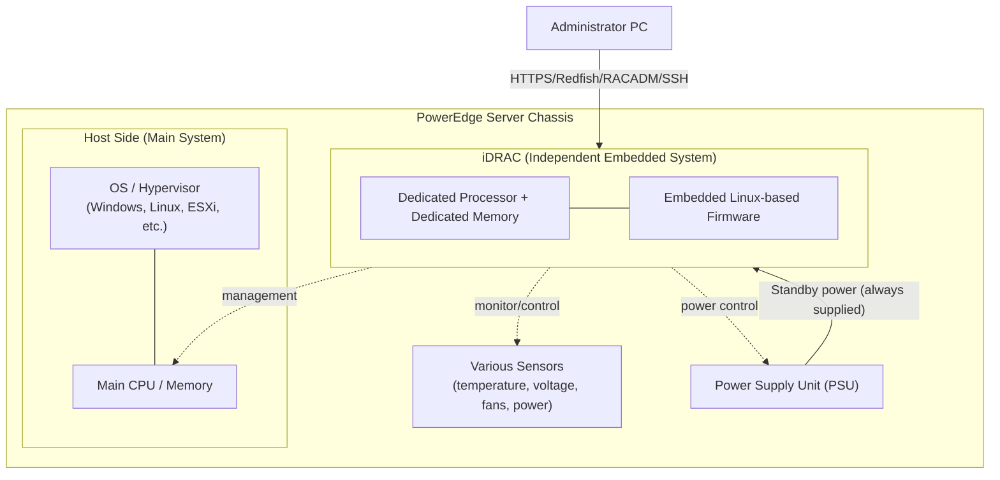
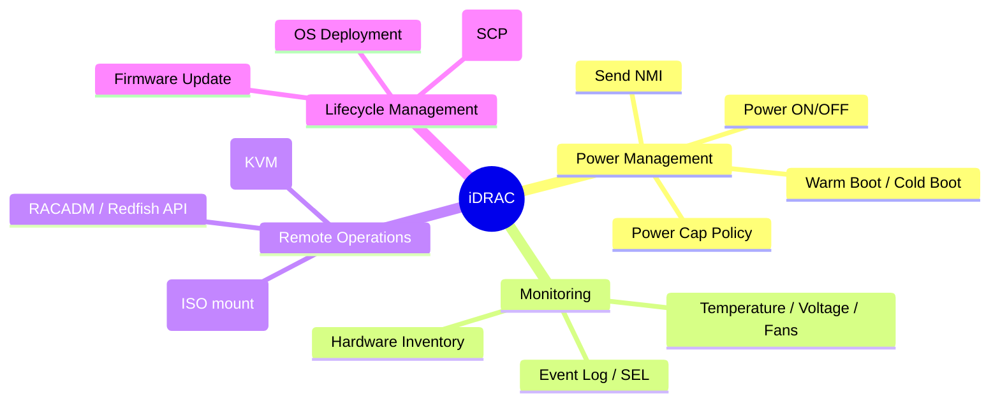

## Introduction

- **What You'll Learn From This Article**: This article moves beyond the understanding of iDRAC on Dell PowerEdge servers as merely "a convenient feature for powering the OS on and off," toward a systematic understanding that includes its internal architecture, power design, licensing structure, security, and behavior during failures.
- **Intended Audience**: Infrastructure engineers who already understand that "iDRAC lets you start up and shut down a server" but cannot explain why or how that's actually achieved.
- **Estimated Reading Time**: About 20-25 minutes

This article is part of the [Top 1% Series' full article guide](/en/sitemap).

First, let's confirm the starting-point understanding this article builds on.

> It's a feature built into Dell servers that lets you start up and shut down the OS, so even when the OS is shut down, there's no need for a human to physically enter the server room — you can power it on or investigate it remotely.

This is a correct understanding. However, not many engineers in the field can actually explain the deeper questions: "Why can you operate it even when the OS is stopped?" "Is iDRAC part of the OS, or something separate?" "How can it be running when the power is off?" This article digs into exactly those questions.

## Prerequisites

Before reading on, it helps to be familiar with the following terms (don't worry if you aren't — they're explained in the body text as well).

- **BMC (Baseboard Management Controller)**: The industry-standard term for a management controller that sits on a server's motherboard and monitors/controls the hardware independently of the OS.

What exactly is a "motherboard," anyway?

A motherboard is a printed circuit board (PCB) that lays out the CPU, memory, storage, expansion cards (PCIe cards), power connectors, and so on, all on a single board, and electrically connects them — it functions as the "wiring and foundation." Embedded inside the board are many layers of extremely fine copper traces (signal lines and power lines), which connect the various "sockets" — the CPU socket, memory slots (DIMM slots), PCIe slots, power connectors — through invisible internal wiring.

The motherboard isn't just passive wiring; it also carries many active components. Three of the most representative are:

- **Chipset**: A control chip that mediates data exchange between the CPU and peripheral devices other than memory (USB, SATA, some PCIe lanes, etc.). Because the CPU itself has only a limited number of I/O ports, the chipset handles the I/O that lies beyond the CPU's direct reach.
- **VRM (Voltage Regulator Module)**: A circuit that further converts the power arriving from the PSU into the finer-grained voltages that the CPU, memory, and other components each require. This mechanism is explored in depth in a separate article, "[Understanding Server Power Design from a \"Top 1%\" Perspective — From AC/DC Conversion to A/B Grid Redundancy and Hot Spares](/en/articles/idrac-power-guide)."
- **BMC (such as iDRAC)**: The very chip that is this article's subject is, in fact, itself one of the components implemented on the motherboard.

In other words, a "motherboard" isn't a "leading actor" like the CPU or memory — it's easiest to picture it as the "stage machinery" that connects those components with the correct wiring and drives them at the correct voltage. Even if you've never seen one in person, if you've watched a PC teardown video and seen a green or black board densely packed with small components (capacitors, VRM coils) around the CPU socket, that's the motherboard.

- **IPMI (Intelligent Platform Management Interface)**: A long-established, industry-standard protocol for operating a BMC.
- **Redfish**: A RESTful API standard that has become widespread as IPMI's successor, exchanging JSON-formatted data over HTTPS.
- **Out-of-Band Management**: A management approach that reaches the server through a path separate from the OS (a separate NIC, a separate processor) rather than through the OS's own network stack. This is the essence of what iDRAC is.

Breaking the terminology down a bit further (the difference between a protocol and an API; the network stack)

- **The difference between a "protocol" and an "API"**: A "protocol" refers to the rules of procedure and format that two devices or pieces of software must follow when communicating (for example, HTTP is a protocol that defines "requests and responses are exchanged in this order, in this format"). An "API," on the other hand, refers to the interface and set of commitments that a piece of software exposes externally, saying "you can perform these operations against me." In terms of the relationship between the two, **an API is built on top of a protocol**. Redfish, an API, rides on the communication procedures defined by the HTTPS protocol while offering a concrete interface (API) that says "send a request in this format to this URL, and you can retrieve or change iDRAC's power state." If a protocol is "the general etiquette of conversation," an API is "the individual service window offered under that etiquette." Readers who want to go deeper into this distinction — including HTTP methods, status codes, and authentication schemes — can find it in a separate article, "[What Is a RESTful API? Understanding from HTTP/JSON Basics to Practical Design from a \"Top 1%\" Perspective](/en/articles/restful-api-guide)."
- **Network stack**: The layered software structure inside an OS that handles network communication (NIC driver → IP → TCP/UDP → application, stacked in that order). Ordinary communication always passes through this "layered structure inside the OS," but if the OS freezes or crashes, the stack itself stops functioning and communication becomes impossible. iDRAC has an independent communication path that never passes through this OS network stack at all, which is why it can communicate and be operated even when the OS side is completely unresponsive. Readers who want a detailed, diagram-based explanation of exactly what each layer (NIC driver, IP, TCP/UDP, application) does can find it in a separate article, "[Understanding the Network Stack from a \"Top 1%\" Perspective — From the NIC Driver to TCP/UDP and the Application Layer](/en/articles/network-stack-guide)."

## Getting the Big Picture

### In a Nutshell

iDRAC is "**a second, small computer embedded inside the server**." Dell calls it the Integrated Dell Remote Access Controller — Dell's own extended implementation of the industry-standard BMC concept. iDRAC functions as an independent embedded system, enabling out-of-band management as a dedicated onboard computer.

The key point is that "a second mini-system, with its own independent CPU, memory, storage, and network interface, coexists on the motherboard alongside the server's main platform." Your server has a "main body" running Windows/Linux/ESXi, and, separately, a small, always-running, Linux-based embedded system dedicated to iDRAC. The two are even partially independent in terms of power circuitry, and (depending on configuration) can have separate network interfaces as well.

### A Picture of the Whole System

As the diagram shows, an administrator connects directly to iDRAC over the network, without going through the main OS. iDRAC runs on **standby power** — power that's continuously supplied as long as the AC cord is plugged into the server's PSU (power supply unit) — so iDRAC itself remains alive even when the host's main power is fully off. This is the crux of the "you can operate it even when the OS isn't running" trick (exactly how standby power works is explained in detail later, in the section "Why Can You Operate It Even When the OS Is Down?").

Note also that in the diagram, the host side's compute chip is labeled "CPU," while iDRAC's compute chip is labeled "Processor." Both are, in the sense of being "semiconductor chips that perform computation," the same kind of thing, but in this article "CPU" is used as the most common term for the main processing unit of a PC or server, while "Processor" is used, with a nuance of distinction, to refer to a small, embedded-oriented chip like the one in iDRAC (Processor is the broader concept that includes CPU). This isn't about a technical hierarchy or claiming they're fundamentally different things — it's simply notation used to distinguish, in the text, between "the host side's large CPU" and "iDRAC's small chip."

## Fundamentals, Thoroughly Explained

### The Relationship Between iDRAC and BMC

"iDRAC" and "BMC" are often used interchangeably in the field, but strictly speaking they're in a containment relationship. A BMC is a hardware component built into a server's motherboard that enables remote monitoring and management, providing functions such as remote power control, diagnostics, and event logging. iDRAC is Dell's implementation of a BMC, and by adding features such as a virtual console, power monitoring, hardware inventory, firmware updates, and remote media access, it becomes a more advanced and comprehensive remote management solution.

In other words, "BMC" is an industry-wide concept (a common noun), while "iDRAC" is the product name (a proper noun) for one vendor's — Dell's — implementation of that concept. Products occupying the same position from other vendors include HPE's "iLO," Fujitsu's "iRMC," and Lenovo's "XCC (XClarity Controller)."

#### Do Differences Between Vendors' BMCs Matter for Server Procurement Decisions?

The short answer: the **basic functions** — power management, sensor monitoring, virtual console, Redfish/IPMI support — are **roughly equivalent across vendors**, and it's rare for a BMC difference alone to determine which vendor's servers get procured. As a baseline, it's largely accurate to think of it as "the same role played by a product, existing under a different name and a different UI for each vendor."

| Product | Vendor | Commonly Cited Characteristics |
|---|---|---|
| iDRAC | Dell | Lifecycle Controller (a built-in toolset that lets you update firmware and configure RAID without needing the OS or external media) is often seen as a strength, with strong affinity for automation and configuration management at scale (SCP, OpenManage Enterprise) |
| iLO | HPE | Often praised for the polish of its Web UI/HTML5 console and mobile app support — strong UI/UX evaluations |
| iRMC | Fujitsu | Often valued for its track record and support structure in domestic (Japanese) data centers, and for the completeness of its Japanese-language documentation |
| XCC | Lenovo | A management experience integrated across the ThinkSystem product line, and integration with higher-level tools such as XClarity Administrator |

That said, there are practical differences that aren't entirely negligible. The following points are worth checking during procurement and operational design.

- **Differences in licensing structure**: Every vendor has a tiered structure of "free basic functions" and "paid upper-tier licenses" (virtual console, advanced monitoring, etc.), but exactly what falls in the free tier versus the paid tier varies by product.
- **Differences in ecosystem compatibility with monitoring/automation tools**: How well your existing monitoring platform (Zabbix, PRTG, etc.) or configuration management tools mesh with a given vendor's Redfish/IPMI extensions can vary by environment.
- **Consistency with existing assets**: If you mix in a small number of servers from another vendor into an environment already running a large fleet of Dell machines, the operations team ends up having to learn multiple BMC operation methods and toolsets, which increases operational cost. In practice, decisions to standardize on the existing vendor are made more often based on "operational uniformity" than on "functional differences between BMCs" — this is closer to how things actually play out in the field.

### Why Can You Operate It Even When the OS Is Down? (A Power-Design Perspective)

This is where the "Top 1%" understanding diverges from the beginner's understanding. There are two key points.

**1. iDRAC runs on a power rail separate from the host (standby power)**

Servers and PCs that comply with the ATX power design have a mechanism that keeps power flowing continuously to a very small subset of circuits, even when the power switch hasn't been pressed. This is called **standby power (the S5 state)**. As long as the AC cable is plugged into the PSU (power supply unit), this standby power keeps flowing even while power to the main platform (CPU, memory, etc.) is cut off. On PowerEdge servers, iDRAC is specifically designed to run entirely on this standby power, which is why it stays alive even when the host's main power is completely off.

PowerEdge servers also incorporate **Power Factor Correction (PFC)**, a mechanism that improves the PSU's power-conversion efficiency. PFC is a circuit that raises the efficiency (power factor) with which the PSU converts AC power to DC power, and it plays a role in reliably and efficiently supplying even the very small amounts of power involved in things like standby power. In short, it's accurate to think of PFC as "the mechanism that keeps efficiently supplying the tiny, stable amount of power iDRAC needs to keep running."

Why not just run the whole host on standby power instead of providing a separate computer called iDRAC? (A comparison with Wake on LAN)

A natural question arises here: "If the host side could do the same thing, why bother providing a separate computer called iDRAC?" The answer lies in the **order of magnitude** of the power involved. Standby power can supply, at most, only a few to a dozen or so watts — a tiny amount of "power for idling" — which is plenty to run iDRAC's small, dedicated embedded chip but nowhere near enough to properly run the host's main system, with its dozens of CPU cores, large amounts of DIMM memory, and PCIe devices. Keeping the host "fully powered on at all times" would ultimately require full power, which would defeat the entire purpose of out-of-band management: managing the server power-efficiently even while the OS is stopped. On top of that, if the host and iDRAC were one and the same system, an OS crash, hardware failure, or firmware corruption would take the management functions down along with it. By deliberately keeping it physically separate as "a different computer," the design ensures that the management path survives independently no matter what state the host falls into.

This is an extension of an idea similar to **Wake on LAN (WoL)**, found even in home PCs. WoL works by keeping a very small circuit inside the NIC (network card) alive on standby power even while the PC is powered off; when that NIC receives a specific piece of data over the network (a special signal called a "magic packet"), it sends a power-on signal to the motherboard to start the PC. iDRAC and WoL share the same underlying idea — staying on standby power at all times and letting an external signal intervene on the host — but the decisive difference is that WoL is just one small feature of a NIC chip, a chip whose only real job is "turning the power on," whereas iDRAC is **an entire independent computer with a full-featured OS, web server, and API server**. It's natural to wonder, "if WoL can be integrated into the host's NIC, couldn't iDRAC's functions be integrated into the host too?" — but for the same reasons as above (the power is orders of magnitude apart, and it shouldn't be dragged down along with the host during a failure), there's real value in keeping it independent.

**2. Only when the power is fully unplugged (a "flea drain") does iDRAC also stop, along with the host**

Consequently, if the AC power itself is lost entirely — for example, when a UPS battery runs out — iDRAC will, of course, also stop. iDRAC doesn't run "magically without power"; the accurate understanding is that it simply has "a separate power path, decoupled from the host's power state." Incidentally, in Dell support, the practice of deliberately, fully discharging this standby power is called a "flea drain," and it's offered as a troubleshooting technique for when iDRAC itself becomes unstable.

Reference: How "discharging (flea drain)" actually works

**How does the host side receive power and boot up?**

When an administrator instructs "power on" via iDRAC, or via the physical power button, that signal is relayed to the PSU (power supply unit), which then begins outputting, in addition to the standby power it was already supplying (a few watts), the main power rails (such as the +12V rail) needed to run the CPU, memory, PCIe cards, and so on. The VRM (voltage regulator module) on the motherboard further converts that +12V into the voltage each component requires (around 1V for the CPU, for example), and only once power has stabilized does POST (Power-On Self-Test) run and the OS's boot process begin. It's not the case that "a constant amount of power keeps flowing in as long as the power cable is plugged in" — the accurate understanding is that the PSU holds a constant voltage while supplying however much current the host happens to be demanding at that moment. Readers who want to go deeper — with diagrams — into this power-conversion mechanism (why AC/DC conversion is needed, PSU redundancy design) can find it in a separate article, "[Understanding Server Power Design from a \"Top 1%\" Perspective — From AC/DC Conversion to A/B Grid Redundancy and Hot Spares](/en/articles/idrac-power-guide)." The mechanism by which the OS actually boots after POST completes — through the bootloader, initramfs, and systemd — is covered in a separate article, "[Understanding the OS Boot Process After POST from a \"Top 1%\" Perspective](/en/articles/os-boot-process-guide)."

**What is "discharging (flea drain)" technically doing?**

In electronic circuits, immediately after power is turned off, capacitors can retain a residual charge, and volatile memory can retain a small amount of half-finished state (what a capacitor actually is, and why it's needed in a server's power circuitry, is explored in a separate article, "[Understanding Server Power Design from a \"Top 1%\" Perspective — From AC/DC Conversion to A/B Grid Redundancy and Hot Spares](/en/articles/idrac-power-guide)"). Normally this dissipates naturally within a few seconds to a few dozen seconds, but occasionally a power-control circuit or embedded controller can get stuck in a "half-finished state" and fail to reinitialize correctly even after power is reapplied.

A "flea drain" (or "flea power drain") is an operation where you leave the AC cable unplugged for a while, aiming to bring this residual charge and residual state all the way down to zero, so that every circuit reinitializes from a completely clean slate the next time power is applied. The well-known laptop fix of "remove the battery and wait 30 seconds" works on the same principle — think of it as resetting invalid state stuck in the CMOS or EC (embedded controller). Conversely, if the firmware itself, as written to flash memory, is actually corrupted (data corruption), discharging won't help, and you'll need to reflash the firmware or replace the hardware. Keeping the line clear between "issues that discharging fixes (volatile state anomalies)" and "issues that discharging doesn't fix (non-volatile data corruption)" sharpens the precision of your troubleshooting.

### Access Path: Dedicated NIC or Shared LOM?

To access iDRAC at all, you first need to be able to reach it over the network. This is where the choice of NIC configuration matters.

| Method | Overview | Advantages | Disadvantages |
|---|---|---|---|
| Dedicated (dedicated NIC) | Uses a physical port dedicated to iDRAC. Not shared with the host OS; management traffic can be routed to a separate physical network | Complete separation of management and production traffic. The most recommended option from a security standpoint | Requires dedicated wiring and switch ports, increasing cost |
| Shared LOM | Shares one of the server's own NICs (LOM) | No extra wiring needed; saves ports | Shares the same path as production traffic, increasing bandwidth contention and security risk |

Dell's official security guide explicitly notes that if a dedicated NIC isn't practical, you can operate in Shared LOM mode with VLANs enabled, but in that case iDRAC's management traffic runs over the same wiring as the production network. In practice, "dedicated NIC + a dedicated management VLAN/subnet" is the recommended configuration, and exposing iDRAC directly to the internet is explicitly discouraged.

### What Can It Do: An Overview of Key Functions

All of these are available regardless of whether or how the OS or hypervisor is running. There's also a difference when it comes to hardware event logs: logs from an OS like Windows only capture what happened while the OS was actually up and running, whereas iDRAC's logs are hardware-side information, so they can continuously track the server's state from power-on all the way to power-off — a difference that is the source of iDRAC's value in failure investigations.

### The Scope of Event Logging: iDRAC vs. OS Logs

Once you accept that "iDRAC is independent of the OS," the next natural question is: "Can iDRAC also detect events that happen inside the main OS (Windows Server, etc.)?" The answer is "some, but not others" — the accurate way to understand this is that the two are independent logging systems, each covering a different scope.

| Category | iDRAC's Event Log (SEL / Lifecycle Log) | OS (Windows Server, etc.) Event Log |
|---|---|---|
| Recording layer | Hardware / firmware layer (whatever the BMC itself can observe) | OS kernel, middleware, application layer |
| Recording while the OS is down | Possible (LAN cable insertion/removal, fan anomalies, voltage anomalies, chassis intrusion detection, etc.) | Not possible (while the OS isn't running, there's no logging subject to begin with) |
| Detecting hardware failures | Possible (memory ECC correction errors, PSU anomalies, temperature anomalies, disk SMART anomalies, etc.) | Partially possible (only when the OS or drivers can detect the hardware anomaly; not as comprehensive as the BMC) |
| OS/application anomalies | Not possible (application crashes, service stoppages, logon failures, etc. are invisible to iDRAC) | Possible (Windows System Log, Application Log, Security Log, etc.) |
| Areas that can be recorded by both | Events observable from both hardware and OS sides, such as a NIC link going down | Same as at left (recorded independently — on the iDRAC side as a hardware event, on the OS side as a driver-mediated event) |

In other words, the important point is that "iDRAC never looks inside the main OS itself (application behavior, logon history, etc.)." What iDRAC observes is strictly the hardware/firmware domain — what happens inside the OS can only be traced through the OS's own logs.

As an exception, however, **when the iDRAC Service Module (iSM) is installed on the host OS**, there is a feature that replicates some of iDRAC's Lifecycle Log (hardware events) into the OS-side event log (in Windows, this appears in Event Viewer under "Windows Logs" → "System," with a source of "iDRAC Service Module"). This lets even an operations team that only watches Windows's standard monitoring/alerting infrastructure notice hardware events. Note, however, that this only copies iDRAC-side logs into the OS side — it doesn't actually broaden the scope of what iDRAC's own logging can see.

The most common patterns in practice for **operational monitoring and alerting** are the following:

- **SNMP traps**: When iDRAC detects a monitored threshold being exceeded or a hardware anomaly, it's common to send a trap (UDP/162) to a designated SNMP manager (monitoring server), so that a monitoring platform such as Zabbix, PRTG, or OpenManage Enterprise can receive alerts centrally.
- **SMTP email alerts**: Configuring iDRAC to send email directly to a SMTP server to notify administrators is also widely used. This is often used as a simple approach in small-to-mid-sized environments without a dedicated monitoring platform.
- Both are configured under a setting called "Alerts and Event Filters," where you can individually select which event categories (temperature, voltage, PSU, disk, etc.) should trigger alerts.

### Access Methods: IPMI, Redfish, and RACADM

There are multiple ways to access iDRAC. In addition to the GUI, out-of-band mechanisms are provided using remote scripting interfaces like Redfish and RACADM, letting you configure the platform, apply firmware updates, back up and restore system settings, and even deploy the OS.

- **Web GUI**: The standard way to operate iDRAC, accessed via a browser over HTTPS
- **RACADM (Remote Access Controller ADMin)**: Dell's dedicated CLI (command-line interface) tool for iDRAC. It offers a family of commands like `racadm getniccfg` and `racadm serveraction`, and its advantage is that it lets you check and change settings — or script them — with a single command, instead of clicking through the GUI. There are two execution paths:
  - **Remote RACADM**: SSH from an administrator's PC directly into iDRAC and run `racadm` commands directly in iDRAC's own shell
  - **Local RACADM (via iSM)**: If you install an agent called the **iDRAC Service Module (iSM)** on the host OS, you can run `racadm` commands from a terminal on the OS itself, and they're bridged to iDRAC through a dedicated internal path within the OS. The advantage is that you don't need to specify iDRAC's IP address or login credentials every time.
- **IPMI**: A long-established, industry-standard protocol. Highly versatile, but inferior to Redfish in terms of functionality and security
- **Redfish**: An HTTPS + JSON-based RESTful API. Currently Dell's recommended, modern standard interface, with strong affinity for automation and orchestration in large-scale environments

How iSM's communication works (the internal dedicated path, and the direction of the two paths)

iSM is software that acts as a "bridge" connecting the host OS and iDRAC; rather than IP communication over the production network, communication uses an internal, dedicated hardware path on the motherboard — called a **USB NIC (a virtual network interface over an internal USB connection)** or a **KCS (Keyboard Controller Style) interface** — that connects only the host and the BMC. Because this is a physically separate path from the production network (LOM or a dedicated NIC), the important point is that even if the normal management network is down, as long as the OS is alive, you can still reach iDRAC via iSM.

What's worth keeping in mind here is that **iSM is strictly a one-directional communication path for "conveying commands from the host OS side to iDRAC."** Both local RACADM (running `racadm` commands from a terminal on the OS) and the "remote reset via iSM" described later (an administrator logs into the OS and, from there, instructs a reset of iDRAC) are operations that flow in the same direction: starting from the OS side and sending an instruction to iDRAC through iSM's internal path.

The reverse question naturally arises: **what path does iDRAC use to power the host OS on/off or shut it down?** — and this uses a completely different mechanism from iSM. iDRAC (the BMC) is designed at the hardware level to have **direct** access to the power-control circuitry on the motherboard (the `PS_ON` signal line to the PSU, and control pins that serve the same role as the physical power button), and it can perform power ON/OFF and reset operations without going through any software running on the OS (including iSM) at all. This is, in fact, the essential design philosophy of what a BMC is (control that doesn't depend on the OS, and that works even when no OS exists) — and indeed, iDRAC's power operations work fine even on a server where iSM isn't installed, or even where no OS is installed at all. In summary, the accurate understanding is that there are two independent paths flowing in different directions: the "OS → iDRAC" path is iSM (via USB NIC/KCS), while the "iDRAC → host power control" path is the BMC's direct access to the power circuitry.

Supplementary note: Why does the GUI display in just a browser? (iDRAC as a web server)

iDRAC needs no desktop environment and no dedicated client application — the GUI management screen appears simply by accessing it via HTTPS from a browser. This isn't any kind of special magic — it works on essentially the same principle as a website: **a piece of software called a web server is always running inside the computer that is iDRAC.**

iDRAC runs on embedded Linux (in earlier models, a lightweight BusyBox-based configuration), and a web server function that accepts HTTPS connections (a service whose enable/disable state and settings you can check with `racadm get idrac.webserver`) runs at all times within it. The static files that make up the screen — HTML, CSS, JavaScript — are stored in iDRAC's own built-in flash storage (a small storage area dedicated to iDRAC, separate from the host's disks). Dynamic data such as temperature, voltage, and power state is fetched from iDRAC's internal management engine (the same mechanism that backs the Redfish API) every time a browser opens a page, and embedded into the page on the fly. In other words, the structure combines "the static look of the screen (files in flash storage)" with "the dynamic content of the data (results of querying the internal engine)" to return a single web page.

Note that this idea — "you don't need a desktop environment; a small web server process, a set of files, and a network socket are enough to serve a GUI to a browser" — isn't unique to iDRAC. It's a mechanism shared by routers, NAS devices, and any device in general that offers a browser-based management screen.

## The View from the Top 1% (What Experts See)

### Licensing Determines "What You Can Do"

iDRAC doesn't offer its full feature set unconditionally — available functionality is progressively restricted by license tier.

| License | Positioning | Key Characteristics |
|---|---|---|
| iDRAC Basic (BMC) | Equivalent to having no license | Basic measurements only, via the Web GUI |
| Express | Often bundled as standard | Provides embedded tools, console integration, and simple remote access. Does not include the virtual console feature |
| Enterprise | Upper-tier paid license | Enables a rich set of features including virtual console, virtual media, and out-of-band performance monitoring |
| Datacenter | Top tier (iDRAC9 and later) | In addition to all Enterprise features, provides extended functionality for large-scale data centers, focused on hardware performance analysis and fine-grained power/thermal management |

A common trap in practice is starting a verification project assuming, "since this server has iDRAC, it must support the virtual console too," only to discover that the license is Express and virtual KVM isn't actually available — wasting time. Confirming licensing requirements at the design and procurement stage is a quietly important task in the field.

### What Is a Virtual KVM / Virtual Console?

"Virtual KVM" and "virtual console" are used almost interchangeably in the context of iDRAC, referring to a feature that lets you operate a host's screen over the network without physically connecting a monitor and keyboard to the machine. "KVM" is a term dating back to a piece of hardware from the 1990s called a "KVM switch," a device used to share a single keyboard, monitor, and mouse across multiple servers by switching between them (KVM stands for Keyboard/Video/Mouse). The practice of installing just one monitor and keyboard in a data center rack, and using a physical switch to choose which server to operate from there, still exists in the field today.

What exactly does the word "virtual" refer to here?

Here, "virtual" refers to the fact that "you can perform equivalent operations over the network, without physically connecting monitor and keyboard cables to the actual machine." Technically, this works via a two-way mechanism: iDRAC's service processor internally captures the host side's graphics output (the frame buffer), encodes it as image data, and streams it over the network to the administrator's browser, while the administrator's keyboard and mouse input is injected in the reverse direction into the host as signals equivalent to USB HID (Human Interface Device) input. It's accurate to think of it as "recreating, virtually, over the network, the same experience as physically connecting a monitor and keyboard."

### Power Design Goes Even Deeper

Beyond the understanding that "it keeps running even when the power is off" lies the design philosophy of power redundancy.

**A/B grid redundancy** refers to a configuration in which a server's multiple PSUs (power supply units) are each connected to two physically distinct power sources (Grid A and Grid B — for example, separate UPSes and separate distribution panels within the data center). If a failure occurs in one PSU, or even in the grid to which that PSU belongs as a whole (a distribution-panel failure, a tripped breaker, etc.), the server can continue receiving power as long as the PSU belonging to the other grid remains healthy. The key point is that true power redundancy only exists once you pair "PSU duplication" with "duplication of the power delivery path (the distribution system) itself." Having two PSUs installed means nothing for redundancy if both are connected to the same distribution panel and the same breaker — when that panel goes down, redundancy is lost.

Enabling the **hot spare feature** additionally allows dynamic control of the load balance across multiple PSUs. Normally, all installed PSUs supply current in parallel, but with hot spare enabled, when the server's power draw is low, one PSU takes on an "active" role, primarily supplying the current, while the other enters a "sleep" state, supplying only the minimum current necessary. This is because PSUs have a characteristic where power-conversion efficiency actually drops when the load ratio is too low, so this mechanism deliberately concentrates the load onto one unit, running it at a more efficient operating point, in order to raise the overall system's power efficiency. As the server's power draw increases, the PSU that was in sleep state automatically returns to active.

This isn't just trivia — it's knowledge that directly matters for a first-pass triage question like, "why is there a warning on just this one PSU, when the server is otherwise operating normally?" In a hot spare configuration, one PSU's load is deliberately reduced, so it's important not to misread a low current reading, or a different LED pattern, as "this PSU has failed." Even in iDRAC's hardware logs, "PSU transitioned to sleep state" and "PSU actually failed" are recorded as distinct events, so cultivating the habit of checking the event type during triage improves your accuracy.

A natural concern also arises: "if multiple servers simultaneously use hot spare and concentrate their load onto the same grid, won't that grid's distribution path become overloaded?" This is addressed by a two-pronged approach: deliberately spreading which PSU is the active side across servers via the `System.Power.Hotspare.PrimaryPSU` setting, and the fact that a data center's power distribution design is, to begin with, built on the assumption that either grid alone can carry the entire load (an N+N design). For a deep dive — with diagrams — into everything from the basics of AC/DC conversion through the internal design of A/B grid redundancy and hot spare, to concrete measures for this overload concern, see the separate article "[Understanding Server Power Design from a \"Top 1%\" Perspective — From AC/DC Conversion to A/B Grid Redundancy and Hot Spares](/en/articles/idrac-power-guide)."

### Considerations for Large-Scale, Multi-Account Operations

In environments running hundreds of PowerEdge servers, configuring iDRAC one machine at a time by hand simply isn't realistic. To address this, Dell provides inventory/configuration export and import via Server Configuration Profile (SCP), automation via the Redfish API, and integration with higher-level management tools such as OpenManage Enterprise. By using the iDRAC RESTful API, iDRAC supports the Redfish standard while adding Dell-specific extensions, and its design optimizes management of large-scale PowerEdge server fleets. There's a wide gulf between "knowing how one iDRAC works" and "being able to codify and automate the management of hundreds of iDRACs," and being able to cross that gulf is exactly what separates senior engineers from the rest.

## Common Misconceptions and Pitfalls

- **Misconception 1: "iDRAC is part of the OS's functionality"**
  In reality, iDRAC is an embedded system completely independent of the OS. A clean install of the OS won't erase iDRAC's settings, and, conversely, resetting iDRAC to factory defaults has no effect on the OS.

So how is iDRAC's own firmware (its embedded OS) updated?

Rather than the way an ordinary OS patches individual packages piecemeal, the basic approach is to bundle iDRAC's entire firmware into a single image file (in a format called a DUP: Dell Update Package) and rewrite it wholesale. There are three main delivery paths:

- **Manual upload via the iDRAC Web GUI/RACADM**: The simplest method — download a firmware image and upload it directly to iDRAC
- **Via Lifecycle Controller**: iDRAC's built-in management function (Lifecycle Controller) references Dell's repository or a local update utility (SUU) to update firmware collectively
- **Bulk updates via Redfish API/OpenManage Enterprise**: An automated update path used in large-scale environments where you need to align firmware versions across many iDRACs

During the update, iDRAC itself briefly reboots, making it unreachable for a few minutes, but this has no effect on the host's OS or applications (you can push updates even while the host is up and running, as part of normal operations).

- **Misconception 2: "iDRAC's IP address and the server's own (OS) IP address are the same"**
  In a Dedicated NIC configuration, iDRAC generally has a different IP address and subnet from the host OS. Even in a Shared LOM configuration, separate IP addresses are assigned for iDRAC and for the OS. Assuming they're the same causes confusion during network design.

Why does even the IP segment (subnet) need to be separated?

The reason is primarily security-related: separating the "attack surface." iDRAC is, in effect, "the management interface with the strongest privileges over the server" — capable of power operations and even reinstalling the OS via virtual media. If it sits on the same segment as production traffic, an attacker who compromises that production segment could also reach iDRAC via scanning within the same segment, ARP spoofing, and similar techniques. If the management segment is physically and logically separated, then even if the production segment is compromised, an attacker's path into iDRAC can be cut off, as long as a firewall or ACL blocks traffic into the management segment. It's only when "IP addresses are functionally separate" is paired with "the network is deliberately segmented, with access control enforced at the boundary" that this carries real security meaning.

- **Misconception 3: "As long as the password is strong, it's fine to connect it directly to the internet"**
  Dell explicitly states that iDRAC is not designed or intended to be used from, or connected directly to, the internet, and that doing so exposes it to security risk. There's a steady stream of cases where machines left with the default password (root/calvin) are discovered via internet-wide scans.

What is "internet scanning"?

This refers to mechanically attempting connections against the vast number of IP addresses on the internet, in order to identify which ports are open and what software is running on them. Using a tool like `masscan` or `zmap`, it's technically possible to scan the entire IPv4 address space (about 4.3 billion addresses) in a matter of minutes to hours. Attackers can use these tools to enumerate large numbers of devices exposing the known ports that iDRAC's management UI uses (such as HTTPS's 443), or use "search engines dedicated to indexing devices exposed on the internet" like `Shodan` or `Censys` to search directly, by product name or banner information, for "hosts running an iDRAC login page." In other words, the assumption "no one will find it" doesn't hold — you should assume that anything exposed to the internet will be mechanically discovered.

- **Anti-pattern: Not updating iDRAC's firmware for extended periods**
  In the past, serious vulnerabilities were discovered that allowed bypassing authentication for WS-MAN or the web interface (CVE-2019-3705 through 3707, among others), where an attacker sending specially crafted data to iDRAC's web interface could potentially bypass authentication and gain access to the system. Unlike the OS, iDRAC is a component whose existence is easy to forget, so it's important to define explicit operational rules for firmware updates.

## Troubleshooting Perspective

### iDRAC Becomes Unresponsive

Typical symptoms include RACADM commands returning "ERROR: Unable to perform requested operation," SSH/Telnet connections timing out, being unable to reach the iDRAC browser, or pings to the iDRAC IP address failing. Typical triage and recovery steps in this case are as follows.

1. **A physical reset via the System ID button**: Holding down the ID button on the front of the chassis for a set duration resets only iDRAC. It has no effect on the host's power.
2. **A remote reset via the iDRAC Service Module (iSM)**: With iSM 2.3 or later, an administrator can remotely reset iDRAC even while it's unresponsive. As mentioned earlier, iSM uses a dedicated internal path (USB NIC/KCS) connecting the host OS and iDRAC, so even in a situation where iDRAC can't be reached over the normal management network, this path can still be used to attempt a reset, as long as the OS is alive. This is the safest option when the OS is alive.
3. **A soft reset via RACADM**: `racadm racreset -f`. iDRAC is unresponsive for about 30 seconds until this operation completes.
4. **A configuration reset (last resort)**: `racadm racresetcfg` (returns iDRAC to factory defaults, though depending on the generation, user and network settings may be preserved), or the more forceful `racadm racresetcfg -rc` (resets the user back to `root`/`calvin`). Because this destroys the configuration, it's positioned strictly as a last resort.
5. **A full discharge of standby power (flea drain)**: Unplug the AC cord, leave it for a few minutes, and plug it back in. Dell's support flow includes a triage sequence where, if an iDRAC initialization error is suspected, you discharge standby power for 5 minutes, and if that doesn't resolve it, consider replacing the motherboard.

### The Case Where Only the Web Server Doesn't Respond (but SSH Works)

While this may seem contradictory at first glance, it's actually a fairly common pattern in practice. If you can SSH into iDRAC but can't reach it via the browser, it's possible that the web server function itself has been disabled in the configuration. Check the value of the `Enable` attribute with `racadm get idrac.webserver`, and if it's `Disabled`, enable it with `racadm set idrac.webserver.enable enabled`. A typical cause is accidentally disabling it during network security hardening work.

### Prevention and Long-Term Countermeasures

- Update iDRAC firmware regularly, and don't leave known vulnerabilities (authentication bypass, buffer overflows, etc.) unpatched.
- Make Dedicated NIC operation, paired with isolation into a management VLAN/subnet, the default policy.
- Always change the default password during initial setup.
- Keep a backup of your iDRAC license (especially before running `racresetcfg -rc` or a factory reset).

## Summary

- iDRAC isn't a feature of the OS — it's an **independent, second computer** embedded in the server, an out-of-band management system with its own dedicated CPU and firmware.
- The reason it can be operated even when the OS is stopped is that iDRAC is continuously powered through a **standby power path** separate from the host's — this isn't "magic," it's a deliberate power design.
- What features you can use depends on the license tier (Basic/Express/Enterprise/Datacenter), so this needs to be confirmed at the requirements-definition and procurement stage.
- Because iDRAC is itself an attack surface on the network, isolating it via a dedicated NIC and management VLAN, keeping firmware up to date, and changing the default password are the bare minimum security requirements.

**Starting Today**
1. Check whether the iDRAC on a server you manage uses a dedicated NIC or a shared LOM, and which license tier it has.
2. Build the habit of checking whether your iDRAC firmware version has patched known vulnerabilities (Dell Security Advisories).

The following topics touched on in this article are each explored further, with diagrams, in their own dedicated articles:

- Power design (the mechanics of AC/DC conversion, the details of A/B grid redundancy and hot spare, the mechanism for powering the main system): [Understanding Server Power Design from a "Top 1%" Perspective — From AC/DC Conversion to A/B Grid Redundancy and Hot Spares](/en/articles/idrac-power-guide)
- RESTful API, HTTP, and JSON (the technologies underlying Redfish): [What Is a RESTful API? Understanding from HTTP/JSON Basics to Practical Design from a "Top 1%" Perspective](/en/articles/restful-api-guide)
- The network stack (the basis for why out-of-band management can work without going through the OS): [Understanding the Network Stack from a "Top 1%" Perspective — From the NIC Driver to TCP/UDP and the Application Layer](/en/articles/network-stack-guide)

## References

- [BMC and iDRAC | Dell Community](https://www.dell.com/community/en/conversations/systems-management-general/bmc-and-idrac/647f7b6ff4ccf8a8de9a7ed7)
- [iDRAC9 User's Guide | Dell Japan](https://www.dell.com/support/manuals/ja-jp/oth-t150/idrac9_7.xx_ug/)
- [Dell Systems Management Overview Guide Version 13.0](https://dl.dell.com/topicspdf/smog_13_ja-jp.pdf)
- [PowerEdge: Power Settings | Dell Japan](https://www.dell.com/support/kbdoc/ja-jp/000202926/poweredge-%E9%9B%BB%E6%BA%90%E8%A8%AD%E5%AE%9A)
- [14th Generation PowerEdge Servers Troubleshooting Guide: Various Types of iDRAC License | Dell Japan](https://www.dell.com/support/manuals/ja-jp/poweredge-r7425/14g_tsg_pub/)
- [iDRAC9 Security Configuration Guide | Dell US](https://www.dell.com/support/manuals/en-us/idrac9-lifecycle-controller-v5.x-series/idrac9_security_configuration_guide/)
- [DSA-2019-028: Dell Technologies iDRAC Multiple Vulnerabilities | Dell US](https://www.dell.com/support/kbdoc/en-us/000176947/dsa-2019-028-dell-emc-idrac-multiple-vulnerabilities)
- [PowerEdge: Multiple Vulnerabilities in Dell EMC iDRAC (CVE-2018-15774 and CVE-2018-15776) | Dell Japan](https://www.dell.com/support/kbdoc/ja-jp/000177031/)
- [PowerEdge: iDRAC Connection Troubleshooting | Dell Japan](https://www.dell.com/support/kbdoc/ja-jp/000185547/idrac-%E6%8E%A5%E7%B6%9A-%E3%83%88%E3%83%A9%E3%83%96%E3%83%AB%E3%82%B7%E3%83%A5%E3%83%BC%E3%83%86%E3%82%A3%E3%83%B3%E3%82%B0)
- [How to Reset the Integrated Dell Remote Access Controller (iDRAC) | Dell Japan](https://www.dell.com/support/kbdoc/ja-jp/000126703/)
- [iDRAC: CVE Vulnerabilities | Securing the Virtual Console with TLS 1.2 | Dell Japan](https://www.dell.com/support/kbdoc/ja-jp/000208968/)
- [Lifecycle Controller Log Replication into Operating System | iDRAC Service Module User's Guide | Dell US](https://www.dell.com/support/manuals/en-us/idrac-service-module/ism_4.0.1_user_guide/lifecycle-controller-log-replication-into-operating-system?guid=guid-32402616-23ff-4b28-88cb-c0013eae6d07&lang=en-us)
- [PowerEdge: How to Configure Email Alerts and SNMP Trap Forwarding in the iDRAC Console | Dell US](https://www.dell.com/support/kbdoc/en-us/000188048/how-to-configure-email-alerts-and-snmp-trap-forwarding-in-the-idrac-console)
- [Dell DRAC | Wikipedia](https://en.wikipedia.org/wiki/Dell_DRAC)
- [KVM switch | Wikipedia](https://en.wikipedia.org/wiki/KVM_switch)
- [iDRAC: Redfish API with Dell Integrated Remote Access Controller | Dell US](https://www.dell.com/support/kbdoc/en-us/000178045/redfish-api-with-dell-integrated-remote-access-controller)
