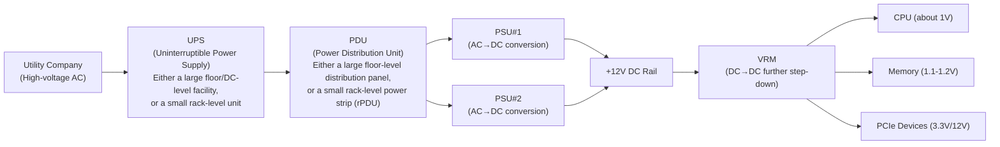
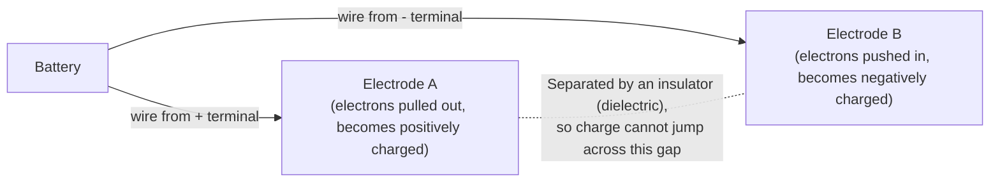
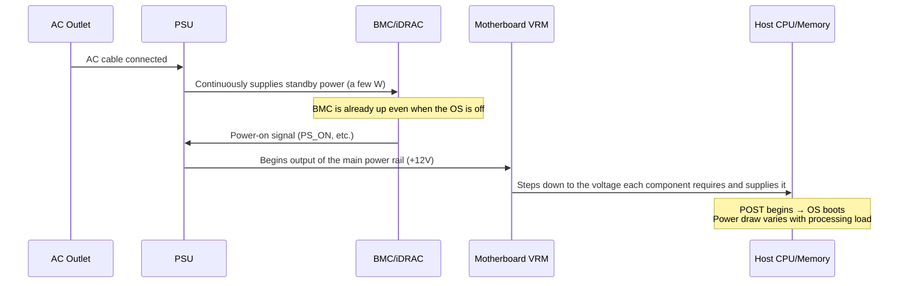

## Introduction

- **What You'll Learn From This Article**: A systematic understanding of why server power supplies perform AC/DC conversion, how the main system receives power and boots up, and what it means to make PSUs redundant (A/B grid redundancy and hot spare) — covering everything from the fundamentals of electricity to the settings and troubleshooting perspective used in practice.
- **Intended Audience**: Infrastructure engineers who know that "AC/DC" stands for alternating current/direct current, but can't explain the mechanics beyond that. This article assumes readers who want to understand server power design (AC/DC conversion, PSU redundancy) starting from the fundamentals of electricity.
- **Estimated Reading Time**: About 15-20 minutes

This article is part of the [Top 1% Series' full article guide](/en/sitemap).

Many readers have probably heard that the BMC (management controller) built into a server runs continuously on a "standby power" rail separate from the host's. In this article, let's take a step back and dig into the more fundamental question: what exactly does a server's power supply do in the first place?

## Prerequisites

- **AC (Alternating Current)**: Electricity whose direction and magnitude change periodically. The commercial power supplied to homes and data centers in Japan is 50Hz/60Hz AC.
- **DC (Direct Current)**: Electricity whose direction and magnitude are always constant. Semiconductors such as CPUs and memory fundamentally only operate on DC.
- **PSU (Power Supply Unit)**: The device in a server that converts AC to DC.
- **VRM (Voltage Regulator Module)**: A circuit on the motherboard that converts the DC output by the PSU into the finer-grained voltages that individual components, such as the CPU, actually require.

## Getting the Big Picture

### In a Nutshell

A server's power supply is "**a mechanism that keeps converting the coarse, unstable AC power of a data center, through multiple stages, into the stable DC power that precision semiconductors require**." It isn't a single conversion and done — power passes through multiple conversion stages, PSU → VRM, before finally reaching the roughly 1V the CPU can actually use.

### The Big Picture of How Power Arrives

Including the stages upstream of the server itself (UPS, PDU), you can see that power delivery is a design built from many layers of "conversion" and "redundancy." This article focuses specifically on the conversion mechanisms inside the server itself (PSU, VRM) and on PSU redundancy design.

Note that this diagram is a simplified single-line view of the path power takes. In practice, to achieve **A/B grid redundancy** (discussed later), this entire path from UPS to PDU is typically duplicated into two independent systems (Grid A and Grid B) running in parallel, so that a single server can draw power from both. Also, the UPS and PDU nodes in this diagram each stand for two different things — a large piece of equipment operating at the floor (data center) level, or a small unit that's entirely self-contained within a single rack — and the two scales don't necessarily both appear together on the same path; which one you get depends on the scale of the deployment. We'll come back to this granularity, and to what the UPS and PDU each actually do, in "Digging Deeper into the Roles of the UPS and PDU."

## Fundamentals, Thoroughly Explained

### The Basics of Electricity: The Relationship Between Voltage, Current, Power, and Resistance

To understand the explanations that follow, let's lay out the minimum electrical fundamentals needed, using a water-pipe analogy.

| Electrical Quantity | Unit | Water Analogy | Meaning |
|---|---|---|---|
| Voltage | V (volt) | Water pressure | The magnitude of the force pushing electricity along |
| Current | A (ampere) | Water flow rate | The actual amount of electricity flowing |
| Resistance | Ω (ohm) | The narrowness/clogging of a pipe | How difficult it is for electricity to flow |
| Power | W (watt) | The work done by a water wheel per unit time | The actual amount of work being consumed/supplied |

These four quantities are tied together by two equations.

- **Ohm's Law**: Voltage = Current × Resistance (`V = I × R`)
- **The Power Equation**: Power = Voltage × Current (`P = V × I`)

For example, the relationship "if you're sending the same amount of power, raising the voltage lets you lower the current" (if `P` is constant, `V` and `I` are inversely proportional) is the foundation for the discussion of AC transmission later on.

Why is "power = voltage × current" a multiplication? (An intuitive explanation using the water-pipe analogy)

"Voltage = current × resistance" is fairly intuitive, since it's a single physical phenomenon — the flow rate is determined by dividing the pushing force (water pressure) by the resistance (how clogged the pipe is). But it's natural to find it less obvious why "power = voltage × current" ends up as a multiplication. This becomes clearer once you break down what "voltage" and "current" each measure.

- **Voltage (V) is "the amount of pushing energy carried by a single unit of electricity" (more precisely, per coulomb of charge)**. In water terms, this is equivalent to "how high a single drop of water fell from, and how much force it carries (the height of the water pressure)."
- **Current (A) is "how many units of electricity (how many coulombs of charge) flow per second."** In water terms, this is equivalent to "how many drops of water hit the water wheel per second (the flow rate)."

The total energy the water wheel receives per second (= the rate of work = power) is determined by "energy per drop of water (pressure)" × "the number of drops hitting it per second (flow rate)." Whether the energy per drop doubles, or the energy per drop stays the same while the number of drops doubles, either way the "total energy transferred to the water wheel per second" doubles. This is why it's a multiplication.

Checking this with concrete numbers: at `100V × 1A = 100W`, doubling the voltage to `200V × 1A` gives `200W` (double), and doubling the current to `100V × 2A` also gives `200W` (double). The fact that doubling either voltage or current doubles "the amount of work transferred per unit time" in exactly the same way — a symmetric relationship — backs up the meaning of the multiplication.

Is voltage "the force pushing electrons" or "the energy electrons carry"? (The idea of electric potential)

Voltage has now come up described two ways — as "the force pushing electrons" (the water-pressure analogy) and as "the energy carried by a single electron" — but these aren't two contradictory definitions. They're **the same underlying quantity, "electric potential," viewed either from the cause side or the effect side**.

The key point is that **voltage (more precisely, electric potential) isn't a property permanently attached to any particular electron — it's a property tied to a location in the circuit**. In water terms, this corresponds not to "energy some particular water molecule was born with," but to potential energy from "being at a certain height in a dam." Water sitting at a high elevation has large potential energy simply because of where it is, and, at the same time, it's subject to a force from gravity pushing it toward lower elevation. "The pushing force" and "the energy that water carries" are really just two ways the same single quantity — height (i.e., potential energy) — shows up.

The same is true in an electric circuit: the positive terminal of a battery sits at high potential, and the negative terminal at low potential (this potential difference is the "voltage"). It's precisely because of this potential difference that connecting the two points with a wire creates a force (an electric field) pushing electrons from the high-potential side toward the low-potential side. And the amount of energy a single electron loses (or gains) as it moves across that entire potential difference is exactly the energy computed as "voltage × one unit of charge." In other words, "voltage = the size of the pushing force" and "voltage = the energy handed off as an electron moves" are not competing explanations — they're the same potential-difference phenomenon, seen once as a force and once as energy.

**What a battery actually does**: A battery isn't a device that "sends out special electrons carrying a fixed voltage." The chemical reaction inside a battery acts like a pump lifting water from the bottom of a dam back up to the top — it continuously uses chemical energy to pump electrons from the negative terminal side over to the positive terminal side, and as a result maintains a constant potential difference (voltage) between the two terminals. When the circuit is closed and electrons travel around the outside of the battery, back to the negative terminal, the battery pumps them back up to the positive side via the same chemical reaction, so the potential difference is sustained and current keeps flowing. It's tempting to picture this as "if there's no friction, energy should be conserved," and that picture is correct: if an electron simply moves through a wire with zero resistance, its potential (i.e., potential energy) isn't lost at all. Potential only drops (i.e., energy is lost) when an electron passes through something like a resistor — an "electrical friction" — and that's exactly what a "voltage drop" is.

**What does "applying a voltage" actually mean?**: Given all this, "applying a voltage" means deliberately creating a potential difference between two points in a circuit — typically by connecting the positive and negative terminals of a battery or power supply to those two points. Conversely, as long as a potential difference exists between two points, a "voltage is applied" there, and connecting those two points with a conductor will start a current flowing in the direction that cancels out the potential difference (if nothing is connected, you can have a potential difference present with no current flowing at all).

The same idea of a "potential difference" applies directly to capacitors as well. How a voltage gets applied to a capacitor, and exactly how charge accumulates on its plates, is covered together in one place later on, in "What exactly does a 'capacitor' do, anyway?"

The reason a VRM (voltage regulator module) treats "voltage," not "current," as its control target also comes down to this relationship. Semiconductors such as CPUs and memory are designed on the assumption that "a constant voltage will always be supplied" — voltage fluctuations lead directly to malfunction or damage. Current (i.e., power consumption), on the other hand, is expected to change moment to moment depending on what the CPU is processing — that's normal. This is why a VRM doesn't actively decide "how much current to supply" — it only performs feedback control to "keep the output voltage exactly at the reference value," and, as a result, the current automatically increases or decreases in response to the state on the CPU side (in Ohm's-Law terms, changes in effective resistance, i.e., impedance). Inside a VRM, a feedback loop continuously senses the output voltage and fine-tunes switching behavior (PWM control, discussed later) — increasing supply when the voltage dips below the reference, and decreasing it when the voltage rises above it.

Are the CPU/memory "requesting power"? (Is there some kind of electrical-signal protocol involved?)

The short answer is no: the CPU and memory don't send the VRM some explicit signal (a digital request protocol) saying "give me power." Increases and decreases in power occur as purely physical phenomena, as follows:

1. When the CPU switches a large number of transistors simultaneously (i.e., performs a heavy computation), the CPU's effective electrical resistance (impedance) changes, and naturally, more current tends to flow at the same voltage (a consequence of Ohm's Law).
2. The VRM detects this subtle drop in voltage at high speed (the moment the load increases and current tries to increase, the voltage momentarily tries to sag) and adjusts the ON/OFF ratio of its switching elements (the duty cycle) to bring the voltage back to the reference value.
3. As a result, from the CPU's point of view, it looks as though "exactly the current it needs is being supplied," but this isn't a willful request — it's a byproduct of feedback control trying to hold the voltage constant.

It's easy to picture this like a battery — "storing up power and dispensing it on request" — but the role played by the capacitors on the motherboard (the "decoupling capacitors" lined up around the VRM's output) is strictly **a very short-term buffer that fills in the instant when voltage momentarily sags** (the fraction-of-a-microsecond lag when current supply can't keep up with a sudden load spike). It's not something that can store power for seconds or minutes — if the PSU's supply stops, this buffer is exhausted almost immediately. It's not the case that "you can draw unlimited power on demand" — if you place a load beyond the PSU's or VRM's rated maximum output, the voltage can't be maintained, leading to a system crash or a shutdown triggered by protective circuitry.

What exactly does a "capacitor" do, anyway?

A capacitor is, structurally, a very simple component: two metal plates (electrodes) placed facing each other with only a tiny gap between them. When a voltage is applied, positive charge accumulates on one electrode and negative charge on the other, and this "imbalance of charge" is how it stores energy. Because the two electrodes are separated by an insulator (a dielectric), the charge can't jump across and flow through — it has nowhere to go and simply keeps accumulating on both electrodes.

Here's what it looks like to place these two plates inside a circuit with a battery:

Electrons are pulled out of electrode A, connected to the battery's positive terminal, leaving it positively charged, while electrons are pushed into electrode B, connected to the negative terminal, leaving it negatively charged. It's a fair intuition that "once negative charge piles up on one side, additional negative charge can't keep advancing (like two south magnetic poles repelling each other)" — that's nearly spot-on as a mental model. The more same-sign charge (electrons) accumulates in one place, the stronger the repulsive force (from the electric field) against pushing yet more of the same charge in, and as the potential difference between the plates approaches the external voltage, the "pushing force" driving further electrons in gets increasingly canceled out. That's why a capacitor doesn't charge forever under a constant applied voltage — current converges toward zero once it balances the external voltage. Conversely, when the external voltage drops or disappears (i.e., the capacitor gets connected to something at lower potential), the stored potential difference drives the accumulated electrons back out, and current flows in reverse. This is exactly what's behind the timing of when voltage rises and falls: it rises while charging, and falls while discharging.

The idea that "a voltage difference arises, and current flows to try to cancel it out" is correct here, and this is exactly the property a capacitor exploits. **When the external voltage tries to rise, the capacitor resists that change by storing more charge (slowing the rise in voltage); conversely, when the external voltage tries to fall, it resists that change by releasing stored charge (slowing the drop in voltage)**. In other words, a capacitor acts as an "electrical shock absorber" that dampens sudden changes in voltage.

The reason this property is needed in servers (and, more broadly, in any digital circuit) is that a digital circuit like a CPU has its current draw spike up and down on a nanosecond timescale, every time it switches transistors on and off en masse. Feedback-control circuits such as PSUs and VRMs also have a small inherent response lag between detecting a voltage change and adjusting their output. It's the large number of small capacitors lined up at the VRM's output (decoupling capacitors) that fill in this "gap the circuit can't react fast enough to fill" — on the order of a fraction of a microsecond to a few dozen nanoseconds — and keep the voltage stable. Without this buffer, the instant the CPU's load increases, the voltage would momentarily dip, and that tiny voltage drop alone could cause transistors' 0/1 determinations to misfire, corrupting computation results or crashing the system.

### Why Is AC→DC Conversion Necessary?

The electricity delivered from a utility company to a data center is AC. AC is used because **voltage can be freely stepped up or down using a transformer, and running transmission at high voltage/low current reduces losses (heat-related loss) during transmission**. This is why long-distance transmission grids are, fundamentally, all built around AC (AC transmission).

Semiconductors such as CPUs, memory, and SSDs, on the other hand, need to switch their internal transistors ON/OFF with precise timing in order to compute, and for this they need **an extremely stable, constant-voltage DC supply** — nothing else will do. If you fed periodically fluctuating AC directly into these circuits, they'd malfunction or be damaged. Therefore, as a bridge between two electrically different worlds — "AC, favorable for transmission" and "DC, essential for computation" — an AC→DC conversion device, the PSU, is needed inside the server.

Why does "high voltage, low current" reduce transmission loss, and why is voltage so easy to change with AC?

**Why is transmission loss determined by the magnitude of the current?**

Transmission lines have a small amount of resistance, and as current flows through them, power is lost as heat. This loss is determined by the equation `Loss = Current² × Resistance` (an application of the electrical fundamentals discussed above), meaning it's proportional to the **square of the current**. In other words, if you're sending the same amount of power (`Power = Voltage × Current`), raising the voltage by a factor of 10 and lowering the current to 1/10 reduces the transmission loss to 1/100. This is the basis for the idea that "for long-distance transmission, you want voltage as high as possible and current as low as possible."

**Doesn't "Loss = Current² × Resistance" contradict "Power = Voltage × Current"?**

Since `Loss = Current² × Resistance` can also be written as `Loss = (Current × Resistance) × Current`, it looks like it should equal "Loss = Voltage × Current" too — so shouldn't raising voltage and raising current affect loss the same way? The catch is that **the "voltage" in each of these two equations refers to something different**.

- The voltage you deliberately raise or lower for transmission efficiency is the **voltage at the sending end of the line** (the voltage the power plant or a transformer establishes across the entire transmission segment) — this is the voltage in the power equation `Power = Voltage × Current`.
- On the other hand, the "Current × Resistance" term in `Loss = Current × Resistance × Current` is the **voltage drop across the transmission line's own resistance** — nothing more than the voltage difference between the two ends of the line. This is passively determined purely by current and resistance; it isn't a variable you can set the way you can set the transmission voltage.

So while the relationship "if you hold power constant and raise the transmission voltage, current drops correspondingly (`Current = Power ÷ Voltage`)" is available to you, there's no such thing as "directly manipulating the voltage-drop term to cut loss." The only real lever for reducing loss is lowering the current — and you lower the current by raising the transmission voltage. That's a one-directional causal chain. Even though the same word "voltage" appears in both equations, one is an independent variable you control, and the other is a dependent variable determined by the current — two quantities of a fundamentally different character, which is exactly the source of this question.

**Why does the ability to change AC voltage matter for this "raise voltage" trick?**

The voltage actually needed at a power plant or by end users (homes, factories) isn't the ultra-high voltage (tens or hundreds of kV) that's ideal for transmission — safety and equipment insulation requirements rule that out. So cutting transmission loss requires a "step up → transmit → step down" cycle: raising the voltage sharply just for the transmission segment, then stepping it back down to a usable voltage right before it reaches the end user. The device that can perform this step-up/step-down at large scale, with low loss and low cost, is the transformer — and a transformer only works, in principle, with alternating current (explained next). In other words, "raising voltage reduces loss" is, by itself, just a statement about the relative sizes of voltage and current — actually pulling it off at grid scale depends entirely on having a means to freely step voltage up and down, and that means is the AC transformer.

**Why can AC voltage be freely changed?**

The device that steps AC voltage up or down is the **transformer**. A transformer works by exploiting electromagnetic induction (the phenomenon in which running an alternating current through a coil creates a changing magnetic field around it, and that changing field induces a new current in an adjacent, separate coil). Simply by changing the ratio between the number of turns on the primary and secondary coils (the turns ratio), voltage can be freely converted.

Why does "just changing the turns ratio" let you freely convert voltage? The key is that in both the primary and secondary coils, **the voltage induced per single turn is always equal, since both coils share the same changing magnetic flux**. The total voltage across a coil is "voltage per turn × number of turns," so if the secondary coil has twice as many turns as the primary, the secondary voltage is automatically doubled too (and, by conservation of energy, the secondary current is correspondingly halved — the power, voltage × current, stays the same on both sides). In short, "changing voltage just by changing the turns ratio" only works because of this property of electromagnetic induction — that the induced voltage per turn is shared between the primary and secondary.

This mechanism only works in the first place because of AC's property of "the direction and magnitude of current continuously changing." DC, whose current always stays at a constant direction and magnitude, can't use this electromagnetic-induction-based voltage-conversion mechanism as-is — changing DC voltage requires a separate, active electronic circuit (something like a DC-DC converter, using active switching). Historically, the fact that long-distance transmission developed around AC was largely due to the ability to convert voltage using only a simple, highly reliable mechanical device — the transformer. (In modern times, HVDC — high-voltage direct current transmission — is used in some cases, such as intercontinental submarine transmission lines, but this is a special case where the cost of conversion equipment can be justified by the sheer length of the transmission distance.)

**Why can alternating current induce electromagnetic induction (and why can't direct current)?**

Underlying electromagnetic induction are the following two physical laws:

1. **When current flows, a magnetic field forms around it (Ampère's Law).** When current flows through a wire, magnetic field lines form around the wire. The larger the current, the stronger the field.
2. **When a magnetic field "changes," a new current arises in a nearby conductor, in a direction that opposes the change (Faraday's Law of Electromagnetic Induction).** The key point is that "a magnetic field merely existing" causes nothing to happen — only when **the strength of the magnetic field changes over time** does a current (an electromotive force) arise in the adjacent conductor.

When AC is run through a transformer's primary coil, the magnitude and direction of the current periodically flip between plus and minus, 50-60 times a second. As noted in point 1, since "a changing current produces an equally changing magnetic field," the magnetic field around the primary coil is constantly changing in strength and direction. This "constantly changing magnetic field" reaches the secondary coil through the iron core, and, by law 2, a new current (voltage) is continuously induced in the secondary coil as well.

DC, on the other hand, when run through the primary coil, produces a magnetic field of constant strength that doesn't change, since the current itself is constant (a brief current is induced in the secondary coil only at the instant power is switched on or off, when the field does change momentarily; after that, since the field no longer changes, no further induction occurs and the current drops to zero). The condition for electromagnetic induction isn't "whether current is flowing" but "whether the magnetic field keeps changing," which is why only AC, which keeps changing continuously, can sustain ongoing voltage conversion through a transformer.

**Why transistors and DC are a good match**

A transistor is a semiconductor device that can switch or amplify a large current using only a very small change in voltage or current. Inside a CPU, a huge number of these transistors are combined as switches with two states — "high voltage = 1," "low voltage = 0" — to perform logical operations (AND/OR/NOT, etc.). This 0/1 determination happens with such tight timing that even a slight voltage wobble can cause a misreading, which means AC, whose voltage keeps periodically fluctuating, can't provide the precise switching needed. DC's property of being "always constant" is fundamentally well-matched to this kind of fast, precise 0/1 determination.

**What exactly is a "semiconductor," anyway? (How a transistor works as a switch)**

A semiconductor is a material, like silicon, whose electrical properties fall between those of a "conductor" (which conducts electricity) and an "insulator" (which doesn't). The key point is that **pure silicon barely conducts electricity at all, but mixing in a tiny amount of impurity (doping) lets you artificially control how well it conducts**.

- Mixing in an impurity such as phosphorus produces an "N-type semiconductor," which has an excess of electrons.
- Mixing in an impurity such as boron produces a "P-type semiconductor," which has a deficiency of electrons (an excess of "holes," the absence of an electron).

A transistor is structured as a sandwich of these N-type and P-type materials, arranged as "N-P-N" or "P-N-P." By making only a small change to the voltage applied to the middle layer (the base), you can electrically switch between a state where current flows between the two outer layers (the collector and emitter) and a state where it doesn't. This is the true nature of a transistor's switching action — "a tiny change in voltage that can switch a large current ON/OFF." It's only because of this special property of semiconductors — the ability to freely control how well they conduct electricity — that it's possible to pack billions of these fast, precise switches onto a chip the size of a fingernail.

**Consumer devices perform the same conversion, too**

The charger (AC adapter) for a laptop or smartphone plays exactly the same role (AC→DC conversion) as a server's PSU. The only difference is whether the conversion circuit sits inside the main body (the PSU, for a server) or outside it (a small box — the power adapter). A laptop may appear to "run directly on AC," but that's only because the conversion has been moved partway along the cable (inside the adapter) — internally, the battery and circuitry run on DC, just like a server.

Why doesn't the entire data center get distributed as DC? (DC power distribution as an option)

At this point, it's natural to wonder, "if you're going to convert AC→DC right before it reaches the server anyway, why not just make the entire data center's power distribution DC from the start?" In fact, some hyperscale operators' data centers do adopt exactly this approach — distributing high-voltage DC (such as ±380V DC) starting right after the UPS, and receiving DC directly at the rack level — reducing the total number of AC/DC conversions and cutting conversion losses. However, this comes with a significant tradeoff: it requires consistently deploying "PSUs and distribution equipment purpose-built for DC distribution" throughout, losing compatibility with existing, general-purpose AC-based facilities and equipment (standard AC outlets, existing UPSes, servers with generic PSUs, etc.). The fact that the mainstream design for a typical rack-mount server today is still to receive power via an AC outlet and perform AC→DC conversion inside the server via a PSU reflects a prioritization of compatibility with existing facilities, maintainability, and procurement flexibility.

### Digging Deeper into the Roles of the UPS and PDU

Before electricity reaches the server itself (the PSU), two important supporting players are involved: the UPS and the PDU.

**UPS (Uninterruptible Power Supply)**

A UPS is a device that instantly switches to power from its internal battery when the commercial power supply (AC from the utility company) is momentarily interrupted or lost entirely, keeping power flowing to downstream equipment without interruption. There are three main types:

| Type | Behavior | Characteristics |
|---|---|---|
| Standby | Normally passes commercial power through almost as-is, switching to battery power only once an outage is detected | Inexpensive, but the switchover causes a brief momentary interruption (a few ms to a few dozen ms) |
| Line-interactive | Automatically corrects minor voltage fluctuations internally, switching to battery only during a major anomaly | More stable than standby; a good balance of cost and performance, and the mainstream choice for mid-sized environments |
| Online (double conversion) | Continuously converts commercial power AC→DC→AC before output, with the battery permanently connected into this same conversion path | No momentary interruption occurs in principle, since there's no switchover. The mainstream choice for mission-critical environments such as data centers |

In data centers, it's common to build redundancy into the UPS layer itself as well — such as `N+1` (the number of units needed, plus one spare) or `2N` (an entire duplicate set of the same configuration) — so that a single UPS failure doesn't take everything down. This idea of "splitting the UPS into multiple redundant systems" is, in fact, the very foundation for the server-side A/B grid redundancy (separate power feeds, Grid A and Grid B) discussed later in this article.

Why does the online method bother converting DC back to AC a second time?

It's natural to wonder, "if it's already converted to DC once, why not just feed that DC straight downstream?" There are two main reasons it's converted back to AC rather than staying DC:

**1. Downstream equipment (such as a server's PSU) is, by standard design, built to expect AC input**

A typical rack-mount server's PSU is designed to accept input from a standardized AC outlet (100V/200V in Japan, 230V elsewhere, etc.). If the UPS's output stayed as DC, every piece of equipment receiving it would need a special DC-input-capable PSU, breaking compatibility with existing general-purpose servers, network equipment, storage, and so on. By standardizing output on AC — the "industry-standard input format" — any generic equipment can be connected downstream of the UPS and used as-is, without any additional conversion.

**2. It allows the output stage to keep running continuously as "a circuit that handles battery-derived power"**

Another goal of the double-conversion approach is that **the output-side inverter (the DC→AC conversion circuit) can keep operating from the same DC bus at all times, without caring whether the input is derived from commercial power or from the battery**. When commercial power is normal, power flows through the path "commercial power → rectifier → DC → inverter → AC output," with the internal battery also permanently floating on this same DC bus. When an outage occurs, the rectifier simply stops supplying power, and the battery instead feeds power into that same DC bus — from the perspective of the output-side inverter, the only difference is "where the power on the DC bus is coming from"; the operation itself doesn't change at all. Because there's no switching action that physically flips the path itself from commercial power to battery, as there is with the standby method, no momentary interruption (the few ms to few dozen ms of switchover time) occurs, in principle. The tradeoff paid for achieving this "always running through the same conversion path" design is a constant, doubled conversion loss from the AC→DC→AC double conversion.

**PDU (Power Distribution Unit)**

A PDU is a device that distributes power received from the UPS or breakers to the individual server outlets within a rack. It's easiest to picture it as a business-grade, high-function version of a household power strip.

| Type | Overview |
|---|---|
| Basic PDU | Simply distributes power — close to a plain power strip |
| Metered PDU | Can measure and visualize power consumption at the rack level and per outlet |
| Switched PDU | Individual outlets can be remotely turned ON/OFF or power-cycled (also used as a last resort — such as force-cycling an unresponsive server — when iDRAC itself isn't usable) |

To achieve the A/B grid redundancy mentioned earlier, connecting all PSUs to a single PDU defeats the purpose. **Only by physically splitting into two separate PDUs — one for Grid A (PDU-A) and one for Grid B (PDU-B), each connected to its own UPS and its own breaker, and then plugging a single server's multiple PSUs into different PDUs — does redundancy of the power delivery path actually hold.** In other words, it isn't that "a single PDU splits power into Grid A and Grid B" — rather, PDU-A and PDU-B are independent, physically separate units running in parallel from the start, and the server draws one cable from each.

"UPS" and "PDU" each refer to two different scales (why can't I find a PDU in my rack, even though there's a UPS?)

In practice, both "UPS" and "PDU" get used to refer to either a **large piece of equipment at the floor (data center facility) level** or a **small unit at the rack level**, which is a common source of confusion:

- **Floor UPS (a centralized, facility-side UPS)**: A large, stationary UPS that backs up power collectively for an entire server room or data center floor, or for a "UPS zone" spanning multiple racks. It's typically operated in a redundant configuration such as `N+1` or `2N`, and, like a floor PDU, it's part of the building's electrical infrastructure rather than something that fits inside a rack.
- **Rack-mount UPS**: A small UPS installed inside the rack itself, alongside the servers, covering just that one rack's worth of load.
- **Floor PDU (facility-side distribution panel)**: A large distribution panel, installed in the wall or under the floor, that splits the UPS's output into multiple circuits (breakers) at the level of an entire server room or data center floor. Some types even include a built-in transformer for voltage conversion. It's part of the building's electrical infrastructure, not something that fits inside a rack.
- **Rack PDU (rPDU)**: The unit mounted inside a rack — essentially, a "business-grade power strip." This is the PDU the table above is describing — the one visible at the rack level.

What matters here is that **these two scales don't necessarily stack together on the same path — a given deployment typically picks one or the other, depending on its size.** In a large data center, it's typical for a floor-level UPS and PDU to collectively receive power from the utility company and then distribute it out to each server via a rack PDU (rPDU). A small-scale setup where a single rack holds both a server and a UPS, wired as server → UPS → floor outlet, is instead the **simplest possible configuration: a rack-mount UPS in place of a floor UPS, with the rack PDU (rPDU) omitted as well.** A rack-mount UPS itself typically has several outlets on the back, and those outlets effectively serve as that rack's power distribution point, so there was no need for a separate "PDU" box inside the rack. Meanwhile, behind the "floor outlet" that rack-mount UPS draws from, there is, invisibly, always a floor PDU (or an equivalent distribution panel) that splits power out toward multiple racks and multiple UPSes. In other words, "there's no PDU device visible in the rack" and "the utility→UPS→PDU big picture doesn't hold" are not the same thing — the PDU's role is simply being handled one level upstream (inside the wall, under the floor) rather than somewhere visible.

The reason the combination of a floor UPS and rack PDUs is standard in large data centers is that in a dense environment with many servers per rack, centralized, facility-wide management via a floor UPS tends to be more maintainable and scalable than per-rack battery backup alone, and a per-rack distribution point plus features like per-outlet power metering and remote power-cycling become practically essential. In smaller environments with only a handful of servers per rack, the configuration covered in this article — a rack-mount UPS with the rack PDU omitted — is also commonly seen in practice.

### PSU Advantages, Disadvantages, and Compatibility with Servers

| Aspect | Description |
|---|---|
| Conversion efficiency | Modern server PSUs use a switching design (SMPS), with efficiency indexed by certifications such as 80 PLUS (Bronze through Titanium). Some models reach efficiency in the high 90% range, but **efficiency varies with load ratio** |
| Efficiency characteristics | Efficiency drops near 0% and 100% load ratio, and in most cases **a load ratio of around 40-60% is the most efficient "sweet spot."** Server power design (the hot spare feature discussed later) is built around this characteristic, aiming to keep active PSUs' load ratio near this sweet spot |
| Redundancy | A non-redundant configuration with only a single PSU is advantageous in terms of cost and installation space, but carries the risk of immediate server downtime if the PSU fails. Multiple PSUs plus a redundancy setting allows the system to tolerate a single PSU failure or loss of AC input |
| Hot-swap capability | Many enterprise-grade PSUs can be replaced without downtime while the server is running (hot-swappable). In a redundant configuration, this means a failed unit can be replaced without a planned outage |

### How Power Reaches the Main System (From Standby to Full Power)

This is the point we most want to dig into here. It's not the case that "a constant amount of power keeps flowing in as long as the power cable is plugged in." A PSU is a device that operates to hold voltage constant, and **how much current (i.e., power) actually flows from it is determined by how much power the downstream components are demanding at that moment**. This is a basic property of electrical circuits, grounded in Ohm's Law.

**1. As long as AC is connected, the PSU continuously supplies power only to a small circuit called the "standby rail."** This is a small amount of standby power (a few to a dozen or so watts) dedicated to the BMC (such as iDRAC), and it's the only thing kept alive while the host's main power is off.

**2. When a power-on operation occurs (the physical button, or a command via iDRAC), the PSU begins outputting the main power rail (such as the +12V rail).** This "whether to output the main rail or not" switchover happens by toggling a control signal line called `PS_ON` between Low and High. This is a long-established, industry-standard mechanism dating back to the ATX power design.

**3. Once the main rail is output, the motherboard's VRM further converts it into the finer-grained voltages each component needs (around 1V for the CPU, around 1.1V for memory, etc.).** Only once power supply has stabilized does POST (Power-On Self-Test) run, beginning the OS's boot process. For a deep dive into what happens after POST completes — the bootloader, initramfs, and systemd stages that bring the OS up — see the separate article [Understanding the OS Boot Process After POST from a "Top 1%" Perspective](/en/articles/os-boot-process-guide).

**4. After boot, the actual amount of current flowing changes dynamically depending on the host's processing load.** Power consumption drops when the CPU is idle, and rises under heavy load (thanks to power-saving mechanisms such as dynamic voltage and frequency scaling). In other words, the accurate understanding is not that "a constant amount of power keeps flowing in," but that "the PSU holds a constant voltage while supplying however much current the host happens to be demanding at that moment."

## A Deep Dive into A/B Grid Redundancy

**A/B grid redundancy** refers to a configuration in which a server's multiple PSUs are each connected to two physically distinct power sources (Grid A and Grid B — separate UPSes and separate distribution panels within the data center). If a failure occurs in one PSU, or even in the grid to which that PSU belongs as a whole (a distribution-panel failure, a tripped breaker, etc.), the server can continue receiving power as long as the PSU belonging to the other grid remains healthy.

In iDRAC's RACADM, this redundancy policy is managed via a setting called `System.Power.RedundancyPolicy`, with three representative options:

| Policy | Common Name | Description |
|---|---|---|
| Not Redundant | Non-redundant | All installed PSUs are always active, sharing the load. Can handle maximum power draw, but a single PSU failure can bring the server down |
| AC Redundant (Input Power Redundant) | AC redundancy / A/B grid redundancy | As long as the PSUs are connected to different input systems (grids), operation continues even if one entire input system is lost |
| PSU Redundant (DC Redundant) | PSU redundancy | Selectable only with a 4-PSU configuration (equivalent to 2+1). Tolerates the failure of a single PSU unit |

### A Deep Dive into the Hot Spare Feature

Enabling the **hot spare feature** allows dynamic control of the load balance across multiple PSUs. Normally, all installed PSUs supply current in parallel, but with hot spare enabled, when the server's power draw is low, one PSU takes on an "active" role, primarily supplying the current, while the other enters a "sleep" state, supplying only the minimum current necessary. As noted earlier, because PSUs have a characteristic where power-conversion efficiency actually drops when the load ratio is too low, this mechanism deliberately concentrates the load onto one unit, running it at a more efficient operating point (the sweet spot), in order to raise the overall system's power efficiency. As the server's power draw increases, the PSU that was in sleep state automatically returns to active.

A natural concern arises here: "if multiple servers use the hot spare feature at the same time, won't the result be that one grid (say, Grid A) ends up consistently active, concentrating load on that grid's power distribution path?" This is a legitimate concern worth keeping in mind in practice.

The response to this concern is two-pronged.

**1. The data center's power distribution design itself is built on the assumption that each grid can carry 100% of the load on its own**
In a redundant data center, it's standard practice to size the UPS, PDU, and upstream breakers based on the criterion "can Grid A alone carry the full load? Can Grid B alone carry the full load?" (a so-called N+N design). So even if load gets concentrated onto a particular grid due to hot spare, that grid's distribution equipment is, by design, already sized to be able to "carry the entire load on its own," so it doesn't become instantly overloaded. That said, electrical equipment carries safety margins (such as the practical rule that a distribution panel's continuous usage should stay under 80% of its rating), so it's still not acceptable, operationally, to simply leave a state where all servers' load is persistently skewed toward one grid.

**2. Each individual server can be manually configured to designate which PSU takes priority (as the primary)**
iDRAC has a setting called `System.Power.Hotspare.PrimaryPSU`, which lets you specify, per server, which PSU should be the active side (the primary) during hot spare operation. By deliberately alternating this primary designation across racks and servers (for example, one server prioritizes PSU1 = Grid A, while another prioritizes PSU2 = Grid B), the load on Grid A and Grid B can be brought closer to balanced across the data center as a whole. This is the same idea behind a common practice in PDU wiring in data centers — distributing servers evenly across the L1/L2/L3 phases of a three-phase power supply to balance the load.

## The View from the Top 1% (What Experts See)

### Combining with Power Cap Policies

iDRAC also has a power cap policy feature that lets you set an upper limit on an individual server's power consumption. Because there's a physical ceiling on the total power available at the rack or data center level, large-scale environments often perform capacity planning with power as a constraint — deliberately capping the maximum power draw per unit in order to fit more units into a rack. PSU redundancy design (making sure power never runs out, no matter what happens) and power cap policy (managing the total amount of power actually used, to begin with) are two sides of the same coin in power design at scale.

### DC Power Distribution as an Option for Hyperscalers

As mentioned earlier, some large-scale operators go so far as to shift their data center's distribution layer to DC, in order to cut even the AC/DC conversion loss at the individual server level. It's rare for a typical enterprise on-premises environment to go this far, but knowing that "there's also a loss in the PSU's own AC/DC conversion, and design philosophies exist to reduce it" sharpens the resolution of any discussion around power efficiency.

## Common Misconceptions and Pitfalls

- **Misconception 1: "Having two PSUs installed is, by itself, enough to achieve redundancy"**
  If the two PSUs are connected to the same distribution panel and the same breaker, both lose power together when that panel goes down. True power redundancy only exists once you pair "PSU duplication" with "duplication of the power delivery path (the distribution system) itself."
- **Misconception 2: "A PSU in sleep state under hot spare is broken or unpowered"**
  Hot spare is a normal operation that deliberately lowers one PSU's load to run more efficiently. It's important not to misread a low current reading or a different LED pattern as a failure — check iDRAC's event log to distinguish "a transition to sleep state" from "an actual failure."
- **Misconception 3: "As long as the power cable stays plugged in, a constant amount of power keeps flowing in"**
  A PSU operates to hold a constant voltage, but the current (power consumption) that actually flows is only as much as the load at that moment demands. Power consumption rises with processing load and drops when idle.

## Troubleshooting Perspective

### When a PSU Failure or Loss-of-Redundancy Alert Fires

1. First, check the event type for the affected PSU in iDRAC's event log/Lifecycle Log. "Redundancy lost," "PSU failure," and "PSU entered sleep state" all have different causes and different responses, so it's important not to mistake one type for another.
2. Use `racadm getsensorinfo` to check each PSU's input voltage and output state, to determine whether the AC input itself isn't arriving (a distribution panel/breaker-side issue) or whether the PSU unit itself has failed.
3. If AC input is present but the PSU keeps reporting errors, consider replacing the PSU unit. In a redundant configuration, this can be done as a hot-swap without downtime.

### Prevention and Long-Term Countermeasures

- Align the redundancy policy (AC redundancy vs. PSU redundancy) with the intended design, and periodically check for configuration drift.
- Deliberately distribute the hot spare primary PSU setting across racks and across the data center as a whole.
- Keep PDU/breaker utilization at around 80% of rating or less, avoiding excessive load concentration on one grid.
- Include PSU firmware, just like the main system firmware, as something to be kept updated rather than left alone.

## Summary

- A server's power supply is a mechanism that keeps converting AC, which is favorable for transmission, into the DC that semiconductors require, through a two-stage conversion: the PSU (AC→DC) and the VRM (a further DC→DC step-down).
- It's not that "a constant amount of power keeps flowing as long as it's plugged in" — the PSU holds a constant voltage while supplying only as much current as the load at that moment demands.
- A/B grid redundancy only has meaning once "PSU duplication" is paired with "duplication of the distribution system."
- Efficiency gains from the hot spare feature are safely realized through two mechanisms working together: the overall data center's distribution design (built so each grid can carry the full load on its own) and deliberate distribution of the PrimaryPSU setting.

**Starting Today**
1. Check whether the `System.Power.RedundancyPolicy` and `Hotspare.PrimaryPSU` settings on a server you manage match the intended design.
2. When you see a PSU alert, build the habit of first checking the event log to distinguish "failure" from "sleep transition (normal)."

## References

- [iDRAC9 with Lifecycle Controller RACADM CLI Guide: System.Power.RedundancyPolicy | Dell US](https://www.dell.com/support/manuals/en-us/idrac9-lifecycle-controller-v3.0-series/idrac_3.00.00.00_racadm/systempowerredundancypolicy-read-or-write?guid=guid-bd4dedeb-8e66-4d80-b471-ff6523deaa6e&lang=en-us)
- [Configuring Power Supply Options | iDRAC9 User's Guide | Dell US](https://www.dell.com/support/manuals/en-us/poweredge-r740/idrac_3.31.31.31_ug/configuring-power-supply-options?guid=guid-8f12589b-c8a1-427b-b356-e20b49f9652e&lang=en-us)
- [Hot Spare Feature | Dell PowerEdge R730xd Owner's Manual | Dell US](https://www.dell.com/support/manuals/en-us/poweredge-r730xd/r730xd_ompublication/hot-spare-feature?guid=guid-de802c03-9996-495c-9942-249068f1f3e4&lang=en-us)
- [PowerEdge: Power Settings | Dell US](https://www.dell.com/support/kbdoc/en-us/000202926/poweredge-power-settings)
- [Quick Guide to Power Distribution Handbook | Eaton](https://www.eaton.com/content/dam/eaton/products/backup-power-ups-surge-it-power-distribution/power-distribution-for-it-equipment/eaton-power-distribution-handbook-MZ155002EN.pdf)
- [Data Center Cabinet Load Balancing | Raritan](https://www.raritan.com/blog/detail/data-center-cabinet-load-balancing-theres-a-less-complicated-way)
