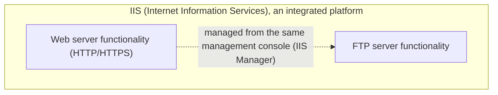

## Introduction

- **What You'll Learn From This Article**: IIS tends to be recognized mainly as web server (HTTP) functionality, but it's actually software that provides multiple internet services in an integrated way — you can also **install an FTP server role service** on top of it. This article systematically explains **the relationship between IIS and FTP**, why the two are integrated into the same management platform, and the difference between the FTP protocol's own active and passive modes, as well as the difference between FTPS and SFTP.
- **Intended Audience**: This article is aimed at engineers who've worked with building or operating an IIS server, but who can't concretely explain the relationship between IIS and FTP, or FTP's own internal workings.
- **Estimated Reading Time**: About 16 minutes

This article is part of the [Top 1% Series' full article guide](/en/sitemap), and the fourth article in the [Windows Server Operations Series](/en/sitemap#series-list). It assumes you understand IIS's web (HTTP) functionality itself from [Understanding How IIS and ASP.NET Work from a "Top 1%" Perspective](/en/articles/iis-fundamentals-guide).

## Prerequisites

- **FTP (File Transfer Protocol)**: A long-established protocol whose purpose is sending and receiving files.
- **NAT**: A mechanism that relays a private-IP-addressed internal network to the internet by translating it to a public IP address. See [Understanding How NAT/NAPT Works from a "Top 1%" Perspective](/en/articles/nat-guide) for details.

## Getting the Big Picture

### What the Name IIS (Internet Information Services) Means

**The name IIS (Internet Information Services) itself expresses a design philosophy — not "an HTTP-only server," but "a platform providing multiple 'internet services' in an integrated way."** When adding the "Web Server (IIS)" role in Server Manager, alongside the Web (HTTP) functionality, you can individually select and install an **FTP Server** role service.

## Fundamentals, Explained Thoroughly

### FTP's Unusual Structure: Control Channel and Data Channel

As a prerequisite for understanding IIS's FTP functionality, it's worth grounding yourself in **the unusual structure the FTP protocol itself has, quite different from HTTP.** **FTP uses two separate connections: a "control channel" (port 21 by default) for exchanging commands, and a "data channel" for actually transferring file content.**

There are also two ways to establish this data channel: **active mode** and **passive mode.**

| Mode | How the data channel is established | Compatibility with NAT/firewalls |
|---|---|---|
| **Active mode** | The server side opens a new data-channel connection toward the client | If the client is behind NAT, the NAT device often can't correctly let through this new connection initiated by the server, making the connection likely to fail |
| **Passive mode** | The client side opens a data-channel connection toward the server (the same direction as an ordinary connection) | Since the client initiates the connection, this works fine even when the client is behind NAT |

**Because NAT is extremely widespread in today's internet environment, passive mode is used almost universally in practice.** As covered in [Understanding How NAT/NAPT Works from a "Top 1%" Perspective](/en/articles/nat-guide), NAT fundamentally builds its translation table based on outbound connections from inside to outside, and often can't correctly relay a new inbound connection (the kind of connection the server initiates in active mode) — this asymmetry is active mode's practical weakness.

### IIS's FTP Functionality Is Internally Independent From HTTP

**IIS's FTP server functionality is implemented as a component that's internally completely independent from HTTP functionality (the HTTP.sys and application pool mechanisms).** A dedicated listener/processing pipeline for the FTP service runs separately, and the ASP.NET and application pool mechanisms covered in [Understanding How IIS and ASP.NET Work from a "Top 1%" Perspective](/en/articles/iis-fundamentals-guide) have no involvement at all in FTP functionality.

**The reason both are integrated into the same IIS management platform is the convenience of being able to centrally manage, from a single management console (IIS Manager), a group of services that historically shared the common purpose of "publishing static content/files externally."** As for their internal implementation and protocol, it's accurate to understand HTTP and FTP as completely separate things.

### The Difference From FTPS and SFTP

Two things often conflated when dealing with FTP are **FTPS** and **SFTP.**

- **FTPS (FTP over SSL/TLS)**: The traditional FTP protocol with SSL/TLS encryption added on top. Its control-channel/data-channel structure is the same as FTP, but the communication content is encrypted. **IIS's FTP server functionality supports FTPS.**
- **SFTP (SSH File Transfer Protocol)**: Despite including "FTP" in the name, this is actually **a file transfer protocol implemented as an SSH subsystem**, from a completely different lineage than FTP. It doesn't have the control-channel/data-channel separation structure, and performs file transfer within a single SSH connection. **IIS's FTP server functionality doesn't support SFTP — if you want to build an SFTP server on Windows, you need separate software (such as OpenSSH's SFTP subsystem).**

Similar-sounding names, completely different implementations

FTPS and SFTP are easily mistaken for the same lineage of technology because of their similar-sounding names, but **FTPS is an extension of the FTP protocol (adding encryption), while SFTP is a subsystem of an entirely different protocol, SSH** — they're completely independent implementations. It's a common point of practical confusion that enabling IIS's FTP functionality doesn't automatically make SFTP available too.

## The View From the Top 1% Perspective

### Passive Mode Port Range Configuration and Firewalls

In passive mode, there's a step where, as the client opens a data-channel connection toward the server, **the server side tells the client "please use this port number."** IIS's FTP server functionality lets you explicitly configure this passive-mode port range, and **the firewall needs to allow inbound traffic for the control channel (port 21) plus this entire configured port range.** Overlooking this setting causes a confusing symptom: the control-channel connection (logging in) succeeds, but only actual directory listings and uploads/downloads fail.

## Common Misconceptions and Pitfalls

- **Misconception 1: "IIS is software exclusively for a web server, unrelated to FTP"**
  As the name IIS (Internet Information Services) itself suggests, IIS is a platform providing multiple internet services in an integrated way, and FTP server functionality can also be added as a role service.
- **Misconception 2: "Enabling IIS's FTP functionality automatically makes SFTP available too"**
  SFTP is a protocol implemented as an SSH subsystem, from a completely different lineage than FTP. IIS's FTP functionality supports FTPS (FTP's encryption extension), but not SFTP.
- **Misconception 3: "Active mode and passive mode are just a matter of configuration preference"**
  In today's widely NAT-enabled environment, active mode is structurally prone to connection failures, and passive mode is the practical standard. It isn't merely a matter of preference.

## The Troubleshooting Perspective

For IIS FTP-related issues, the basic approach is to **isolate whether the problem is with the control channel, or the data channel (the passive-mode port range).**

1. **Connecting/logging into FTP works, but directory listings or uploads/downloads fail**: Check whether the passive-mode port range is correctly allowed inbound on the firewall.
2. **The FTP connection itself fails from the start**: Check reachability to the control channel (port 21 by default), and whether the credentials are correct.
3. **An SFTP client can't connect to the IIS server**: Since IIS's FTP functionality doesn't support SFTP, check whether separate SFTP-capable software (such as OpenSSH) has been installed.

### Preventive Measures and Permanent Fixes

- Explicitly configure the passive-mode port range and allow that entire range through the firewall.
- Standardize on encrypted transfer via FTPS (or separate software, if SFTP is needed), rather than plaintext FTP.
- Document clearly, in operational documentation, that FTP and SFTP are separate protocol lineages, to prevent confusion at the requirements-gathering stage.

## Summary

- The name IIS (Internet Information Services) expresses a design philosophy of providing multiple internet services in an integrated way, and FTP server functionality can also be added as a role service.
- FTP is a protocol using two connections — a control channel and a data channel — and there are two ways to establish the data channel: active mode and passive mode. With NAT so widespread today, passive mode is the practical standard.
- IIS's FTP functionality is implemented as a component that's internally completely independent from HTTP functionality.
- FTPS (FTP's encryption extension) and SFTP (an SSH subsystem) have similar-sounding names but are completely separate implementations; IIS's FTP functionality supports FTPS but not SFTP.

**What to Keep in Mind From Today**
1. When you run into an FTP connection issue, first isolate whether it's a control-channel or data-channel (passive-mode port range) problem.
2. When you run into a requirement that needs SFTP, keep in mind that IIS's FTP functionality can't handle it, and consider deploying separate software.

## References

- [FTP Extensions for IIS | Microsoft Learn](https://learn.microsoft.com/en-us/iis/extensions/ftp-extensibility)
- [File Transfer Protocol (FTP) | RFC 959](https://datatracker.ietf.org/doc/html/rfc959)
- [SSH File Transfer Protocol | IETF Draft](https://datatracker.ietf.org/doc/html/draft-ietf-secsh-filexfer)
