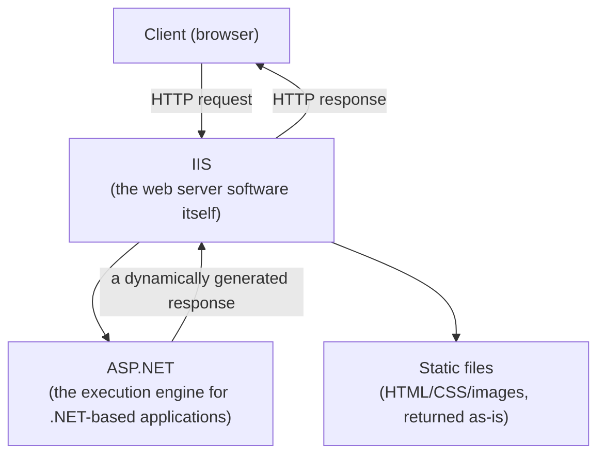
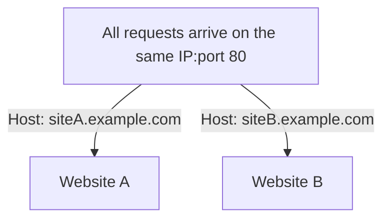

## Introduction

- **What You'll Learn From This Article**: This article sorts out what **IIS (Internet Information Services)** — a role you add to Windows Server — and **ASP.NET**, which runs on top of it, each actually do. It also systematically explains the true identity of the **Default Web Site** that always shows up when you open IIS Manager, the **binding configuration** needed to run multiple websites on a single server, and how adding/changing **HTTP response headers** works.
- **Intended Audience**: This article is aimed at engineers who've worked with building or operating an IIS server, but who can't concretely explain the division of labor between IIS and ASP.NET, or what binding configuration actually controls.
- **Estimated Reading Time**: About 18 minutes

This article is part of the [Top 1% Series' full article guide](/en/sitemap), and the third article in the [Windows Server Operations Series](/en/sitemap#series-list).

## Prerequisites

- **HTTP**: The basic communication protocol of the web, where a client (such as a browser) sends a request to a server, and the server returns a response. See [What Is a RESTful API? Understanding from a "Top 1%" Perspective](/en/articles/restful-api-guide) for details.

## Getting the Big Picture

### The Division of Labor Between IIS and ASP.NET

**IIS (Internet Information Services) is "the web server software itself" — it accepts and handles HTTP requests. ASP.NET is one of "the frameworks for running dynamic web applications" that runs on top of that IIS foundation.**

**IIS is simply a general-purpose foundation that accepts the HTTP protocol — it doesn't depend on any particular kind of application running on top of it.** ASP.NET is one representative execution engine that runs on IIS, but modules for PHP or other languages can also be integrated into IIS. **Keeping the distinction "IIS = the web server" versus "ASP.NET = the mechanism for running .NET applications on top of that web server" clear** is the foundation for everything that follows.

## Fundamentals, Explained Thoroughly

### IIS's Internal Structure: HTTP.sys, Application Pools, and Worker Processes

Internally, IIS is broadly made up of three components.

| Component | Role |
|---|---|
| **HTTP.sys** | A component that runs in Windows kernel mode and handles receiving HTTP requests. It actually listens on ports like 80 and 443, and routes incoming requests to the appropriate application pool. |
| **Application pool** | A "box" for separating multiple websites/applications at the process level. If an abnormality occurs (a crash, a memory leak) in one application pool, other websites running in a different application pool aren't affected. |
| **Worker process (w3wp.exe)** | The user-mode process that actually runs the application's code (ASP.NET, and so on). A dedicated worker process is started per application pool. |

**Of these three layers, isolation via application pools is a particularly important design element in practice.** When running multiple web applications on a single IIS server, assigning each to a separate application pool prevents a bug in one application from taking down the entire set of other applications along with it.

### What Is the Default Web Site?

Installing the IIS role automatically creates a website entry named **Default Web Site** by default. This is **the "first website" slot IIS comes with from the start**, configured by default to bind to port 80 (HTTP) and reference `%SystemDrive%\inetpub\wwwroot` (typically `C:\inetpub\wwwroot`) as its physical path.

In practice, **some configurations use this Default Web Site as-is to run a small-scale site, while others create a new, custom website and stop or delete the Default Web Site itself.** The Default Web Site isn't a special, reserved mechanism — it's simply "one of the ordinary website entries provided from the start" — so feel free to stop, delete, or modify it as your requirements dictate.

### Binding Configuration: The Mechanism for Routing to Multiple Websites on One Server

When hosting multiple websites simultaneously on a single IIS server, **"binding" is the configuration that determines which website an incoming request received by HTTP.sys should be routed to.** A binding is defined by a combination of three elements:

- **IP address**: Whether to accept requests bound only for a specific IP address, or for all IP addresses.
- **Port number**: Typically 80 for HTTP and 443 for HTTPS, but any port number can be specified.
- **Host name (the Host header)**: The value of the `Host` header included in an HTTP request lets requests be routed to different websites even when the IP address and port number are the same.

**Being routed to different websites based on host name, even with the same IP address and port number**, is the basic mechanism called **name-based virtual hosting**, used to consolidate multiple sites onto a single server.

Host-name-based routing for HTTPS (SNI)

For HTTP, the `Host` header is included in the unencrypted request, so routing can simply look at its value. For HTTPS, on the other hand, there's a challenge: which certificate to present needs to be decided before the TLS encryption handshake even completes. This is solved by **SNI (Server Name Indication)**, a TLS handshake extension that lets the client convey its desired host name in plaintext at an early stage of the handshake. Current IIS supports SNI, letting a single IP address and port simultaneously host multiple HTTPS sites, each with a different certificate.

### Adding and Changing HTTP Response Headers

IIS Manager lets you **add or change custom headers included in the HTTP response**, per website or per application. This is a mechanism achievable **purely through IIS-side configuration**, separate from explicitly setting headers within the application's own code.

Representative use cases include:

- **Adding security-related headers**: Headers that strengthen security, such as `X-Frame-Options` (a clickjacking countermeasure) or `Strict-Transport-Security` (forcing HTTPS communication), can be added in bulk purely through IIS-side configuration, without changing the application's code.
- **Changing or removing server-identifying information**: A setting for changing or removing the `Server` header (indicating the type and version of the server software in use) that's included in a response by default, for security reasons (avoiding giving an attacker a clue).

## The View From the Top 1% Perspective

### Why Application Pool Isolation Design Matters in Practice

If multiple web applications get bundled into the same application pool without much thought, there's a risk that **a memory leak or crash in one application could take down that entire pool — every other application assigned to it as well.** In practice, the recommended best practice, from an availability standpoint, is to **isolate applications with different importance or update frequency into separate application pools by principle.**

### Practical Caveats for Binding Design and Certificate Management

When consolidating multiple HTTPS sites onto a single IIS server, SNI enables host-name-based routing, but there's an operational challenge where **managing certificate expiration and host names gets more cumbersome in proportion to the number of sites.** Considering a mechanism to centrally manage certificate renewal (adopting an auto-renewal tool, for example) before the number of sites grows too large is practically important.

## Common Misconceptions and Pitfalls

- **Misconception 1: "IIS and ASP.NET are just two names for the same thing"**
  IIS is the web server software itself, accepting HTTP requests, while ASP.NET is the application execution framework for .NET that runs on top of it — clearly distinct layers.
- **Misconception 2: "The Default Web Site is a special entity essential to the system's operation and must never be deleted"**
  The Default Web Site is simply one of the ordinary website entries provided from the start. Feel free to stop, delete, or modify it as your requirements dictate.
- **Misconception 3: "HTTP response headers can only be set within the application's own code"**
  IIS Manager's configuration alone lets you add or change custom HTTP response headers, per website or per application.

## The Troubleshooting Perspective

For IIS-related issues, the basic approach is to **isolate whether the problem stems from binding configuration, or from application pool isolation design.**

1. **Adding a new website triggers a binding conflict error**: Check whether a different website is already using the same combination of IP address, port number, and host name.
2. **A bug in one application also takes down another application**: Check whether they're assigned to the same application pool, and isolate them if needed.
3. **An HTTPS site presents an unexpected certificate**: Check the SNI configuration and the correspondence between each binding and its assigned certificate.

### Preventive Measures and Permanent Fixes

- Isolate applications with different importance or update frequency into separate application pools by principle.
- In an environment running multiple sites, adopt a mechanism to centrally manage certificate expiration early on.
- Apply security-related HTTP response headers (X-Frame-Options, Strict-Transport-Security, and so on) consistently, per site, through IIS-side configuration.

## Summary

- IIS is the web server software itself, accepting HTTP requests, while ASP.NET is the application execution framework for .NET that runs on top of it — clearly distinct layers.
- IIS is made up of a three-layer structure — HTTP.sys, application pools, and worker processes — with isolation via application pools being an important design element for availability.
- The Default Web Site isn't a special, reserved mechanism — it's simply one of the ordinary website entries provided from the start.
- Binding configuration is the mechanism that routes requests to multiple websites on a single server, based on the combination of IP address, port number, and host name.

**What to Keep in Mind From Today**
1. When you encounter the terms IIS and ASP.NET, keep in mind they refer to different layers — the web server itself versus the application execution framework.
2. When running multiple web applications on a single IIS server, consider application pool isolation design from the start.

## References

- [Introduction to IIS Architecture | Microsoft Learn](https://learn.microsoft.com/en-us/iis/get-started/introduction-to-iis/introduction-to-iis-architecture)
- [ASP.NET Core Module overview | Microsoft Learn](https://learn.microsoft.com/en-us/aspnet/core/host-and-deploy/iis/aspnet-core-module)
- [Configure Websites in IIS | Microsoft Learn](https://learn.microsoft.com/en-us/iis/manage/configuring-security/understanding-sites-applications-and-virtual-directories-on-iis)
- [Transport Layer Security (TLS) Extensions: Extension Definitions | RFC 6066 (SNI)](https://datatracker.ietf.org/doc/html/rfc6066)
