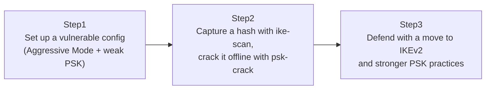

## Introduction

- **What You'll Learn From This Article**: The IKE Phase 1 covered in [Understanding How L2TP/IPsec Works From a "Top 1%" Perspective](/en/articles/l2tp-ipsec-guide) has an older mode called **Aggressive Mode**, which trades fewer round trips for weaker guarantees than Main Mode. This article reproduces, in a genuinely safe test environment, exactly why combining Aggressive Mode with a weak pre-shared key (PSK) allows an offline dictionary attack to succeed.
- **Intended Audience**: Readers who understand the basics of IKE's PSK authentication, but have never experienced firsthand how it can actually be abused, from an attacker's perspective. **This hands-on is for educational, defensive purposes — to strengthen the defenses of a test environment you manage yourself. Do not run these steps against someone else's production environment without authorization.**
- **Estimated Reading Time**: About 30 minutes

This article is part of the [Top 1% Series Complete Article Guide](/en/sitemap).

## Prerequisite Knowledge

- **IKE (Internet Key Exchange) and PSK Authentication**: This assumes the role of IKE Phase 1 — agreeing on encryption keys and authenticating the peer — covered in [Understanding How L2TP/IPsec Works](/en/articles/l2tp-ipsec-guide).
- **The Difference Between Main Mode and Aggressive Mode**: Main Mode encrypts identity information before exchanging it, across 6 round trips. Aggressive Mode shortens this to 3 round trips, at the cost of sending identity information unencrypted.

## The Big Picture



## Hands-On Steps

### Step 1: Set Up a Vulnerable Configuration (Aggressive Mode + Weak PSK)

On a test strongSwan server, allow Aggressive Mode and set a PSK weak enough to be in a dictionary.

```
# /etc/ipsec.conf
conn vulnerable-ike
    left=%defaultroute
    right=%any
    authby=secret
    aggressive=yes
    ike=aes256-sha256-modp2048!
    keyexchange=ikev1
```

```
# /etc/ipsec.secrets
%any %any : PSK "Summer2024!"
```

**This PSK, `Summer2024!`, only has enough strength to hold up against a dictionary attack for so long.** In many real-world environments, the PSK set during a site-to-site VPN's initial build gets left unreviewed for years.

### Step 2: Capture a Hash With ike-scan and Crack It Offline With psk-crack

On the attacker's machine, install `ike-scan`.

```bash
sudo apt install -y ike-scan
```

Attempt a connection in Aggressive Mode and capture the server's response (which includes the hash).

```bash
sudo ike-scan -M -A --id=vpnuser <server's IP address> --pskcrack=hash.txt
```

**In Aggressive Mode, that first response contains a hash derived from the PSK, sent unencrypted.** Under Main Mode, this identity information and hash are protected by a key already established beforehand, so they can't be captured at this stage.

Run a dictionary attack against the captured hash with `psk-crack`.

```bash
psk-crack -d /usr/share/dict/words hash.txt
```

**If the PSK is a word in the dictionary, `psk-crack` recovers `Summer2024!` itself in a relatively short amount of time.** This attack is a purely offline computation, generating no additional traffic to the server at all, so it never triggers a defense mechanism like account lockout.

### Step 3: Defend With a Move to IKEv2 and Stronger PSK Practices

The fundamental fix here is disabling Aggressive Mode itself.

```
# /etc/ipsec.conf
conn hardened-ike
    left=%defaultroute
    right=%any
    authby=secret
    keyexchange=ikev2
```

**IKEv2 has no equivalent to Aggressive Mode's shortened flow that sends identity information up front, to begin with.** As covered in [Comparing L2TP/IPsec With Modern VPN Protocols From a "Top 1%" Perspective](/en/articles/vpn-protocols-comparison-guide), IKEv2 is designed to deliver protection at least equal to Main Mode, with fewer round trips. On top of that, using a long, randomly generated string for the PSK — instead of a dictionary word like `Summer2024!` — is also a genuinely effective additional defense.

## What a Pro Sees Here (Top 1% Understanding)

### Why Aggressive Mode Is Still Used Today, and the Risk That Comes With It

That Aggressive Mode is weaker than Main Mode has been widely known as part of IKE's spec for a long time. **Even so, the biggest reason it's still used in the field is that when a remote-access VPN client has a dynamic IP address, Main Mode's mechanism of looking up the PSK keyed on the peer's IP address doesn't play well with that — Aggressive Mode's ordering, receiving the peer's ID (an identifier other than an IP address) first and deciding the PSK afterward, has genuinely been operationally necessary in that case.** But in a setup like a site-to-site VPN, where both IP addresses are fixed, this constraint simply doesn't exist, so **there's practically no operational reason to use Aggressive Mode in most cases.** If Aggressive Mode is enabled on a site-to-site VPN configuration, understand that alone as a setting worth reviewing.

### "The PSK Hasn't Leaked" and "The PSK Can't Be Cracked" Are Different Problems

What matters about the attack reproduced in this hands-on is that the PSK itself was never leaked or exfiltrated — **it was decrypted offline, purely from information obtainable by following the legitimate protocol exchange, through entirely proper steps.** The reasoning "I've never told anyone the PSK, so it's safe" doesn't hold in an environment where Aggressive Mode is enabled. You need to either prevent the hash from being obtainable at all (disable Aggressive Mode), or strengthen the PSK to a level where cracking it takes an impractical amount of time even if obtained — ideally both.

## Common Misconceptions and Pitfalls

- **Misconception 1: "PSK authentication is inherently weaker than certificate authentication."**
  The vulnerability isn't PSK authentication itself — it's the combination of Aggressive Mode, which sends identity information up front, and a weak PSK. IKEv2 plus a strong PSK provides plenty of real-world strength.
- **Misconception 2: "This attack requires ongoing unauthorized access to the server."**
  Capturing the hash completes entirely within a legitimate protocol exchange, and the subsequent cracking work happens completely offline, generating no additional traffic to the server.
- **Misconception 3: "Disabling Aggressive Mode means you don't need to worry about PSK strength anymore."**
  Disabling Aggressive Mode is an effective defense, but strengthening the PSK itself is also independently important, from a defense-in-depth perspective.

## Troubleshooting Perspective

1. **Deciding whether Aggressive Mode is actually needed for a site-to-site VPN configuration**: Check whether both IP addresses are fixed. If they are, there's usually no need for Aggressive Mode at all.
2. **Checking the strength of an existing PSK**: Actually attempting a crack with a dictionary-attack tool like `psk-crack` reveals its real-world strength.
3. **Clients can't connect after moving to IKEv2**: Check whether the client-side implementation supports IKEv2, and whether the `keyexchange=ikev2` setting matches on both sides.

## Summary

- IKEv1's Aggressive Mode sends identity information and a hash derived from the PSK unencrypted, letting a tool like `ike-scan` capture it.
- An offline dictionary attack against the captured hash, using a tool like `psk-crack`, requires no additional traffic to the server and triggers no defense mechanism.
- The fundamental fix is a combination of disabling Aggressive Mode itself (moving to IKEv2) and strengthening the PSK to a level not found in any dictionary.

**Takeaways to Apply Today**
1. Audit your site-to-site VPN configurations for whether Aggressive Mode is enabled.
2. In a setup where both IP addresses are fixed, review your configuration on the assumption that there's no real need for Aggressive Mode.

## References

- [ike-scan | Kali Tools](https://www.kali.org/tools/ike-scan/)
- [strongSwan Documentation: IKEv1 vs IKEv2](https://docs.strongswan.org/docs/latest/features/ikev1.html)
