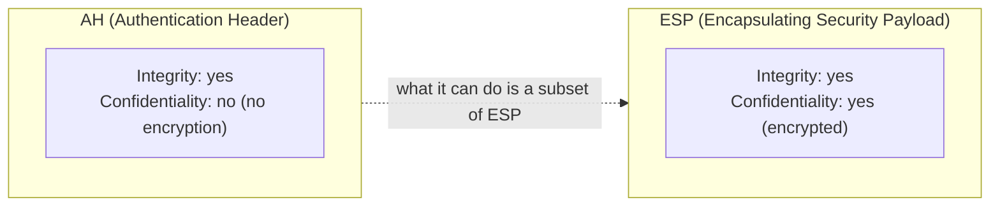
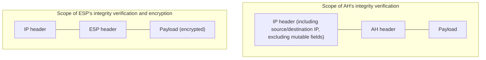
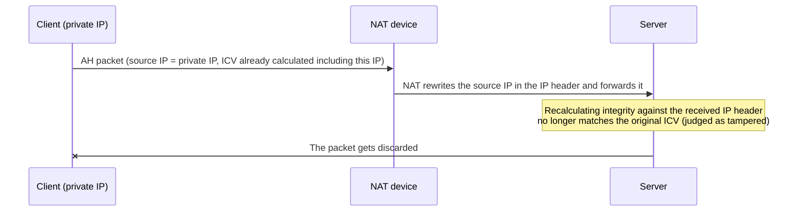

## Introduction

- **What You'll Learn From This Article**: Beyond ESP (Encapsulating Security Payload), covered in [Understanding How L2TP/IPsec Works from a "Top 1%" Perspective](/en/articles/l2tp-ipsec-guide), IPsec has another protocol called **AH (Authentication Header)**. This article systematically explains what AH actually protects, how it differs from ESP, why AH's lack of an encryption feature is said to be connected to certain countries' export restrictions, and why AH is almost never used in real-world practice today, given its fundamental incompatibility with NAT.
- **Intended Audience**: This article is aimed at engineers who understand IPsec mainly through ESP, but who can't concretely explain what the AH protocol actually does or why it's rarely seen in practice.
- **Estimated Reading Time**: About 16 minutes

This article is part of the [Top 1% Series' full article guide](/en/sitemap), a follow-on in the [Remote-Access VPN / L2TP-IPsec Series](/en/sitemap#series-list). It assumes you understand ESP and NAT traversal from [Understanding How L2TP/IPsec Works from a "Top 1%" Perspective](/en/articles/l2tp-ipsec-guide).

## Prerequisites

- **ESP (Encapsulating Security Payload)**: The IPsec protocol that handles data encryption and tamper detection. See [Understanding How L2TP/IPsec Works from a "Top 1%" Perspective](/en/articles/l2tp-ipsec-guide) for details.
- **Integrity and confidentiality**: Integrity is the property of being able to verify that data hasn't been tampered with since it was sent; confidentiality is the property of preventing a third party from reading the data's content (encrypting it). These are separate requirements, and a mechanism providing only one of the two also exists.

## Getting the Big Picture

### In a Nutshell

**AH (Authentication Header) is a protocol that adds only "integrity" (proof that a packet hasn't been tampered with) to an IP packet — unlike ESP, it has no confidentiality (encryption) functionality at all.** This design choice of "not encrypting" is the very essence of what AH is, and it directly ties into both the historical background covered below and the reason it's almost unused today.

## Fundamentals, Explained Thoroughly

### What AH Protects: Even the IP Header Itself

The biggest difference between AH and ESP isn't just whether encryption is present. **AH includes not only the payload (the actual data) but also most of the IP header (including the source and destination IP addresses) within the scope of its integrity verification** — this is the structural difference from ESP.

When calculating the authentication data (ICV, Integrity Check Value), AH includes everything in the IP header except mutable fields that can be legitimately rewritten by routers along the path (such as TTL). This gives it a strength ESP doesn't have: **the ability to also guarantee that header information like the IP address itself hasn't been tampered with in transit.** But this very strength is the direct cause of the severe incompatibility with NAT covered later.

### AH's Header Structure

AH is a header inserted right after the IP header, with the following fields:

| Field | Content |
|---|---|
| Next Header | Indicates the protocol that follows AH (TCP, UDP, or the inner IP header in tunnel mode, and so on) |
| Payload Length | The length of the AH header itself |
| SPI (Security Parameters Index) | A value identifying which security association (SA — a set of encryption keys and settings) is in use |
| Sequence Number | A sequence number for detecting replay attacks (an attack that resends the same packet to force it to be processed illegitimately) |
| Authentication Data (ICV) | A hash value for tamper detection, calculated over the scope of integrity verification described above |

**The replay attack countermeasure via the Sequence Number works exactly the same way as in ESP** — AH and ESP fundamentally differ only in two respects: the scope covered by the authentication data calculation, and whether encryption is present.

## The View From the Top 1% Perspective

### Why AH Has No Encryption: A Historical Story About Export Restrictions

Behind AH's deliberate design choice of having no encryption functionality lies a historical circumstance: **various countries' export and import restrictions on cryptographic technology back in the 1990s.**

At the time, strong cryptographic technology was treated similarly to military technology, and was subject to export controls as **"dual-use (military and civilian) technology"** (under regulations such as the US Export Administration Regulations, and the multinational Wassenaar Arrangement). A product with encryption functionality could face restrictions on its import or use in certain destination countries, or require permit applications or strength limitations in the exporting country itself. This regulation is believed to have stemmed from concerns that governments' ability to monitor communications could be undermined by the widespread adoption of strong cryptography.

**Because AH only provides integrity (tamper detection) and has no confidentiality functionality to conceal the content of communications**, it was less likely to be caught up by these cryptographic export controls. "Anyone can read the content of the communication, but its integrity in transit is guaranteed" was an easy argument to make that this didn't undermine government surveillance capability, so AH held a certain value as **a means of achieving at least integrity protection, even in countries or organizations where encryption (ESP) couldn't be used, or was difficult to use.**

This regulatory concern matters far less today

Around the year 2000, many countries substantially relaxed their cryptographic export restrictions (partly because commercially available, mass-market cryptographic technology increasingly became exempted from the Wassenaar Arrangement's controls). So, **the circumstance of "not having encryption functionality is advantageous for avoiding regulation" has largely lost its meaning today.** This historical background is important for understanding the reason behind AH's design choice at the time it was born, but it's worth keeping in mind that it no longer holds up as a reason to choose AH today.

### Why AH Is Almost Never Used Today: A Fundamental Incompatibility With NAT

Even now that the historical constraint of cryptographic export restrictions has relaxed, there's a more direct, decisive reason AH is almost never used in practice: **its incompatibility with NAT (Network Address Translation).**

As covered in [Understanding How NAT/NAPT Works from a "Top 1%" Perspective](/en/articles/nat-guide), NAT functions by **rewriting the source (or destination) IP address in the IP header** of packets passing through it. But as noted above, AH **includes the IP header's content (including the source and destination IP addresses) itself within the scope of its integrity verification.** If a NAT device rewrites the IP header of an AH packet, the hash value the receiving side calculates for integrity verification no longer matches the hash value the sending side calculated and embedded, so **the AH packet is judged to have been tampered with, and gets discarded.**

While ESP was able to solve this problem via **NAT-T (NAT traversal)**, covered in [Understanding How L2TP/IPsec Works from a "Top 1%" Perspective](/en/articles/l2tp-ipsec-guide) (by encapsulating in UDP and excluding the IP header itself from ESP's integrity verification scope), **the very design of AH — including the IP header itself in its integrity verification — is fundamentally incompatible with this kind of workaround.** In today's networking environment, where NAT is extremely widespread, this constraint is decisive.

Can ESP alone achieve the same integrity that AH used to provide?

You might worry, "without AH, won't we lose the ability to protect integrity all the way through the IP header?" — but this rarely causes a real problem in practice. **ESP can be configured with its encryption algorithm set to "NULL" (no encryption), while keeping only its integrity verification functionality enabled** (referred to as ESP-NULL). This lets you address the same demand AH originally satisfied — "I don't need confidentiality, but I do want integrity" — within ESP's own framework. Unlike AH, ESP's integrity verification doesn't include the entire outer IP header, so it causes no problem in a NAT environment either. **In other words, the functional value AH used to provide can be substituted by a configuration of ESP (ESP-NULL), leaving essentially no practical reason to actively choose AH, which retains only the drawback of being NAT-hostile.**

## Common Misconceptions and Pitfalls

- **Misconception 1: "AH is simply an older, outdated protocol compared to ESP"**
  Both AH and ESP remain active protocols within the IPsec specification today. Rather than "older," the accurate understanding is that **they're protocols with different design philosophies aimed at different use cases** — differing in scope of protection and whether confidentiality is present.
- **Misconception 2: "AH just has weaker encryption than ESP, but the basic functionality is the same"**
  AH has no encryption functionality at all. The essential difference isn't "weaker encryption" — it's that **the encryption (confidentiality) capability doesn't exist in the first place.**
- **Misconception 3: "You can communicate fine in a NAT environment as long as you use AH"**
  Because AH includes the IP header itself within the scope of its integrity verification, it's structurally incompatible with NAT's rewriting of the IP header. A workaround like ESP's NAT-T can't work with AH's design.

## The Troubleshooting Perspective

Since **newly choosing AH itself is a rare case today**, AH-related troubleshooting is best treated practically as understanding either "a configuration with historical roots that still lingers" or "something that shows up as study material or exam prep."

1. **AH is used in an existing configuration, and a connection can't be established in a NAT environment**: As noted, AH and NAT are structurally incompatible, so consider migrating to ESP (ESP-NULL if needed) where possible.
2. **A requirement for integrity-only protection has come up**: Rather than choosing AH, configuring ESP with the NULL encryption algorithm satisfies the requirement while also remaining compatible with a NAT environment.

### Preventive Measures and Permanent Fixes

- When designing a new IPsec configuration, choose ESP rather than AH unless there's a specific requirement otherwise.
- Even for a requirement that only needs integrity, consider the ESP-NULL option to ensure compatibility with NAT environments.

## Summary

- AH is a protocol that provides only integrity (tamper detection) and has no confidentiality (encryption) functionality at all.
- AH's structural difference from ESP is that it includes the IP header itself (including source and destination IP addresses) within the scope of its integrity verification.
- AH's design of having no encryption functionality stems from the historical circumstance of making it easier to avoid 1990s cryptographic export restrictions, but that circumstance itself matters far less today.
- AH's design of including the IP header itself in its verification scope is structurally incompatible with NAT's rewriting of the IP header, which is the decisive reason AH is almost never used today. ESP-NULL can substitute for the integrity-only requirement AH used to satisfy.

**What to Keep in Mind From Today**
1. When you encounter the term AH in IPsec, remember two things together: "it provides only integrity, not confidentiality," and "it's structurally incompatible with NAT."
2. When you run into a requirement for integrity-only protection, consider ESP-NULL rather than AH.

## References

- [IP Authentication Header | RFC 4302](https://datatracker.ietf.org/doc/html/rfc4302)
- [IP Encapsulating Security Payload (ESP) | RFC 4303](https://datatracker.ietf.org/doc/html/rfc4303)
- [Security Architecture for the Internet Protocol | RFC 4301](https://datatracker.ietf.org/doc/html/rfc4301)
- [Wassenaar Arrangement on Export Controls for Conventional Arms and Dual-Use Goods and Technologies](https://www.wassenaar.org/)
