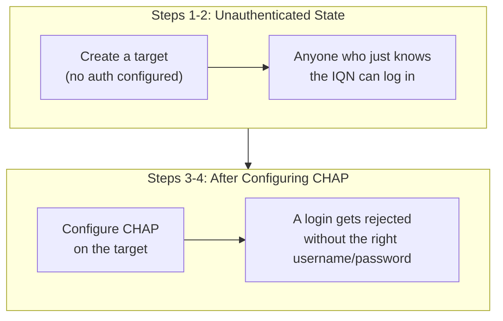

## Introduction

- **What You'll Learn From This Article**: Building on the initiator/target relationship you learned in [How iSCSI Works](/en/articles/iscsi-guide), reproduce — inside a safe, controlled test environment — the unauthenticated danger that **left unconfigured, a target lets anyone who merely knows its IQN log in**, and confirm that configuring **CHAP authentication** lets you reject a login from anyone who doesn't know the right username and password.
- **Intended Audience**: Readers who understand [How iSCSI Works](/en/articles/iscsi-guide), but can't explain exactly what configuration achieves iSCSI's access control.
- **Important Note**: **This hands-on exercise is for educational and defensive purposes — to strengthen the defenses of an environment you yourself control.** Never run this procedure against someone else's live environment without authorization. The test environment used here only ever communicates with a server you set up yourself, and contains no attack procedure directed at any third-party system whatsoever.
- **Estimated Reading Time**: About 25 minutes, including the hands-on exercise

This article is part of the [Top 1% Series Complete Article Guide](/en/sitemap), and the twelfth article in the [Storage Fundamentals Series](/en/sitemap#series-list). You can follow along with one of the Ubuntu Server environments set up in the [Hands-On Prep Manual](/en/articles/handson-prep-guide).

## Prerequisite Knowledge

- **iSCSI's Basic Mechanism**: The terms initiator, target, and IQN, covered in [How iSCSI Works](/en/articles/iscsi-guide).

## Getting the Big Picture

In this hands-on, you'll run both an iSCSI target and an initiator on the same single server, and confirm these two stages.



## Hands-On Steps

### Step 1: Create an iSCSI Target With No Authentication Configured

```bash
sudo apt install -y tgt open-iscsi
sudo dd if=/dev/zero of=/disk-iscsi.img bs=1M count=100
sudo tgtadm --lld iscsi --mode target --op new --tid 1 -T iqn.2026-11.test.example:storage.disk01
sudo tgtadm --lld iscsi --mode logicalunit --op new --tid 1 --lun 1 -b /disk-iscsi.img
sudo tgtadm --lld iscsi --mode target --op bind --tid 1 -I ALL
```

**The `-I ALL` option means "allow a connection from any IP address," and you haven't configured any username/password authentication at all yet.**

### Step 2: Confirm You Can Log In From the Initiator Side, With No Authentication

```bash
sudo iscsiadm -m discovery -t sendtargets -p 127.0.0.1
sudo iscsiadm -m node -T iqn.2026-11.test.example:storage.disk01 -p 127.0.0.1 --login
```

**Output:**

```
Logging in to [iface: default, target: iqn.2026-11.test.example:storage.disk01, portal: 127.0.0.1,3260]
Login to [iface: default, target: iqn.2026-11.test.example:storage.disk01, portal: 127.0.0.1,3260] successful.
```

**The login succeeded even though you never entered any username or password at all.** This concretely demonstrates what you learned in [How iSCSI Works](/en/articles/iscsi-guide): an IQN is **"a name for telling who you're talking to," not "credentials for proving who you actually are."** This is a state where **anyone who can reach the same network and knows the target's IQN can read and write that storage's contents.**

<details>
<summary>Why an IQN Alone Never Proves Identity</summary>

As you learned in [How iSCSI Works](/en/articles/iscsi-guide), **an IQN is an identifier that keeps uniquely identifying who you're talking to, regardless of IP address changes.** But being an identifier and being a credential are entirely different properties. **An IQN is close to public information — anyone who sniffs the network traffic can learn it.** Unlike a password, it's not a secret known only to the real owner, so the mere fact of knowing an IQN proves nothing about whether the other party is actually a legitimate initiator.

</details>

### Step 3: Log Out and Configure CHAP Authentication

```bash
sudo iscsiadm -m node -T iqn.2026-11.test.example:storage.disk01 -p 127.0.0.1 --logout
sudo tgtadm --lld iscsi --mode account --op new --user tgtuser --password tgtpass12345
sudo tgtadm --lld iscsi --mode target --op bind --tid 1 -I ALL
sudo tgtadm --lld iscsi --mode account --op bind --tid 1 --user tgtuser
```

**Now the target side only accepts, as a legitimate connection, "whoever presents the name tgtuser along with its matching password."** This is "**CHAP**" (Challenge-Handshake Authentication Protocol) authentication.

### Step 4: Confirm a Login With No Credentials Gets Rejected

```bash
sudo iscsiadm -m node -T iqn.2026-11.test.example:storage.disk01 -p 127.0.0.1 --login
```

**Output:**

```
iscsiadm: Could not login to [iface: default, target: iqn.2026-11.test.example:storage.disk01, portal: 127.0.0.1,3260].
iscsiadm: initiator reported error (24 - iSCSI login failed due to authorization failure)
```

**Unlike before, the login got rejected.** Now configure the correct username and password on the initiator side, and log in again.

```bash
sudo iscsiadm -m node -T iqn.2026-11.test.example:storage.disk01 -p 127.0.0.1 \
  -o update -n node.session.auth.authmethod -v CHAP
sudo iscsiadm -m node -T iqn.2026-11.test.example:storage.disk01 -p 127.0.0.1 \
  -o update -n node.session.auth.username -v tgtuser
sudo iscsiadm -m node -T iqn.2026-11.test.example:storage.disk01 -p 127.0.0.1 \
  -o update -n node.session.auth.password -v tgtpass12345
sudo iscsiadm -m node -T iqn.2026-11.test.example:storage.disk01 -p 127.0.0.1 --login
```

**Output:**

```
Login to [iface: default, target: iqn.2026-11.test.example:storage.disk01, portal: 127.0.0.1,3260] successful.
```

**The login only succeeded once you presented the correct username and password.** You've concretely confirmed that configuring CHAP authentication closes off the dangerous state from Step 2 — "anyone who just knows the IQN can log in."

## What a Pro Sees Here (Top 1% Understanding)

### Carry the Premise That "a Default Configuration Is Never Guaranteed to Be Safe"

The biggest lesson from this hands-on is that **the initial state right after creating a target with `tgtadm` has zero authentication defense active at all.** **A great many storage and network devices' default configurations prioritize "getting it working" first, with the expectation that the user will additionally configure "getting it working safely" themselves.** This shares the same underlying idea as [an old protocol like SMB1 now getting disabled by default](/en/articles/windows-server-smb1-hardening-handson-guide). **A top-1% engineer needs the habit of explicitly checking, every time, "is it actually fine to use the default configuration as-is," whenever introducing a new device or service.**

## Common Misconceptions and Pitfalls

- **Misconception 1: "Knowing an IQN is sufficient as a means of proving identity."**
  An IQN is a name for identifying who you're talking to, not a secret credential like a password. Anyone who sniffs the network can learn it.
- **Misconception 2: "Creating an iSCSI target automatically enables authentication."**
  The state right after creating a target with `tgtadm` has no authentication configured at all — a connection is allowed to anyone who knows the IQN.
- **Misconception 3: "Configuring CHAP authentication also encrypts the actual communication itself."**
  CHAP authentication is a mechanism for proving identity at connection time, not for encrypting the actual data communication after login. If encryption is needed, you'd need to combine it with a separate mechanism, such as IPsec.

## Troubleshooting Perspective

1. **An existing initiator can no longer log in after configuring CHAP authentication**: Check whether the initiator side's configuration reflects the correct username and password.
2. **An unintended host is allowed to connect to the iSCSI target**: Check whether a setting allowing every IP address, like `tgtadm --mode target --op bind -I ALL`, has been left in place.
3. **You want to change the CHAP authentication password**: You need to update both the target side's account configuration and the initiator side, simultaneously.

## Summary

- Left unconfigured, an iSCSI target lets anyone who merely knows its IQN log in.
- An IQN is a name for identifying who you're talking to, not credentials for proving who you actually are.
- Configuring CHAP authentication lets you reject a login from anyone who doesn't know the right username and password.
- Many devices' default configurations often prioritize getting them working over safety, requiring the user to explicitly add defenses.

**Takeaways to Apply Today**
1. When building a new iSCSI target, always include configuring CHAP authentication as part of your initial build procedure.
2. When introducing storage or network equipment, explicitly check every time whether using the default configuration as-is is actually safe.

## References

- [RFC 1994 - PPP Challenge Handshake Authentication Protocol (CHAP)](https://datatracker.ietf.org/doc/html/rfc1994)
- [tgtadm(8) Manual Page](https://linux.die.net/man/8/tgtadm)
