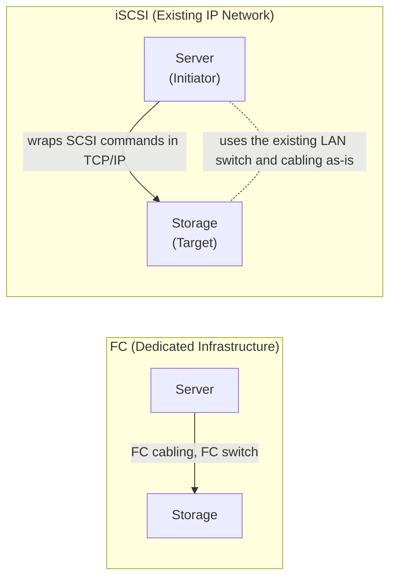

## Introduction

- **What You'll Learn From This Article**: Building on the mechanism covered in [The Difference Between FC Cabling and LAN Cabling](/en/articles/fc-san-fundamentals-guide) — FC building a SAN over dedicated cabling and equipment — a systematic understanding of **how iSCSI achieves that same SAN (a storage-dedicated network) over an existing IP network.**
- **Intended Audience**: Readers who understand "iSCSI is apparently a technology for running a SAN over an IP network," but can't explain exactly how it differs from FC, or terms like initiator and target.
- **Estimated Reading Time**: About 18 minutes

This article is part of the [Top 1% Series Complete Article Guide](/en/sitemap), and the seventh article in the [Storage Fundamentals Series](/en/sitemap#series-list).

## Prerequisite Knowledge

- **FC and SAS Fundamentals**: The fundamentals covered in [The Difference Between FC Cabling and LAN Cabling](/en/articles/fc-san-fundamentals-guide) — FC using no IP addresses at all, recognizing its counterpart via a WWN identifier, as a dedicated spec entirely independent from LAN. iSCSI's design trades away that independence for a different benefit.

## Getting the Big Picture

FC achieves a SAN through **"assembling an entirely separate set of dedicated cabling, equipment, and protocols, apart from LAN"** — thorough separation. iSCSI takes the opposite idea: **"instead of setting up new dedicated cabling and equipment to achieve a SAN, wrap the SCSI command itself, as-is, inside a TCP/IP packet and send it,"** achieving a SAN on top of existing LAN (Ethernet/IP) infrastructure.



## Deep Dive Into the Fundamentals

### Initiator and Target: a Role Division Carried Over Directly From SCSI Terminology

iSCSI is built on the idea of **letting SCSI (Small Computer System Interface) — an old command set originally designed for storage directly attached inside a server — be used as-is, over a network.** Because of this, terminology that's been in use since the SCSI era carries over directly.

- **Initiator**: The side that sends a request — the server itself, using the storage.
- **Target**: The side that receives the request — the actual disk (the storage device).

**The terms "initiator" and "target" aren't iSCSI's own invention — they carry over directly from SCSI, a spec originally designed for communication between components inside a single server.** Understanding iSCSI as a spec that simply swaps out "how to transmit a SCSI command" for TCP/IP over a network, with everything else unchanged, makes the terminology's origin click into place naturally.

### IQN: iSCSI's Own Identifier, Counterpart to FC's WWN

FC used no IP address at all, recognizing its counterpart through an identifier called a **WWN.** iSCSI, too, uses its own identifier, separate from the ordinary IP address: the **IQN (iSCSI Qualified Name).**

```
iqn.2026-10.test.example:storage.disk01
```

**An IQN is an identifier prepared entirely separately from the IP address.** This lets an iSCSI initiator or target keep uniquely identifying its counterpart under the exact same name, no matter how the IP address changes (through DHCP reassignment, and similar).

<details>
<summary>Why Isn't the IP Address Alone Sufficient?</summary>

If recognizing a counterpart depended on the IP address alone, **you'd need to review every setting on the storage side (which server is allowed to access which disk) every single time a server's IP address changed.** Preparing a fixed identifier, separate from the IP address — the IQN — means the setting "this named initiator is allowed to access this disk" never needs to change, no matter how the IP address shifts. This closely parallels how [DNS abstracts a changeable IP address behind a less-changeable name](/en/articles/dns-server-fundamentals-guide).

</details>

### What iSCSI Gains, and What It Sacrifices

| Aspect | FC | iSCSI |
|---|---|---|
| **Dedicated Equipment Needed** | Requires an FC switch and FC HBA (a dedicated network card) | Works with existing Ethernet switches and NICs |
| **Deployment/Operating Cost** | High, due to dedicated equipment | Lower, since existing infrastructure can be reused |
| **Performance/Latency** | No TCP/IP overhead, low latency | TCP/IP overhead tends toward higher latency than FC |
| **Operational Separation** | Physically fully separate from LAN traffic | Shares the same LAN infrastructure, so separation depends on design |

**What iSCSI gains is "low cost from reusing existing infrastructure"; what it sacrifices is "the low latency and physical traffic separation that FC's dedicated infrastructure provided."** Real-world practice compensates for this sacrifice to some degree through software-level measures, like isolating a dedicated VLAN for iSCSI traffic.

## What a Pro Sees Here (Top 1% Understanding)

### The Design Pattern of "Achieving the Same Goal via an Entirely Different Layer"

The relationship between FC and iSCSI closely parallels the structure covered in [When to Use a Proxy vs. a Firewall](/en/articles/proxy-firewall-guide) — "technologies with a similar-looking goal actually operate at entirely different layers." FC created an entirely new network layer, purpose-built for the goal of a SAN. iSCSI achieves that exact same SAN goal retroactively, on top of an entirely different, existing layer — the IP network. **This binary structure — "build a new dedicated layer" versus "layer it on top of an existing one" — recurs as a universal design pattern, not just in storage, but across other technology domains too, like [the comparison between modern and legacy VPN protocols](/en/articles/vpn-protocols-comparison-guide).**

## Common Misconceptions and Pitfalls

- **Misconception 1: "iSCSI is a full, superior replacement for FC."**
  iSCSI trades away the low latency and physical traffic separation FC provided, in exchange for lower deployment cost. The choice isn't about which is "better" — it's matched to requirements.
- **Misconception 2: "The terms initiator and target are iSCSI's own invention."**
  These terms carry over directly from SCSI, an old command set.
- **Misconception 3: "An IQN is just an alias for a hostname."**
  An IQN is iSCSI's own identifier, entirely separate from a hostname. It's designed to preserve uniqueness regardless of IP address changes.

## Troubleshooting Perspective

1. **An initiator can't find a target**: Check whether the IQN is specified correctly, and whether a firewall rule on the network between the initiator and target is blocking communication.
2. **Disk access over iSCSI is slower than expected**: Check whether ordinary traffic is mixed in on the same LAN infrastructure, and whether a dedicated VLAN separation is in place.
3. **Storage access broke after changing a server's IP address**: Check whether the target side's access permission setting is IP-address-based where it should actually be IQN-based.

## Summary

- Where FC achieves a SAN with dedicated infrastructure, iSCSI achieves a SAN over an existing IP network by wrapping SCSI commands in TCP/IP packets.
- The terms initiator (the requester) and target (the receiver) carry over directly from SCSI.
- An IQN is iSCSI's own identifier, letting an initiator and target keep uniquely identifying each other regardless of IP address changes.
- iSCSI gains lower deployment cost, at the cost of sacrificing, to some degree, the low latency and physical traffic separation FC provided.

**Takeaways to Apply Today**
1. When weighing FC against iSCSI, concretely compare the trade-off between "performance/latency" and "deployment/operating cost."
2. When configuring storage access permissions, base them on a fixed identifier like an IQN, rather than a changeable IP address.

## References

- [RFC 7143 - Internet Small Computer System Interface (iSCSI) Protocol](https://datatracker.ietf.org/doc/html/rfc7143)
- [RFC 3721 - Internet Small Computer Systems Interface (iSCSI) Naming and Discovery](https://datatracker.ietf.org/doc/html/rfc3721)
