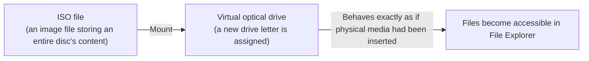

## Introduction

- **What you'll get from this article**: Downloading a server update utility like Dell Server Update Utility sometimes gives you an **ISO file** rather than an executable. This article systematically covers exactly what happens when you right-click it and choose **"Mount,"** and why ISO-based distribution still persists today.
- **Intended audience**: Readers who routinely right-click and mount ISO files, but can't concretely explain what's happening behind the scenes.
- **Estimated reading time**: About 11 minutes

This article is part of the [Top 1% Series — Full Article Guide](/en/sitemap), and the 9th entry in the [Windows Client Operations series](/en/sitemap#series-list). Reading [Understanding the Difference Between x64 and x86 Installers](/en/articles/windows-install-media-guide) first will make this article easier to follow.

## Prerequisite Knowledge

- **Optical media (CD/DVD)**: A read-only optical disc used to store data. It was once widely used for software distribution and OS installation.

## Getting the Big Picture

### In a nutshell

**An ISO file is a "disk image" — the entire content of an optical medium like a CD or DVD, saved byte-for-byte as a single file.** Right-clicking it and choosing "Mount" makes Windows **recognize the ISO file's content exactly as if a physical disc had actually been inserted into a physical optical drive.**

## Deep Dive into the Fundamentals

### What "mounting" actually does

Right-click an ISO file and choose "Mount," and a new virtual optical drive (assigned a new drive letter) appears in File Explorer, showing the ISO file's contents as if they'd been unpacked directly into it.

**The key point is that mounting is strictly an operation that makes it recognized as a virtual, read-only drive — not an operation that actually unpacks or copies the ISO file's content to another location on disk.** Unmounting makes that virtual drive disappear, while the original ISO file itself remains untouched. Since Windows 8, this capability has been built into the OS by default, executable directly from a right-click without any additional software.

### Why update utilities are still distributed as an ISO today

The reason server firmware/driver update utilities are often distributed as an ISO rather than a standalone executable is that **the convention of originally being designed for distribution and boot via physical CD/DVD media has carried forward unchanged.** With an ISO, you can also **burn it directly onto physical media and boot the target server from it**, giving it a practical advantage: performing an update on a server that can't even boot its own OS, using this media on its own to boot and carry out the update.

## What Top-1% Engineers See

### The difference from writing an ISO directly to a USB drive

These days, instead of burning an ISO to physical CD/DVD media, the mainstream practice has become writing it directly to a bootable USB drive using a dedicated tool (Rufus, for example). In this case, simply "copying the ISO file's contents onto the USB drive" doesn't actually make it bootable media. **A tool that creates a bootable USB drive doesn't just copy the ISO's contents — it also performs the additional work of rewriting the USB drive's own partition layout and boot sector into a format the target firmware (BIOS/UEFI) can correctly recognize.** Mounting merely "shows you the content as-is," while creating bootable media "actually constructs the bootable structure itself" — an entirely different process. Keeping this distinction in mind makes it easier to understand how this differs from a simple file copy.

## Common Misconceptions and Pitfalls

- **Misconception 1: "Mounting an ISO file actually unpacks and copies its content onto disk."**
  Mounting is an operation that makes the ISO file's content recognized as a virtual, read-only drive — not an operation that actually copies or unpacks its content elsewhere.
- **Misconception 2: "Simply copying an ISO file's contents onto a USB drive makes it bootable media."**
  Creating a bootable USB drive requires additional processing beyond a simple file copy: rewriting the partition layout and boot sector.

## Troubleshooting Perspective

1. **Right-clicking an ISO file doesn't show a "Mount" option**: Older Windows versions may not have this built in as a default feature, requiring a third-party mounting tool.
2. **A drive you supposedly mounted doesn't show up in File Explorer**: Check whether another disk image is already mounted, or whether the ISO file itself is corrupted.
3. **A bootable USB drive created from an ISO file doesn't actually boot**: Check whether it was made with a simple file copy instead of a dedicated tool, and whether the partition layout and boot sector were actually created correctly using a tool like Rufus.

### Prevention and Long-Term Countermeasures

- When creating bootable media from an ISO file, always use a dedicated tool — never settle for a simple file copy.
- Keep in mind that mounting and creating bootable media are entirely different processes.

## Summary

- An ISO file is a disk image that saves the content of an optical medium like a CD or DVD as a single file.
- "Mounting" is an operation that makes an ISO file's content recognized as a virtual, read-only drive — not an operation that actually unpacks or copies its content onto disk.
- Update utilities are still distributed as an ISO today because the convention of originally being designed for distribution and boot via physical media has carried forward.
- Creating a bootable USB drive involves additional processing beyond a simple file copy — rewriting the partition layout and boot sector.

**What to keep in mind starting today**
1. When you encounter "mounting" an ISO file, remember it's just recognition as a virtual, read-only drive.
2. When creating bootable media from an ISO file, always use a dedicated tool.

## References

- [Mount and unmount an ISO image | Microsoft Support](https://support.microsoft.com/en-us/windows/mount-and-unmount-a-disc-image-iso-or-vhd-in-windows-63d84dfc-a75f-4c3e-b298-84a3fbec7784)
