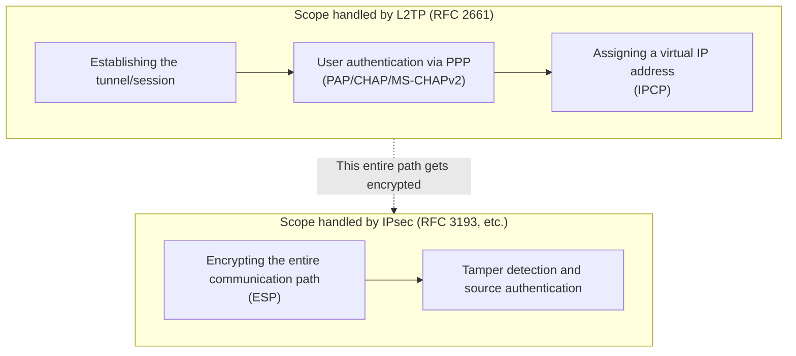
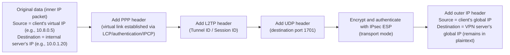
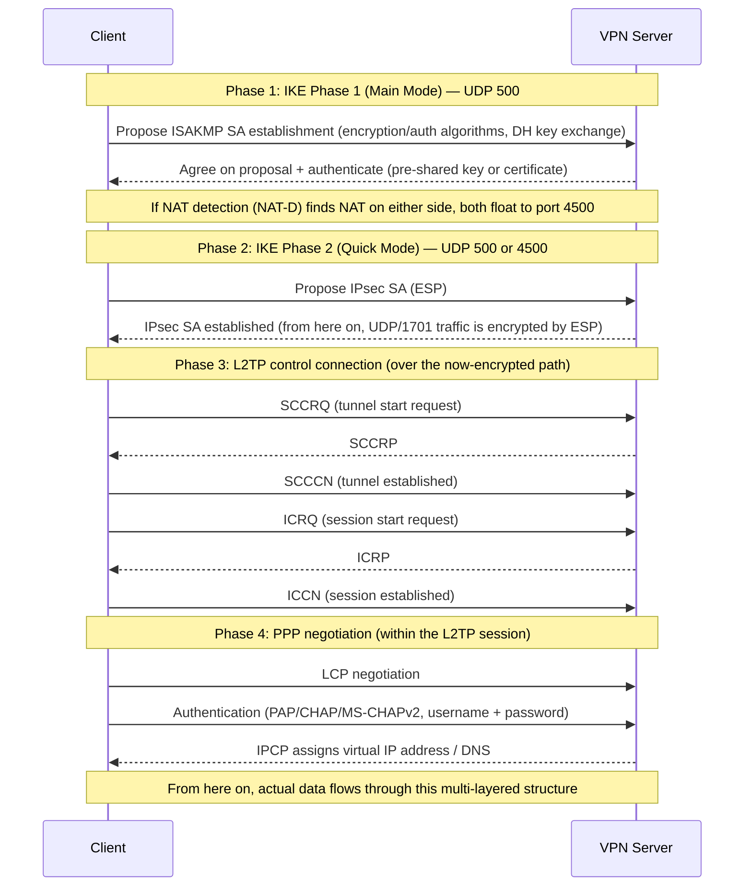
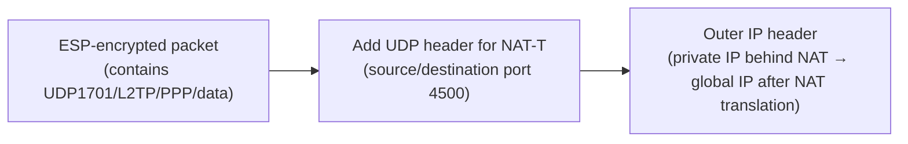

## Introduction

- **What You'll Learn From This Article**: This article unpacks what actually lies behind the understanding that "a VPN connection uses the L2TP protocol together with IPsec encryption" — why two standards with different roles need to be combined, exactly what happens, and in how many stages, when a connection is established, and how NAT traversal (NAT-T) is achieved. By the end you'll have a systematic understanding of all of it.
- **Intended Audience**: This article is written for infrastructure engineers who know that "a VPN connection uses the L2TP protocol together with IPsec encryption," but who cannot explain the internal workings beyond that — why two protocols are needed, the steps of connection establishment, and what exactly gets encrypted.
- **Estimated Reading Time**: About 25 minutes

This article is part of the [Top 1% Series' full article guide](/en/sitemap).

## Prerequisites

- **VPN (Virtual Private Network)**: A general term for technologies that create a logical communication path — one that behaves like a dedicated line — on top of a public network such as the internet.
- **Encapsulation**: Attaching headers (control information) before and after a piece of data and wrapping it inside another protocol for transport. The basic idea that a header gets added every time a packet descends a layer is common to network communication in general.
- **UDP (User Datagram Protocol)**: A lightweight, connectionless transport-layer protocol that performs no delivery confirmation or retransmission control. Unlike TCP, its basic nature is "fire and forget."
- **NAT (Network Address Translation)**: A technology that translates between private and global IP addresses. Many home and corporate routers use it so that multiple internal devices can share a single global IP address. Why a home router gets a global IP in the first place (and the difference between cases where the carrier's concentration point performs NAT translation and cases where it doesn't) is covered in "Whose Global IP Is It, Really?" in [Understanding the Evolution of Access-Line Technology — ADSL, Fiber, and More — from a "Top 1%" Perspective](/en/articles/access-network-guide).

## Getting the Big Picture

### In a Nutshell

**"L2TP/IPsec" is a combination of two independent standards with a clear division of labor: L2TP builds a virtual tunnel, and within it a PPP connection handles user authentication and IP address assignment, while IPsec encrypts the entire communication path to protect it from eavesdropping and tampering.**

This is the first sticking point. "L2TP/IPsec" is not a single, unified protocol — it is **two standards, with different design philosophies and different standards bodies, that were combined after the fact**.

The reason they need to be combined is that **L2TP by itself has no encryption capability whatsoever, and IPsec by itself had no standard mechanism for the "per-user authentication" and "automatic virtual IP address assignment" that remote-access VPNs require** (the latter issue is now solved by IKEv2's EAP authentication, discussed later). It helps to keep the historical background in mind: the technology for digging a tunnel and the technology for locking that tunnel were each developed for their own separate reasons, and later combined into the form we see today.

### Inside the Packet: How Many Layers of Headers Stack Up

In actual communication, headers stack up on a single IP packet as follows (the diagram below shows the state after the PPP connection and the IKE/IPsec negotiation, both discussed later, have fully completed and real data has begun to flow).

**Notice that two kinds of IP address appear here.** The "original data" is an **inner IP packet** whose source is the **virtual IP** assigned to the client via IPCP, and whose destination is the internal server the client actually wants to reach. The "outer IP header," on the other hand, carries the client's and the VPN server's actual global IP addresses — the addresses that routers along the internet path actually use to forward the packet. These two addresses play entirely different roles: the inner IP address determines "which server to communicate with inside the tunnel," while the outer IP address determines "where on the internet the tunnel itself runs from and to." At the tunnel's endpoint, the VPN server strips off all the ESP/L2TP/PPP headers and forwards the inner IP packet that emerges to the destination internal server, using ordinary IP routing.

The key point is that **ESP encrypts the UDP header (port 1701) along with everything else** (the detailed mechanics of ESP itself are explained later in "The Role IPsec Plays"). IPsec's transport mode leaves intact only the IP header that ESP is directly applied to — here, the outer IP header between the client and the VPN server — and encrypts everything inside it (in this case, UDP/L2TP/PPP/the original IP packet, all of it). It's worth being precise here: **the name "transport mode" refers to "ESP does not add a second, new outer IP header," not to "the original inner IP packet stays in the clear."** The "original data (inner IP packet)" shown in the diagram is bundled together with UDP/L2TP/PPP and falls entirely inside what gets encrypted, so the only information visible from outside is "the source and destination global IP addresses" and "the fact that this is an ESP packet (IP protocol number 50)." Not just the UDP port 1701 information, but also the inner IP packet's own source (virtual IP) and destination (internal server IP) addresses, disappear into the encrypted payload and are invisible to devices along the path. This point matters again later, in "Common Misconceptions."

A common question is **which layer of the OSI model / TCP-IP model each of these headers corresponds to**. The mapping looks like this.

| Header | Role it plays | Corresponding layer (approximate) |
|---|---|---|
| Original data (inner IP packet) | The actual payload being sent and received | L3 (network layer) |
| PPP header | Framing over a 1-to-1 link | L2 (data link layer) |
| L2TP header | Multiplexing identifier for the tunnel/session | Information for identifying and multiplexing L2 frames (PPP); closer to a "session ID" than a layer |
| UDP header | Carries the L2TP message itself | L4 (transport layer) |
| ESP | Encryption, integrity, and anti-replay protection | A "security layer" that spans L3 and L4 (informally sometimes called L3.5) |
| Outer IP header | Routing over the actual path on the internet | L3 (network layer) |

The reasoning "UDP is L4, so working backward, L2TP must be L3 and the PPP header must be L2" is **half right and half wrong**. PPP corresponding to L2 is correct. But the fact that L2TP appears **inside the payload** of a UDP (L4) protocol does not mean it plays the role of L3 (the routing layer) — the outer IP header is what actually performs internet routing, and the L2TP header only carries multiplexing information identifying "which PPP session's frame this is." This mismatch arises because L2TP is "a protocol for tunneling L2 frames" that nevertheless sits, in its implementation, on top of L4 (UDP) — a good example of how **tunneling protocols often cannot be cleanly mapped back onto the OSI layers by construction** (ESP is similar: because it sits immediately after the IP header, treated as IP protocol number 50, it leans toward L3, but functionally it handles encryption and authentication — territory distinct from L3's original job — so it doesn't fit neatly into a single layer either). It clicks into place once you accept that "encapsulation order = where the protocol operates," but not necessarily "encapsulation order = OSI layer number."

## Fundamentals, Thoroughly Explained

### The Role L2TP Plays: Creating the Tunnel

L2TP (Layer 2 Tunneling Protocol, RFC 2661) is a protocol standardized by merging Cisco's L2F (Layer 2 Forwarding) and Microsoft's PPTP (Point-to-Point Tunneling Protocol). As its name suggests, its fundamental role is to **tunnel PPP (Point-to-Point Protocol) frames over an IP network**.

Why Does a "Dial-Up Era" Protocol Like PPP Show Up in a VPN?

PPP (RFC 1661) is a protocol originally designed to connect two points directly over dial-up connections that ran across telephone lines. It defines a sequence of steps: "establish the link (LCP)," "authenticate with a username and password," and "assign an IP address (IPCP)." By assuming a "circuit-switched" model — like a telephone line, where a single physical circuit remains occupied between the two parties for the duration of the call — PPP could get away with a simple design: it carries no destination address and simply processes incoming frames in order.

L2TP was created to reproduce this "one-to-one link establishment, authentication, and IP address assignment mechanism that PPP had" not over a physical telephone line, but over a virtual tunnel on an IP network. In other words, the source of the odd feeling that "why does a dial-up-era standard show up in a VPN" is simply that **L2TP/IPsec directly reuses the PPP mechanism built for dial-up**. The reason remote-access VPNs feel like "log in with a username and password and receive an internal IP address" is a vestige of this design.

If you want to dig deeper into the difference between telephone lines and IP networks (circuit switching versus packet switching), their historical background, and the concrete steps of a dial-up connection, see the separate article [Understanding the Difference Between Telephone Lines and IP Networks from a "Top 1%" Perspective — Circuit Switching, Packet Switching, and the Design of PPP](/en/articles/circuit-switching-ppp-guide).

### What Is Tunneling? — How It Differs from Encryption

Let's pin down exactly what the words "tunnel" and "tunneling" mean here. **Tunneling means encapsulating a frame from one protocol (here, a PPP frame), unchanged, as the payload of a different protocol (here, UDP/IP) and carrying it that way.** It's not a process that touches the contents — it's purely about "how the data is carried, how the path is built" — and that is the decisive difference from encryption.

- **Tunneling**: Repackaging data, without touching its contents at all, by stacking headers on the outside so it can travel over a different path. The contents remain readable by anyone.
- **Encryption**: Transforming the contents themselves into a form unreadable to any third party without the key. It has nothing to do with the path or how the data is carried.

These are two independent concepts. Indeed, both **L2TP alone (tunneling without encryption)** and **a configuration where IPsec directly protects communication between two hosts (encryption without tunneling)** are each perfectly viable on their own. L2TP/IPsec is simply a combination that happens to layer the two together.

**What "tunneling PPP frames over an IP network" means** becomes clear once you see it this way. PPP was originally designed to work only over a "dedicated serial link connecting two points directly," like a telephone line. As-is, it cannot flow over a packet-switched network like an IP network. So L2TP wraps PPP frames as the payload of UDP/IP, tricking PPP into believing that **a dedicated physical link exists** between the two remote points. That's why it's called a "tunnel": even though no dedicated physical line exists, it's a virtual path that behaves, logically, as though a single direct connection were in place.

**Why does merely "wrapping" the frame create the illusion of a dedicated link?** Let's dig one level deeper into the mechanism. In its implementation, PPP treats "the lower layer that sends and receives frames" purely as an abstract interface — whether that's a telephone line's serial port or a tunnel over an IP network, PPP itself is designed not to care at all what medium lies underneath, as long as the send/receive contract holds: "hand over a frame and it reaches the other side; if a frame arrives from the other side, I can receive it." L2TP implements this lower-layer interface over an IP network in place of a physical serial line. Specifically, it takes a single frame handed off by PPP, wraps it unchanged as a UDP/IP payload, and sends it to a **single fixed destination corresponding to the already-established Tunnel ID and Session ID (discussed below)**. From PPP's point of view, then, the exact same contract as a dedicated link — "hand over a frame and it reaches one specific party" — continues to hold, with only the implementation underneath swapped from a serial port to L2TP's send/receive processing. PPP's own code never has to be aware that the link layer changed from a physical circuit to an IP tunnel; it just keeps running as long as this send/receive interface contract is satisfied. That is the substance of "tricking it into believing a dedicated physical link exists."

With this groundwork in place, two common questions can now be answered clearly. **First: "Is the tunnel created in order to encrypt the PPP exchange?"** — the answer is no. L2TP itself has no encryption capability whatsoever (this is also covered later, in "Common Misconceptions"), and the tunnel's purpose, as explained above, is purely to emulate the one-to-one link that PPP requires on top of a shared IP network — it has nothing to do with encryption. Encryption is entirely the job of a separate layer, IPsec (ESP), covered later in "The Role IPsec Plays."

**Second: "IPsec already provides encryption, so why not start PPP negotiation directly instead of inserting the L2TP tunneling step?"** — what matters here is the difference between what IPsec (ESP) provides and what PPP needs. What IPsec (ESP) provides is "a confidential IP communication path between two IP addresses"; it does not, on its own, set up "the shape of a one-to-one link that PPP can run over" inside that path. PPP is a protocol designed on the premise that it exchanges LCP/authentication/IPCP with exactly one peer over a dedicated link, and it is not built to ride directly on the flow of IP packets that IPsec has encrypted. Inserting L2TP provides, inside the already-encrypted path, the "virtual link that PPP can run over" described earlier. In addition, L2TP's Tunnel ID/Session ID also serves to identify and multiplex individual PPP sessions when many users connect to a single VPN server simultaneously — a function that IPsec's SA (Security Association) alone cannot substitute for.

### Why Encapsulate in UDP/IP At All? — Why ESP Alone Isn't Enough

Even once you understand that "L2TP encapsulates PPP frames in UDP/IP," one more question remains. **ESP runs directly after the IP header as IP protocol number 50 and handles encryption and authentication on its own — it looks like that alone should be enough to get a packet to the VPN server, so why is a UDP header needed at all?**

The first thing to sort out is that **L2TP's choice to use UDP was already fixed in L2TP's own specification (RFC 2661), before it was ever combined with IPsec.** Encryption via ESP is a separate layer stacked on top afterward — there's no relationship of "UDP becomes unnecessary because ESP exists" to begin with. So why did L2TP itself choose UDP? There are mainly two reasons.

The first is that **it can be implemented entirely with ordinary user-space socket APIs.** Handling an IP protocol other than TCP/UDP directly — like ESP (IP protocol number 50) — requires creating a raw socket, which on most operating systems demands root-equivalent privileges. UDP, on the other hand, can be implemented with completely ordinary socket programming — just `bind()` to a specific port (1701 for L2TP) — the kind any application programmer can do. In fact, `xl2tpd`, a commonly used L2TP implementation on Linux, runs as an ordinary, unprivileged daemon process that simply handles a UDP socket — a direct benefit of L2TP being designed on top of UDP, a transport layer that "anyone can use." Why a daemon's implementation can be self-contained as an ordinary user-space process is covered in [What Is a Daemon? Understanding Linux Background Processes from a "Top 1%" Perspective](/en/articles/linux-daemon-guide).

The second is **multiplexing by port number.** An IP protocol number (50 for ESP) is fundamentally treated as a single protocol per IP address, and the OS kernel can only dispatch processing by protocol number. Inserting a transport layer like UDP lets multiple UDP ports (L2TP's 1701, IKE's 500, NAT-T's 4500, and so on) listen independently as separate services on the same IP address at the same time, with the OS's standard socket API automatically handling the per-port dispatch.

Note that, in actual L2TP/IPsec communication, this "L2TP uses UDP 1701" detail ends up encrypted, UDP header and all, by the ESP layered on top of it afterward, so the UDP port 1701 information itself becomes invisible to any third party along the path or to NAT devices (as covered earlier in "Misconception 3"). In short, the reason L2TP uses UDP and the reason IPsec protects it are two entirely separate design decisions stacked on top of each other — it's more accurate to think "UDP is a matter of L2TP's own implementation convenience, and ESP is a matter of encryption, and the two just happen to overlap in the same packet" than to think "UDP is unnecessary because ESP exists."

### How Does Decapsulation Actually Work? — Is a Layer-4 Header Really Mandatory?

There's one more question left, one step deeper than the header-stacking we've covered so far. **Does encapsulation follow a rule that says the OSI layers must be stacked dutifully one at a time — L2, then L3, then L4, and so on — or can some layer be skipped depending on the situation?** And **how does the receiving side actually peel this stack of headers apart correctly, one at a time?**

The short answer: **there is no rule in the OSI model itself that says a Layer 4 (transport-layer) header must always be inserted.** The proof is ESP itself, the very protocol this article covers. ESP carries no Layer 4 header at all, like UDP or TCP — it runs directly after the IP header as protocol number 50. And yet ESP packets travel across the internet without issue and are processed correctly on arrival. **What each layer's header is fundamentally doing is carrying an identifier that says "hand this content to which processing step next"** — and whether that identifier takes the form of the IP header's protocol number, the UDP header's port number, the L2TP header's Tunnel ID/Session ID, or the PPP header's Protocol field depends entirely on which multiplexing problem that particular layer needs to solve.

So what actually forced L2TP to use UDP (Layer 4)? It comes down to the two practical constraints covered earlier — **the raw-socket privilege problem** and **the need to listen on multiple services (IKE's port 500, L2TP's port 1701, NAT-T's port 4500) simultaneously on the same IP address** — not "because Layer 4 is mandatory," but because "Layer 4's tools (multiplexing by port number, and an ordinary socket API anyone can use) happened to suit L2TP's implementation." It's an implementation choice, not an architectural requirement. A protocol like ESP, which skips Layer 4 entirely, can still tell multiple peers apart (for a VPN server, the multiple clients connected to it at once) because ESP carries its own identifier, the **SPI (Security Parameters Index, covered below)**, in place of a port number. Think of it as the same idea applied differently: "if Layer 4 isn't available, the layer itself supplies a different identifier instead."

With that "hand it off using an identifier" lens, let's trace what the receiving side (the VPN server) actually does to peel the headers apart.

1. **Look at the outer IP header**: Confirm the destination IP address is its own, then check the **Protocol field**. A value of `50` identifies it as ESP, so the OS hands the packet to the IPsec processing code.
2. **Look at the ESP header**: The start of the ESP header carries an identifier called the **SPI (Security Parameters Index)**. A VPN server holds multiple IPsec SAs (Security Associations — the negotiated set of keys and cryptographic algorithms) corresponding to each of the multiple clients connected to it at once, and it uses this SPI to identify "which client, and which SA's key, this should be decrypted with." Decrypting with the identified SA's key reveals a UDP header inside.
3. **Look at the UDP header**: The destination port is `1701`, so the OS hands this payload to the process that handles L2TP (such as `xl2tpd`).
4. **Look at the L2TP header**: The combination of **Tunnel ID** and **Session ID** identifies exactly which client's, and which PPP session's, frame this is. The VPN server tracks the Tunnel ID/Session ID for every currently connected client and hands the payload to that session's processing context.
5. **Look at the PPP header**: The value of the **Protocol field** (`0x0021` for actual data, `0x8021` for an IPCP control message, and so on — as covered earlier in "Why Is a PPP Header Still Needed After IPCP Completes?") determines whether this is an actual data IP packet or a control message for keeping the connection alive or renegotiating it.
6. **What's left, finally, is the original inner IP packet.** Once it's identified as actual data, the PPP layer hands it off as an ordinary IP packet to the OS's routing logic, and from there it's forwarded to the destination internal server the same way any ordinary IP routing would.

In other words: while the sending side stacks headers in the order shown in the earlier diagram — data → PPP → L2TP → UDP → ESP → outer IP — the receiving side works through it in **the reverse order (outer IP → ESP → UDP → L2TP → PPP → data), reading the identifier each header carried as it peels that header away, and deciding one step at a time which processing stage comes next.** That's what decapsulation actually is. As long as this one principle holds — that each layer carries an identifier pointing to the next destination — there's no absolute rule about how many layers there must be or what kind. Whether L2TP/IPsec inserts a Layer 4 (UDP) header, or ESP sits directly on IP without one, each is simply the rational outcome of the particular multiplexing problem that layer needs to solve.

L2TP has two kinds of messages with different communication characteristics.

- **Control messages**: Messages for establishing and tearing down tunnels and sessions. Messages named SCCRQ/SCCRP/SCCCN (tunnel establishment) and ICRQ/ICRP/ICCN (session establishment) are exchanged, and their content is carried in a variable-length attribute format called AVP (Attribute-Value Pair). Because control messages cannot be allowed to be lost, they have their own retransmission control based on Ns/Nr (send/receive sequence numbers).
- **Data messages**: Messages that carry the actual PPP frames. These have no retransmission control at the L2TP layer; recovery of lost packets is left to a higher layer (such as TCP communication flowing inside the tunnel).

Both control and data messages are multiplexed using two identifiers: **Tunnel ID** (which tunnel) and **Session ID** (which session within the tunnel). This is the same idea as TCP/UDP multiplexing "which application it's destined for" via source/destination port numbers.

On the Terms LAC and LNS

In the L2TP specification, the side that accepts the PPP client and initiates the tunnel is called the **LAC (L2TP Access Concentrator)**, and the side that terminates the PPP session at the far end of the tunnel is called the **LNS (L2TP Network Server)**. These terms originally assumed a configuration (compulsory tunneling) in which an ISP would tunnel a PPP connection, accepted at the user's nearest access point (the LAC), through to an LNS on the enterprise side. In today's common remote-access VPN setups — where a client connects directly to a VPN server using the L2TP/IPsec client built into Windows, iOS, or Android — the client itself acts as both the LAC and the PPP client, while the VPN server acts as the LNS, a configuration called "voluntary tunneling." As a result, LAC and LNS appearing as physically separate devices is a fairly limited scenario.

### The Role PPP Plays: User Authentication and IP Address Assignment

Once an L2TP session is established, **PPP negotiation** begins within it. This breaks down broadly into three stages.

1. **LCP (Link Control Protocol)**: Agrees on link parameters such as MRU (Maximum Receive Unit) and which authentication method will be used next.
2. **Authentication phase**: Actual authentication with a username and password. The representative methods are as follows.

    | Method | Summary | Characteristics |
    |---|---|---|
    | PAP (RFC 1334) | Sends the username and password as plaintext | Extremely weak on its own; should not be used unless encryption via IPsec is guaranteed |
    | CHAP (RFC 1994) | Challenge-response scheme in which the server issues a challenge value and the client responds with a hash of the password | The password itself is never sent, but authentication is one-directional only |
    | MS-CHAPv2 (RFC 2759) | Extends CHAP to support mutual authentication in both the client→server and server→client directions | Windows default; has known weaknesses in cryptographic strength, discussed later |

    MS-CHAPv2 is by far the most widely used method today. The basics of the challenge-response scheme, and the concrete procedure by which MS-CHAPv2 splits the NT hash into DES keys to compute the response (the part that underlies the reduction of analysis cost to a single DES key mentioned later in "Known Weaknesses"), are covered in detail in the "Inside the Authentication Phase" section of [Understanding the Difference Between Telephone Lines and IP Networks from a "Top 1%" Perspective — Circuit Switching, Packet Switching, and the Design of PPP](/en/articles/circuit-switching-ppp-guide).

3. **NCP/IPCP (Network Control Protocol / IP Control Protocol)**: After successful authentication, the server assigns the client a virtual IP address (typically something like an internal `10.x.x.x` address) and DNS server information. The familiar VPN-connection behavior of "receiving an IP address for the internal network" is exactly this IPCP exchange. How the client actually manages and prioritizes multiple DNS servers is covered in depth in [Understanding How DNS Works from a "Top 1%" Perspective](/en/articles/dns-guide).

### Why Is a PPP Header Still Needed After IPCP Completes?

You might wonder, at this point, "authentication and IP address assignment via IPCP are already done, so shouldn't the PPP header become unnecessary from here on, with L2TP just carrying IP packets directly?" The answer is **no — the PPP header keeps being attached to every frame carrying real data for as long as the connection stays up.**

What the PPP header carries is not limited to control information used during setup, like LCP, authentication, and IPCP. Its core content is a **Protocol field that identifies what kind of content the frame carries** (for example, protocol number `0x0021` for a real IP data packet, or `0x8021` for an IPCP control message). L2TP is a protocol that "tunnels PPP frames wholesale over UDP/IP," and L2TP itself has no way to distinguish whether the content it's carrying is real IP data, an IPCP renegotiation, or an LCP Echo Request (a keepalive, discussed below). That job — distinguishing what kind of content is inside — is exactly what the PPP header's Protocol field does.

In other words, even after IPCP completes, LCP Echo Request/Reply messages (link keepalives) and, when needed, IPCP renegotiation continue to flow over the same PPP link, and the PPP header remains necessary for the entire duration of the connection precisely so these control frames can be distinguished from the real IP data packets. It's correct to think of authentication and IP address assignment as a one-time procedure that happens at connection start, but it helps to also keep in mind that "the PPP mechanism used for that procedure keeps being used for the ongoing exchange of real data afterward, too" — that's why the earlier "Inside the Packet" diagram shows a PPP header attached to the real data as well.

### Why Is Assigning a Virtual IP Address Necessary?

Let's dig one level deeper into what the virtual IP address assigned via IPCP actually means.

First, as a premise: in a typical L2TP/IPsec configuration, what the client gains is not physical participation in the **same Ethernet segment (L2)** as the site — it means holding, at L3, a routable IP address that belongs to the internal address scheme (some implementations use a bridged configuration that makes it appear as L2 adjacency, but the general L2TP/IPsec configuration is L3 routing).

The reason this IP address is necessary is that **many internal servers perform access control based on whether the source IP address falls within the internal address range**. Even before the VPN connection is established, the client can already reach the VPN server's public IP address. But that is merely reaching the "gateway" that is the VPN server. From the perspective of the individual internal servers beyond it (file servers, business applications, and so on), if the source IP address of an arriving packet is not within the internal address range, it gets rejected as "unauthorized access from outside."

By assigning a virtual IP address, the source IP address of packets the client sends becomes one within the internal address range, so it looks to internal servers like "legitimate access originating from inside the company." Furthermore, response packets from internal servers are sent to this virtual IP address, and because the VPN server keeps track of which virtual IP address corresponds to which L2TP session (tunnel), it can correctly route the response back to the right client. This is an independent routing mechanism that cannot be achieved by "reachability to the VPN server" alone.

So, **the answer to the question "if I can already communicate with the destination server while attempting the VPN connection, isn't an internal IP unnecessary?"** is that reachability only extends to the gateway that is the VPN server — communication with each individual server on the internal network beyond it requires source and destination IP addresses within the internal address range. Starting from this virtual IP address, the VPN server plays the role of a gateway that makes both routing and access control work.

Concrete IP Address Management When Building on Windows Server (RRAS)

When you actually build an L2TP/IPsec server on Windows Server's RRAS (Routing and Remote Access), the "virtual IP address assignment" described above takes a more concrete form. Implementation-level details — how to design the range of IP addresses assigned to clients (a static address pool or DHCP relay), why the client needs a "default gateway" specified (because even though it may numerically look like the same subnet as the internal LAN, communication actually happens through L3 routing), and how the server itself manages the internal address of each connected client — are covered in [Understanding Windows Server (RRAS) L2TP/IPsec VPN Setup and IP Address Management from a "Top 1%" Perspective — Why Do You Need a Gateway on the Same Subnet?](/en/articles/windows-server-l2tp-vpn-guide).

Also, when the VPN server itself is made redundant for availability, clients typically connect not to the IP address of an individual physical server but to a virtual IP (VIP) representing the group. How this representative IP corresponds to the actual server's IP address (whether through NAT translation, or by having the active server hold the IP address directly), and how this differs from NIC teaming's virtual IP, is covered in [Understanding Virtual IPs (VIPs) and NIC Teaming's Virtual IP from a "Top 1%" Perspective — IP Address Management in Redundant Configurations](/en/articles/virtual-ip-guide).

### The Role IPsec Plays: Guaranteeing Encryption and Integrity

IPsec is not a single protocol but a collection of component technologies. The two mainly used in L2TP/IPsec are as follows.

- **IKE (Internet Key Exchange)**: A protocol for securely agreeing on encryption keys (IKEv1 is RFC 2409, IKEv2 is RFC 7296). It uses UDP port 500.
- **ESP (Encapsulating Security Payload, RFC 4303)**: The protocol that actually encrypts the data and attaches authentication information for tamper detection. It is treated as IP protocol number 50.

IKEv1 and IKEv2 sound like mere version numbers of the same thing, but they're separate versions with a fundamentally redesigned message exchange. Their differences (EAP authentication, Configuration Payload, MOBIKE, and more), along with what to watch out for when actually upgrading a live IKEv1 deployment to IKEv2 (this mostly comes up in a site-to-site VPN context), are covered in detail in, respectively, the "IKEv2/IPsec: The 'Evolved' Version That Skips L2TP" section of [Comparing L2TP/IPsec to Modern VPN Protocols from a "Top 1%" Perspective](/en/articles/vpn-protocols-comparison-guide) and [Understanding Site-to-Site VPN from a "Top 1%" Perspective](/en/articles/site-to-site-vpn-guide).

A similar mechanism, **AH (Authentication Header, RFC 4302)**, exists, but AH only performs tamper detection and source authentication — it does not provide encryption (confidentiality). Since L2TP/IPsec's purpose is to keep communication content confidential, AH alone is never used; ESP is always used.

IPsec further has two modes of application: **transport mode** and **tunnel mode**.

| Mode | Scope of protection | Main use |
|---|---|---|
| Transport mode | Leaves the original IP header intact and encrypts only its contents (transport layer and above) | L2TP/IPsec (sufficient because L2TP itself already provides tunneling) |
| Tunnel mode | Encrypts the entire original IP packet, header included, and wraps it in a new outer IP header | Site-to-site VPNs and other cases where the routing information itself also needs to be hidden |

L2TP/IPsec can get away with transport mode because **the job of "creating a virtual tunnel" is already fulfilled on the L2TP side**. Layering tunnel mode on top of that would only add a duplicate IP header — pure overhead with no benefit.

Note that this article covers only remote-access VPN — connecting a client device to a VPN server one-to-one. A site-to-site VPN, which connects two entire site networks to each other, is designed around a different set of ideas altogether, including its authentication model (per-user vs. per-gateway) and how it identifies traffic (a virtual IP address vs. traffic selectors). That difference, along with the practical considerations for building an IPsec tunnel between different vendors like Cisco and WatchGuard, is covered in depth in the separate article [Understanding Site-to-Site VPN from a "Top 1%" Perspective](/en/articles/site-to-site-vpn-guide).

### The Full Connection-Establishment Sequence

Laying out the elements covered so far in chronological order, the actual connection establishment proceeds as follows.

**It's easiest to keep this organized by understanding that IKE Phase 1 is the stage that builds the connection's foundation (a secure control channel), and Phase 2 is the stage that, on top of that foundation, creates the actual key for protecting data (the IPsec SA).** L2TP's control connection and PPP negotiation take place flowing inside this IPsec SA only after it has already been established and encrypted. In other words, as long as a properly established IPsec SA is functioning, the username and password used for PPP authentication never travel over the network in plaintext.

### IKE Phase 1 Authentication: What Is Exchanged, What Is Verified

In "Phase 1" of the sequence diagram above, the following exchange and verification of information actually takes place.

1. **DH (Diffie-Hellman) key exchange**: Both sides exchange values they're willing to make public (DH public values) and combine them with a secret value each side keeps privately, so that each side independently derives **a shared secret value that a third party cannot compute from the information that traveled over the communication path alone**. From this shared secret and the random nonces exchanged by both sides, the full set of encryption keys that protect subsequent communication is derived. The mathematical mechanism behind why an eavesdropper cannot compute the shared secret from a DH key exchange (the discrete logarithm problem) is covered later below.
2. **Proof of identity (authentication)**: DH key exchange alone tells you that a key has been shared, but not whether the other party is truly who they claim to be. This is where a pre-shared key (PSK) or a certificate comes in.

**With the pre-shared key (PSK) method**, both sides compute a hash value (an authentication hash) using "the exchange so far (DH public values, nonces, etc.)" and "the PSK" as inputs, and send it to the other side. The receiving side redoes the same computation using its own copy of the same PSK, and compares it against the hash that arrived. If they match, it proves that "the other party also knows the same PSK." The important point is that the PSK itself is never sent over the network.

**With the certificate method**, both sides are assumed to already hold their own certificate (a set consisting of a public key, identifying information, and the CA's signature) issued in advance by a CA (Certificate Authority), and they perform the following two steps within IKE's Phase 1.

1. **Presenting the certificate**: Both sides present their own certificate to the other.
2. **Signing the handshake**: Each side sends a signature, made with its own private key, over the data exchanged in this handshake (DH public values, nonces, and so on).

The receiving side verifies (a) whether the peer's certificate can be correctly validated using the CA's public key (is it a genuine certificate issued by a trusted CA), and (b) whether the arriving signature, verified using the public key contained in the certificate, was indeed made by the holder of that private key "specifically for this handshake." Authentication succeeds only once both checks pass. The reason for **signing over a nonce (a random value that changes every time)** is to prevent replay attacks in which the signature from a past handshake is reused as-is.

How certificates are issued in the first place, and what CSRs, CAs, and certificate chain validation each actually do — the PKI (Public Key Infrastructure) mechanism itself — is a general-purpose technology used far beyond IKE, in TLS (HTTPS), SSH, and many other contexts, and it's a substantial, independent topic. Along with the mathematical backing of DH key exchange (the discrete logarithm problem) promised above, the separate article [Understanding PKI and Digital Certificates from a "Top 1%" Perspective — From Public-Key Cryptography to Certificate Chain Verification](/en/articles/pki-guide) dives deeply into all of it, from the roles of client certificates, server certificates, and certificate authorities through to the certificate chain verification procedure.

### How ESP Actually Encrypts and Authenticates

Based on the IPsec SA (the full set of parameters for ESP) agreed upon in IKE Phase 2 (Quick Mode), ESP performs the following processing on the actual data.

- **Encryption**: An ESP-specific encryption key is derived from the key material derived in IKE Phase 1 and additional nonces exchanged in Phase 2. This key is used to encrypt the payload (in this case, the entire UDP/L2TP/PPP/data) with a symmetric encryption scheme such as AES-CBC or AES-GCM.
- **Guaranteeing integrity (tamper detection)**: Separately from encryption, an HMAC (a keyed hash value — or, when AES-GCM is used, an AEAD authentication tag) is computed from the packet's contents (and the ESP header itself) and appended at the end of the packet as an ICV (Integrity Check Value). The receiving side redoes the same computation and verifies whether it matches the ICV that arrived, confirming that not even a single bit was tampered with along the path.
- **Anti-replay protection**: The ESP header includes a counter called the **sequence number**, which increments by one with every transmission. The receiving side checks this number using a sliding-window scheme and discards packets with a number already processed or an extremely old number. This ensures that even if an eavesdropper resends a packet that was captured earlier, it will not be accepted.

In short, ESP simultaneously provides three kinds of protection — "encryption," "integrity and source authentication," and "anti-replay protection" — within a single protocol. The overall division of labor becomes clear once you position IKE Phase 1 and Phase 2 as the "preparation" that securely delivers the full set of keys this processing requires.

What encryption and HMAC each actually do internally (how AES processes data block by block, the difference between the CBC and GCM modes, why the IV/nonce matters, and why HMAC can detect tampering) is an independent topic common to far more than just ESP — it applies equally to TLS and elsewhere. The separate article [Understanding Symmetric Encryption (AES) and HMAC/AEAD from a "Top 1%" Perspective — From Block Cipher Modes to Authenticated Encryption](/en/articles/symmetric-encryption-guide) dives deeply into it.

### The Two-Layer Authentication Model

As the sequence above shows, L2TP/IPsec has **two stages of authentication with different characters**.

1. **IPsec-layer authentication (per device/group)**: The PSK- or certificate-based authentication performed in Phase 1. It confirms whether this device is authorized to open a tunnel at all.
2. **PPP-layer authentication (per user)**: The username/password authentication performed in Phase 4. It confirms specifically who is connecting.

This two-layer structure has a design advantage in itself: if one layer is compromised, the other acts as a backstop. In actual practice, however, a configuration where **the IPsec-layer PSK is reused across every user in the organization** is common, and this is a known weakness discussed later.

## The View from the Top 1% (What Experts See)

### How NAT Traversal (NAT-T) Works Internally

NAT (NAPT) devices manage communication using a translation table keyed on combinations such as source IP address and port number, so that multiple internal devices can share a single global IP. **ESP itself, however, has no concept of a port number**, and so it cannot be accommodated by this translation table. As a result, when a client sits behind NAT — such as a home router — many inexpensive NAT devices either don't support ESP (IP protocol number 50) pass-through at all, or, even when they do, cannot distinguish between multiple internal devices. **NAT-T (NAT Traversal, RFC 3947/3948)** solves this problem. The general mechanics of how NAT/NAPT translation tables actually work, and specifically how NAT-T carries ESP over port-based translation (floating to UDP port 4500, discrimination via the Non-ESP marker, keepalives), are covered in depth in the separate article [Understanding How NAT/NAPT Works from a "Top 1%" Perspective — From the Translation Table's Internals to NAT-T](/en/articles/nat-guide). Here we'll dig into just one point specific to L2TP/IPsec that matters for security.

You might reasonably wonder, at this point, "if protocols and port numbers aren't 1:1 anyway, why not just assign ESP an arbitrary port number?" Why a port number can't simply be tacked onto ESP after the fact — given that it's a field that only exists inside the TCP/UDP header format in the first place — is explored in depth in the separate article [Understanding the Relationship Between TCP/UDP "Sessions" and Port Numbers from a "Top 1%" Perspective](/en/articles/tcp-udp-session-port-guide).

**NAT detection** happens within IKE Phase 1, when both sides compute and exchange "a hash of the source IP address plus port number" (the NAT-D payload). If the hash value computed by the peer doesn't match the hash the local side computes from the source information of the packet it actually received, it can conclude that the address/port was rewritten somewhere along the path by NAT. Worth noting here is that **what NAT-D detects is strictly the fact that an address/port was rewritten somewhere along the path — it cannot distinguish whether that was done by a legitimate NAT device or by malicious tampering/spoofing from a third party**. NAT-D is purely a functional mechanism for deciding whether to float to UDP 4500 afterward; it is not a security defense mechanism. What actually prevents spoofing and tampering is the **PSK- or certificate-based handshake signature/hash verification** described earlier in "IKE Phase 1 Authentication." Because authentication incorporates the DH key exchange and the nonces, even if the IP address or port number is rewritten along the way (whether by NAT or by an attacker), a peer without the corresponding key material cannot pass this authentication. Furthermore, from Phase 2 onward, per-packet tamper detection is also performed via ESP's ICV (Integrity Check Value), described earlier. In other words, the answer to "what happens if the IP wasn't the one meant to connect, or was spoofed" is that **regardless of whether NAT-D matches or not, the subsequent authentication step and ESP's integrity verification separately guarantee that the communication is legitimate**.

So once NAT is detected, why does that specifically require "floating" to port 4500 — wrapping the ESP packet in yet another UDP header? The reason is that the constraint covered earlier, **ESP itself having no concept of a port number**, remains exactly as much of a problem from the NAT device's point of view. A NAT device normally builds its translation-table entries keyed on a combination of source IP address and port number, and uses that to decide which internal device a returning packet should be delivered to. Because ESP (protocol number 50) has no field equivalent to a port number, a NAT device can't build a proper translation-table entry for an ESP packet at all (and even when it does support pass-through, it can only distinguish internal devices by source IP address alone) — so when multiple devices behind the same NAT try to connect at once, this breaks down easily. NAT-T's fix is that, once NAT is detected, both sides re-wrap their traffic as packets addressed to UDP port 4500. Because a UDP header has a port-number field to begin with, the NAT device can place it on its translation table using exactly the same logic it already applies to ordinary UDP traffic, and multiple internal devices get correctly distinguished as each is translated to a different source port. In short, floating to port 4500 is **a way of using UDP — which does have a port number — to supply, from the outside, the multiplexing mechanism that ESP never had in the first place**.

In an environment where NAT-T is active, the final packet structure adds one more UDP header on top of the diagram shown earlier.

### The Trade-off Between IKE's Main Mode and Aggressive Mode

IKE Phase 1 actually has two modes.

- **Main Mode**: Uses six message round-trips and exchanges identity information (IDs, authentication hashes) only after encrypting it, so even if the communication is eavesdropped, the identity information itself remains protected.
- **Aggressive Mode**: A faster mode shortened to three round-trips, but because identity information and the authentication hash are exchanged before encryption, it has a known weakness: **an eavesdropped authentication hash makes an offline brute-force attack against the PSK possible**. Choosing Aggressive Mode in a configuration that uses a pre-shared key effectively leaves this attack surface open.

Most VPN devices use Main Mode by default, but some vendor implementations or mobile-compatibility settings can select Aggressive Mode, and the combination of "PSK authentication + Aggressive Mode" is a typical finding flagged in security audits.

### Known Weaknesses and Their Context

- **Reuse of the PSK**: As mentioned above, a configuration in which the IPsec-layer PSK is shared across all users is extremely common. In this case, the IPsec layer itself becomes a state where "anyone can open a tunnel with the same key," and all effective personal authentication depends entirely on the PPP-layer username and password. If the PSK leaks or is shared, the IPsec layer loses its value as a backstop.
- **MS-CHAPv2's cryptographic strength**: MS-CHAPv2 uses DES internally, and known techniques, pointed out in 2012, can reduce the cost of analyzing the authentication handshake to that of a single DES key (2^56 possibilities). However, this was singled out as an especially critical weakness for PPTP (a configuration protected by MS-CHAPv2 alone, without going through L2TP). In the case of L2TP/IPsec, the PPP authentication exchange takes place inside a path already encrypted by IPsec's ESP, so a third party on the communication path cannot directly observe the plaintext authentication handshake. That said, the underlying fact that "the inner authentication method itself is weak" doesn't change, so migrating to certificate-based authentication or a newer protocol (such as IKEv2/IPsec) is recommended where possible. L2TP/IPsec is often labeled "legacy" precisely because of weaknesses like these; how mainstream VPN protocols today — IKEv2/IPsec, OpenVPN, and WireGuard — are each designed, and what makes them better, is explored in the separate article [Comparing L2TP/IPsec to Modern VPN Protocols from a "Top 1%" Perspective](/en/articles/vpn-protocols-comparison-guide).

### The Shrinking of Effective MTU

Because L2TP/IPsec layers multiple headers — PPP, L2TP, UDP, ESP, (and, if needed, the NAT-T UDP header), plus the outer IP — on top of the original IP packet, the effective data size that can be sent as-is along the path (the effective MTU) becomes considerably smaller than plain Ethernet's MTU (1,500 bytes). As a rough guide, the total overhead of the outer IP header, ESP header/trailer, UDP header, L2TP header, and PPP header comes to roughly 40–60 bytes depending on the conditions. In practice, it's common to err on the safe side and **set the client-side MTU to around 1,400 bytes**, or, for TCP, address it with **MSS clamping** (forcibly reducing TCP's maximum segment size to match the effective MTU of the path). The underlying principles of fragmentation and PMTUD apply here directly, as covered generally in the MTU/PMTUD discussion in [Understanding the Network Stack from a "Top 1%" Perspective — From the NIC Driver to TCP/UDP and the Application Layer](/en/articles/network-stack-guide).

The Difference from L2TPv3 (Don't Confuse It with L2TPv2)

Everything explained so far concerns **L2TPv2** (RFC 2661), the version used in remote-access VPNs. Separately, a standard called **L2TPv3** (RFC 3931) also exists, but its purpose is entirely different. L2TPv3 does not assume PPP; it is a "pseudowire" technology that tunnels Layer 2 frames themselves — such as Ethernet frames — directly over an IP network, and it's used for purposes like extending an L2 segment between data centers. Even though it shares the name "L2TP," it must be treated as a completely different thing from the L2TP/IPsec discussed in the context of remote-access VPNs.

## Common Misconceptions and Pitfalls

- **Misconception 1: "L2TP handles the encryption."**
  L2TP itself has no encryption capability whatsoever. Encryption is entirely IPsec's (ESP's) role. An "L2TP-only" configuration with IPsec disabled leaves the communication content flowing in plaintext.
- **Misconception 2: "IPsec alone is enough — isn't L2TP unnecessary?"**
  IKEv1-based IPsec by itself had no standard mechanism for "per-user authentication" or "automatic virtual IP address assignment," both of which remote-access VPNs require (historically, vendor-specific extensions such as XAuth substituted for this). The reason for the combination is that borrowing L2TP's PPP authentication and IPCP mechanisms filled this gap in a standard way. Note that today's IKEv2 supports EAP authentication as standard, so IKEv2 alone ("IKEv2/IPsec," without going through L2TP) can complete both user authentication and virtual IP address assignment on its own — which is why new deployments increasingly choose a configuration that skips L2TP.
- **Misconception 3: "You must open UDP 1701 on the firewall for the connection to work."**
  As described earlier, in a NAT-T environment the ESP packet itself is wrapped inside UDP 4500, and the UDP 1701 header within it is part of the content already encrypted by ESP. All that's visible to firewalls and routers along the path is "UDP 500 (IKE)," "UDP 4500 (NAT-T)," and "IP protocol number 50 (ESP, when NAT-T isn't used)" — there's normally no need to open UDP 1701 individually on any intermediate device other than the endpoints.
- **Misconception 4: "In transport mode, the original IP packet (the inner IP header) is left unencrypted, in the clear."**
  It's the opposite. What's excluded from encryption in transport mode is strictly **the outer IP header that ESP is directly applied to** — the global IP addresses used for the client-to-VPN-server connection. Because L2TP has already encapsulated PPP and the original IP packet inside that, they're bundled together as part of the UDP payload and fall entirely within what ESP encrypts. In other words, the inner original IP packet (carrying the virtual-IP-to-internal-server addressing) is properly encrypted and hidden from the path even in transport mode. It's more accurate to think "everything inside the encapsulation gets encrypted" than to think "transport mode means the inside stays in plaintext." The real difference from tunnel mode (covered in detail in [Understanding Site-to-Site VPN from a "Top 1%" Perspective](/en/articles/site-to-site-vpn-guide)) is strictly whether IPsec itself adds one more, brand-new outer IP header on top.
- **Misconception 5: "Any number of devices can connect simultaneously as long as they're behind the same NAT."**
  In practice, when multiple devices behind the same global IP address (the same NAT) try to establish L2TP/IPsec connections at the same time, many VPN server and NAT device implementations manage sessions primarily by "source IP address" as the identifier, so a device connecting later can overwrite an existing session. This is more an implementation constraint than a specification constraint, and it's often worked around by migrating to IKEv2 or by placing a single VPN router at the site to tunnel the entire site's traffic as one connection.

## Troubleshooting Perspective

For L2TP/IPsec connection failures, the basic approach is to **narrow down which phase it's stuck at**. Depending on where in the connection-establishment sequence covered earlier (IKE Phase 1 → Phase 2 → L2TP control connection → PPP authentication) it stalls, the cause you should suspect is completely different.

1. **IKE Phase 1 fails**: Typical causes include a pre-shared key mismatch, a failure of both sides to agree on the proposed encryption/hash algorithms, or UDP 500/4500 being blocked by a firewall in the first place. On Windows clients, "Error 789 (a security layer processing error occurred during initial negotiation)" commonly shows up for a failure at this stage.
2. **IKE Phase 2 (ESP SA) cannot be established**: Phase 1 succeeded, but ESP itself (IP protocol number 50), or UDP 4500 when behind NAT, is blocked somewhere along the path. This is where the symptom of "ping (ICMP) gets through but only the VPN fails to connect" occurs.
3. **Failures specific to being behind NAT**: By default, Windows clients don't support a configuration where "the server is on the other side of a NAT," so it may be necessary to create a DWORD value named `AssumeUDPEncapsulationContextOnSendRule` under `HKEY_LOCAL_MACHINE\SYSTEM\CurrentControlSet\Services\PolicyAgent` and set it to `2` (which permits both the client and server to be behind NAT).
4. **The L2TP control connection/session cannot be established**: The IPsec SA is up, but the L2TP-layer SCCRQ/ICRQ exchange fails. Possible causes include the L2TP service itself being disabled on the VPN server side, or having reached the maximum number of tunnels.
5. **PPP authentication fails**: The L2TP session establishes fine, but the username/password is wrong, or the authentication method (PAP/CHAP/MS-CHAPv2) doesn't match between client and server. Error codes specific to user-authentication failure, such as "Error 691 (access denied)," appear.
6. **The connection succeeds but communication is unstable or times out**: Fragmentation is suspected. Packets larger than the effective MTU are likely being dropped along the path, and reducing the client-side MTU or configuring MSS clamping often fixes this.

The standard approach for investigation is to check the IKE/IPsec daemon logs on both endpoints (on Linux, checking logs such as strongSwan's via `journalctl`; on Windows, the error codes in Event Viewer), plus a capture such as `tcpdump -i <if> udp port 500 or udp port 4500`, to confirm exactly which phase packets are actually round-tripping through in the first place.

### Prevention and Long-Term Countermeasures

- Use a pre-shared key with sufficient length and complexity, and consider migrating to certificate-based authentication where possible.
- Configure IKE Phase 1 to use Main Mode rather than Aggressive Mode (to avoid the known offline PSK attack surface).
- On routers and firewalls, reliably allow the three items UDP 500, UDP 4500, and IP protocol number 50 (ESP), without restricting ports more tightly than necessary.
- Adjust the client-side MTU/MSS in advance to match the effective value, preventing instability caused by fragmentation before it occurs.

## Summary

- L2TP/IPsec combines two standards with different design philosophies: L2TP (+PPP), which handles tunnel creation, user authentication, and IP address assignment, and IPsec (ESP), which handles encryption and integrity guarantees for the entire communication path.
- Connection establishment proceeds in the order "IKE Phase 1 → IKE Phase 2 (ESP SA establishment) → L2TP control connection → PPP negotiation," and PPP authentication takes place inside a path that is already encrypted.
- Connections from behind NAT are made possible by NAT-T (floating to UDP 4500 and UDP encapsulation of ESP), and this mechanism is exactly why there's no need to individually open UDP 1701 on firewalls along the path.
- Reusing a pre-shared key and using Aggressive Mode are known weaknesses, and it's worth considering migration to certificate-based authentication or an IKEv2-based configuration where possible.

**Starting Today**
1. When you run into L2TP/IPsec connection trouble, first narrow down which stage it's stuck at — "IKE Phase 1 → Phase 2 → L2TP → PPP."
2. When reviewing a VPN device's IKE settings, always check whether Main Mode or Aggressive Mode is being used.

This article focuses on the overall picture of L2TP/IPsec itself, so it has left deeper coverage of several large topics to separate articles. The mathematical mechanism behind the Diffie-Hellman key exchange used in IKE Phase 1, and the PKI mechanisms themselves — public-key cryptography, digital signatures, and certificate chain verification used in certificate authentication — are covered further in [Understanding PKI and Digital Certificates from a "Top 1%" Perspective — From Public-Key Cryptography to Certificate Chain Verification](/en/articles/pki-guide); the internal workings of the symmetric encryption (AES) and HMAC/AEAD that ESP uses are covered in [Understanding Symmetric Encryption (AES) and HMAC/AEAD from a "Top 1%" Perspective — From Block Cipher Modes to Authenticated Encryption](/en/articles/symmetric-encryption-guide); NAT/NAPT fundamentals through the mechanics of NAT-T are covered in [Understanding How NAT/NAPT Works from a "Top 1%" Perspective — From the Translation Table's Internals to NAT-T](/en/articles/nat-guide); the internal computation of MS-CHAPv2 authentication is covered in [Understanding the Difference Between Telephone Lines and IP Networks from a "Top 1%" Perspective — Circuit Switching, Packet Switching, and the Design of PPP](/en/articles/circuit-switching-ppp-guide); the concrete setup and IP address management on Windows Server (RRAS) is covered in [Understanding Windows Server (RRAS) L2TP/IPsec VPN Setup and IP Address Management from a "Top 1%" Perspective — Why Do You Need a Gateway on the Same Subnet?](/en/articles/windows-server-l2tp-vpn-guide); and the virtual IP (VIP) used in redundant configurations is covered in [Understanding Virtual IPs (VIPs) and NIC Teaming's Virtual IP from a "Top 1%" Perspective — IP Address Management in Redundant Configurations](/en/articles/virtual-ip-guide).

Beyond these, what the word "session" actually means for TCP/UDP, and the relationship between protocol numbers and port numbers, are covered in [Understanding the Relationship Between TCP/UDP "Sessions" and Port Numbers from a "Top 1%" Perspective](/en/articles/tcp-udp-session-port-guide), a comparison against modern VPN protocols such as IKEv2/IPsec, OpenVPN, and WireGuard is covered in [Comparing L2TP/IPsec to Modern VPN Protocols from a "Top 1%" Perspective](/en/articles/vpn-protocols-comparison-guide), and the difference from a site-to-site VPN that connects two entire site networks together, along with how to build one between Cisco and WatchGuard, is covered in [Understanding Site-to-Site VPN from a "Top 1%" Perspective](/en/articles/site-to-site-vpn-guide). And if you'd like to get hands-on and verify all of this yourself, there's also a hands-on lab guide, [A "Top 1%" Hands-On Lab: Building Your Own L2TP/IPsec Server on Proxmox VE](/en/articles/l2tp-ipsec-lab-guide), that walks through building an L2TP/IPsec server with strongSwan and xl2tpd on Proxmox VE and observing the connection sequence with tcpdump.

## References

- [Layer Two Tunneling Protocol "L2TP" | RFC 2661](https://datatracker.ietf.org/doc/html/rfc2661)
- [Securing L2TP using IPsec | RFC 3193](https://datatracker.ietf.org/doc/html/rfc3193)
- [Layer Two Tunneling Protocol - Version 3 (L2TPv3) | RFC 3931](https://datatracker.ietf.org/doc/html/rfc3931)
- [The Point-to-Point Protocol (PPP) | RFC 1661](https://datatracker.ietf.org/doc/html/rfc1661)
- [PPP Challenge Handshake Authentication Protocol (CHAP) | RFC 1994](https://datatracker.ietf.org/doc/html/rfc1994)
- [Microsoft PPP CHAP Extensions, Version 2 | RFC 2759](https://datatracker.ietf.org/doc/html/rfc2759)
- [IP Encapsulating Security Payload (ESP) | RFC 4303](https://datatracker.ietf.org/doc/html/rfc4303)
- [Security Architecture for the Internet Protocol | RFC 4301](https://datatracker.ietf.org/doc/html/rfc4301)
- [The Internet Key Exchange (IKE) | RFC 2409](https://datatracker.ietf.org/doc/html/rfc2409)
- [Internet Key Exchange Protocol Version 2 (IKEv2) | RFC 7296](https://datatracker.ietf.org/doc/html/rfc7296)
- [Negotiation of NAT-Traversal in the IKE | RFC 3947](https://datatracker.ietf.org/doc/html/rfc3947)
- [UDP Encapsulation of IPsec ESP Packets | RFC 3948](https://datatracker.ietf.org/doc/html/rfc3948)
- [Configure L2TP/IPsec server behind NAT-T device | Microsoft Learn](https://learn.microsoft.com/en-us/troubleshoot/windows-server/networking/configure-l2tp-ipsec-server-behind-nat-t-device)
- [Weaknesses in MS-CHAPv2 authentication | Microsoft MSRC Blog](https://www.microsoft.com/en-us/msrc/blog/2012/08/weaknesses-in-ms-chapv2-authentication)
