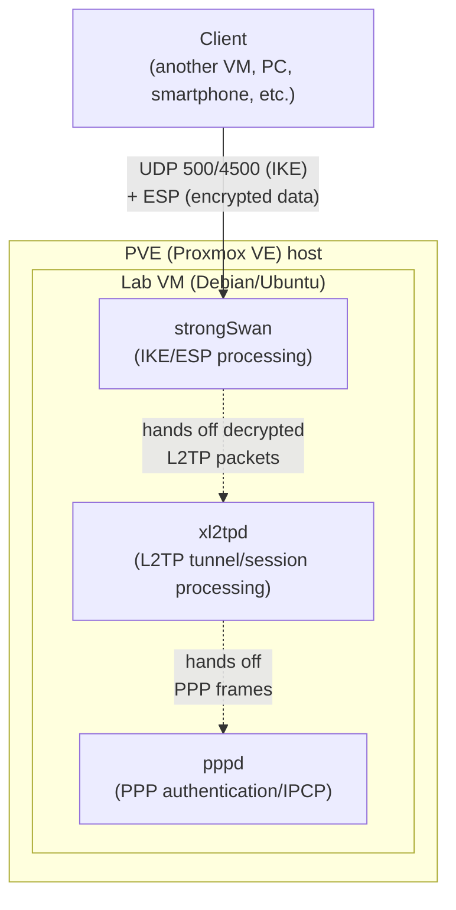

## Introduction

- **What You'll Learn From This Article**: How to spin up a lab VM on a home Proxmox VE (PVE) environment, build a real L2TP/IPsec server on it using strongSwan (IKE/IPsec) and xl2tpd (L2TP), connect a client to it, and use `tcpdump` to watch the entire connection sequence—IKE Phase 1 → Phase 2 → the L2TP control connection → PPP negotiation—unfold as actual packets.
- **Intended Audience**: This article is aimed at infrastructure engineers who have a home virtualization platform like PVE and want to get hands-on and actually verify how L2TP/IPsec works internally.
- **Estimated Reading Time**: About 90 minutes, including setup and verification

**A note on this article**: This series normally devotes its pages to digging into internal mechanics rather than hands-on build steps for physical or virtual environments. This article is a deliberate exception—a practical, hands-on companion piece written specifically to answer a request to "build it myself and verify it."

This article is part of the [Top 1% Series' full article guide](/en/sitemap).

## Prerequisites

- **Basic operation of Proxmox VE (PVE)**: This article assumes you're comfortable uploading an ISO, creating a new VM, and attaching a VM to a network bridge (such as `vmbr0`).
- **Basic Linux operation**: This article assumes you're comfortable managing packages with `apt`, managing services with `systemctl`, and editing configuration files in a text editor.
- **Basic L2TP/IPsec terminology**: Along the way, this article gives brief, self-contained explanations of terms like IKE (key exchange), ESP (encryption), L2TP (tunneling), PPP (authentication and IP address assignment), and NAT-T (NAT traversal) as they come up.

## Getting the Big Picture

### The Environment You'll Build

In this article, you'll stand up a single Linux VM (the server) on PVE and install **strongSwan** (which handles IPsec processing), **xl2tpd** (which handles L2TP tunnel/session processing), and **pppd** (which handles PPP negotiation, invoked internally by xl2tpd) on it, to build a complete L2TP/IPsec server. For the client, you'll use either another VM (Linux) or the built-in VPN feature on your own PC or smartphone.



### The Overall Workflow

1. Create a server VM on PVE
2. Install strongSwan, xl2tpd, and ppp
3. Configure IPsec (strongSwan) using a pre-shared key
4. Configure L2TP (xl2tpd)
5. Configure PPP authentication (chap-secrets)
6. Configure kernel IP forwarding and the firewall
7. Start the services and verify their status
8. Connect from a client
9. Observe the connection sequence live with `tcpdump`
10. Deliberately trigger NAT-T by connecting from behind a NAT

## Fundamentals, Thoroughly Explained (the Actual Build Steps)

### Step 0: Prepare a VM on PVE

From the PVE management UI, upload a Debian 12 (or Ubuntu Server 22.04 or later) ISO and create a new VM. For lab purposes, 1-2 vCPUs, 1-2 GB of memory, and about 8 GB of disk is plenty.

How you connect the network affects how easily you can trigger the NAT-T verification later on.

- **Bridging directly to `vmbr0`**: The VM gets an IP address directly from your home router. If you want to simulate a client connecting over the internet, you'll need to set up port forwarding on your router (UDP 500/4500, IP protocol number 50).
- **Adding an extra layer of NAT inside PVE**: If you attach the VM to a NAT-mode network, the path becomes client → (NAT) → server, deliberately creating a NAT environment. You'll use this later in "Deliberately Triggering and Observing NAT-T."

Start simple: begin your verification from within your LAN, over a directly bridged connection.

### Step 1: Install the Required Packages

SSH into the VM and install the necessary packages.

```bash
sudo apt update
sudo apt install -y strongswan strongswan-pki libcharon-extra-plugins xl2tpd ppp
```

`libcharon-extra-plugins` includes the group of IKE plugins that handle the NAT-D-related processing discussed later.

### Step 2: Configure IPsec (strongSwan)

You'll start with a simple **pre-shared key (PSK)** setup. Edit `/etc/ipsec.conf` as follows.

```
config setup
    charondebug="ike 1, knl 1, cfg 0"
    uniqueids=no

conn %default
    ikelifetime=60m
    keylife=20m
    rekeymargin=3m
    keyingtries=1
    keyexchange=ikev1

conn L2TP-PSK
    authby=secret
    auto=add
    ike=aes256-sha1-modp1024,aes128-sha1-modp1024,3des-sha1-modp1024!
    esp=aes256-sha1,aes128-sha1,3des-sha1!
    keyingtries=3
    left=%any
    leftprotoport=17/1701
    right=%any
    rightprotoport=17/%any
    type=transport
```

`type=transport` specifies IPsec's transport mode—"leave the original IP header alone, and encrypt only its payload." Because L2TP itself already provides tunneling, there's no need to stack a second layer of tunnel mode on top of it in IPsec, so transport mode is enough—and this setting directly reflects that design. `leftprotoport=17/1701` says "only apply this IPsec policy to traffic destined for UDP (protocol 17) port 1701," scoping IPsec protection specifically to the port L2TP uses.

Next, set the pre-shared key in `/etc/ipsec.secrets`.

```
: PSK "set a sufficiently long and complex pre-shared key here"
```

Lock down its permissions.

```bash
sudo chmod 600 /etc/ipsec.secrets
```

### Step 3: Configure L2TP (xl2tpd)

Create `/etc/xl2tpd/xl2tpd.conf`.

```
[global]
port = 1701

[lns default]
ip range = 10.10.10.10-10.10.10.20
local ip = 10.10.10.1
require chap = yes
refuse pap = yes
require authentication = yes
name = L2TPLab
ppp debug = yes
pppoptfile = /etc/ppp/options.xl2tpd
length bit = yes
```

`ip range` is the range of virtual IP addresses handed out to clients. `local ip` is the virtual gateway address the server itself holds inside this L2TP tunnel.

### Step 4: Configure PPP Authentication

Create `/etc/ppp/options.xl2tpd`.

```
require-mschap-v2
ms-dns 8.8.8.8
ms-dns 1.1.1.1
asyncmap 0
auth
crtscts
idle 1800
mtu 1410
mru 1410
nodefaultroute
debug
lock
proxyarp
connect-delay 5000
```

`mtu`/`mru` are capped at around 1410 because the effective MTU shrinks once you stack multiple headers—L2TP, PPP, ESP, and so on—on top of each other (this logic itself is covered in detail elsewhere). `require-mschap-v2` pins the authentication method to MS-CHAPv2.

Next, set a username and password in `/etc/ppp/chap-secrets`.

```
# client        server  secret                    IP addresses
labuser         L2TPLab "a sufficiently strong password"      *
```

Lock down this file's permissions too.

```bash
sudo chmod 600 /etc/ppp/chap-secrets
```

### Step 5: Configure Kernel IP Forwarding and the Firewall

So that a connected client can reach the internet or other devices on your LAN using its assigned virtual IP address, enable IP forwarding. Add the following to `/etc/sysctl.conf`.

```
net.ipv4.ip_forward = 1
net.ipv4.conf.all.accept_redirects = 0
net.ipv4.conf.all.send_redirects = 0
```

Apply it.

```bash
sudo sysctl -p
```

In your firewall (`nftables` or `iptables`), allow the ports/protocols needed for IKE, NAT-T, ESP, and L2TP, and set up MASQUERADE so the client's virtual IP range can reach the internet (replace `eth0` with the name of your actual WAN-facing interface).

```bash
sudo iptables -A INPUT -p udp --dport 500 -j ACCEPT
sudo iptables -A INPUT -p udp --dport 4500 -j ACCEPT
sudo iptables -A INPUT -p udp --dport 1701 -j ACCEPT
sudo iptables -A INPUT -p esp -j ACCEPT
sudo iptables -A FORWARD -s 10.10.10.0/24 -j ACCEPT
sudo iptables -A FORWARD -d 10.10.10.0/24 -j ACCEPT
sudo iptables -t nat -A POSTROUTING -s 10.10.10.0/24 -o eth0 -j MASQUERADE
```

<details>
<summary>Why explicitly allow UDP 1701 too (shouldn't it already be encrypted by ESP)?</summary>

As discussed elsewhere, ESP's transport mode encrypts UDP port 1701 along with everything it carries, so the number "1701" itself is invisible to any firewall or router sitting **somewhere along the path**. This server's own firewall (its `INPUT` chain), however, is a different story. strongSwan's kernel implementation (XFRM) decrypts an incoming ESP packet before handing it off to the OS's networking stack—so, depending on exactly when the `INPUT` chain gets evaluated, it can end up seeing "a plaintext packet destined for UDP 1701" after decryption. Because this behavior can vary by implementation and kernel version, most build guides err on the side of caution and explicitly allow UDP 1701 in the server's own firewall as standard practice.

</details>

### Step 6: Start the Services and Check Their Status

```bash
sudo systemctl enable --now strongswan-starter xl2tpd
sudo systemctl status strongswan-starter xl2tpd
```

You can check the state of IPsec with the following command (before any client connects, you'll see policies that are "loaded but not yet established").

```bash
sudo ipsec statusall
```

### Step 7: Connect from a Client

**On Linux (NetworkManager)**, the easiest path is the `network-manager-l2tp` plugin.

```bash
sudo apt install -y network-manager-l2tp network-manager-l2tp-gnome
```

From the GUI, choose "Add VPN" → "Layer 2 Tunneling Protocol (L2TP)," and enter the server's IP address as the gateway, the username/password you set in `chap-secrets`, and the pre-shared key you set in `ipsec.secrets`.

**On Windows, macOS, iOS, and Android**, use the OS's built-in VPN settings screen to select "L2TP/IPsec" (or the equivalent type), and enter the same server address, username, password, and pre-shared key.

Once connected, you can confirm the established IPsec SA and L2TP tunnel by running the following on the server:

```bash
sudo ipsec statusall
sudo journalctl -u xl2tpd -f
```

### Step 8: Watch the Connection Sequence Live with `tcpdump`

This is the heart of the hands-on exercise. **Before** connecting the client, start a capture on the server:

```bash
sudo tcpdump -i any 'udp port 500 or udp port 4500 or udp port 1701' -w /tmp/l2tp-capture.pcap
```

With the capture running, connect from the client, and once the connection is up, stop the capture with `Ctrl+C`. Open the resulting `l2tp-capture.pcap` in Wireshark (either copy it out via SCP, or use `tcpdump`'s remote-capture feature if you have Wireshark installed locally), and you can observe the following flow as real packets.

| What You Can Observe | Example Filter | What It Reveals |
|---|---|---|
| IKE Phase 1 (Main Mode) | `isakmp` | Key-exchange proposals over UDP 500, the DH key exchange, and the PSK-based authentication exchange (6 round trips of messages) |
| IKE Phase 2 (Quick Mode) | `isakmp` | The proposal and agreement establishing the IPsec SA (ESP) |
| L2TP control messages | `l2tp` | SCCRQ/SCCRP/SCCCN (tunnel establishment) and ICRQ/ICRP/ICCN (session establishment)—though once NAT-T is active, these are encrypted by ESP, so Wireshark can't show you the contents without decryption |
| PPP negotiation | (encapsulated inside L2TP) | LCP, CHAP authentication, and the IPCP exchange (also invisible if encrypted) |

**The key thing to actually confirm here** is that the only exchange visible in plaintext is the UDP 500 (IKE) traffic—once encryption via ESP kicks in, both the UDP port 1701 (L2TP) traffic and the PPP exchange carried inside it become unreadable. This is direct, packet-level confirmation of the fact that PPP authentication traffic always takes place over an already-encrypted path. Pairing this with strongSwan's debug log (`sudo journalctl -u strongswan-starter -f`) lets you trace, in more detailed text form, exactly what's happening at each phase of IKE.

## The View from the Top 1% (What Experts See)

### Deliberately Triggering and Observing NAT-T

Using the "add an extra layer of NAT inside PVE" setup mentioned earlier, you can deliberately trigger and observe NAT-T in action. Attach your client VM to a NAT-mode network (a private network that gets SNAT'd) in PVE, and connect from there to your server VM.

```bash
sudo tcpdump -i any 'udp port 500 or udp port 4500' -w /tmp/nat-t-capture.pcap
```

Open this capture in Wireshark, and you'll be able to confirm, as actual packets: that the IKE Phase 1 messages contain a NAT-D (NAT Detection) payload; that the subsequent traffic then **floats from UDP port 500 to UDP port 4500**; and that ESP packets are further encapsulated inside a UDP header. If you're using a Windows client, you can also reproduce and verify the related behavior where the client connection fails when the server itself is also behind a NAT (double NAT), and is resolved by setting the `AssumeUDPEncapsulationContextOnSendRule` registry value on the client side to `2`.

### Confirming PSK's Operational Weakness in Your Own Config Files

The pre-shared key you set in `/etc/ipsec.secrets` is **shared by every client that connects**. Even if you set up multiple `chap-secrets` entries (multiple users), take a look at the config files and confirm for yourself that authentication at the IPsec layer is configured so that everyone uses the exact same PSK. This is a real, hands-on look at a configuration that comes up often in practice—"reusing the same PSK across every client"—where the IPsec layer ends up in a state where "anyone can open the tunnel with the same key," and the actual per-user authentication ends up depending entirely on the PPP layer's username and password. Switching to certificate-based authentication resolves this weakness, but it requires separately issuing a CA and client certificates, which raises the build's difficulty (switching to certificate-based authentication is beyond the scope of this article—give it a try separately if you're interested).

## Common Sticking Points (Troubleshooting)

1. **The IKE SA doesn't establish at all**: Check the logs with `sudo journalctl -u strongswan-starter -f` for errors such as `NO_PROPOSAL_CHOSEN`. This usually means the encryption/hash algorithm proposals don't match between client and server, or that UDP 500/4500 is being blocked by a firewall somewhere.
2. **xl2tpd starts, but PPP negotiation doesn't proceed**: A common cause is a typo in the username/password in `chap-secrets`, or permissions on the file being too restrictive for `pppd` to read it. Check `sudo journalctl -u xl2tpd -f` along with the pppd-related entries in `/var/log/syslog`.
3. **The connection succeeds, but the client can't reach the internet or other devices on the LAN**: Check whether `net.ipv4.ip_forward` is actually enabled, and whether the MASQUERADE iptables rule points at the correct interface name.
4. **A Windows client behind NAT can't connect**: If the server itself is also behind a NAT (a double-NAT setup), you'll need to set the `AssumeUDPEncapsulationContextOnSendRule` registry value on the client side.

## Cleaning Up the Lab Environment

Once you've finished verifying, you can leave the VM as-is to reuse for further experiments (switching to certificate-based authentication, testing scenarios beyond NAT-T, and so on). If you're done with it, either shut down and delete the VM from the PVE management UI, or take a snapshot before making further configuration changes—handy if you plan to iterate on the setup repeatedly.

## Summary

- You can build your own L2TP/IPsec server by installing and configuring three separate components: strongSwan (IKE/ESP), xl2tpd (L2TP tunnel/session), and ppp (PPP authentication).
- Watching IKE Phase 1 and Phase 2 with `tcpdump` lets you confirm, in real packets, that IKE messages over UDP 500 are visible in plaintext, while the L2TP/PPP exchange becomes unreadable once ESP encryption is established.
- Adding an extra layer of NAT inside PVE lets you deliberately trigger and observe NAT-T's behavior—the float to UDP port 4500 and the NAT-D payload.
- The weakness of sharing a single pre-shared key (PSK) across every client becomes intuitively clear once you actually look at the configuration files yourself.

**Starting Today**
1. A connection sequence you've only read about in theory only really counts as "understood" once you've watched it happen with `tcpdump` yourself. If you have a lab environment available, get in the habit of capturing traffic proactively.
2. Details like PSK handling and file permissions—the kind of thing it's easy to get lax about "since it's just a lab"—are exactly where you build the security instincts that matter in production.

## References

- [strongSwan Documentation](https://docs.strongswan.org/)
- [xl2tpd | Linux man-pages](https://man7.org/linux/man-pages/man8/xl2tpd.8.html)
- [Proxmox VE Administration Guide](https://pve.proxmox.com/pve-docs/)
- [Configure L2TP/IPsec server behind NAT-T device | Microsoft Learn](https://learn.microsoft.com/en-us/troubleshoot/windows-server/networking/configure-l2tp-ipsec-server-behind-nat-t-device)
