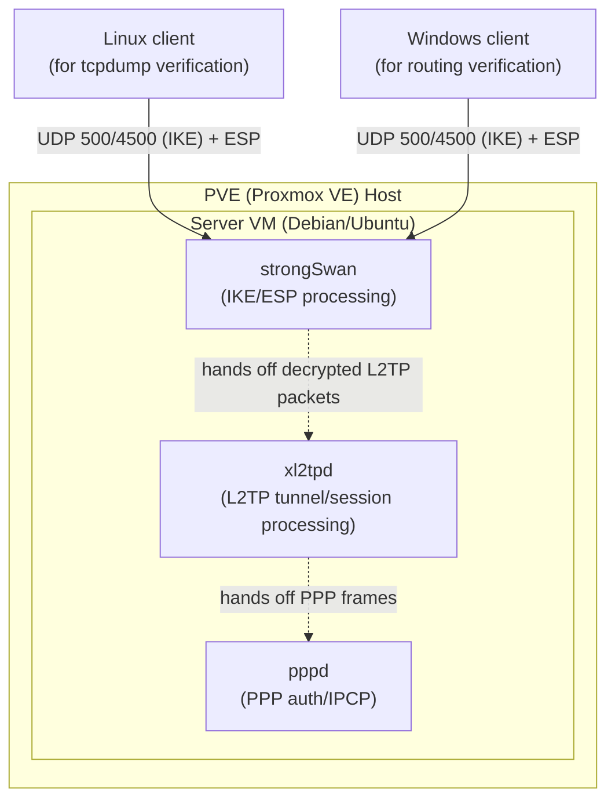

## Introduction

- **What You'll Learn From This Article**: How to verify, with your own eyes on a real L2TP/IPsec server built in your home Proxmox VE (PVE) lab, what you learned across three articles: [How L2TP/IPsec Works](/en/articles/l2tp-ipsec-guide), [Building L2TP/IPsec VPN on Windows Server (RRAS)](/en/articles/windows-server-l2tp-vpn-guide), and [Comparing L2TP/IPsec to Modern VPN Protocols](/en/articles/vpn-protocols-comparison-guide). The goal is to turn things you read about in theory — "IKE Phase 1 takes 6 round trips," "PPP needs an explicit gateway because it's a point-to-point link," "a PSK is shared across every client" — into first-hand experience via packet captures and a client's actual behavior, the kind of concrete knowledge you can speak to confidently at work or in an interview.
- **Intended Audience**: This article assumes you've already read the three articles above, have a home virtualization platform like PVE, and want to hands-on verify how L2TP/IPsec actually behaves. It won't re-explain the roles of IKE/ESP/L2TP/PPP, NAT-T, or why IKEv1 is inefficient in depth — read those three articles first if you haven't.
- **Estimated Reading Time**: About 120 minutes, including setup and verification

**About this article**: This series usually spends more pages on internal mechanics than on hands-on build steps for real or virtual environments, but this article is a deliberate exception — practical, hands-on material for readers who want to verify what they've read for themselves. This article is part of the [Top 1% Series' full article guide](/en/sitemap).

## Prerequisites

- **Basic PVE (Proxmox VE) operation**: Uploading an ISO, creating a new VM, and attaching a VM to a network bridge (e.g., `vmbr0`).
- **Basic Linux operation**: Package management with `apt`, service management with `systemctl`, and editing config files in a text editor.
- **The content of the three prerequisite articles**: Terms like IKE (key exchange), ESP (encryption), L2TP (tunneling), PPP (authentication/address assignment), and NAT-T (NAT traversal), along with why L2TP/IPsec ends up combining these three components, are assumed knowledge covered in [How L2TP/IPsec Works](/en/articles/l2tp-ipsec-guide).

<details>
<summary>FAQ: What should I prepare before starting this hands-on lab?</summary>

If you're not yet comfortable creating a VM in Proxmox VE, installing an OS, or the basics of `sudo apt update` / `sudo su -` / `nano`, reading the prep manual first will make this lab much smoother. See the [hands-on prep manual](/en/articles/handson-prep-guide).

</details>

## Getting the Big Picture

### The three claims this article puts to the test

Each of the three prerequisite articles made a specific claim. This article verifies each one with your own eyes.

| Source Article | Claim in the Article | How This Article Verifies It |
|---|---|---|
| [How L2TP/IPsec Works](/en/articles/l2tp-ipsec-guide) | The connection is established in the order IKE Phase 1 → Phase 2 → L2TP tunnel → PPP negotiation, and behind NAT, a float to UDP 4500 occurs | Capture packets with `tcpdump` and observe the actual sequence and the NAT-T float |
| [Building L2TP/IPsec VPN on Windows Server (RRAS)](/en/articles/windows-server-l2tp-vpn-guide) | PPP is a point-to-point link, so ARP doesn't work and the client needs an explicit gateway | After connecting a Windows client, inspect the actual virtual interface state with `route print` and `ipconfig /all` |
| [Comparing L2TP/IPsec to Modern VPN Protocols](/en/articles/vpn-protocols-comparison-guide) | IKEv1's Phase 1 (Main Mode) plus Phase 2 together take 9 round trips, versus 4 for IKEv2 | Count the actual number of message round trips and elapsed time from `tcpdump` timestamps and record it as a concrete measurement |

### The environment you'll build

You'll stand up one Linux VM (the server) on PVE, and install **strongSwan** (handles IPsec processing), **xl2tpd** (handles L2TP tunnel/session processing), and **pppd** (handles PPP negotiation, invoked internally by xl2tpd) to build an L2TP/IPsec server. Two kinds of clients are used depending on what you're verifying:

- **A Linux client (a separate VM)**: Used for packet captures with `tcpdump` and for triggering NAT-T via a PVE-internal NAT.
- **A Windows client (a PC, or a separate VM)**: Used to confirm, via the actual output of `route print`, the "why is a gateway needed" question covered in the Windows Server (RRAS) article. If you don't have a Windows machine handy, a Windows VM on PVE works fine too (an evaluation ISO is sufficient).



### Overall workflow

1. Provision the server VM on PVE
2. Install strongSwan, xl2tpd, and ppp, and bring up the server with a PSK configuration
3. Connect from the Linux client and use `tcpdump` to measure the IKE → L2TP → PPP sequence and IKEv1's round-trip count
4. Connect from the Windows client and confirm PPP's gateway problem via `route print`/`ipconfig`
5. Insert a second NAT layer inside PVE and deliberately trigger NAT-T
6. Confirm the PSK's weakness from the config files themselves
7. Record a simple performance baseline with `iperf3` (used again in the next hands-on article)

## Fundamentals, Thoroughly Explained (The Actual Build)

### Step 0: Prepare the VMs on PVE

From the PVE management UI, upload a Debian 12 (or Ubuntu Server 22.04+) ISO and create the server VM. For lab purposes, 1–2 vCPUs, 1–2GB of memory, and about 8GB of disk is plenty. Set up a second VM of similar spec for the Linux client. Only set up a Windows VM if you don't already have a Windows machine to use as the client.

<details>
<summary>FAQ: A VM in Proxmox VE is slow to boot or feels sluggish — what should I check?</summary>

In most cases, the host CPU's virtualization support (Intel VT-x/AMD-V) is disabled in BIOS/UEFI, and QEMU has fallen back to slow software emulation. Check whether that setting is enabled in your BIOS/UEFI. For how KVM/QEMU actually works, see [How KVM/QEMU Works](/en/articles/proxmox-internals-guide).

</details>

How you wire up the network changes how easy it is to trigger NAT-T later.

- **A configuration bridged directly to `vmbr0`**: The VM gets an IP address directly from your home router. Start here, testing from within your LAN.
- **A configuration with an extra layer of NAT inside PVE**: Attaching the client VM to a NAT-mode network gives you a client → (NAT) → server path, deliberately creating a NAT environment. Covered separately in Verification 3, along with the actual build steps.

### Step 1: Install the required packages

SSH into the server VM and install the required packages.

```bash
sudo apt update
sudo apt install -y strongswan strongswan-pki libcharon-extra-plugins xl2tpd ppp
```

`libcharon-extra-plugins` includes the IKE plugins that handle NAT-D processing, among other things.

### Step 2: Configure IPsec (strongSwan)

Start with a simple **pre-shared key (PSK)** setup. Edit `/etc/ipsec.conf` as follows.

```
config setup
    charondebug="ike 1, knl 1, cfg 0"
    uniqueids=no

conn %default
    ikelifetime=60m
    keylife=20m
    rekeymargin=3m
    keyingtries=1
    keyexchange=ikev1

conn L2TP-PSK
    authby=secret
    auto=add
    ike=aes256-sha1-modp1024,aes128-sha1-modp1024,3des-sha1-modp1024!
    esp=aes256-sha1,aes128-sha1,3des-sha1!
    keyingtries=3
    left=%any
    leftprotoport=17/1701
    right=%any
    rightprotoport=17/%any
    type=transport
```

`type=transport` directly reflects the design explained in [How L2TP/IPsec Works](/en/articles/l2tp-ipsec-guide): since L2TP already provides its own tunneling function, there's no need to stack IPsec's tunnel mode on top of it. `leftprotoport=17/1701` scopes this IPsec policy to only traffic destined for UDP (protocol 17) port 1701.

`left`/`right` don't mean "server" vs. "client" — they mean **"the host reading this config file" (`left`) vs. "the peer it's talking to" (`right`).** For the same tunnel, the server's own `ipsec.conf` sees itself as `left` and the client as `right`, while the client's `ipsec.conf` sees the exact opposite (itself as `left`, the server as `right`). In the server config above, `left=%any`/`right=%any` means "accept a connection from any peer" (any of potentially many clients). The client-side config you'll write in Verification 1 uses asymmetric values instead: `left=%defaultroute` (auto-detect its own WAN address) and `right=<server's IP address>` (explicitly name the peer).

<details>
<summary>Meaning of a few settings not covered above (ipsec.conf)</summary>

- **`ikelifetime`/`keylife`/`rekeymargin`/`keyingtries`**: `ikelifetime` is the lifetime of the IKE SA (the management channel for key exchange established in Phase 1), and `keylife` is the lifetime of the IPsec SA (the actual encryption key established in Phase 2). `rekeymargin` is how many minutes before expiry a rekey should start, and `keyingtries` is how many times to retry a failed key exchange. Shorter SA lifetimes reduce the window a given key stays in use (safer), at the cost of more frequent rekeying overhead.

</details>

Next, set the pre-shared key in `/etc/ipsec.secrets` and lock down its permissions.

```
: PSK "set a sufficiently long and complex pre-shared key here"
```

```bash
sudo chmod 600 /etc/ipsec.secrets
```

`chmod 600` means "only the owner (root) can read or write; everyone else gets no access at all." This file holds the pre-shared key in plaintext, so if the permissions are left looser than this, any other local user account on the same server could read the key. strongSwan itself will warn you at startup if this file's permissions are too permissive. For more on what the permission notation itself means, see [How Linux Permissions (chmod) Work](/en/articles/linux-file-permissions-guide).

You'll examine the weakness of this "shared across all clients" PSK in Step 6.

### Step 3: Configure L2TP (xl2tpd) and PPP authentication

Create `/etc/xl2tpd/xl2tpd.conf`.

```
[global]
port = 1701

[lns default]
ip range = 10.10.10.10-10.10.10.20
local ip = 10.10.10.1
require chap = yes
refuse pap = yes
require authentication = yes
name = L2TPLab
ppp debug = yes
pppoptfile = /etc/ppp/options.xl2tpd
length bit = yes
```

`ip range` is the range of virtual IP addresses handed to clients; `local ip` is the server's own virtual gateway address inside the L2TP tunnel. This exact `local ip` value is what you'll see as the gateway when you inspect a Windows client's `route print` output in Step 4. `pppoptfile` tells xl2tpd which config file to hand to the `pppd` child process it spawns once the L2TP session comes up. The `/etc/ppp/options.xl2tpd` file named here is what you'll create next. In other words, `xl2tpd.conf` itself is only responsible for getting the L2TP tunnel/session up; the PPP negotiation that follows (authentication, address assignment) is delegated to a `pppd` started with whatever config `pppoptfile` points at.

By default, `xl2tpd.conf` ships with a large block of sample lines commented out with `;` (semicolon). **Appending a fresh block as shown above is fine, but if you instead copy and edit an existing sample line (like `; [lns default]`), make sure you don't forget to strip the leading `;`.** A line left commented out is skipped entirely, and `xl2tpd` never even sees that the section exists.

<details>
<summary>`[lns default]` has no `=` assigning it a value — so how does it get "enabled"?</summary>

An INI-style config file like `xl2tpd.conf` has two kinds of lines: `key = value` settings, and `[section name]` headers. `[lns default]` is the latter — the declaration "an LNS section named `default` starts here" is itself the information; there's no value being assigned via `=`. xl2tpd's config parser treats any `[lns <name>]` (or `[lac <name>]`) section it finds that isn't commented out as, simply by existing, an active definition to register (there's no separate `enable = yes`-style flag). In other words, the section's mere presence — uncommented — is the on/off switch. The `[lac ...]` section you'll append on the client side in Verification 1 works exactly the same way.

</details>

<details>
<summary>Meaning of a few settings not covered above (xl2tpd.conf)</summary>

- **`require chap`/`refuse pap`**: Of the PPP authentication methods, this requires CHAP (a challenge-response scheme that never sends the password itself) and explicitly refuses PAP (an older method that sends the password in near-plaintext). Even though everything travels over an ESP-encrypted path, this keeps the authentication method itself from being a weak link.

</details>

Next, create `/etc/ppp/options.xl2tpd`.

```
require-mschap-v2
ms-dns 8.8.8.8
ms-dns 1.1.1.1
asyncmap 0
auth
crtscts
idle 1800
mtu 1410
mru 1410
nodefaultroute
debug
proxyarp
connect-delay 5000
```

`mtu`/`mru` are kept around 1410 because the effective MTU shrinks once L2TP/PPP/ESP headers all stack up.

<details>
<summary>Meaning of a few settings not covered above (options.xl2tpd)</summary>

- **`nodefaultroute`**: Tells the client side not to automatically adopt this PPP link as its default gateway. This avoids "full tunnel" mode (where all traffic goes over the VPN) in favor of "split tunnel" mode, where only traffic destined for the VPN's address range uses this link.
- **`proxyarp`**: Has the server answer ARP requests for the client's virtual IP address on the server's own behalf, using the server's own MAC address. Since the client's virtual IP doesn't actually exist on the physical LAN, other devices on the LAN couldn't reach the client without this.

</details>

`require-mschap-v2` pins the authentication method to MS-CHAPv2. Set the username/password in `/etc/ppp/chap-secrets`.

```
# client        server  secret                    IP addresses
labuser         *       "a sufficiently strong password"      *
```

```bash
sudo chmod 600 /etc/ppp/chap-secrets
```

Same reasoning as `ipsec.secrets`: this file holds a plaintext username and password, so permissions are locked down to the owner only.

Each line in `chap-secrets` has four fields: `client-name server-name secret allowed-IPs`. The second field, "server name," is matched against **the name pppd itself is presenting as** when it acts as the authenticator — but exactly what value gets passed in here can vary depending on the caller (xl2tpd vs. a Windows RRAS client, for instance). Hard-coding it to `L2TPLab` means a client that identifies itself differently (a Windows client, as you'll see later) can fail authentication without a clear error in the logs. That's why this article uses `*` (wildcard, match any) from the start.

### Step 4: Configure kernel IP forwarding and the firewall

Add the following to `/etc/sysctl.conf` and apply it. For how `sysctl` and kernel parameters actually get applied, see [How sysctl and procfs Work](/en/articles/linux-sysctl-guide).

```
net.ipv4.ip_forward = 1
net.ipv4.conf.all.accept_redirects = 0
net.ipv4.conf.all.send_redirects = 0
```

```bash
sudo sysctl -p
```

Here's what each of these three settings actually does.

| Setting | Meaning |
|---|---|
| `net.ipv4.ip_forward = 1` | Enables the kernel's ability to forward (route) packets that aren't addressed to itself, out another interface. This is disabled (`0`) by default; without setting it to `1`, the server can't relay packets from VPN clients out to the internet or LAN. |
| `net.ipv4.conf.all.accept_redirects = 0` | Prevents the kernel from rewriting its own routing state in response to an ICMP redirect (a packet suggesting "there's a closer router you should use"). This guards against an attacker hijacking your routes via forged ICMP redirects. |
| `net.ipv4.conf.all.send_redirects = 0` | Conversely, stops this host from sending ICMP redirects of its own. This server is a simple VPN gateway, not a complex router that needs to advise other hosts about better routes. |

<details>
<summary>FAQ: I added net.ipv4.ip_forward = 1 to /etc/sysctl.conf, but it's not taking effect</summary>

The kernel doesn't read `/etc/sysctl.conf` directly — it only applies to `/proc/sys` once you run `sysctl -p` or reboot. Saving the file alone doesn't affect the running kernel.

</details>

In the firewall ([iptables](/en/articles/linux-iptables-guide)), allow the ports/protocols IKE, NAT-T, ESP, and L2TP need, and set up MASQUERADE so the client's virtual IP range can reach the internet (replace `eth0` with your actual WAN-facing interface name). If you're not sure of the interface name, the following command shows which interface is used for the default route (effectively, the WAN side).

```bash
ip route show default
```

The value after `dev` in output like `default via <gateway IP> dev <interface name>` is the interface name to substitute. On a host with multiple NICs (for example, if you added a second network in Step 0 for NAT-T testing), it's more reliable to ask for the default route (effectively, the way out to the internet) directly like this than to eyeball a full interface listing and guess which one is the WAN side.

```bash
sudo iptables -A INPUT -p udp --dport 500 -j ACCEPT
sudo iptables -A INPUT -p udp --dport 4500 -j ACCEPT
sudo iptables -A INPUT -p udp --dport 1701 -j ACCEPT
sudo iptables -A INPUT -p esp -j ACCEPT
sudo iptables -A FORWARD -s 10.10.10.0/24 -j ACCEPT
sudo iptables -A FORWARD -d 10.10.10.0/24 -j ACCEPT
sudo iptables -t nat -A POSTROUTING -s 10.10.10.0/24 -o eth0 -j MASQUERADE
```

<details>
<summary>Why explicitly allow UDP 1701 too (isn't it already encrypted by ESP)?</summary>

ESP's transport mode encrypts the UDP port 1701 header along with everything else, so anything **on the path** — firewalls, routers — can't see the UDP 1701 information at all. But the server's own firewall (the `INPUT` chain) is a different story. strongSwan's kernel implementation (XFRM) decrypts an ESP packet before handing it to the OS's network stack, so depending on when exactly the `INPUT` chain gets evaluated, it may see the already-decrypted "plaintext packet destined for UDP 1701." Since this can vary by implementation and kernel version, most build guides play it safe and explicitly allow UDP 1701 on the server's own firewall too.

</details>

<details>
<summary>FAQ: Do the iptables rules I allowed survive a server reboot?</summary>

No — rules registered with netfilter live in the kernel's memory, and by default they're gone after a reboot. You need to explicitly persist them with the `iptables-persistent` package, or `iptables-save`/`iptables-restore`.

</details>

Start the services.

```bash
sudo systemctl enable --now strongswan-starter xl2tpd
sudo systemctl status strongswan-starter xl2tpd
sudo ipsec statusall
```

## Verification 1: Confirming L2TP/IPsec Theory with a Linux Client and tcpdump

### Connect from the client

On the Linux client (a separate VM), install the same **strongSwan**, **xl2tpd**, and **ppp** you already used on the server, and connect entirely from the CLI. This reuses the knowledge you already built up setting up the server, and there's a good reason (below) to prefer it here.

```bash
sudo apt update
sudo apt install -y strongswan xl2tpd ppp
```

<details>
<summary>Why not use NetworkManager's GUI plugin (network-manager-l2tp)?</summary>

If you want to configure an L2TP/IPsec connection from a GUI on Ubuntu/Debian's GNOME desktop, there are two packages: `network-manager-l2tp` (the L2TP/IPsec plugin itself for NetworkManager) and `network-manager-l2tp-gnome` (the GUI settings panel for it).

```bash
sudo apt install -y network-manager-l2tp network-manager-l2tp-gnome
```

The problem is that `network-manager-l2tp-gnome` depends on the entire GNOME desktop stack, so installing it on a CLI-only Server image (Debian/Ubuntu Server) drags in a full desktop environment via something like `sudo apt install -y ubuntu-desktop`. On the roughly 8GB of disk allocated for a lab VM, that alone can fail with "No space left on device." If you want to try the GUI route, either expand the client VM's disk to 20GB+ or consider a lighter desktop environment like `ubuntu-desktop-minimal`. This article's main text uses the CLI approach instead, since it sidesteps the disk-space problem and reuses the same tools and knowledge from building the server.

</details>

First, append a client-side connection definition to `/etc/ipsec.conf`. It's nearly identical to the server's `conn L2TP-PSK`, except `right` now points at the server's IP address.

```
conn L2TP-PSK
    authby=secret
    auto=add
    keyexchange=ikev1
    ike=aes256-sha1-modp1024,aes128-sha1-modp1024,3des-sha1-modp1024!
    esp=aes256-sha1,aes128-sha1,3des-sha1!
    type=transport
    left=%defaultroute
    leftprotoport=17/1701
    right=<server's IP address>
    rightprotoport=17/1701
```

Set the same pre-shared key as the server in `/etc/ipsec.secrets`.

```
: PSK "same pre-shared key as the server's ipsec.secrets"
```

```bash
sudo chmod 600 /etc/ipsec.secrets
```

Next, append a `lac` section (LAC: L2TP Access Concentrator, the term for the client side of L2TP, paired with the server's `lns` — L2TP Network Server) to `/etc/xl2tpd/xl2tpd.conf`, pointing at the server.

```
[lac L2TPLab]
lns = <server's IP address>
ppp debug = yes
pppoptfile = /etc/ppp/options.l2tpd.client
length bit = yes
```

The same caution about a leftover leading `;`, and the same "a section header with no `=` still gets enabled" mechanics, apply here exactly as covered for `[lns default]` when building the server (Step 3). For the general approach to investigating errors and using `journalctl`, see [Investigating Error Logs with journalctl](/en/articles/linux-journalctl-guide).

Create the pppd options file `/etc/ppp/options.l2tpd.client`.

```
ipcp-accept-local
ipcp-accept-remote
refuse-eap
require-mschap-v2
noccp
noauth
idle 1800
mtu 1410
mru 1410
defaultroute
usepeerdns
debug
connect-delay 5000
name labuser
```

`name labuser` is the username registered in the server's `/etc/ppp/chap-secrets`. Set up an identical file on the client (pppd consults it during CHAP authentication to decide which name/password to present).

```
# client        server  secret                    IP addresses
labuser         *       "same password as the server"      *
```

Same reasoning as the server's `chap-secrets`: the `server` field is `*` here too. The client's pppd matches this `server` field against whatever name the CHAP challenger (the server) presents itself as — and since `options.xl2tpd` never sets a `name` option, that presented value ends up being something environment-dependent like the server's hostname, not `L2TPLab` (the name set in `xl2tpd.conf`'s `[lns default]`, which is what the LNS presents at the L2TP protocol level — a different thing entirely from pppd's own authentication name). Hard-coding this field risks a silent authentication failure depending on the environment, so it's left as `*`.

```bash
sudo chmod 600 /etc/ppp/chap-secrets
```

Once everything's in place, start the services and connect.

```bash
sudo systemctl restart strongswan-starter xl2tpd
sudo ipsec up L2TP-PSK
sudo xl2tpd-control connect-lac L2TPLab
```

On success, a `ppp0` virtual interface appears.

```bash
ip a show ppp0
```

If `ppp0` doesn't show up, check `sudo ipsec statusall` to see whether the IKE/IPsec SA came up, and `sudo journalctl -u xl2tpd -f` for the L2TP/PPP negotiation logs. If xl2tpd's own log shows no errors but `ppp0` still doesn't appear, you need to look at the log from the `pppd` child process xl2tpd launches. `pppd` isn't a systemd unit — it logs under a syslog identifier — so filter with `-t` instead of `-u`.

```bash
sudo journalctl -t pppd -n 30 --no-pager
```

### Disconnect

The upcoming `tcpdump` capture is meant to observe the packets exchanged **at the moment** a connection comes up. If you start capturing while `ppp0` from the steps above is still up, you'll only see the periodic keepalive (Hello/ZLB) messages an already-established tunnel sends — not the Main Mode → Quick Mode → L2TP sequence you're looking for. So disconnect first.

```bash
sudo xl2tpd-control disconnect-lac L2TPLab
sudo ipsec down L2TP-PSK
```

### Observe the connection sequence with `tcpdump`

Once disconnected, start a capture on the server **before** connecting the client again.

```bash
sudo tcpdump -i any 'udp port 500 or udp port 4500 or udp port 1701' -w /tmp/l2tp-capture.pcap
```

With the capture running, re-run `ipsec up L2TP-PSK` followed by `xl2tpd-control connect-lac L2TPLab` from above to reconnect, then stop the capture with `Ctrl+C` once the connection is up. Opening the resulting `l2tp-capture.pcap` in [Wireshark](/en/articles/wireshark-guide) lets you observe the following flow as actual packets.

| What You Can Observe | Example Filter | What It Shows |
|---|---|---|
| IKE Phase 1 (Main Mode) | `isakmp` | UDP 500 key-exchange proposals, DH key exchange, PSK authentication (6 round trips) |
| IKE Phase 2 (Quick Mode) | `isakmp` | Proposal and agreement for establishing the IPsec SA (ESP) (3 round trips) |
| L2TP control messages | `l2tp` | SCCRQ/SCCRP/SCCCN (tunnel establishment), ICRQ/ICRP/ICCN (session establishment) — if NAT-T is active, these are encrypted by ESP and Wireshark can't see inside without decryption |
| PPP negotiation | (encapsulated inside L2TP) | LCP, CHAP authentication, IPCP exchange (also invisible if encrypted) |

The only thing visible in plaintext is the IKE exchange on UDP 500; once ESP encryption is active, the contents of UDP port 1701 (L2TP) and the PPP exchange inside it become invisible. This packet capture is your direct proof that the PPP authentication exchange — which carries a username and password — always happens over an already-encrypted path.

<details>
<summary>If you see L2TP Hello/ZLB messages before Main Mode/Quick Mode</summary>

In theory, `isakmp` (Main Mode, then Quick Mode) should come first, followed by `l2tp` tunnel-establishment messages. If you see `l2tp` `Hello`/`ZLB` messages ahead of any IKE traffic at the start of your capture, it's very likely not a fresh negotiation at all — you probably started capturing while **an existing tunnel was still up** (forgot to disconnect first), and what you're seeing is that tunnel's periodic keepalive. Following the "Disconnect" step above — reliably tearing down with `ipsec down`/`xl2tpd-control disconnect-lac` before you start the capture — gets you the sequence in the order the theory predicts.

</details>

### Actually counting IKEv1's "9 round trips"

[Comparing L2TP/IPsec to Modern VPN Protocols](/en/articles/vpn-protocols-comparison-guide) explained that IKEv1 takes 9 round trips total — Phase 1 (Main Mode, 6 round trips) plus Phase 2 (Quick Mode, 3 round trips) — while IKEv2 simplifies this to just 4 round trips in its base exchange. Let's confirm that gap with an actual capture.

In Wireshark, apply the `isakmp` filter and, watching the `Time` column, count the packets and elapsed time from the first ISAKMP packet to the last. On the same LAN, the total elapsed time itself should be quite short — tens of milliseconds — but counting the packets should confirm roughly 9 round trips (around 18 packets, give or take depending on retries and implementation details) exactly as the theory predicts. Keep this measurement on hand — you'll compare it against WireGuard's key exchange (about 1 round trip) in the next hands-on article (STEP4).

<details>
<summary>FAQ: Is IKE Phase 1 (6 round trips) and Phase 2 (3 round trips) always exactly that number?</summary>

That's the theoretical baseline. It can vary slightly based on the implementation, retries, and network conditions. The steps above are how you confirm, against an actual packet capture, whether your own environment matches the theory.

</details>

## Verification 2: Confirming PPP's Gateway Problem with a Windows Client

[Building L2TP/IPsec VPN on Windows Server (RRAS)](/en/articles/windows-server-l2tp-vpn-guide) explained the question "why does the VPN client need an explicit gateway, when the client and internal servers appear to be on the same subnet?" using the fact that PPP is a point-to-point link. Here, you'll confirm that behavior directly on a real Windows client.

From Windows' built-in VPN settings (Settings → Network & Internet → VPN → Add a VPN connection), choose "L2TP/IPsec with pre-shared key" as the type, enter the server address, username, password, and pre-shared key, and connect.

<details>
<summary>FAQ: Connecting gives "The remote computer could not be reached... the port used for this connection is closed"</summary>

If the server's pppd log shows `couldn't find any suitable secret (password)`, the cause is that `/etc/ppp/chap-secrets` has no matching entry for that user. Since this article's `chap-secrets` uses `*` for the server-name field, adding an entry with the correct client name (username) and password lets a Windows client authenticate through the exact same file as the Linux client. Double-check that the username/password you entered in Windows' connection settings matches an entry in `chap-secrets`.

</details>

Once connected, run the following from a command prompt.

```
ipconfig /all
route print
```

In `ipconfig /all`, you should see the PPP adapter (usually shown with a name like "Ethernet adapter PPP connection") assigned a virtual IP address from the `ip range` in `xl2tpd.conf`. What's worth paying attention to here is that **the subnet mask is `255.255.255.255`.** This is direct evidence that this link is being treated not as a "network" but as a "1-to-1 dedicated link."

Next, check `route print` for the route entry via this PPP adapter. Here's the catch: **the gateway column doesn't literally show the numeric value of `local ip` from `xl2tpd.conf` (`10.10.10.1`).** Instead, the rows for `0.0.0.0/0` (the default route) and `10.10.10.10/32` (your own assigned address) show "On-link" in the gateway column.

This isn't a contradiction — if anything, it's further confirmation of the "point-to-point link" claim. On an ordinary network like Ethernet, there are potentially many destinations reachable within the same segment, so the OS needs an explicit numeric gateway to say "send it here next." A PPP point-to-point link, though, has **exactly one possible next hop, period.** When there's only one candidate destination, forwarding onto the link IS effectively the same as reaching it — so Windows' implementation doesn't bother spelling out `10.10.10.1` as a distinct number. Combined with the "subnet mask is `255.255.255.255`" detail from `ipconfig /all`, this gets you to a deeper understanding: a link with exactly one possible peer needs neither ARP nor a numeric gateway in the first place.

### Confirming with `tracert` that the server itself is acting as the gateway

Looking only at `route print` so far, you might get the impression that "the gateway isn't shown as a number" means "`10.10.10.1` isn't actually functioning as a gateway." In reality, though, `10.10.10.1` (the server's virtual IP) is unambiguously acting as this link's one and only next hop — its gateway — relaying packets bound for every other destination. To confirm this as an actual path, run `tracert` against an external destination while connected over the VPN.

```
tracert 8.8.8.8
```

Confirm that the first hop in the output is `10.10.10.1` (the server's `local ip`). The peer that `route print` could only show as "On-link" turns out, as the actual path a packet takes, to genuinely be the server itself — routing-table evidence that the server really is functioning as the VPN client's gateway. What this result demonstrates is that "the gateway value isn't shown as a number" and "there is no gateway / it isn't functioning" are two entirely different things.

## Verification 3: Deliberately Triggering NAT-T

Verifications 1 and 2 above were both done with the client VM bridged directly to `vmbr0`, sitting on the same LAN segment as the server VM. In that setup, no NAT device sits between client and server, so NAT-T never triggers. To deliberately trigger and observe NAT-T, you need to build a client → (NAT) → server path. Proxmox VE doesn't ship with a ready-made "NAT mode" network the way, say, VirtualBox does, so you'll build that path yourself first.

### Building an extra layer of NAT inside PVE

Here, you'll build a simple NAT network by applying the **exact same technique you used in Step 4 for the server VM (`ip_forward` + `iptables MASQUERADE`) to the PVE host itself.**

1. **Create a new Linux bridge with no physical NIC attached**: In the PVE management UI, select your node, then "System" → "Network" → "Create" → "Linux Bridge". Leave `Bridge ports` empty (so it's not connected to a physical NIC — it stays entirely internal to the PVE host), and give the bridge itself an IPv4 address (e.g., `192.168.100.1/24`). Use a name that doesn't collide with `vmbr0` (e.g., `vmbr1`). Reboot the node or run "Apply Configuration" to activate it.
2. **Enable IP forwarding on the PVE host itself**: From a shell on the PVE host, add `net.ipv4.ip_forward = 1` to `/etc/sysctl.conf` (same as you did for the server VM) and run `sudo sysctl -p`.
3. **Add a MASQUERADE rule on the PVE host itself**: This rewrites the source address for packets forwarded from the new bridge (`vmbr1`) out through the bridge that actually reaches the WAN (`vmbr0`).

   ```bash
   sudo iptables -t nat -A POSTROUTING -s 192.168.100.0/24 -o vmbr0 -j MASQUERADE
   ```

You now have the foundation of a client VM → (NAT'd by the PVE host) → server VM path. Notice that you just applied the exact same two mechanisms — `ip_forward` and `MASQUERADE` — that you set up on the server VM in Step 4, only this time on the PVE host itself. Once that clicks, NAT stops looking like some special built-in feature and starts looking like what it actually is: an ordinary mechanism you can bolt onto any Linux host sitting along a path.

### Moving the client onto the new NAT network

Up through Verification 2, you've had the client VM attached to `vmbr0`. Now move that same client VM over to the `vmbr1` you just created, to actually put it behind NAT. The server VM stays on `vmbr0`, unchanged.

1. **Change the client VM's network attachment**: In the PVE management UI, select the client VM, then under "Hardware," change its network device's bridge from `vmbr0` to `vmbr1`.
2. **Reconfigure the client VM's IP address**: `vmbr0` handed out a home-LAN address via DHCP, but `vmbr1` has no DHCP of its own, so set a static IP manually (e.g., `192.168.100.10/24`, gateway `192.168.100.1`).
3. **Confirm reachability to the server**: Before attempting the VPN connection, first confirm you can `ping` the server VM's real address through the NAT. If this doesn't get through, the IKE negotiation that follows will obviously fail too — worth ruling out a plain network-layer problem first.

   ```bash
   ping -c 3 <server's IP address>
   ```

Note that the client's `/etc/ipsec.conf` `right=<server's IP address>` stays exactly as you set it in Verification 1 — no change needed. NAT rewrites the client's **source** address; the server's address as a destination looks the same whether viewed from inside or outside the NAT. Once reachability is confirmed, connect using the same steps as Verification 1 (`sudo ipsec up L2TP-PSK` → `sudo xl2tpd-control connect-lac L2TPLab`). If you ever want to go back to the Verification 1/2 setup, just move the client VM's bridge back to `vmbr0` and restore its IP configuration.

### Observing the NAT-T trigger with `tcpdump`

With the client now behind NAT, run the following capture on the server while connecting.

```bash
sudo tcpdump -i any 'udp port 500 or udp port 4500' -w /tmp/nat-t-capture.pcap
```

Checking this capture in [Wireshark](/en/articles/wireshark-guide), you can confirm as real packets: that the IKE Phase 1 messages include a NAT-D (NAT Detection) payload, that subsequent traffic **floats from UDP port 500 to UDP port 4500**, and that ESP packets arrive further encapsulated inside a UDP header. If you're using a Windows client, you can also reproduce and verify the behavior where a client fails to connect when the server itself is also behind NAT (double NAT), and that setting the registry value `AssumeUDPEncapsulationContextOnSendRule` to `2` resolves it.

## Verification 4: Confirming the PSK's Weakness in the Actual Config Files

The pre-shared key set in `/etc/ipsec.secrets` is **shared by every client that connects.** Even if you set up multiple entries in `chap-secrets` (multiple users), confirm for yourself, by looking at the config files, that the IPsec-layer authentication is configured so everyone uses the same PSK. This is exactly the "PSK reuse" configuration seen often in practice — in this setup, the IPsec layer becomes "anyone can open a tunnel with the same key," and per-user authentication ends up depending entirely on the PPP layer's username/password. Switching to certificate-based authentication is beyond the scope of this article — that's covered in the next hands-on article (STEP4: migrating to IKEv2/IPsec with certificate authentication).

## The View from the Top 1% (What Experts See): Recording a Performance Baseline

Use `iperf3` to measure and record simple throughput over this L2TP/IPsec tunnel. Run `iperf3 -s` on the server, then run the following from the client (over the tunnel).

```bash
iperf3 -c <server's virtual IP address> -t 30
```

Hold onto the resulting throughput (Mbps), along with the IKE negotiation time you observed in Verification 1, for the next hands-on article (STEP4: performance comparison against OpenVPN/WireGuard). L2TP/IPsec can take advantage of IPsec's (ESP's) kernel-space implementation (XFRM), so this becomes your baseline for seeing how the "IPsec-family and WireGuard tend to outperform OpenVPN" trend from [Comparing L2TP/IPsec to Modern VPN Protocols](/en/articles/vpn-protocols-comparison-guide) actually plays out in your own environment.

## Common Sticking Points (Troubleshooting)

This list is organized around "which command should I run first to check this," for the issues that actually come up most often in this hands-on lab. For deeper explanations, see [Investigating Error Logs with journalctl](/en/articles/linux-journalctl-guide).

1. **The IKE SA never establishes at all**: Check the logs with `sudo journalctl -u strongswan-starter -f` for an error like `NO_PROPOSAL_CHOSEN`. This is usually caused by mismatched cipher/hash proposals between client and server, or a firewall blocking UDP 500/4500.
2. **A section in `xl2tpd.conf` isn't being recognized**: If `sudo journalctl -u xl2tpd` shows a `parse_config`-related error, check whether the section in question (e.g., `[lac ...]`) still has a leading `;`.
3. **xl2tpd starts but PPP negotiation doesn't progress**: A common cause is a typo in the `chap-secrets` username/password, or file permissions locked down so tightly that `pppd` can't read it. Check `sudo journalctl -u xl2tpd -f`, and also `sudo journalctl -t pppd -n 30 --no-pager` for pppd's own log (syslog identifier `pppd`).
4. **The IKE/IPsec and L2TP SAs are up, but `ppp0` never appears**: Often a typo in the options file (`options.xl2tpd`/`options.l2tpd.client`), or an option that doesn't work in this environment — check `sudo journalctl -t pppd`.
5. **`xl2tpd-control` returns `error: no such command`**: The subcommand is `connect-lac`/`disconnect-lac`, not `connect`/`disconnect`.
6. **Connection succeeds, but the client can't reach the internet or other LAN devices**: Check that `net.ipv4.ip_forward` is enabled and that the MASQUERADE iptables rule references the correct interface name.
7. **The Windows client's `route print` doesn't show a PPP route**: It can take a few seconds to show up right after connecting. First confirm the PPP adapter itself has been created via `ipconfig /all`. Note that even when everything's working correctly, the gateway column shows "On-link" rather than a number.
8. **A Windows client behind NAT can't connect**: If the server itself is also behind NAT (double NAT), you'll need to set the `AssumeUDPEncapsulationContextOnSendRule` registry value on the Windows client.

<details>
<summary>FAQ: When something breaks, which logs should I check — strongSwan (ipsec), xl2tpd (l2tp), or pppd — and in what order?</summary>

A connection comes up in the order IKE (ipsec) → L2TP tunnel/session (xl2tpd) → PPP authentication (pppd), so troubleshoot in that same order. First run `sudo ipsec statusall` to see if the IKE/IPsec SA is up; if not, check `journalctl -u strongswan-starter`. If the SA is up but `ppp0` never appears, check `journalctl -u xl2tpd` next, and if that still doesn't explain it, check `journalctl -t pppd` (as noted in Verification 1, pppd isn't a systemd unit — it logs under a syslog identifier, so filter with `-t`). The same logic applies on both the server and the client, and lining up logs from both hosts around the same timestamp makes it much easier to pin down the actual cause.

</details>

<details>
<summary>FAQ: ipsec up gives NO_PROPOSAL_CHOSEN, and removing the spaces from ike= plus restarting the client alone doesn't fix it — why?</summary>

strongSwan's cipher-suite lists (`ike=`/`esp=`) are parsed strictly on commas, so a space after a comma gets treated as part of an invalid algorithm name, and that whole proposal gets rejected — hence `NO_PROPOSAL_CHOSEN`. Two things make this confusing: editing the config file doesn't instantly take effect on the already-running charon daemon, and state from a previously failed negotiation can linger inside the daemon. If you only fix and restart the client, the server may still be holding onto stale state (or an old config), so it fails again — restarting strongSwan on both sides, so both start a clean negotiation from the new config, is what actually resolves it. As a habit, restart strongSwan (`sudo ipsec restart`, or `systemctl restart strongswan-starter`) on both ends whenever you edit `ipsec.conf`, not just the side you changed.

</details>

## Cleaning Up the Lab Environment

Once you're done, you can leave the VMs as-is for reuse in later experiments (building OpenVPN/WireGuard in the next hands-on article, migrating to certificate-based IKEv2 authentication, and so on). If you don't plan to keep using them, shut the VMs down and delete them from the PVE management UI, or take a snapshot of the pre-change state — handy if you plan to keep tweaking the configuration and trying things repeatedly.

## Summary

- Installing and configuring three components separately — strongSwan (IKE/ESP), xl2tpd (L2TP tunnel/session), and ppp (PPP authentication) — lets you build your own L2TP/IPsec server.
- Watching IKE Phase 1 and Phase 2 with `tcpdump` confirms that only the UDP 500 IKE messages are visible in plaintext, and that IKEv1 really does perform 9 round trips of message exchange, exactly as the theory predicts.
- Checking a Windows client's `route print`/`ipconfig` confirms, on real hardware, that the PPP adapter's subnet mask is `255.255.255.255`, and that the default route's gateway column shows "On-link" rather than a number (because there's only ever one possible next hop) — hard evidence that PPP really is a point-to-point link.
- Adding an extra layer of NAT inside PVE lets you deliberately trigger and observe NAT-T (the float to UDP port 4500, the NAT-D payload).
- The weakness of sharing a single pre-shared key (PSK) across every client becomes intuitively obvious once you look at the actual config files.
- The performance baseline recorded with `iperf3` here gets used again in the next hands-on article (comparing performance against OpenVPN/WireGuard).

**Starting Today**
1. Connection sequences and performance characteristics you've only read about in theory only become "truly understood" once you've observed them yourself with `tcpdump` or `iperf3`. If you have a lab environment available, build the habit of actually capturing numbers.
2. Things it's easy to get lax about in a lab environment — PSKs, file permissions on config files — are exactly the areas where practicing good security discipline pays off in production.

## References

- [strongSwan Documentation](https://docs.strongswan.org/)
- [xl2tpd | Linux man-pages](https://man7.org/linux/man-pages/man8/xl2tpd.8.html)
- [Proxmox VE Administration Guide](https://pve.proxmox.com/pve-docs/)
- [Configure L2TP/IPsec server behind NAT-T device | Microsoft Learn](https://learn.microsoft.com/en-us/troubleshoot/windows-server/networking/configure-l2tp-ipsec-server-behind-nat-t-device)
- [iPerf - The TCP, UDP and SCTP network bandwidth measurement tool](https://iperf.fr/)
