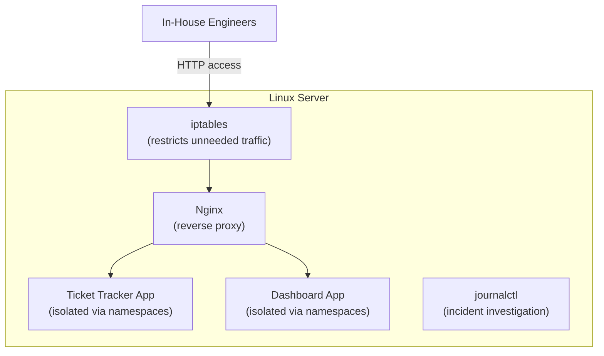

## Introduction

- **What You'll Learn From This Article**: This is the Linux Infrastructure Department's capstone project, where you'll **integrate, on your own, the techniques you've learned one at a time in earlier hands-on labs** (investigating with find, reverse proxy construction via Nginx, process isolation via namespaces, least-privilege design via Capabilities instead of SUID) **and the knowledge from the lectures** (daemons, permissions, iptables, journalctl, how a config file takes effect) **into a single fictional in-house developer platform.** Where earlier articles aimed at "following steps to reliably master one technique," this article takes a format much closer to real-world work: **presenting only requirements, and leaving you to design which techniques to combine, and how.**
- **Intended Audience**: Readers who've worked through the Linux Infrastructure Department's Junior, Senior, and Graduate School content and can execute each individual hands-on lab, but have never designed a single server infrastructure combining them.
- **Estimated Reading Time**: Expect several days to about a week, including design, building, and documentation (the heaviest single hands-on in this series).

This article is part of the [Top 1% Series Complete Article Guide](/en/sitemap). It's positioned as the capstone project within the [Linux Infrastructure Department's full curriculum](/en/university#linux-infrastructure-department).

## Prerequisite Knowledge

This hands-on doesn't teach new techniques. **It combines techniques you've already mastered in the following lectures and hands-on labs.**

- [What Is a Daemon?](/en/articles/linux-daemon-guide)
- [What Are Permissions (chmod)?](/en/articles/linux-file-permissions-guide)
- [iptables (netfilter)](/en/articles/linux-iptables-guide)
- [How a Config File Actually "Takes Effect"](/en/articles/linux-config-activation-guide)
- [Investigating Error Logs With journalctl](/en/articles/linux-journalctl-guide)
- [The Top 1% Hands-On for Tracking Down a File or Directory Yourself With find](/en/articles/linux-find-guide)
- [How Nginx Works](/en/articles/nginx-fundamentals-guide)
- [The Top 1% Hands-On for Building a Custom Virtual Host and Reverse Proxy With Nginx](/en/articles/nginx-handson-guide)
- [A Top 1% Hands-On for Building a Linux Namespace Yourself and Experiencing What a 'Container' Really Is](/en/articles/linux-namespaces-handson-guide)
- [A Top 1% Hands-On for Reproducing the SUID Bit's Danger Yourself and Confirming Least-Privilege Defense via Capabilities](/en/articles/linux-suid-capabilities-handson-guide)

## The Challenge: A Fictional In-House Developer Platform

**You're an infrastructure engineer at a fictional startup, "KoiKoi Dev." Until now, in-house engineers have each run several small internal tools (a ticket tracker, a simple dashboard, and similar) on their own individual laptop, creating two problems: sharing URLs is hard, and investigating an incident is hard. Your assignment is to build, with your own hands, an in-house developer platform on a single Linux server, satisfying every one of the following requirements.**

### Requirement 1: Serve Multiple In-House Tools, Properly Routed, Within One URL Structure

**Serve the ticket tracker app and the dashboard app, each at a different path.** Make sure the same structure can accommodate more tools as they get added in the future.

### Requirement 2: Restrict Unneeded Network Access to the Server With Clear Rules

**Deny traffic to any port in-house engineers don't actually need to access.** Be ready to explain which rule you configured, and why.

### Requirement 3: Isolate Each Application So They Don't Affect Each Other

**Make sure a bug or heavy load in one application never affects another.** Rather than setting up entirely separate physical servers, consider a method that achieves practical isolation on a single server.

### Requirement 4: Never Grant an Application More Privilege Than It Needs

**Even when an application genuinely needs to perform an operation that normally requires root privilege, such as binding to a privileged port, never casually run it as root or with SUID.** Consider a method for granting, concretely, only the privilege genuinely needed.

### Requirement 5: Establish a System for Quickly Identifying the Cause When a Failure Occurs

**Prepare a procedure letting an operator quickly identify the relevant logs and investigate the cause, when one of the applications stops responding.**

### Requirement 6: Make Operations So You Can Reliably Confirm a Configuration Change Took Effect as Intended

**Build a step into your operational flow for reliably confirming whether a change to Nginx's or iptables's configuration actually took effect**, whenever you make one.

## Deliverable Requirements: Assemble It as a Portfolio

**This hands-on's final deliverable isn't just a confirmation that the configuration worked.** Assemble the following into a repository, such as on GitHub.

- **README.md**: An overview of this scenario, and the overall picture of the in-house developer platform you adopted (including a diagram, such as a mermaid chart)
- **A Record of Design Decisions**: The reasoning behind "why you chose that particular technique or configuration" — especially where a trade-off arose, such as your isolation method and privilege design
- **Execution Steps**: A record of the configuration and verification commands you actually ran
- **An Incident Response Runbook**: The concrete investigation steps an operator should take when one of the applications stops responding
- **A Retrospective**: Challenges you discovered while doing this, and what you'd additionally need to consider in real-world practice (integrating with CI/CD, integrating with monitoring tools, and similar)

**This deliverable is exactly the concrete achievement you can present in a job search or as a portfolio.** Simply explaining "I built a reverse proxy with Nginx" is far less persuasive than being able to demonstrate that, "under the realistic constraint of a live environment where multiple applications coexist, I designed by combining several techniques, and can articulate the trade-off between isolation and privilege design."

## What a Pro Sees Here (Top 1% Understanding)

### "The Ability to Follow Steps" and "the Ability to Design From Requirements" Are Entirely Different Skills

Every hands-on so far has taken the format of following a fixed set of steps: "Step 1, Step 2...." **But what actually gets evaluated in real-world work is never the ability to execute a procedure exactly as written — it's the ability to design, on your own, which techniques to combine and how, starting from given requirements** (what this article calls "Requirements 1 through 6"). These two are entirely different skills, despite looking similar. Even having completed every individual hands-on, without the experience of combining them into one coherent server infrastructure design, you're not yet immediately effective in real-world work. This capstone project is deliberately designed to bridge that gap.

### Why This Scenario — "Multiple Apps Coexisting, With Least Privilege"

There's a reason this hands-on, rather than being a one-off technical demo, is deliberately modeled on a realistic project — one where "multiple in-house tools coexist on a single server." **Most real-world Linux server operation never serves a single application in isolation — it needs to simultaneously satisfy multiple axes at once: isolating multiple applications, restricting network access, minimizing privilege, and investigability during an incident.** Knowing Nginx's basic configuration alone isn't enough for a real project — you also need to see through to isolation via namespaces, least-privilege design via Capabilities, and incident investigation via journalctl. The ultimate goal of this capstone project is to elevate your knowledge of individual techniques into **the ability to see through an entire server infrastructure's design.**

## Common Misconceptions and Pitfalls

- **Misconception 1: "This hands-on has one single, fixed, correct configuration."**
  There's no single correct answer to this hands-on. Multiple valid approaches exist, as long as the design satisfies the requirements. What matters is recording, in your README.md, the design you chose and why.
- **Misconception 2: "A deliverable confirming it worked is sufficient on its own."**
  Confirming it works matters, but isn't sufficient on its own. Being able to articulate the reasoning behind your design decisions is this hands-on's real value.
- **Misconception 3: "Having completed every individual hands-on means this one will be easy too."**
  There's a large gap between knowing individual techniques and integrating them into one coherent design. Expect this to take considerable time.

## Troubleshooting Perspective

For this hands-on, **design-level rework** is the main challenge, more than individual technical troubleshooting.

1. **You think you've satisfied the requirements, then later notice a contradiction**: Before starting implementation, write up only the design portion of your README.md first, and confirm, at the writing stage, that you've satisfied every one of Requirements 1 through 6.
2. **You've forgotten the steps from an individual hands-on**: Don't hesitate to go back and reread the linked prerequisite article for each requirement. This capstone tests design skill, not memorization.
3. **You're not sure how much detail is enough**: Use "could I show this README.md to an interviewer I'm meeting for the first time, in a job search, and explain my design decisions?" as your benchmark for completeness.

## Summary

- This capstone project is an integrative exercise, combining techniques you've mastered individually in the Linux Infrastructure Department into a single fictional in-house developer platform.
- What's required is never the ability to follow steps — it's the ability to design, on your own, from requirements.
- Assemble your deliverable as a portfolio document that articulates the reasoning behind your design decisions, not just a confirmation that it worked.

**Takeaways to Apply Today**
1. Even while learning an individual hands-on, build the habit of asking "under what future requirements would I actually end up using this?"
2. Beyond technical deliverables, build the habit of articulating the trade-off between isolation and privilege design in your day-to-day work too.

## References

- [The Linux Infrastructure Department's Full Curriculum](/en/university#linux-infrastructure-department)
