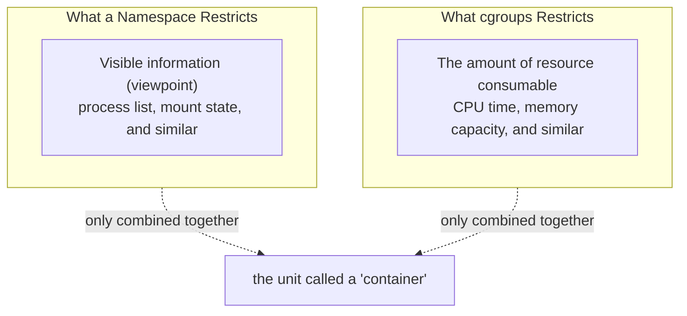

## Introduction

- **What You'll Learn From This Article**: Of the combination covered in [A Top 1% Hands-On for Building a Linux Namespace Yourself and Experiencing What a 'Container' Really Is](/en/articles/linux-namespaces-handson-guide) — "**a container = a namespace + cgroups**" — experience **cgroups** (control groups), the half you hadn't put your hands on yet, by actually setting limits on CPU and memory. You'll understand the decisive difference in role: where a namespace is a mechanism for "restricting what's visible," **cgroups is a mechanism for "restricting the actual amount of resource that can be consumed."**
- **Intended Audience**: Readers who've worked through the namespace hands-on, but have never tried the other half of the mechanism — resource limiting via cgroups — with their own hands.
- **Estimated Reading Time**: About 22 minutes, including the hands-on exercise

This article is part of the [Top 1% Series Complete Article Guide](/en/sitemap), and article 19.1 in the [Linux Infrastructure Series](/en/sitemap#series-list). You can follow along with one of the Ubuntu Server environments set up in the [Hands-On Prep Manual](/en/articles/handson-prep-guide).

## Prerequisite Knowledge

- [A Top 1% Hands-On for Building a Linux Namespace Yourself and Experiencing What a 'Container' Really Is](/en/articles/linux-namespaces-handson-guide): The premise that a namespace is a mechanism for "restricting a viewpoint," and that a container is a combination of namespaces and cgroups.

## Getting the Big Picture

As confirmed in the namespace hands-on, **a namespace only restricts the information visible to a process (the list of other processes, mount state, and similar) — it places no limit whatsoever on how much CPU or memory it may consume.** In other words, **a namespace alone leaves open the possibility that a process that thinks it's isolated could still exhaust the entire host's resources.**



## Hands-On Steps

### Step 1: Run a Process That Exhausts Memory, With No Limit at All

First, deliberately set up a process that allocates a large amount of memory, with no limit in place.

```bash
python3 -c "
data = []
while True:
    data.append(' ' * 10**8)  # allocate about 100MB at a time
    print(f'{len(data) * 100}MB allocated')
" &
MEMHOG_PID=$!
sleep 3
kill $MEMHOG_PID
```

**With no limit at all in this state, as long as it keeps allocating memory, the host's overall memory keeps getting squeezed.**

### Step 2: Create a cgroup and Set a Memory Limit

Using cgroups v2 (the currently dominant interface), create a new cgroup.

```bash
sudo mkdir /sys/fs/cgroup/memhog-demo
echo "100M" | sudo tee /sys/fs/cgroup/memhog-demo/memory.max
```

**Simply writing `100M` into the file `memory.max` sets a 100MB cap on the total memory every process belonging to this cgroup can consume.** This is the same underlying idea as [procfs presenting the kernel's own settings as "live files"](/en/articles/linux-sysctl-guide) — cgroups configuration, too, is done through ordinary file reads and writes.

### Step 3: Add a Process to This cgroup and Confirm What Happens at the Limit

```bash
echo $$ | sudo tee /sys/fs/cgroup/memhog-demo/cgroup.procs
python3 -c "
data = []
while True:
    data.append(' ' * 10**8)
    print(f'{len(data) * 100}MB allocated')
"
```

**Output (illustrative):**

```
100MB allocated
Killed
```

**The instant memory allocation tried to exceed 100MB, this process got forcibly terminated (an OOM Kill).** Writing your own process ID (`$$`) into `cgroup.procs` places the current shell and its child processes under this cgroup's limit. **You've confirmed that, as an entirely independent mechanism from a namespace's viewpoint restriction, actual resource consumption itself gets forcibly cut off by the kernel.**

<details>
<summary>How This Differs From an Ordinary Out-of-Memory Condition (a Host-Wide OOM)</summary>

**Normally, when the host's overall physical memory runs low, the kernel selects an OOM Kill target based on criteria like which process across the entire system is consuming the most memory.** With a cgroup's `memory.max` set, by contrast, **the instant that cgroup itself exceeds its own assigned limit, only the processes inside that cgroup become targets.** The decisive difference is that **even while the host overall still has plenty of free memory, the forced termination happens purely because this cgroup exceeded the limit assigned to it — an arbitrary, agreed-upon ceiling.**

</details>

### Step 4: Set a Limit on CPU Usage Too

```bash
sudo mkdir -p /sys/fs/cgroup/cpuhog-demo
echo "50000 1000000" | sudo tee /sys/fs/cgroup/cpuhog-demo/cpu.max
echo $$ | sudo tee /sys/fs/cgroup/cpuhog-demo/cgroup.procs
yes > /dev/null &
sleep 5
top -b -n 1 | grep yes
```

**Setting `cpu.max` to `"50000 1000000"` means: "out of every 1,000,000-microsecond (1-second) period, only allow 50,000 microseconds (0.05 seconds) of CPU time usage."** This lets you confirm that **the `yes` command, which would normally occupy an entire CPU core at 100%, ends up capped at roughly 5% CPU usage.**

## What a Pro Sees Here (Top 1% Understanding)

### "Namespace + cgroups" Is a Concrete Example of the Design Philosophy "Use a Separate Tool for Each Kind of Problem"

The biggest discovery you can confirm through this hands-on, together with [the namespace hands-on](/en/articles/linux-namespaces-handson-guide), is that **the requirement "isolation" — which looks like a single purpose at a glance — actually breaks down into two entirely independent problems: "what's visible" (a namespace) and "how much can be used" (cgroups).** **What a tool like Docker provides as the single concept "a container" is really nothing more than automating operations against these two entirely separate mechanisms, bundled together.** A top-1% engineer, whenever encountering a new, abstracted concept, has the habit of always breaking it down and asking: "what independent mechanisms is this actually a combination of?"

## Common Misconceptions and Pitfalls

- **Misconception 1: "cgroups restricts the information visible to a process, the same way a namespace does."**
  What cgroups restricts is the amount of resource consumable (CPU time, memory capacity, and similar) — an entirely separate axis from the range of visible information, which is a namespace's role.
- **Misconception 2: "Setting a memory limit automatically makes a process switch to using less memory."**
  cgroups is a mechanism that triggers forced termination (an OOM Kill) once a limit is exceeded — it never automatically changes a process's own behavior toward consuming less memory.
- **Misconception 3: "A process under a cgroup limit gets forcibly terminated because the host overall is running low on memory."**
  Even with plenty of free memory on the host overall, forced termination happens purely because that cgroup itself exceeded its own assigned limit.

## Troubleshooting Perspective

1. **A process inside a container suddenly terminates, leaving only a "Killed" message**: First check whether that container's assigned memory limit (a setting equivalent to `memory.max`) got exceeded.
2. **A specific process's CPU usage plateaus lower than expected**: Check whether the cgroup that process belongs to has a `cpu.max` limit configured.
3. **You try to create a cgroup, but the file can't be found**: cgroups v1 and v2 have different interfaces. Check `/sys/fs/cgroup`'s structure to confirm which version is actually running.

## Summary

- A namespace restricts the range of information visible to a process; cgroups is an entirely independent mechanism that restricts the actual amount of resource consumable.
- cgroups configuration happens through reading and writing files under `/sys/fs/cgroup` — `memory.max` caps memory, and `cpu.max` caps CPU usage.
- Exceeding a cgroup's limit forcibly terminates or throttles the processes inside that cgroup, even with plenty of resource free on the host overall.
- Container technology automates, as a single concept, the combination of two independent mechanisms: namespaces (what's visible) and cgroups (how much can be used).

**Takeaways to Apply Today**
1. When you hit an incident related to a container's resource usage, first check the cgroups limit configured for that container.
2. Whenever you encounter a new, abstracted concept, build the habit of breaking it down and asking what independent mechanisms it's actually a combination of.

## References

- [Control Group v2 | The Linux Kernel Documentation](https://docs.kernel.org/admin-guide/cgroup-v2.html)
- [cgroups(7) Manual Page](https://man7.org/linux/man-pages/man7/cgroups.7.html)
