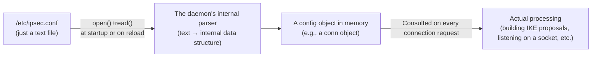
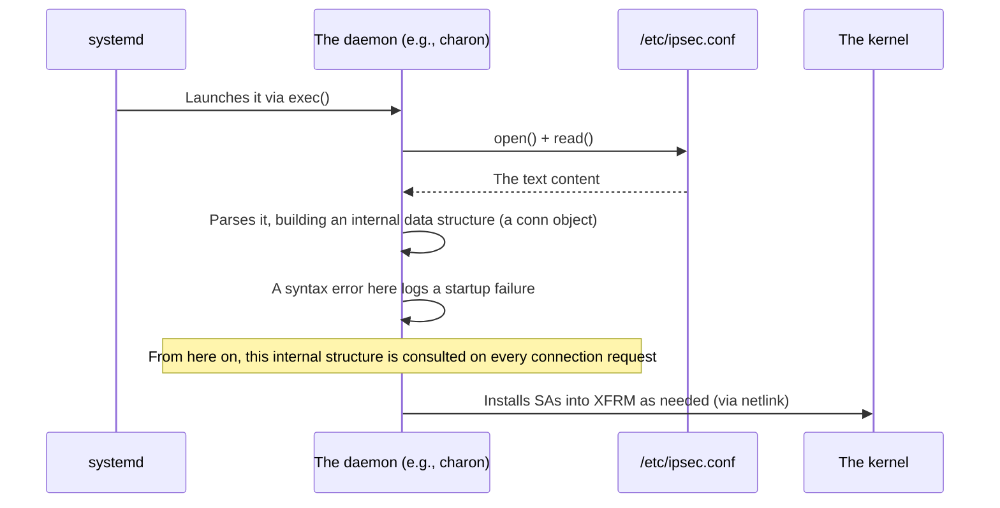

## Introduction

- **What You'll Learn From This Article**: Why writing human-readable text like `type=transport` into `/etc/ipsec.conf` actually changes strongSwan's real encrypted-traffic behavior — the full path a config file travels from "just text" to "the actual behavior of a running program," including a daemon's startup process, its parsing step, and what reload vs. restart really mean.
- **Intended Audience**: Readers who know the routine of "edit the config, then restart the daemon to apply it," but can't explain the mechanism underneath that makes it work.
- **Estimated Reading Time**: About 15 minutes

This article is part of the [Top 1% Series' full article guide](/en/sitemap). It's a spin-off from the point in the [self-built L2TP/IPsec server hands-on lab](/en/articles/l2tp-ipsec-lab-guide) where `/etc/ipsec.conf` and `/etc/xl2tpd/xl2tpd.conf` are edited.

## Prerequisites

- **Daemons**: Processes that stay resident in the background. Covered in [What Is a Daemon?](/en/articles/linux-daemon-guide).
- **System calls**: The official mechanism a program uses to invoke kernel functionality. Covered in [User Space, Kernel Space, and TUN/TAP Devices](/en/articles/linux-user-kernel-space-guide).

## Getting the Big Picture

### In a nutshell

**A config file, by itself, has no power to execute anything. It "takes effect" only because a separate program — a "daemon" — reads it, interprets it, and reflects it in actual processing.** `/etc/ipsec.conf` is nothing more than "input data" for strongSwan's `charon` daemon; the config only "takes effect" once charon `open()`s and `read()`s this file, parses its contents, holds them as an internal data structure inside the program, and puts that structure to use — listening on a socket, choosing encryption parameters, and so on.

## Fundamentals, Thoroughly Explained

### "Loading the config" as part of a daemon's startup process

Most daemons, right after starting up, go looking for their config file and parse its contents. This step is folded into the same startup sequence covered in [What Is a Daemon?](/en/articles/linux-daemon-guide) — detaching from the terminal and settling in to listen in the background.

After parsing, the `conn L2TP-PSK` block in `/etc/ipsec.conf` gets turned into a program-level data structure inside strongSwan — a "conn object" (a struct, in C terms). From then on, every time a client sends a connection request, strongSwan consults this internal structure — building the cipher proposal specified by `ike=`, checking whether the request matches the condition specified by `leftprotoport=`, and so on. **The text file's contents "take effect" precisely because this converted, in-memory data structure keeps getting consulted inside the actual processing logic.**

### Why editing the file alone doesn't apply the change

Editing `/etc/ipsec.conf` in a text editor doesn't get **automatically detected** by a running charon daemon. This has the exact same root structure as the phenomenon covered in the [sysctl article](/en/articles/linux-sysctl-guide) — "editing `/etc/sysctl.conf` alone doesn't reach the kernel." **A config file is passive data; it has no ability to watch itself and reflect changes on its own.** Getting a daemon to pick up a change requires one of the following, telling it to "read it again":

| Operation | What happens internally |
|---|---|
| Restarting the daemon (`systemctl restart`) | The process is terminated and a new one is `exec()`'d. The startup-time loading process runs again from scratch. |
| Reloading the config (`sudo ipsec reload`; often `systemctl reload` for other daemons) | The process isn't terminated — a signal like SIGHUP tells it "re-read your config file." This often applies the new config without dropping existing connections. |

`reload` has the advantage of applying a change while keeping the process (and any established communication) alive, but **not every daemon, and not every config item, can be applied via reload** (strongSwan itself has some settings that reload can't apply, requiring an explicit restart). Checking the target daemon's own documentation is the reliable way to know which operation you need.

### A parse failure at startup means the config fails to "activate" at all

If a config file has a syntax error, the daemon fails at the "load and interpret" step of its startup process, and in most cases aborts startup entirely right there. When `sudo systemctl status strongswan-starter` shows a failure, the cause is very often **an error at exactly this parsing stage**. It helps to remember that a config file doesn't "take effect just by being written" — it only **becomes a candidate to take effect once it can be correctly interpreted as valid syntax.**

## The View from the Top 1% (What Experts See)

### "User-space config" and "kernel-space config" take completely different paths to apply

`/etc/ipsec.conf` and `/etc/xl2tpd/xl2tpd.conf`, covered in this article, are **config that userspace daemons — strongSwan, xl2tpd — parse themselves.** By contrast, `/etc/sysctl.conf` (covered in the [sysctl article](/en/articles/linux-sysctl-guide)) and the firewall rules covered in the [iptables article](/en/articles/linux-iptables-guide) are **config that ultimately rewrites the kernel's own internal state.** Despite looking the same on the surface — "a text file placed under `/etc`" — the path to actually applying them differs sharply:

| Kind of config | Path to applying it | What triggers it |
|---|---|---|
| Userspace daemon config (`ipsec.conf`, etc.) | The daemon itself parses the file and updates a data structure in its own process's memory | Daemon startup, or an explicit reload command |
| Kernel parameter (`sysctl`) | The `sysctl` command writes to `/proc/sys`, directly updating an internal kernel variable | Running `sysctl -p`, or `systemd-sysctl.service` at boot |
| Firewall rules (`iptables`) | The `iptables` command registers rules with the kernel's netfilter via netlink | Running the `iptables` command itself (immediate) |

**The key to handling this domain systematically is not being fooled by the surface-level similarity of "a text file under `/etc`," and instead distinguishing where a given piece of config ultimately applies (your own process's memory, or inside the kernel) and how (a homegrown parser, or a dedicated command run each time).**

### Why do so many daemons roll their own config file format?

`ipsec.conf`'s block syntax, `xl2tpd.conf`'s INI-style format, and `sysctl`'s key=value format all differ — there's no unified standard format. That's because **the config file's parser is part of that daemon's own implementation, and developers are free to pick whatever format suits their own program.** More and more software adopts general-purpose formats like YAML or JSON these days, but many traditional Linux daemons like `ipsec.conf` and `xl2tpd.conf` implement their own lightweight, homegrown parser and syntax. This might look inefficient, but it also brings a practical benefit: **fewer external library dependencies, and a faster startup.**

## Common Misconceptions and Pitfalls

- **Misconception 1: "The daemon is always watching the config file, and it applies automatically the moment I save."**
  Most traditional Linux daemons don't watch their config files at all. Applying a change requires an explicit reload or restart (though some modern software does use a file-change-notification mechanism like `inotify` to auto-reload).
- **Misconception 2: "Reload and restart do the same thing."**
  Reload swaps the config while keeping the process alive; a restart terminates and recreates the process itself. Their impact on active connections differs greatly.
- **Misconception 3: "If the config file's syntax is correct, it's guaranteed to behave as intended."**
  Parsing correctly and being semantically sensible are two different things. A contradictory cipher-algorithm specification, for instance, won't trigger a syntax error, but it will surface as a negotiation failure the moment a real connection is attempted.

## Common Sticking Points (Troubleshooting)

1. **You changed the config, but it's not applied**: First, check with `sudo systemctl status <service>` whether the daemon was actually restarted or reloaded (look at the most recent start time). Forgetting to reload/restart after a change is by far the most common cause.
2. **The daemon won't start**: Check the most recent logs with `sudo journalctl -u <service> -e`, and look for a message indicating a config-file syntax error (a failure at the parsing stage).
3. **You reloaded, but some settings didn't apply**: The daemon may simply not support applying that particular setting via reload (check its documentation for something like "requires restart"). A restart is the reliable fallback.

### Prevention and Long-Term Fixes

- Before changing config in production, validate it beforehand if the daemon offers a syntax-check command (for strongSwan, confirming syntax before something like `ipsec rereadsecrets`).
- Document, internally, which settings apply via reload and which require a restart, so you're never guessing mid-change.
- Include confirming a change actually applied (checking the relevant logs, a connectivity test) as a checklist item in your change process, so you never leave things in a "file edited but not applied" state.

## Summary

- A config file has no power on its own — it only "takes effect" once a daemon reads it, parses it, converts it into an internal data structure, and uses that structure in actual processing.
- A running daemon doesn't automatically detect a config-file change, so applying one requires an explicit reload (re-reading the config while the process stays alive) or restart (recreating the process).
- Even though they look the same — "a text file under /etc" — config that a userspace daemon parses itself and config that ultimately rewrites the kernel (sysctl, iptables) follow completely different paths to actually applying.
- Daemons roll their own config file formats because the parser is part of that daemon's own implementation — a practical choice that reduces external dependencies and speeds up startup.

**Starting Today**
1. After changing a config file, always pair it with the trigger that applies it (reload or restart), and confirm the change actually took via logs or a connectivity check.
2. When you encounter an unfamiliar config file, get in the habit of first asking "who reads this — which daemon, or the kernel itself — and how does it get applied?"

## References

- [strongSwan Documentation — ipsec.conf](https://docs.strongswan.org/docs/latest/config/IPsecConfiguration.html)
- [systemd.service — systemd System and Service Manager](https://www.freedesktop.org/software/systemd/man/latest/systemd.service.html)
- [signal(7) — Linux manual page (SIGHUP and other signals)](https://man7.org/linux/man-pages/man7/signal.7.html)
