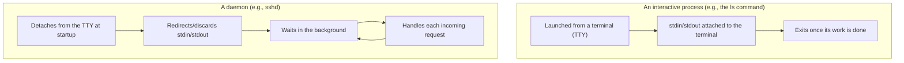
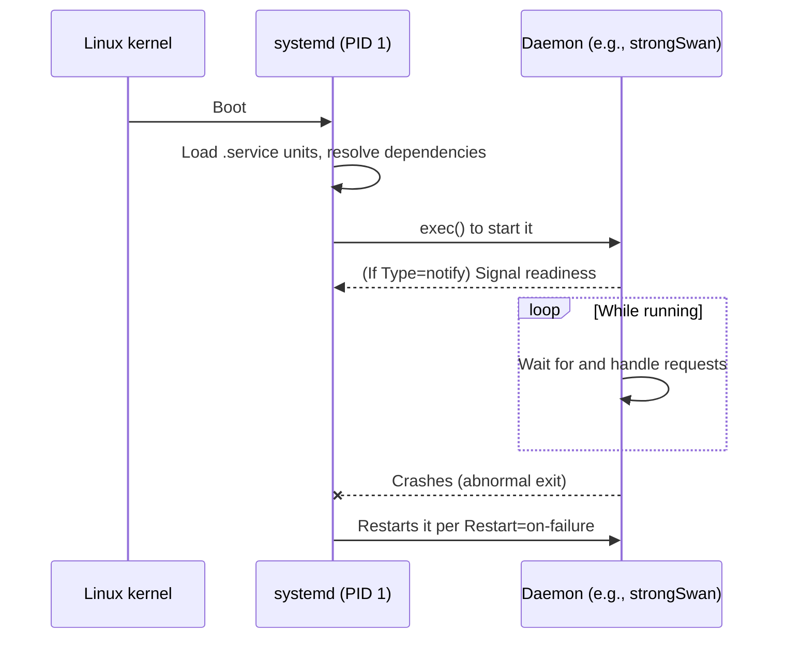

## Introduction

- **What You'll Learn From This Article**: What a "daemon" actually is — how it differs from a regular process, why protocol-handling software like IKE or L2TP is implemented as a daemon, and how systemd starts, monitors, and restarts daemons under the hood.
- **Intended Audience**: This article is aimed at infrastructure engineers involved in building and operating servers who hear the word "daemon" constantly but can't go much further than "something running in the background," and can't clearly explain how it differs from a regular process.
- **Estimated Reading Time**: About 15 minutes

This article is part of the [Top 1% Series' full article guide](/en/sitemap).

## Prerequisites

- **Process**: The running instance of a program. The OS allocates resources such as memory space, CPU time, and file descriptors to each process.
- **Standard I/O (stdin/stdout/stderr)**: The three basic input/output channels an OS provides so a program can read keyboard input or print text to a screen.
- **Signal**: A short asynchronous notification sent to a process by the OS or another process (e.g., `SIGTERM` asks a process to terminate; `SIGKILL` forces it to).

## Getting the Big Picture

### In a Nutshell

**A daemon is a process that has no directly attached terminal, keeps running in the background for as long as the OS is up, and continuously provides some specific role or service.** The name traces back not to "demon" in the sinister sense but to the Greek "daemon" — a guardian spirit that watches over and quietly acts on someone's behalf — and by convention many daemon names end in `d` (though exceptions like `charon` exist).

An everyday command like `ls` or `cat` is an "interactive process": it's launched from a terminal and exits as soon as it's done. A daemon has a fundamentally different lifecycle — **it stays resident after detaching from the terminal, and processes work whenever something (a network packet, a socket connection, a timer) triggers it.**

## The Fundamentals, Explained Thoroughly

### What Separates a Daemon from a Regular Process

A daemon isn't written in a special language or compiled into a special binary format. **Any ordinary program becomes a daemon by going through a startup procedure known as daemonizing:**

1. **`fork()` and let the parent exit**: The classic technique for detaching from the calling terminal's process group.
2. **Start a new session (`setsid()`)**: Detaches the process from its controlling terminal, so closing that terminal doesn't take the process down with it.
3. **Redirect standard I/O to `/dev/null` or a dedicated log file**: Since there's no longer a "screen" to write to, the output destination has to be explicitly decided.
4. **Change the working directory to something stable, such as `/`**: This avoids problems if the directory the process started in later gets unmounted.

On modern Linux, instead of every program implementing this sequence itself, **the init system (systemd) takes over the job of daemonizing.** A program can be written as an ordinary process, and specifying `Type=simple` or `Type=forking` in its systemd `.service` unit is enough for systemd to perform the equivalent of the steps above on the program's behalf.

### Why Implement Protocol Handling as a "Daemon"

The **IKE daemon (strongSwan's `charon`), L2TP daemon (`xl2tpd`), and PPP daemon (`pppd`)** that show up when discussing VPN protocols all rely on this "wait around in the background" property to implement each protocol's own **state machine**.

- IKE listens on UDP ports 500/4500 and transitions through internal states — "phase 1 in progress," "SA established," and so on — depending on the kind of IKE message it receives.
- An L2TP daemon manages multiple tunnels and sessions simultaneously, keeping a table of each one's state (unestablished, establishing, established).

This kind of work **doesn't suit a short-lived program that handles one request and exits (something like a CGI script).** Protocol negotiation spans multiple message exchanges and needs to keep in-progress state — cryptographic keys, sequence numbers, timers — in memory the whole time. Running as a resident daemon lets that state be held safely in the process's memory while handling multiple connections in parallel.

Aside: How "daemon" relates to "service"

In practice "daemon" and "service" are used almost interchangeably, but strictly speaking they describe different viewpoints. **"Daemon" refers to the process itself** (e.g., the running process backed by the `sshd` binary), while **"service" refers to the management unit as seen by an init system like systemd** (e.g., the `sshd.service` unit). A single service unit can start and manage multiple daemon processes, and Windows' concept of a "service" corresponds fairly closely to a Unix-style daemon.

### How systemd Starts, Monitors, and Restarts Daemons

On modern Linux distributions, **systemd** runs as PID 1 (the very first process to start) and takes care of everything from startup ordering and dependency resolution to automatically restarting a daemon after it crashes.

Common operational commands:

| Command | Purpose |
|---|---|
| `systemctl start/stop <service>` | Start or stop a daemon |
| `systemctl enable <service>` | Enable automatic startup on next boot |
| `systemctl status <service>` | Check current status and recent log excerpts |
| `journalctl -u <service>` | View all logs a given daemon has produced |

A systemd unit file can include a setting like `Restart=on-failure`, which lets an operator get **automatic restart after a crash** and **wait for another daemon it depends on (e.g., one that only starts after networking is up) before starting** — all without changing a single line of the application's own code. This is the practical reason individual programs rarely need to implement daemonizing logic themselves anymore.

## What the Top 1% Sees

### Multiple Cooperating Daemons: Fault Isolation, but Also a Breeding Ground for Complexity

A design like L2TP/IPsec's, where an IKE daemon, an L2TP daemon, and a PPP daemon each work independently and cooperate, gets the benefit of **fault isolation** — if one daemon crashes, it doesn't directly affect the others or the OS as a whole. On the other hand, **tracing a full connection sequence requires cross-referencing logs from multiple daemons**, which raises the cost of troubleshooting. A design like WireGuard's, which folds the processing directly into the Linux kernel itself (bypassing even a daemon), can be seen as a deliberate choice to structurally avoid that complexity.

### Where Logs Go: The Role of syslog/journald

Traditional daemons are designed to send their messages to **syslog**, a centralized logging facility, instead of writing to standard output. In a modern systemd environment, a daemon's stdout/stderr are captured directly into `journald`, letting `journalctl` provide a single, unified place to view them. This removes the need to think about log file locations and rotation policy on a per-daemon basis, and gives troubleshooting a consistent answer to "which log should I check?"

## Common Misconceptions and Pitfalls

- **Misconception 1: "A daemon is a specially built program, fundamentally different from a normal one."**
  In reality, a daemon is an ordinary executable that requires no special compilation method or language feature. The only difference is how it's started — detaching from a terminal to run resident in the background.
- **Misconception 2: "If a daemon is running, the service it provides must be working correctly."**
  `systemctl status` reporting "active (running)" only tells you the process is alive; it says nothing about whether the daemon is actually configured correctly or handling connections properly. You still need to verify actual connectivity and check log contents before concluding it's healthy.
- **Misconception 3: "There's exactly one daemon per service."**
  As the L2TP/IPsec example shows, it's not unusual for a single feature (remote-access VPN) to require several cooperating daemons working together.

## A Troubleshooting Perspective

Daemon-related issues are best triaged by **separating "is the process alive" from "is it fulfilling its role correctly."**

1. **The daemon isn't running at all**: Use `systemctl status <service>` to check whether the process exists and, if not, why it most recently exited (a config-file syntax error, a duplicate port binding, etc. are common causes).
2. **The daemon is running but unresponsive**: Use a command like `ss -tulnp` to verify that the daemon is actually listening on the port you expect. A misconfigured interface or port binding is a typical cause.
3. **Only specific requests fail**: Follow the logs live with `journalctl -u <service> -f` while reproducing the problematic request, and pin down exactly which internal processing stage the daemon fails at.

### Preventive Measures and Long-Term Fixes

- Configure systemd's `Restart=on-failure` and `StartLimitBurst` appropriately to get automatic recovery from crashes while avoiding an infinite restart loop.
- Centralize daemon logs into `journald`, and for services made of several cooperating daemons (like L2TP/IPsec), keep track of every unit name involved so you can trace logs across all of them during an investigation.
- Before going to production, deliberately `kill` a daemon to verify that automatic restart works, and confirm that any daemons it depends on start in the correct order.

## Summary

- A daemon is a process that detaches from a terminal and stays resident in the background; it's distinguished not by a special executable format but by how it's started (daemonizing).
- Protocol-handling components such as IKE or L2TP daemons naturally fit a daemon design, since they need to hold state across multiple message exchanges.
- On modern Linux, systemd takes over daemonizing, startup ordering, automatic restart on crash, and centralized logging, reducing the need for individual programs to implement any of this themselves.
- Running multiple cooperating daemons brings fault isolation, but at the cost of more complex troubleshooting.

**Things to Keep in Mind Starting Today**
1. Remember that `systemctl status` only confirms "is the process alive" — separately verify "is it fulfilling its role correctly" through logs and actual connectivity checks.
2. For services built from several cooperating daemons, know every unit name involved ahead of time so you're not scrambling to find them during an incident.

## References

- [systemd.service — systemd System and Service Manager](https://www.freedesktop.org/software/systemd/man/latest/systemd.service.html)
- [daemon(7) — Linux manual page](https://man7.org/linux/man-pages/man7/daemon.7.html)
- [journalctl(1) — Linux manual page](https://man7.org/linux/man-pages/man1/journalctl.1.html)
