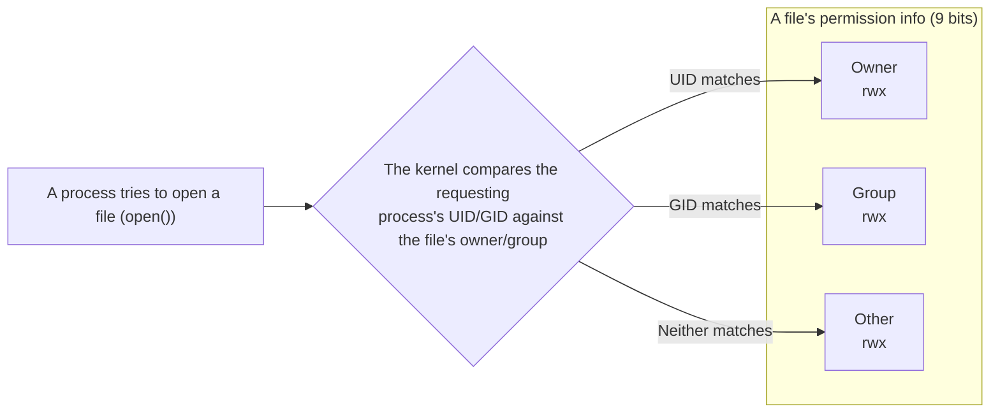

## Introduction

- **What You'll Learn From This Article**: Why a seemingly cryptic command like `chmod 600` can control access to a file — the meaning of the rwx bits, how numeric notation maps to symbolic notation, special permissions like setuid and the sticky bit, and how the kernel actually enforces this mechanism.
- **Intended Audience**: Readers who can run commands like `chmod 600 /etc/ipsec.secrets` from a setup guide, but can't explain why the number 600 means "only the owner can read and write."
- **Estimated Reading Time**: About 15 minutes

This article is part of the [Top 1% Series' full article guide](/en/sitemap). It's a spin-off from the point in the [self-built L2TP/IPsec server hands-on lab](/en/articles/l2tp-ipsec-lab-guide) where `chmod 600` is run on `/etc/ipsec.secrets` and `/etc/ppp/chap-secrets`.

## Prerequisites

- **Processes and User IDs (UIDs)**: A running program (process) on Linux carries a numeric UID identifying the user who launched it. Covered in more depth in [What Is a Daemon?](/en/articles/linux-daemon-guide).
- **System calls**: The official mechanism by which a userspace program invokes kernel functionality (like reading or writing a file). Covered in [User Space, Kernel Space, and TUN/TAP Devices](/en/articles/linux-user-kernel-space-guide).

## Getting the Big Picture

### In a nutshell

**Linux file permissions express "who can do what" as 9 bits of information stored per-file, and the kernel checks these 9 bits every time a process tries to access that file.** "Who" breaks down into three categories — owner, group, and other — and "what" breaks down into three actions — read, write, and execute. 3 categories × 3 actions = 9 bits, and everything else builds on this foundation.



The first character of the 11-character string you see in `ls -l` output, like `-rw-------`, is the file type; the remaining 9 characters are these bits. The `chmod` command is nothing more than an operation that rewrites these 9 bits.

## Fundamentals, Thoroughly Explained

### The rwx bits and their numeric mapping

Read (r), write (w), and execute (x) are each assigned a value — 4, 2, and 1 — and the sum of these values expresses one category's permission as a single digit.

| Permission | Symbol | Value |
|---|---|---|
| Read | r | 4 |
| Write | w | 2 |
| Execute | x | 1 |

For example, "read + write only" is 4+2=**6**, "read + execute only" is 4+1=**5**, and "everything" is 4+2+1=**7**. Lining these up for owner/group/other gives you the 3-digit number you see in commands like `chmod 600` or `chmod 755`.

| Command | Owner | Group | Other | Meaning |
|---|---|---|---|---|
| `chmod 600 file` | rw- | --- | --- | Only the owner can read/write (the standard for passwords, private keys, etc.) |
| `chmod 644 file` | rw- | r-- | r-- | Owner can read/write, everyone else can read (typical for config files) |
| `chmod 755 file` | rwx | r-x | r-x | Owner has full access, everyone else can read/execute (typical for executables and directories) |

Running `chmod 600` on `/etc/ipsec.secrets` sets it to exactly the first row of this table, so that the pre-shared key can't be read by anyone but the file's owner (usually root).

<details>
<summary>Numeric mode (chmod 600) vs. symbolic mode (chmod u+rw,go-rwx)</summary>

Besides the numeric (absolute) mode covered in this article, `chmod` also supports symbolic (relative) mode, combining `u` (user/owner), `g` (group), `o` (other), and `a` (all) with `+`/`-`/`=`. For example, `chmod u+x file` means "add execute permission for the owner only," and `chmod go-rwx file` means "strip all permissions from group and other." Numeric mode fixes all 9 bits at once; symbolic mode specifies a diff relative to the current state — handy when you want to change just one part while keeping the rest intact.

</details>

### rwx means something different on a directory than on a file

The meaning of rwx changes depending on whether the target is a file or a directory. Not knowing this leads to confusing situations like "I have read permission, but I still can't access the file's contents."

| Permission | On a file | On a directory |
|---|---|---|
| r | Can read the file's contents | Can list filenames inside with `ls` |
| w | Can modify the file's contents | Can create/delete files inside (**independent of the files' own permissions**) |
| x | Can execute the file as a program | Can `cd` into the directory and access files inside (if you know their names) |

One especially easy thing to miss: **whether you can delete or rename a given file is determined not by that file's own permissions, but by the write permission on its parent directory.** No matter how tightly a file's contents are locked down with `600`, if the parent directory is writable, the file itself can still be deleted and replaced with a new one.

### chown/chgrp: changing "whose it is"

While `chmod` changes "what can be done," `chown` (change owner) changes "whose it is."

```bash
sudo chown alice:developers file.txt
```

This changes the file's owner to `alice` and its group to `developers`. Changing the owner (`chown`) **requires root privileges** (if an ordinary user could freely "hand off" ownership of their files to someone else, that would create problems for things like disk-quota accounting). Changing the group (`chgrp`, or the `:groupname` part of `chown`), on the other hand, **can be done by the file's own owner**, as long as it's a group they themselves belong to.

### setuid and the sticky bit: three special bits

Beyond the basic 9 bits, three more exist — setuid, setgid, and the sticky bit — expressed as a 4th (leading) digit in `chmod`'s numeric notation (e.g., `chmod 4755`).

- **setuid (4000)**: Set on an executable, this makes the program **run with the privileges of the file's owner, regardless of who actually launched it**. The classic example is `/usr/bin/passwd`. The `passwd` command needs to modify `/etc/shadow` (which no one but root can read or write), but ordinary users aren't allowed to edit that file directly. Setting setuid on the `passwd` executable itself, owned by root, confines this privilege-escalation loophole to exactly one place: `/etc/shadow` can only be modified through the fixed validation logic that `passwd` implements.
- **Sticky bit (1000)**: Set on a directory, this adds the constraint that **only the file's owner (or root) can delete or rename each file, even though the directory itself is writable**. `/tmp` is the classic example — anyone can write to it, but users can't delete each other's temporary files.

## The View from the Top 1% (What Experts See)

### The kernel checks these 9(+3) bits every single time

Permissions aren't a static decoration you set once and forget. Every time a process tries to access a file via a system call like `open()`, `read()`, or `write()`, **the kernel's VFS (Virtual File System) layer compares the requesting process's effective UID/GID against the owner/group/mode bits recorded in that file's inode (metadata), and makes an allow/deny decision on the spot.** The fact that `chmod 600` makes a file unreadable to other users is a demonstration of static config information having a dynamic, runtime effect via the system-call path, every single time it's used. Because this check runs in kernel space, there's no way for a userspace program to bypass it (the privilege-level separation covered in [User Space, Kernel Space, and TUN/TAP Devices](/en/articles/linux-user-kernel-space-guide) is what makes this safety guarantee possible).

### The classic setuid pitfall: shell scripts

Running `chmod u+s script.sh` on a shell script won't do what you expect on most Linux distributions. That's because setuid is an attribute of the executable's own inode, whereas running a shell script is actually a two-step indirect call — the kernel first reads the shebang (`#!/bin/bash`), `exec`s the shell binary, and passes the script file as an argument to that shell. This indirection is easy to exploit via a race condition to escalate privileges. The practical rule is to only ever use setuid on compiled binaries, never shell scripts.

## Common Misconceptions and Pitfalls

- **Misconception 1: "Root ignores permissions entirely, no matter what."**
  Practically true, but more precisely: root (UID 0) has the privilege to effectively bypass the permission check itself. Using the Linux kernel's `capabilities` mechanism, you can further subdivide root's privileges and create a special root-like process that lacks specifically "the privilege to ignore file permissions."
- **Misconception 2: "Raising the group permission makes it override the owner's."**
  The kernel's check proceeds in order — "does it match the owner? If so, apply the owner's permission. If not, check the group." — and **only the first matching category's permission is applied; permissions across categories are never combined.** Even if the owner also happens to belong to the file's group, only the owner-category permission applies.
- **Misconception 3: "Setting a file to 600 makes it completely secure."**
  `chmod 600` only prevents access from other users on the same server. It does nothing to prevent server compromise (e.g., an attacker gaining root via SSH) or a plaintext copy leaking through a backup or log file. Permissions are just one layer of defense-in-depth.

## Common Sticking Points (Troubleshooting)

1. **"Permission denied" when accessing a file**: Check the file's own permissions with `ls -l`, but also check the **execute (x) permission on every parent directory** along the path. Missing x on even one directory in the chain blocks `cd` into anything below it.
2. **The permissions look right, but access still fails**: In environments with MAC (Mandatory Access Control) like SELinux or AppArmor enabled, a request can still be denied by MAC policy even when ordinary permissions (DAC — Discretionary Access Control) allow it. Check with `getenforce` or `aa-status`.
3. **A service fails during processing that goes through a setuid binary**: On a filesystem mounted with the `nosuid` option, the setuid bit is ignored even if it's set. Check the mount options with `mount`.

### Prevention and Long-Term Fixes

- Turn "run `chmod 600` (or the minimum permission the daemon actually needs) immediately after creating a config file containing a secret" into a checklist item.
- Avoid creating new setuid binaries; prefer granting specific privilege escalation through `sudo` policy (`/etc/sudoers`) instead (a compromised setuid binary has a much wider blast radius).
- Codify permission settings explicitly in CI/CD or provisioning tools (like Ansible) to prevent manual configuration from being missed.

## Summary

- File permissions are expressed as 9 bits — 3 categories (owner/group/other) × 3 actions (read/write/execute) — and `chmod`'s numeric notation turns these 9 bits into a 3-digit number as the sum of r=4/w=2/x=1.
- rwx means something different on a directory than on a file; in particular, whether a file can be deleted is determined by the parent directory's write permission.
- The special 3-bit trio setuid/sticky bit are used for things like limited privilege escalation (the `passwd` command) and protecting shared directories (`/tmp`).
- This isn't a static setting — it's runtime access control that the kernel dynamically checks in the VFS layer on every system call.

**Starting Today**
1. Build the reflex of applying `chmod 600` (or the minimum necessary permission) the moment you create a file containing secrets.
2. When you hit "Permission denied," get in the habit of checking parent directory permissions, not just the target file's own.

## References

- [chmod(1) — Linux manual page](https://man7.org/linux/man-pages/man1/chmod.1.html)
- [path_resolution(7) — Linux manual page](https://man7.org/linux/man-pages/man7/path_resolution.7.html)
- [credentials(7) — Linux manual page (UID/GID and capabilities)](https://man7.org/linux/man-pages/man7/credentials.7.html)
