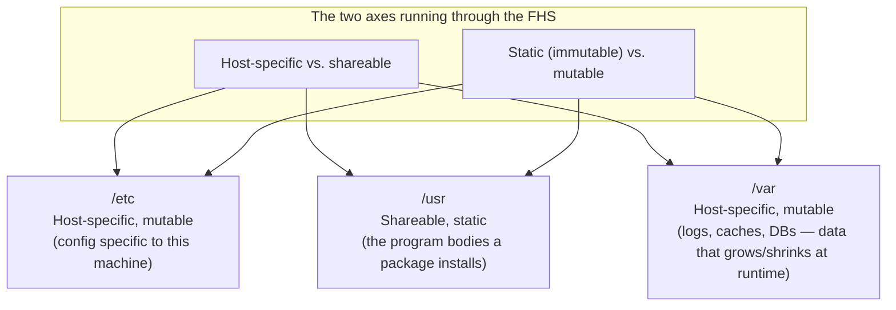

## Introduction

- **What You'll Learn From This Article**: Why Linux config files like `/etc/ipsec.conf` and `/etc/xl2tpd/xl2tpd.conf` almost invariably live under `/etc`, and what the other top-level directories — `/var`, `/usr`, `/bin`, `/home` — each actually exist for, as a coherent design philosophy rather than a list to memorize.
- **Intended Audience**: Readers who can run commands like `cd /etc` or `ls /var/log`, but can't explain the rule running through the whole directory layout — why a given piece of data lives where it does.
- **Estimated Reading Time**: About 14 minutes

This article is part of the [Top 1% Series' full article guide](/en/sitemap). It's a spin-off from the point in the [self-built L2TP/IPsec server hands-on lab](/en/articles/l2tp-ipsec-lab-guide) where `/etc/ipsec.conf` is edited.

## Prerequisites

- **Filesystems**: The mechanism for organizing disk data into a hierarchy of files and directories.
- **Package management**: The mechanism tools like `apt` use to install, update, and remove software on an OS. Covered in more depth in [What Is a Library?](/en/articles/software-library-guide).

## Getting the Big Picture

### In a nutshell

**Linux's directory layout follows an industry standard called the FHS (Filesystem Hierarchy Standard), and at its backbone are two axes: (a) is this data host-specific, or generic data that can be shared/reused across multiple machines, and (b) is this static data that never changes once installed, or mutable data that gets rewritten during operation.** `/etc` being the standard home for config files isn't just convention — it's because, sorted along these axes, it occupies a clear position: "host-specific, mutable data."

## Fundamentals, Thoroughly Explained

### The role of each major top-level directory

Sorting the FHS's top-level directories that come up frequently in practice along the two axes above:

| Directory | Role | Host-specific? | Mutable? |
|---|---|---|---|
| `/etc` | System-wide config files | Host-specific | Mutable (hand-edited) |
| `/usr` | Program bodies, shared libraries, and docs a package installs | Shareable (works if copied to another machine) | Static (updated via package management) |
| `/bin`, `/sbin` | Basic executable commands (on most modern distros, largely symlinks into `/usr/bin`, `/usr/sbin`) | Shareable | Static |
| `/var` | Logs, caches, databases — data that grows and shrinks at runtime | Host-specific | Mutable (auto-generated by programs) |
| `/home` | Ordinary users' personal data | Host-specific | Mutable |
| `/tmp` | Temporary files (often cleared on reboot) | Host-specific | Mutable, transient |
| `/opt` | Third-party software packages outside the package manager's scope | Could be either | Static |
| `/root` | The root user's home directory (kept separate from `/home`) | Host-specific | Mutable |

The act of opening `/etc/ipsec.conf` in `nano` and hand-editing it lines up exactly with `/etc`'s definition: host-specific, mutably edited by a human.

Why is `/bin` a symlink to `/usr/bin` on so many distributions (the usrmerge)?

Historically, the minimal set of commands usable in the very early boot stages — before `/usr` was even mounted — lived in `/bin`/`/sbin`, with most other commands in `/usr/bin`/`/usr/sbin`. But as the initial RAM disk (initramfs) mechanism matured on modern Linux, keeping this split served little practical purpose, so many distributions (Debian/Ubuntu, etc.) adopted the "usrmerge," turning `/bin`/`/sbin` into plain symlinks to `/usr/bin`/`/usr/sbin` to simplify the layout.

### The convention of per-service subdirectories

Since `/etc` would otherwise fill up with a chaotic pile of config files, software with multiple config files follows a convention of **grouping them under a subdirectory named after the service**, like `/etc/xl2tpd/xl2tpd.conf` or `/etc/ppp/chap-secrets`. This isn't mandated by the FHS down to individual filenames — it's a practical organizing convention that took hold across the package-developer community. Simple software that only needs one config file tends to sit directly under `/etc` (like `/etc/ipsec.conf`), while more complex software involving multiple files, certificates, or keys tends to get grouped into a subdirectory.

### What the `/etc`/`/usr` split actually buys you: an update-resilient design

The practical payoff of this split is that **an OS/software update (`apt upgrade`, etc.) can swap the program bodies under `/usr` for new versions while leaving the administrator's hand-tuned config under `/etc` essentially protected.** When a package management system detects that a config file under `/etc` has been manually edited, it doesn't blindly overwrite it — it often asks how to reconcile the new default config with the current one (the confirmation prompt `dpkg` shows on a config-file update is one example of this). This safe update flow only works because the program body (`/usr`, disposable) and the configuration (`/etc`, precious) are physically kept in separate directories.

## The View from the Top 1% (What Experts See)

### How the meaning of `/etc` and `/var` shifts in the container/cloud era

In disposable execution environments like Docker containers, this "host-specific, mutable" nature of `/etc`/`/var` directly informs a design decision: **don't bake them into the container image itself — treat them as something mounted in from outside (bind mounts, volumes).** The container image itself is built as a collection of "static, shareable" data, like `/usr`, while `/etc` config and `/var` data get injected at runtime from the host or a volume. This is a generalization of the FHS's two-axis classification, extended from a single-machine concern into a design principle of container orchestration.

### The FHS is "an industry agreement," not "an enforced standard"

The FHS is a specification maintained by the Linux Foundation, but the kernel itself doesn't enforce it. In principle, it's technically possible to put any file in any directory. This layout is followed almost without exception in practice because **the major distributions' package management systems (`apt`, `dnf`, etc.) effectively assume that package developers follow the FHS.** When building or customizing your own software, following this "industry-wide implicit agreement" lets other administrators and tools operate on your system without confusion.

## Common Misconceptions and Pitfalls

- **Misconception 1: "`/etc` stands for et cetera — it's just a meaningless catch-all folder."**
  The "et cetera" origin story gets told a lot, but in the modern FHS, `/etc` has been redefined with a clear role — not "everything else," but **"host-specific, non-static config data."**
- **Misconception 2: "It doesn't matter where a config file lives, as long as the program is told where to find it."**
  Technically true, but placing a config file outside `/etc` means backup tools, monitoring tools, and other admins can no longer rely on the industry-standard assumption that "config lives under `/etc`" — leading to operational blind spots.
- **Misconception 3: "It's safe to delete anything under /var/log."**
  Data under `/var` is mutable, but that includes logs needed for incident investigation and data (like a database) that's valuable in its own right. "Mutable" doesn't mean "always safe to throw away" — it means "changes at runtime, and deleting it requires a separate judgment call."

## Common Sticking Points (Troubleshooting)

1. **A config change you made by hand disappeared or got overwritten after an update**: Check whether you missed the package management system's config-update confirmation prompt (files like `dpkg`'s `.dpkg-new`/`.dpkg-old`). In most cases, the old config is preserved as something like `.dpkg-old`, not completely lost.
2. **Disk usage under `/var` spikes and fills the disk**: A classic pattern of logs (`/var/log`) or package caches (`/var/cache`) bloating. Check the breakdown with `du -sh /var/*`, and confirm whether `logrotate` (automatic log rotation, compression, deletion) is actually working.
3. **A file you manually placed disappeared after a package update**: Placing your own files inside a package-managed directory (under `/usr`, etc.) risks losing them on the next update or reinstall. It's safer to place custom files somewhere outside package management's reach, like `/usr/local` or `/opt`.

### Prevention and Long-Term Fixes

- Enforce keeping config file changes under version control (git, etc.), or explicitly back them up before making a change.
- Include "is a log rotation mechanism like `logrotate` active for `/var/log`?" on your new-server-build checklist.
- Place custom-installed software or scripts under a location outside package management's scope, like `/usr/local` or `/opt`, so they don't collide with distribution-standard packages.

## Summary

- Linux's directory layout follows the FHS industry standard, and the role of each directory can be consistently explained along two axes: "host-specific vs. shareable" and "static vs. mutable."
- `/etc` is the standard home for "host-specific config data that a human mutably edits," and this property underpins the safe update flow that package managers like `apt` provide.
- Per-service subdirectories like `/etc/xl2tpd` aren't part of the FHS itself — they're a practical convention that took hold across the package-developer community.
- In container environments, this nature of `/etc`/`/var` carries straight over into the design decision to mount them in from outside rather than baking them into the image.

**Starting Today**
1. When you can't find where a new piece of software's config lives, ask yourself "is this host-specific?" and "does a human edit this?" — it'll narrow down where under `/etc` to look.
2. When placing your own scripts or files, get in the habit of avoiding directories under package management's control, and use `/usr/local` or `/opt` instead.

## References

- [Filesystem Hierarchy Standard (FHS) — Linux Foundation](https://refspecs.linuxfoundation.org/FHS_3.0/fhs-3.0.html)
- [hier(7) — Linux manual page](https://man7.org/linux/man-pages/man7/hier.7.html)
- [The /usr Merge — Debian Wiki](https://wiki.debian.org/UsrMerge)
