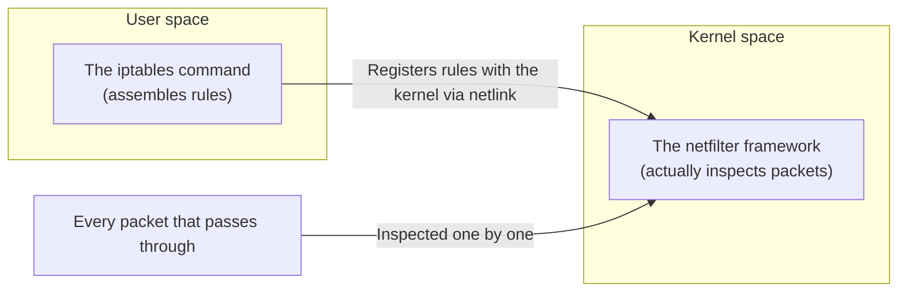
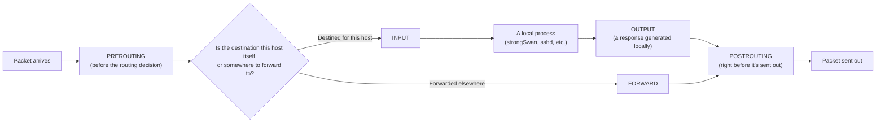

## Introduction

- **What You'll Learn From This Article**: When you stack up `iptables -A INPUT ...`-style commands to build a firewall, what are you actually registering, and where, inside the Linux kernel's **netfilter** framework? What order do packets pass through which chains? What do targets beyond `ACCEPT`/`DROP`, like `MASQUERADE`, actually do?
- **Intended Audience**: Readers who can copy-paste `iptables` commands from a build guide, but can't explain in their own words the difference between `INPUT` and `FORWARD`, or what `MASQUERADE` is actually doing.
- **Estimated Reading Time**: About 18 minutes

This article is part of the [Top 1% Series' full article guide](/en/sitemap). It's a spin-off from the `iptables` commands in the [self-built L2TP/IPsec server hands-on lab](/en/articles/l2tp-ipsec-lab-guide) that open ports for IKE/ESP/L2TP and set up MASQUERADE for clients.

## Prerequisites

- **NAT/NAPT**: A technique for translating source/destination IP addresses and port numbers. Covered in [How NAT/NAPT Works](/en/articles/nat-guide).
- **Kernel space**: The privileged region where the OS's network stack runs. Covered in [User Space, Kernel Space, and TUN/TAP Devices](/en/articles/linux-user-kernel-space-guide).

## Getting the Big Picture

### In a nutshell

**The `iptables` command isn't a program that processes rules directly — it's purely a configuration tool that registers rules with the Linux kernel's `netfilter` packet-filtering mechanism, saying "when a packet like this arrives, handle it like this."** The kernel itself is what actually inspects each packet and decides ACCEPT/DROP; `iptables` has nothing further to do with it once the command finishes running.

## Fundamentals, Thoroughly Explained

### The 5 checkpoints (hook points) a packet passes through

netfilter provides **5 fixed points (hook points)** along the path an IP packet travels through the kernel's network stack, and rules can be applied to every packet passing through each one.

Each command used in the L2TP/IPsec lab can be sorted by which hook it concerns:

| Chain | Packets that pass through it | Use in the lab |
|---|---|---|
| `INPUT` | Packets destined for this server itself | Letting the server itself receive UDP 500/4500/1701 and ESP |
| `FORWARD` | Packets forwarded through this server to somewhere else | Letting L2TP clients' virtual IP range (`10.10.10.0/24`) traffic flow |
| `POSTROUTING` | Packets right before they're sent out | Translating clients' virtual IPs into the server's real IP (MASQUERADE) to send them onto the internet |

Confusing `INPUT` and `FORWARD` leads directly to the classic trap: "I allowed connections to the server itself, but client traffic can't get out" (or the reverse). The core of the distinction between these two chains comes down to: **is it addressed to my own machine, or just passing through on its way somewhere else?**

### Tables: same hook point, sorted by "what to do"

netfilter has multiple **tables**, each with a different role — "filtering (pass/drop)," "address translation," and so on. At a single hook point, rules from multiple tables get evaluated in a fixed order.

| Table | Main purpose | Main chains |
|---|---|---|
| `filter` (default) | Deciding whether to pass or drop a packet | INPUT / FORWARD / OUTPUT |
| `nat` | Translating source/destination addresses | PREROUTING / POSTROUTING / OUTPUT |
| `mangle` | Rewriting header fields (TTL, TOS, etc.) | All chains |
| `raw` | Special handling, e.g., excluding a packet from connection tracking (below) | PREROUTING / OUTPUT |

`sudo iptables -A INPUT -p udp --dport 500 -j ACCEPT` from the lab adds to the `filter` table (the default when no table is specified); `sudo iptables -t nat -A POSTROUTING ... -j MASQUERADE` explicitly targets the `nat` table.

### Rules are evaluated top-to-bottom, and the first match wins

A single chain can hold multiple rules, and **a packet is checked against them from top to bottom; the target (`ACCEPT`/`DROP`/`REJECT`/etc.) of the first matching rule decides that packet's fate.** If no rule matches, the chain's **default policy** (often `DROP` or `ACCEPT`) applies.

- `-A` (append): Adds the rule to the **end** of the chain.
- `-I` (insert): Inserts the rule at the **start** (or a specified position) of the chain.

Order matters because **a broad rule written earlier can shadow a narrower exception written later.** If a "deny everything" rule sits too close to the top, any allow rules written after it never get evaluated at all.

### Connection tracking (conntrack): the real mechanism behind a "stateful" firewall

netfilter includes a subsystem called **conntrack** that tracks the state of connections passing through it. This enables **stateful decisions** — not just "allow packets to this port," but "only allow packets that are part of an already-established connection."

| State | Meaning |
|---|---|
| `NEW` | The first packet of this connection (a brand-new connection) |
| `ESTABLISHED` | A packet belonging to an existing connection where two-way traffic is already flowing |
| `RELATED` | A packet in a separate connection, but related to an existing one (e.g., an FTP data connection) |
| `INVALID` | A packet that doesn't match any tracked connection — malformed or unexpected |

Using this, you can write a safer rule (`-m conntrack --ctstate ESTABLISHED,RELATED -j ACCEPT`) — for example, "only allow `FORWARD` traffic that's a response to something the client initiated, and reject brand-new unsolicited packets from outside." The lab's simple setup skips this, but real-world firewall designs treat this kind of stateful decision as close to mandatory.

## The View from the Top 1% (What Experts See)

### MASQUERADE vs. SNAT: a trade-off over "asking for the IP address every single time"

Two targets translate the source address — `SNAT` and `MASQUERADE` — and while both achieve the same result (letting multiple internal clients share one external IP address to reach the internet), their internals differ.

- **`SNAT`**: You specify the translated source IP address **explicitly, as a fixed value**, with `--to-source <IP>`. It suits servers with a static IP, and since it doesn't need to look up the current IP on every packet, the overhead is marginally lower.
- **`MASQUERADE`**: You don't specify a translated source IP; instead, it **dynamically looks up whatever IP address is currently assigned to the outgoing interface, on every packet**. This is the better fit for environments where the WAN-side IP might change (a home router obtaining an address via DHCP, or a lab environment like this one).

Using `MASQUERADE` in the lab reflects exactly this assumption — a verification environment where the WAN-side IP obtained via DHCP (from PVE or a home router) might change. In a production environment with a confirmed static IP, `SNAT` is the marginally more efficient choice.

### iptables is now often "a compatibility layer wearing nftables' skin"

netfilter now has a newer configuration tool than `iptables`: `nftables`. On many modern distributions (Debian 10+, Ubuntu 20.04+, and others), running the `iptables` command actually goes through a compatibility layer called `iptables-nft`, which converts the rule internally and registers it as an `nftables` ruleset. If `iptables --version` shows `(nf_tables)` in its output, this is what's happening. The rules still look and read the same as classic `iptables`, but **the engine actually inspecting packets in the kernel is nftables** — worth knowing as background for when you eventually migrate to native `nftables` syntax.

## Common Misconceptions and Pitfalls

- **Misconception 1: "Allowing a port in INPUT lets all traffic on that port through."**
  The `INPUT` chain only ever applies to packets destined for this host itself. Traffic bound for a VPN client's virtual IP (the lab's `10.10.10.0/24`) that's forwarded through the server needs a `FORWARD` rule instead.
- **Misconception 2: "Once the firewall ACCEPTs something, later rules stop being evaluated."**
  More precisely: the decision for *that one packet* is finalized. The very next packet to arrive is checked against the whole chain again, starting from the top.
- **Misconception 3: "iptables rules survive a reboot."**
  Rules registered with netfilter live in the kernel's memory, and **by default, they're gone after a reboot**. You need to explicitly persist them — with the `iptables-persistent` package, or `iptables-save`/`iptables-restore`.

## Common Sticking Points (Troubleshooting)

1. **A specific kind of traffic just doesn't get through**: Run `sudo iptables -L -v -n --line-numbers` and check each chain's rules along with a packet counter for each one. If the counter on the rule you expected stays at 0, some earlier rule in the chain is likely deciding the packet's fate first.
2. **You added a rule, but it doesn't seem to take effect**: Double-check you targeted the right table (a missing `-t nat`, for example) and chain name.
3. **The firewall config is gone after a reboot**: As above, this is most likely because rule persistence (`iptables-persistent` or similar) isn't set up. Confirm with `sudo iptables -L` whether the current ruleset is actually empty.
4. **MASQUERADE is set up, but clients still can't reach the internet**: Check whether `net.ipv4.ip_forward` is enabled (see the [sysctl article](/en/articles/linux-sysctl-guide)). Even if the `FORWARD` chain allows it, if the kernel's IP forwarding itself is disabled, packets never get forwarded in the first place.

### Prevention and Long-Term Fixes

- Serialize the whole ruleset with `iptables-save` and track its history with a configuration management tool or git, instead of relying on an order-dependent, manually-run sequence of commands.
- Default each chain's policy to `DROP`, and explicitly `ACCEPT` only the traffic you actually need — a whitelist-first baseline.
- On newer distributions, consider migrating to native `nftables` and discuss as a team whether continuing to depend on the `iptables-nft` compatibility layer is worth it.

## Summary

- The `iptables` command is a configuration tool that registers rules with the Linux kernel's `netfilter`; the kernel itself is what actually inspects each packet.
- Packets pass through 5 hook points along their path (PREROUTING/INPUT/FORWARD/OUTPUT/POSTROUTING), and the split between `INPUT` (destined for this host) and `FORWARD` (just passing through) is the most fundamental organizing axis.
- Rules are evaluated top-to-bottom, with the first match deciding the outcome, so rule ordering directly determines whether a firewall design is correct.
- `MASQUERADE` is source-address translation for environments with a dynamic WAN IP; `SNAT` is marginally more efficient once the IP is confirmed static.

**Starting Today**
1. When designing firewall rules, start by asking "is this destined for the host itself, or just passing through?" and let that decide whether it belongs in `INPUT` or `FORWARD`.
2. After adding or changing a rule, get in the habit of confirming with `iptables -L -v -n` that packets are actually matching as intended, by watching the counters.

## References

- [iptables(8) — Linux manual page](https://man7.org/linux/man-pages/man8/iptables.8.html)
- [Netfilter/iptables project home](https://www.netfilter.org/)
- [nftables wiki — What is nftables?](https://wiki.nftables.org/)
