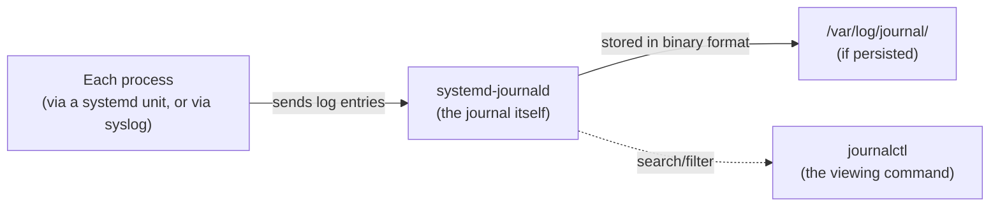
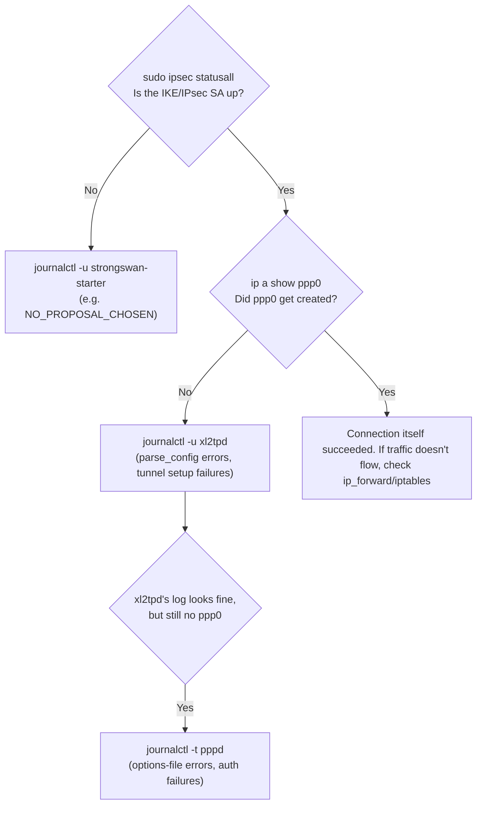

## Introduction

- **What You'll Learn From This Article**: When something on Linux won't start or won't connect, how to use `journalctl` to actually get to the root cause — not just the commands, but the *method*: which logs to check, and in what order. You'll walk through several real errors that came up while building the [L2TP/IPsec hands-on lab](/en/articles/l2tp-ipsec-lab-guide), following the same investigative process you'd use in practice.
- **Intended Audience**: Anyone who's seen `systemctl status` report an error but hasn't turned "find the cause" into a repeatable process, or who's been unsure which log to check first when several processes work together (like a VPN server stack).
- **Estimated Reading Time**: About 15 minutes

This article is part of the [Top 1% Series' full article guide](/en/sitemap). It's a deep-dive spun off from debugging xl2tpd/pppd errors in the [L2TP/IPsec hands-on lab](/en/articles/l2tp-ipsec-lab-guide).

## Prerequisites

- **[What Is a Daemon?](/en/articles/linux-daemon-guide)**: Background on how systemd starts and supervises daemons.
- **Standard output / standard error**: The two channels a program normally writes messages to. journalctl can search and store log entries that arrive via several such channels in one place.

## Getting the Big Picture

### In a nutshell

**journalctl is the search command for the "journal" — a binary-format log store managed by systemd.** Instead of `grep`-ing through a plain text file like `/var/log/syslog`, you can filter structured log entries directly by service name, time range, priority (severity), and the process that emitted them.



`journald` automatically captures the stdout/stderr of any process started as a systemd unit, but it also collects **messages sent via syslog** (from programs calling `syslog()`, including old-style ones that were never converted into systemd units) into the very same journal. This "everything ends up in one place, regardless of how it started" property is exactly why `-u` and `-t` exist as separate options, as you'll see below.

## Fundamentals, Thoroughly Explained

### `-u`: Filter by systemd unit

The option you'll reach for most often is `-u`, which filters to a specific systemd unit (service).

```bash
sudo journalctl -u xl2tpd
```

For a process directly started and managed by systemd, like `xl2tpd` via `systemctl start xl2tpd`, this gets you everything you need.

### `-t`: Filter by syslog identifier (tag) — for processes that aren't systemd units

Here's an easy trap to fall into. `xl2tpd` is managed as a systemd unit, but **`pppd`, which `xl2tpd` launches internally, is not** (there's no unit like `systemctl status pppd`). `pppd` is just an ordinary process that happens to log via syslog. In cases like this, filter by the syslog identifier (the tag attached to the program's name) using `-t` instead of `-u`.

```bash
sudo journalctl -t pppd -n 30 --no-pager
```

`-u` only covers the process systemd itself is managing — logs from a further child process that service launches internally may not show up under that filter. If you're sure something's failing but `-u` shows nothing that looks relevant, check whether that service launches another program internally (via `ps`, or the docs), and try filtering by `-t` as well.

### `-f`: Follow it live

```bash
sudo journalctl -u xl2tpd -f
```

`-f` (follow) behaves like `tail -f`, streaming new log lines as they arrive. When you want to see exactly what happens the moment you do something (attempt a connection, restart a service), starting `-f` beforehand means you won't miss the timing.

### `-n` and `--no-pager`: Just the last N entries, with no pager

```bash
sudo journalctl -u xl2tpd -n 30 --no-pager
```

`-n 30` limits the output to the last 30 entries. `--no-pager` skips the interactive pager (a `less`-style scrolling viewer) and streams straight to stdout instead. Use `--no-pager` whenever you want to copy-paste output directly from an SSH session, or pipe it into another command.

### `-xe`: The latest errors, with systemd's own context attached

```bash
sudo systemctl status xl2tpd.service
```

When a service fails to start, you'll usually see a suggestion to run `journalctl -xeu <unit name>`.

```bash
sudo journalctl -xeu xl2tpd.service
```

`-e` jumps to the end (the most recent entries), and `-x` appends systemd's own supplementary explanations ("common causes of this error are...") where it has them. That's more of a head start toward understanding what happened than staring at the raw log alone.

<details>
<summary>Some environments don't persist the journal</summary>

Depending on the distro and its configuration, the journal may live only in memory and vanish on reboot. To keep logs across reboots, create `/var/log/journal` (`sudo mkdir -p /var/log/journal` then `sudo systemctl restart systemd-journald`) to persist it to disk.

</details>

## In Practice: Tracing L2TP/IPsec Hands-On Errors with journalctl

The [L2TP/IPsec hands-on lab](/en/articles/l2tp-ipsec-lab-guide) involves three independent processes working together: strongSwan (IPsec), xl2tpd (L2TP), and pppd (PPP). Since a connection comes up in that exact order ([IKE → L2TP → PPP](/en/articles/l2tp-ipsec-guide)), **troubleshooting in that same order is the most efficient approach.**



1. **`sudo ipsec statusall`**: Start by checking whether the IKE/IPsec SA is up. If not, check `journalctl -u strongswan-starter -f` for mismatched proposals or an error like `NO_PROPOSAL_CHOSEN`.
2. **`sudo journalctl -u xl2tpd`**: If the IPsec SA is up but `ppp0` never shows up, check xl2tpd's own log next. An error like `parse_config: line NN: data '...'` points at a syntax problem in that line of `/etc/xl2tpd/xl2tpd.conf` — often a leftover `;` at the start of the line.
3. **`sudo journalctl -t pppd -n 30 --no-pager`**: If xl2tpd's log looks clean but the connection still doesn't come up, check the `pppd` child process it launches. Messages like `unrecognized option` (a typo in the options file, or an option that doesn't work in this environment) or `couldn't find any suitable secret` (no matching entry in `chap-secrets`) almost always only show up here.

**Check logs on both the server and the client.** In a setup like L2TP/IPsec, where the same three processes run on both ends, "the client side looks fine but it still won't connect" often turns out to be explained only by something in the server's logs. Lining up log entries from both hosts around the same timestamp makes it much easier to pin down which side the process is actually stalling on.

## The View from the Top 1% (What Experts See): Tips for Searching Error Messages

When you get a specific error message, like `unrecognized option 'crtscts'`, searching for that exact string is usually the fastest path to a fix. But "silent failures" — where a process just fails to start with no clear error message at all (like the `lock` option case, which produces no obvious complaint) — have a hard limit to how far `journalctl` alone can take you. In those cases, you may need the more tedious approach of commenting out suspect settings one at a time and restarting, essentially binary-searching for the one that fixes things. Combining what the logs actually tell you with deliberate experiments to narrow things down is what makes root-cause investigation repeatable rather than lucky.

## Summary

- `journalctl -u <unit name>` gets you logs for processes systemd directly manages; `journalctl -t <identifier>` gets you logs for child processes (like pppd) that aren't systemd units themselves.
- `-f` follows in real time, `-n` limits the entry count, `--no-pager` skips the interactive pager, and `-xe` shows the latest entries with systemd's supplementary context.
- In a system made of several cooperating processes, deciding which log to check, in what order, and on which host, based on the order components are supposed to come up in, is what makes root-cause investigation efficient.

**Starting Today**
1. When you hit an error, start with the `-xeu` overview `systemctl status` suggests, then identify the processes actually involved and decide `-u` vs. `-t` based on whether each one is a systemd unit — keep that as a repeatable routine.
2. For failures spanning multiple hosts and processes, knowing the order components are supposed to come up in is your map for where to start looking.

## References

- [journalctl(1) — Linux manual page](https://man7.org/linux/man-pages/man1/journalctl.1.html)
- [systemd-journald.service(8) — Linux manual page](https://man7.org/linux/man-pages/man8/systemd-journald.service.8.html)
- [xl2tpd | Linux man-pages](https://man7.org/linux/man-pages/man8/xl2tpd.8.html)
