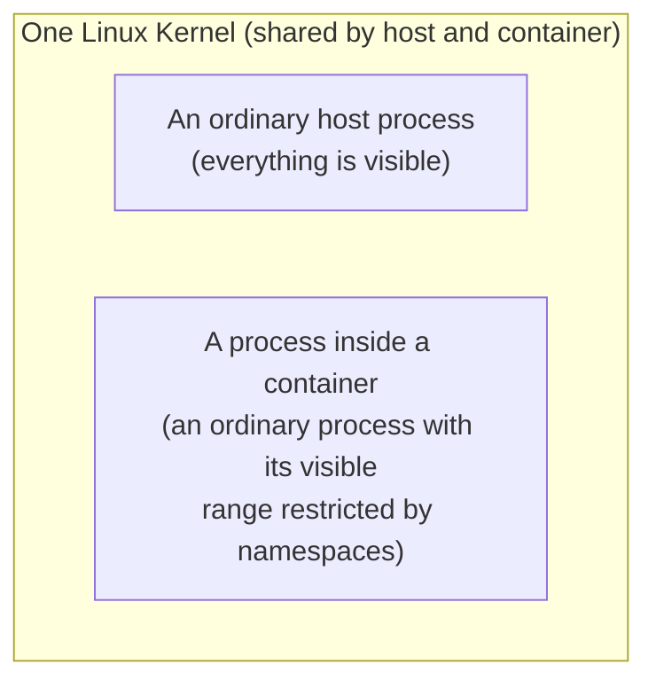

## Introduction

- **What You'll Learn From This Article**: Building on the premise you learned in [User Space vs. Kernel Space](/en/articles/linux-user-kernel-space-guide) — that a process operates through the kernel — experience, using the `unshare` command to assemble namespaces with your own hands, one at a time, that **"container" technology isn't a dedicated virtualization mechanism — it's merely a combination of a feature the Linux kernel has had all along, called a namespace.**
- **Intended Audience**: Readers who use containers like Docker or Podman daily, but can't explain exactly what mechanism isolates "inside the container" from the host.
- **Estimated Reading Time**: About 25 minutes, including the hands-on exercise

This article is part of the [Top 1% Series Complete Article Guide](/en/sitemap), and the nineteenth article in the [Linux Infrastructure Series](/en/sitemap#series-list). You can follow along with one of the Ubuntu Server environments set up in the [Hands-On Prep Manual](/en/articles/handson-prep-guide).

## Prerequisite Knowledge

- **User Space and Kernel Space**: The premise covered in [User Space vs. Kernel Space, and How TUN/TAP Devices Work](/en/articles/linux-user-kernel-space-guide) — that a process operates under the kernel's management.

## Getting the Big Picture

Picturing "inside a container, a separate OS is running" makes everything that follows impossible to explain. In reality, a process inside a container runs on the exact same single Linux kernel as the host.



## Hands-On Steps

### Step 1: Check the Current Process List With No Restrictions

```bash
ps aux | wc -l
```

**Output (example):**

```
87
```

**This shows the count of every process running on the host.**

### Step 2: Separate a PID Namespace and Confirm How Processes Appear

```bash
sudo unshare --pid --fork --mount-proc /bin/bash
ps aux
```

**Output:**

```
USER       PID %CPU %MEM    VSZ   RSS TTY      STAT START   TIME COMMAND
root         1  0.0  0.1   8376  5244 pts/0    S    12:00   0:00 /bin/bash
root         6  0.0  0.1  10632  3328 pts/0    R+   12:00   0:00 ps aux
```

**The 87 processes you saw a moment ago are now visible as only 2.** This isn't because those processes actually terminated — it's because **this `bash` entered a new PID namespace, and processes outside that namespace became entirely invisible to it.** Notice, too, that **inside this new namespace, bash's own PID is "1."** PID 1 normally belongs exclusively to the host's overall init process, but **once a namespace is separated, it can exist separately as "the first process" within just that namespace.**

<details>
<summary>Why Does "Merely Making Invisible" Achieve Isolation?</summary>

**A namespace isn't a mechanism for "duplicating resources" — it's a mechanism for "withholding certain kinds of information from a particular process (giving it a different viewpoint)."** None of the host's 87 processes actually changed at all. Only the new bash process created by `unshare` was given a special viewpoint: "my PID namespace is separate, so nothing except myself and my child processes is visible at all." This idea of "restricting the viewpoint" is the real identity behind a container's apparent isolation.

</details>

### Step 3: Separate a Mount Namespace and Confirm How the Filesystem Appears

Exit the original shell once, and create a new mount namespace together with it this time.

```bash
exit
sudo unshare --pid --fork --mount-proc --mount /bin/bash
mount -t tmpfs tmpfs /mnt
echo "visible only inside this namespace" > /mnt/secret.txt
cat /mnt/secret.txt
```

**Output:**

```
visible only inside this namespace
```

Open a separate terminal and check the same path from the host side.

```bash
ls /mnt/
cat /mnt/secret.txt
```

**Output:**

```
cat: /mnt/secret.txt: No such file or directory
```

**The mount and file creation you performed against `/mnt` inside the namespace never got reflected on the host side at all.** This is because **a process with a separated mount namespace holds its own, independent mount table.** A container's filesystem structure appearing different from the host's is a direct application of this exact mechanism.

## What a Pro Sees Here (Top 1% Understanding)

### "Container Technology" Isn't a New Concept — It's "a Combination of Existing Features"

As you confirmed in this hands-on, **container technology is the result of applying several individual features the Linux kernel has had all along — PID namespaces, mount namespaces, network namespaces — all together, against a single process.** Tools like Docker and Podman are nothing more than an **orchestration layer**, automating and conveniently wrapping the exact operations you performed manually with `unshare` here, together with resource limiting via cgroups. **Understanding "a container is a dedicated lightweight VM" overlooks an important security premise: the host and the container share the exact same kernel** (a premise where [a kernel vulnerability can potentially break a container's isolation](/en/articles/linux-user-kernel-space-guide)). A top-1% engineer understands a container not as "a magic isolation device," but as "a combination of viewpoint restrictions called namespaces."

## Common Misconceptions and Pitfalls

- **Misconception 1: "Inside a container, a separate Linux kernel from the host is running."**
  A process inside a container runs on the exact same single Linux kernel as the host. It only looks separate because namespaces restrict its viewpoint.
- **Misconception 2: "Separating a PID namespace actually stops the host's processes."**
  Nothing about the host's processes changes at all. They've simply become invisible from the process inside the new namespace.
- **Misconception 3: "A namespace created with unshare is exactly the same thing as a Docker container."**
  A Docker container combines several namespaces (PID, mount, network, and more) with cgroups (resource limiting), and further automates image management and network configuration. `unshare` is a command for manually experiencing the individual namespace features underlying that foundation.

## Troubleshooting Perspective

1. **You can operate the host's processes from inside a container**: Check whether the PID namespace actually got separated correctly at startup.
2. **A container's files are gone after a restart**: Any change made inside a mount namespace gets lost along with the container's termination, unless it was explicitly persisted to a volume.
3. **The `unshare` command fails with a permission error**: Creating a PID or mount namespace normally requires root privileges (`sudo`).

## Summary

- A container isn't a dedicated virtualization mechanism — it's an ordinary single process running on the exact same Linux kernel as the host.
- A namespace isn't a mechanism for "duplicating resources" — it's a mechanism for "withholding certain information from a particular process," restricting its viewpoint.
- Separating a PID namespace makes external processes entirely invisible from inside that namespace, and gives its own process the PID "1."
- Separating a mount namespace means any mount operation or file change made inside it never gets reflected on the host side.

**Takeaways to Apply Today**
1. When considering a container's security, always keep the premise "it shares the kernel with the host" in mind.
2. Whenever you run into Docker/Podman behavior you don't understand, build the habit of digging one layer deeper to ask "which kind of namespace is restricting this?"

## References

- [namespaces(7) Manual Page](https://man7.org/linux/man-pages/man7/namespaces.7.html)
- [unshare(1) Manual Page](https://man7.org/linux/man-pages/man1/unshare.1.html)
