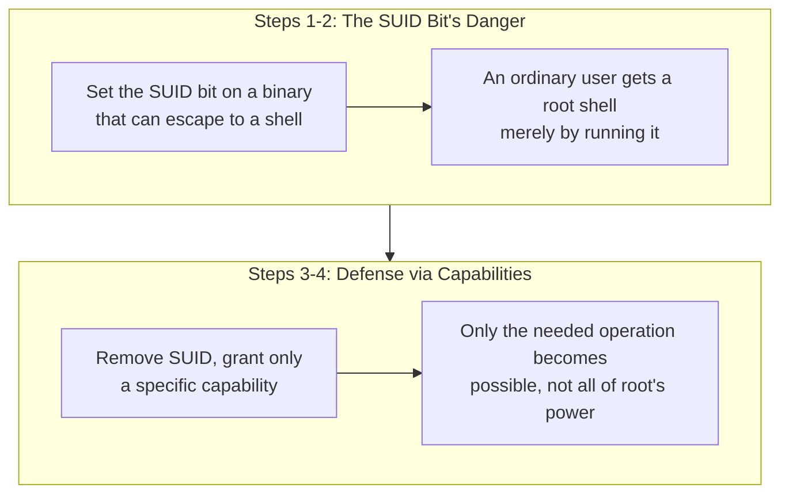

## Introduction

- **What You'll Learn From This Article**: Building on the read/write/execute permission mechanism you learned in [What Is a Permission (chmod)?](/en/articles/linux-file-permissions-guide), reproduce — inside a safe, controlled test environment — the danger that **a binary with the SUID bit set becomes a stepping stone letting an ordinary user seize root privileges, merely by having a means of escaping to a shell**, and confirm the defense achieved by using **Linux Capabilities** to grant only the minimum necessary privilege.
- **Intended Audience**: Readers who understand setting permissions with `chmod`, but can't concretely explain why the SUID bit is considered more dangerous than ordinary permission settings.
- **Important Note**: **This hands-on exercise is for educational and defensive purposes — to strengthen the defenses of an environment you yourself control.** Never run this procedure against someone else's live environment without authorization. The test environment used here only ever performs operations against a server you set up yourself, and contains no attack procedure directed at any third-party system whatsoever.
- **Estimated Reading Time**: About 22 minutes, including the hands-on exercise

This article is part of the [Top 1% Series Complete Article Guide](/en/sitemap), and the twentieth article in the [Linux Infrastructure Series](/en/sitemap#series-list). You can follow along with one of the Ubuntu Server environments set up in the [Hands-On Prep Manual](/en/articles/handson-prep-guide).

## Prerequisite Knowledge

- **Permission Fundamentals**: The read/write/execute permission mechanism covered in [What Is a Permission (chmod)?](/en/articles/linux-file-permissions-guide).

## Getting the Big Picture

This hands-on covers two stages.



## Hands-On Steps

### Step 1: Set the SUID Bit on a Binary That Can Escape to a Shell

For testing, create an ordinary user and prepare a demo binary.

```bash
sudo useradd -m testuser
sudo cp /usr/bin/find /usr/local/bin/find-suid-demo
sudo chown root:root /usr/local/bin/find-suid-demo
sudo chmod u+s /usr/local/bin/find-suid-demo
ls -l /usr/local/bin/find-suid-demo
```

**Output (relevant part):**

```
-rwsr-xr-x 1 root root ... /usr/local/bin/find-suid-demo
```

**The `s` in the permission display shows the SUID bit is set.** The `find` command, [per GNU findutils' specification](/en/articles/linux-find-guide), has a feature — the `-exec` option — that can run any arbitrary command.

### Step 2: Obtain a Root Shell as an Ordinary User

```bash
su - testuser
/usr/local/bin/find-suid-demo . -maxdepth 0 -exec /bin/sh -p \; -quit
whoami
```

**Output:**

```
root
```

**`testuser`, an ordinary user, just obtained a root-privileged shell.** This is the result of abusing the mechanism where [a binary with the SUID bit set runs with the privileges of the file's owner (root, here), not the privileges of the user who executed it](/en/articles/linux-file-permissions-guide). The `find` command itself is a harmless, ordinary command, but **this concretely demonstrates how dangerous it is to casually set the SUID bit on a binary that has the ability to run arbitrary commands.**

<details>
<summary>Why a Command Like `find` Falls Into This Problem</summary>

SUID is considered dangerous **whenever a binary's own functionality includes a means of invoking a shell or an arbitrary command.** `find`'s `-exec`, `vim`'s `:!`, `less`'s `!`, and many other seemingly harmless standard commands actually have this exact property. **The judgment call "I just want this one operation to run with root privileges, so I'll casually set SUID" leads directly to this kind of broad privilege seizure, unintended by the binary's own author.**

</details>

### Step 3: Remove SUID and Grant Only the Minimum Necessary Privilege via Linux Capabilities

First, disable the SUID binary created in Step 1.

```bash
exit
sudo chmod u-s /usr/local/bin/find-suid-demo
```

Next, configure Capabilities on a separate demo program that only needs **the privilege to bind to a specific network port.**

```bash
cat << 'EOF' > /tmp/bind_demo.py
import socket
s = socket.socket(socket.AF_INET, socket.SOCK_STREAM)
s.bind(("0.0.0.0", 80))
print("Bound to port 80 successfully")
EOF
sudo cp /usr/bin/python3 /usr/local/bin/python3-cap-demo
sudo setcap 'cap_net_bind_service=+ep' /usr/local/bin/python3-cap-demo
getcap /usr/local/bin/python3-cap-demo
```

**Output:**

```
/usr/local/bin/python3-cap-demo cap_net_bind_service=ep
```

### Step 4: Confirm Only the Privileged Operation Is Allowed, as an Ordinary User

```bash
su - testuser
/usr/local/bin/python3-cap-demo /tmp/bind_demo.py
whoami
```

**Output:**

```
Bound to port 80 successfully
testuser
```

**Still as the ordinary user `testuser`, you only succeeded at binding to a port below 1024, something that normally requires root privileges.** `whoami`'s result also still shows `testuser`, not `root`. **By granting just one specific privilege, `cap_net_bind_service`, you confirmed that the needed operation alone could be achieved, without handing over the entirety of root's power.**

## What a Pro Sees Here (Top 1% Understanding)

### Never Choose SUID Just Because "root Privilege Is Needed"

The biggest lesson from this hands-on is that **casually choosing the SUID bit, just because "this operation needs root privilege," ends up letting every other unrelated feature of that binary also run with root privilege.** **Linux Capabilities split root's power into meaningful units — like `cap_net_bind_service` (binding to a privileged port) and `cap_net_raw` (using a raw socket) — letting you grant only the privilege you actually need, individually.** This shares the same underlying idea as the principle of least privilege covered in [AWS's IAM Policy Evaluation Logic](/en/articles/aws-iam-policy-evaluation-guide): **"carve out and hand over only what's actually needed, rather than all-or-nothing privilege" — a way of thinking that runs through privilege design in general.** A top-1% engineer avoids the judgment call "there's not enough privilege, so just run it as root for now," and always asks instead, concretely, "what privilege is actually needed here?"

## Common Misconceptions and Pitfalls

- **Misconception 1: "The SUID bit grants root privilege for just one specific operation."**
  The SUID bit grants root-privileged execution for the entire binary. If that binary has a shell-invocation or arbitrary-command feature, root privilege becomes usable through that feature too.
- **Misconception 2: "Setting Capabilities makes that binary run fully with root privilege."**
  Capabilities grant only an individual, specific privilege, like `cap_net_bind_service` — never the entirety of root's power.
- **Misconception 3: "This problem is a defect specific to the find command."**
  The find command itself has no defect. The real problem is the operational judgment call of casually setting SUID on a binary that has the ability to invoke an arbitrary command.

## Troubleshooting Perspective

1. **You want to check whether an unintended SUID binary exists on a server**: `find / -perm -4000 -type f 2>/dev/null` lists every file with the SUID bit set.
2. **A binary you configured Capabilities on gets a permission error**: Check with `getcap` whether the intended capability is actually configured correctly. Note that recopying a binary loses its configured capabilities.
3. **Removing SUID broke an existing operation**: Reconfirm whether that operation genuinely needed SUID, and consider switching to a narrower-scoped alternative, like Capabilities.

## Summary

- A binary with the SUID bit set, if it has a feature that can run a shell or an arbitrary command, becomes a stepping stone for an ordinary user to seize root privilege.
- This danger isn't a defect specific to the find command — it's a structural risk inherent to the SUID mechanism itself.
- Linux Capabilities split root's power into meaningful units, letting you grant only the privilege actually needed, individually.
- Rather than choosing SUID just because "root privilege is needed," it matters to concretely identify what privilege is genuinely necessary.

**Takeaways to Apply Today**
1. Whenever you run into an operation that needs root privilege, first consider whether Capabilities, rather than SUID, could achieve it.
2. Include checking for unintended SUID binaries as part of a server's regular audit.

## References

- [capabilities(7) Manual Page](https://man7.org/linux/man-pages/man7/capabilities.7.html)
- [GTFOBins - find](https://gtfobins.github.io/gtfobins/find/)
