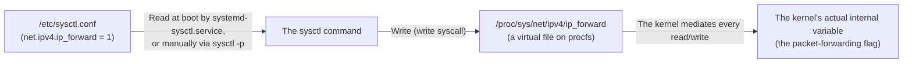

## Introduction

- **What You'll Learn From This Article**: Why writing a single line like `net.ipv4.ip_forward = 1` into `/etc/sysctl.conf` actually changes the kernel's packet-forwarding behavior — the mechanics of **procfs**, a virtual filesystem underlying this, how it maps to the `sysctl` command, and the classic pitfall of "I edited it but nothing changed."
- **Intended Audience**: Readers who know the routine of appending a parameter to `/etc/sysctl.conf` and running `sysctl -p`, but can't explain why the contents of a text file change the kernel's actual behavior.
- **Estimated Reading Time**: About 14 minutes

This article is part of the [Top 1% Series' full article guide](/en/sitemap). It's a spin-off from the point in the [self-built L2TP/IPsec server hands-on lab](/en/articles/l2tp-ipsec-lab-guide) where `net.ipv4.ip_forward = 1` and other values are set in `/etc/sysctl.conf`.

## Prerequisites

- **Kernel space and system calls**: The mechanism a program uses to invoke kernel functionality. Covered in [User Space, Kernel Space, and TUN/TAP Devices](/en/articles/linux-user-kernel-space-guide).
- **Filesystems**: The usual way disk data is organized into files and directories, normally backed by real disk storage.

## Getting the Big Picture

### In a nutshell

**procfs (`/proc`) is a "virtual" filesystem with no actual backing on disk — the kernel generates its contents on the spot, the moment they're accessed.** The subtree under `/proc/sys` presents runtime kernel tuning parameters disguised as "files": reading one shows the current value, and writing to one changes the kernel's actual internal value **immediately**. The `sysctl` command and `/etc/sysctl.conf` are nothing more than convenient front ends for reading and writing this `/proc/sys` tree.



## Fundamentals, Thoroughly Explained

### procfs isn't "a file on disk"

Running `ls /proc` shows numbered directories (corresponding to running processes' PIDs) and files like `cpuinfo` and `meminfo`. None of these actually live on any disk partition you'd see with `df`. **The kernel simply formats whatever internal data it's currently holding into something that looks like a file, every time something accesses a path under `/proc`.** The numbers in `cat /proc/meminfo` change on every run not because you're reading a stale cached file, but because it's **reflecting the kernel's internal state in real time, every single time**.

### How `/proc/sys` maps to sysctl keys

Within `/proc`, the parameters that can actually **change** kernel behavior (i.e., are writable) live under `/proc/sys`. This is a hierarchical directory tree with individual parameters as files at the leaves.

```bash
cat /proc/sys/net/ipv4/ip_forward
```

The `sysctl` command treats this path as a dot-separated "key" — it's purely syntactic sugar for reading and writing this tree.

| `/proc/sys` path | Corresponding `sysctl` key |
|---|---|
| `/proc/sys/net/ipv4/ip_forward` | `net.ipv4.ip_forward` |
| `/proc/sys/net/ipv4/conf/all/accept_redirects` | `net.ipv4.conf.all.accept_redirects` |

In other words, `sysctl net.ipv4.ip_forward` is roughly equivalent to `cat /proc/sys/net/ipv4/ip_forward`, and `sysctl -w net.ipv4.ip_forward=1` is roughly equivalent to `echo 1 > /proc/sys/net/ipv4/ip_forward` (as root). Remembering that a key's `.` separators map directly to a path's `/` separators lets you guess the file location for a parameter you've never seen before.

<details>
<summary>What are `net.ipv4.conf.all.accept_redirects`/`send_redirects` (set in the L2TP/IPsec lab)?</summary>

`accept_redirects` controls whether to trust an ICMP redirect message from another router ("that packet would take a shorter path via this other router") and rewrite the routing table accordingly. Trusting these blindly opens the door to a man-in-the-middle-style attack where a malicious host sends forged ICMP redirects to hijack routing, so the safe default is `0` (disabled). `send_redirects` is the flip side — whether this host itself sends ICMP redirects — and it's appropriate to set to `0` on a host like a VPN server that isn't meant to act as an ordinary LAN router.

</details>

### Why editing `/etc/sysctl.conf` alone doesn't take effect

This is the biggest pitfall. **The kernel has no idea that a file called `/etc/sysctl.conf` even exists.** This file is purely an input list that the `sysctl` command (or `systemd-sysctl.service`, run automatically at boot) reads and then writes into `/proc/sys` — either at boot, or whenever explicitly told to.

- At boot, `systemd-sysctl.service` reads `/etc/sysctl.conf` and `/etc/sysctl.d/*.conf` and automatically applies them to `/proc/sys`.
- Editing `/etc/sysctl.conf` on a running system only changes **the file's contents** — the kernel's actual behavior doesn't change at all. To apply it, you either reboot, or explicitly run:

```bash
sudo sysctl -p
```

This command does nothing more than "read `/etc/sysctl.conf` and write each line into the corresponding file under `/proc/sys`," all in one batch.

### `/etc/sysctl.conf` vs. `/etc/sysctl.d/`

Modern distributions recommend a **drop-in** style directory, `/etc/sysctl.d/*.conf`, alongside (or instead of) the single `/etc/sysctl.conf`. You can add per-package or per-application files individually (e.g., `/etc/sysctl.d/99-vpn-lab.conf`), read in filename-sorted order (usually controlled with a numeric prefix), avoiding the risk of hand-editing one giant `sysctl.conf` into a tangle of conflicting settings.

## The View from the Top 1% (What Experts See)

### The procfs-style trade-off: "immediate but not persistent" vs. "persistent but not immediate"

Writing directly to `/proc/sys` takes effect on the running kernel instantly, but reverts to the kernel's default on reboot (**immediate, but not persistent**). Writing to `/etc/sysctl.conf`, on the other hand, persists across reboots automatically, but **doesn't affect the currently running kernel just by being written** (**persistent, but not immediate**). The standard practice in production is to always treat these as a pair when changing a parameter: use `sysctl -w` to confirm the effect right now, and also write it to `/etc/sysctl.d/` to guarantee the same state after the next boot.

### procfs is "an API wearing the skin of a readable/writable file"

Reading and writing files under `/proc/sys` isn't really file I/O — it's direct access to internal kernel variables. The advantage of this design is its generality: **you can read and write kernel internal state using nothing but `cat`/`echo` or the standard file-handling functions of any programming language, with no dedicated program or library required.** This is a real-world example of the UNIX philosophy ("everything is a file") — the acts of "writing a config file" and "a program calling an API" end up going through the exact same interface (a file) within Linux. Once you internalize this idea, other virtual filesystems like `sysfs` (`/sys`, device info) and `cgroupfs` (`/sys/fs/cgroup`, resource limits) become easy to read the same way.

## Common Misconceptions and Pitfalls

- **Misconception 1: "Saving sysctl.conf applies the setting."**
  Saving the file alone does nothing. You need a separate "apply" step — running `sysctl -p` (or rebooting).
- **Misconception 2: "Files under /proc consume disk space."**
  procfs is a virtual filesystem and doesn't actually consume disk space measured by `du` or `df`. The kernel generates its contents dynamically from in-memory data on every access.
- **Misconception 3: "sysctl only lets you change network-related settings."**
  Beyond `net.*`, `sysctl` reaches broad areas of kernel behavior — memory management (`vm.*`), the maximum number of processes (`kernel.pid_max`), the file descriptor limit (`fs.file-max`), and more.

## Common Sticking Points (Troubleshooting)

1. **You wrote the config, but routing/forwarding doesn't work**: Check the **actual current value** with `sysctl net.ipv4.ip_forward`. If the file's contents don't match the actual value, suspect either a missed `sysctl -p`, or another file under `/etc/sysctl.d/` overriding it afterward.
2. **`sysctl -p` fails with something like "No such file or directory"**: This happens when the kernel module corresponding to the given key hasn't been loaded yet (e.g., parameters for certain network protocols only appear under `/proc/sys` once the relevant module is loaded).
3. **Multiple config files conflict on the same key**: Files under `/etc/sysctl.d/` are read in filename-sorted order, and **whichever file is read last wins**. Running `sysctl --system` shows exactly which files were read, in what order, and which value was ultimately applied.

### Prevention and Long-Term Fixes

- Split production sysctl parameters into purpose-named files under `/etc/sysctl.d/*.conf` rather than one monolithic `/etc/sysctl.conf`, and codify them with a configuration management tool (like Ansible).
- Always include running `sysctl -p` (or `sysctl --system`) after a parameter change in your runbooks or provisioning scripts, so you never end up in a "file written but not applied" state.
- For security-relevant parameters (like `accept_redirects`), keep a list of anything changed from the default, along with the reason.

## Summary

- `/proc` is a virtual filesystem (procfs) with no backing on disk — it reflects the kernel's internal state on the spot, every time it's accessed.
- `/proc/sys` holds parameters that can actually change kernel behavior; a `sysctl` key (dot-separated) maps directly to this path (slash-separated).
- `/etc/sysctl.conf` isn't read directly by the kernel — it's only an input list for `systemd-sysctl.service` or `sysctl -p` to apply to `/proc/sys`, so editing it has no effect on a running kernel until applied.
- procfs is "an API wearing the skin of a readable/writable file" — a real-world example of the UNIX philosophy that lets you manipulate kernel internal state with no dedicated tooling.

**Starting Today**
1. When you change a sysctl parameter, don't stop at saving the file — build the habit of treating `sysctl -p` (or confirming the actual value with `sysctl <key>`) as part of the same step.
2. When you encounter an unfamiliar sysctl key, get in the habit of translating its dots to slashes to guess the path under `/proc/sys`, and confirming the current value with `cat`.

## References

- [sysctl(8) — Linux manual page](https://man7.org/linux/man-pages/man8/sysctl.8.html)
- [sysctl.d(5) — Linux manual page](https://man7.org/linux/man-pages/man5/sysctl.d.5.html)
- [proc(5) — Linux manual page](https://man7.org/linux/man-pages/man5/proc.5.html)
