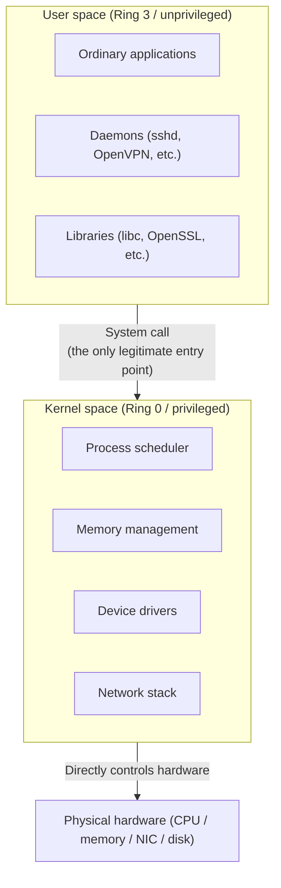
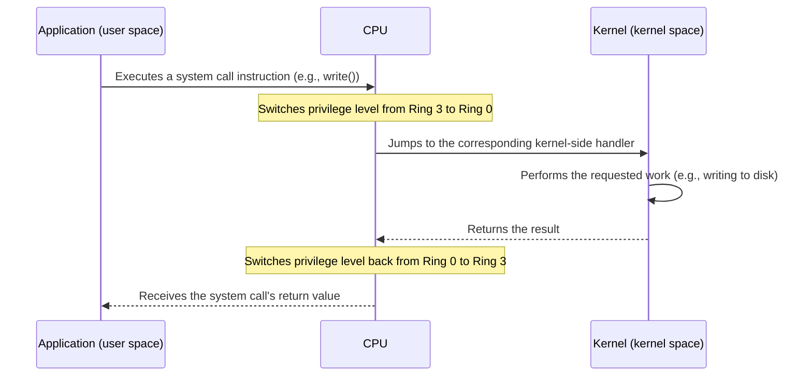
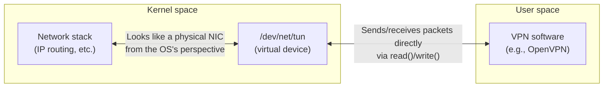

## Introduction

- **What You'll Learn From This Article**: Why and how Linux separates user space from kernel space, how the system call — the mechanism for crossing that boundary — actually works, and how the TUN/TAP device, which lets a user-space program behave as if it owns a physical network card, is built on top of that boundary.
- **Intended Audience**: This article is aimed at infrastructure engineers involved in building servers and virtual networking environments who've heard the terms "user space" and "kernel space" but can't concretely explain what actually separates the two, or how VPN software uses a TUN/TAP device.
- **Estimated Reading Time**: About 18 minutes

This article is part of the [Top 1% Series' full article guide](/en/sitemap).

## Prerequisites

- **Process**: The running instance of a program. Covered in more detail in [What Is a Daemon?](/en/articles/linux-daemon-guide).
- **CPU**: The processing unit that executes instructions. CPUs have a notion of "privilege level," which progressively restricts what instructions can be executed.
- **Memory space (address space)**: The numbering scheme a process uses to see "what's located where in memory." Modern OSes give each process its own independent virtual memory space.

## Getting the Big Picture

### In a Nutshell

**Kernel space is the privileged region where the OS's core processing — hardware control, memory management, process scheduling, and so on — runs, while user space is the region, with restricted direct access to hardware, where ordinary applications run.** The whole point of strictly separating the two is to **prevent a bug or crash in an ordinary application from directly damaging the OS as a whole or the hardware underneath it.**

An ordinary application isn't allowed to directly control hardware such as a disk or a network card. **If it needs anything done that touches hardware, it must ask the kernel to do it on its behalf** — and the mechanism for making that request is the system call, described next.

## The Fundamentals, Explained Thoroughly

### Why the Separation Exists: The CPU's Privilege Levels

This separation isn't just a software convention — it's enforced by **a privilege-level mechanism built into the CPU hardware itself** (on x86, this is the notion of "rings," Ring 0 through Ring 3).

- **Ring 0 (kernel mode)**: The most privileged mode, with access to every CPU instruction, all of memory, and hardware registers. The Linux kernel runs here.
- **Ring 3 (user mode)**: A restricted mode where the set of executable instructions is limited, and privileged instructions related to hardware access or memory management are forbidden. Ordinary applications run here.

If code running in user mode attempts to execute a privileged instruction, the CPU raises a **fault** and forcibly interrupts it. In other words, "user-space programs can't directly control hardware" isn't merely an agreed-upon convention or good manners — it's **a constraint enforced at the CPU hardware level.** The reason a buggy application can't directly corrupt disk contents or peek into another process's memory comes down to this privilege-level separation.

### System Calls: The One Legitimate Route Across the Boundary

When a user-space program wants to use a kernel feature — reading or writing a file, network communication, allocating memory — it invokes a **system call**.

Writing to a file with `write()`, creating a network socket with `socket()`, spawning a new process with `fork()` — most of the standard library functions application developers use every day ultimately invoke a system call and go through this privilege-level switch to ask the kernel to do the work. **This switching itself costs CPU cycles (the overhead of a context switch)**, so programs that call system calls frequently are more exposed to the cost of that switching.

Aside: What is a context switch?

A **context switch** is when the CPU saves the state of whatever it's currently executing (register values, etc.) and loads the state of something else to switch execution to it. The switch between user space and kernel space is one kind of context switch; another occurs when the OS switches between processes to give each one a fair share of CPU time. Either way, saving and restoring registers is overhead, and doing it frequently affects overall CPU throughput.

### The TUN/TAP Device: A "Virtual Network Card" Visible from User Space

Given the principles above, **controlling a network interface (NIC) is fundamentally kernel-space work**, and a user-space program shouldn't be able to send or receive packets directly. Yet user-space VPN software like OpenVPN clearly does read and write packets freely. What makes this possible is the **TUN/TAP device**.

TUN/TAP is a virtual network interface mechanism provided by the Linux kernel that creates a two-way channel for exchanging packets between the kernel's network stack and a user-space program.

Here's how it works, step by step:

1. The VPN software opens `/dev/net/tun` and creates a virtual network interface such as `tun0`.
2. The OS's routing table registers this `tun0` as a network interface, exactly like a physical NIC.
3. When the kernel's routing decision determines that a packet an application sent is destined for `tun0`, the kernel hands that packet straight to the user-space VPN software (readable via `read()`).
4. The VPN software encrypts the packet it received and sends it to the remote VPN server over the actual physical NIC.
5. Once it decrypts an encrypted packet arriving from the remote side, the VPN software writes it back to `tun0` via `write()`, handing it to the kernel's network stack "as if it had arrived from `tun0`" directly.

**A TUN (TUNnel) device works with raw IP packets (layer 3), while a TAP (network TAP) device works with Ethernet frames (layer 2, including MAC addresses).** A TUN device is enough for most remote-access VPNs, which only need routing, while configurations that need bridging (joining the same network segment) use a TAP device instead.

This mechanism is a concrete example of the very topic of this article: **bridging the boundary between a user-space program and the kernel-space network stack through a legitimate, kernel-provided interface.** The fact that a VPN's software must cross this `read()`/`write()` system-call boundary between user space and kernel space for every single packet is the direct source of the overhead that user-space VPN implementations carry, compared to implementations that complete entirely inside kernel space.

## What the Top 1% Sees

### Why Kernel-Space-Only Implementations Are Faster

Communication through TUN/TAP involves, at minimum, a round trip per packet: "copy from kernel to user space plus a context switch," "processing in user space," and "copy back from user space to kernel plus another context switch." By contrast, **an implementation that handles networking entirely within kernel space (IPsec's XFRM framework, or WireGuard, built directly into the Linux kernel) never makes that round trip at all**, so under equivalent conditions it tends to achieve higher throughput and lower latency. Whether an implementation lives in user space or kernel space isn't merely a detail of where the code happens to run — **it's a design decision that determines the length of the actual path a packet has to travel.** Keeping that framing in mind is useful whenever you're evaluating the performance characteristics of a VPN protocol or a piece of networking equipment.

### Why Bugs in Kernel Space Are So Much More Dangerous

If a user-space program crashes, the damage is contained to that one process — the OS reclaims its memory and keeps running. But **when code running in kernel space (the kernel itself, or a device driver) crashes due to a bug, the failure happens in the very place where the privilege-level separation mechanism is supposed to be protecting things, and the entire OS goes down (a kernel panic).** The fact that most device drivers run in kernel space is what gives them high performance, but it also means driver quality is directly tied to the stability of the entire system — a real trade-off.

## Common Misconceptions and Pitfalls

- **Misconception 1: "TUN/TAP requires special physical hardware."**
  TUN/TAP is a purely software (kernel-created) virtual device, and requires no additional physical hardware whatsoever.
- **Misconception 2: "With enough cleverness, a user-space program can access hardware directly."**
  Under normal execution modes, the CPU's privilege level forbids direct hardware access. (Kernel-bypass techniques are a limited, explicit exception, where the kernel grants safe access by mapping a specific piece of hardware into user space with its permission.)
- **Misconception 3: "System calls are slow, so a program should avoid them as much as possible."**
  Anything touching hardware — reading/writing files, network communication — fundamentally can't happen without a system call. What matters is reducing the number of *unnecessary* system calls, not avoiding system calls altogether.

## A Troubleshooting Perspective

Issues at the user-space/kernel-space boundary are best triaged by **first determining which side of the boundary the problem is actually on.**

1. **`tun0` isn't created when establishing a VPN connection**: A typical cause is a permissions issue on the `/dev/net/tun` device file, or in a container environment, a missing capability grant such as `--cap-add=NET_ADMIN`. Creating a TUN/TAP device requires an operation roughly equivalent to administrator-level privileges over the kernel.
2. **Traffic flows over the VPN, but throughput won't scale**: Check the CPU usage of the relevant process with `top`, in particular the system-time percentage (`%sy`). A high system-time share suggests system-call/context-switch overhead is the bottleneck.
3. **A kernel panic or full system freeze occurs**: Check `dmesg` or a kernel crash dump to identify which kernel module (such as a device driver) was involved right before the crash. Application logs in user space alone can't explain this — checking kernel logs is essential.

### Preventive Measures and Long-Term Fixes

- When running VPN software that uses TUN/TAP inside a container, identify the necessary permissions (such as `NET_ADMIN`) up front, and design how far you're willing to go within a principle of least privilege.
- For throughput-sensitive use cases, deliberately choose between a user-space implementation (via TUN/TAP) and a kernel-space implementation (like WireGuard) based on your actual performance requirements.
- Before introducing a kernel module (such as a third-party driver) into production, verify its crash behavior (whether it panics, whether it can recover automatically) in a test environment first.

## Summary

- Linux uses the CPU's privilege levels (Ring 0/Ring 3) to separate kernel space (privileged core processing) from user space (ordinary applications).
- A user-space program must go through the legitimate entry point of a system call to use a kernel feature, and that switch carries context-switch overhead.
- A TUN/TAP device is a virtual network interface that bridges this boundary, letting user-space VPN software read and write packets directly.
- An implementation that completes entirely in kernel space tends to be faster because it avoids the round trip to user space, while bugs in kernel space are more likely to bring down the entire system — a real trade-off.

**Things to Keep in Mind Starting Today**
1. When you hit a throughput problem in a user-space implementation, suspect system-call/context-switch overhead first, and check the CPU's system-time percentage (`%sy`).
2. When running TUN/TAP-based software in a container, identify the necessary permissions ahead of time.

## References

- [Universal TUN/TAP device driver — Linux kernel documentation](https://www.kernel.org/doc/Documentation/networking/tuntap.txt)
- [syscalls(2) — Linux manual page](https://man7.org/linux/man-pages/man2/syscalls.2.html)
- [vdso(7) — Linux manual page (the mechanism used to reduce user-space/kernel-space switching costs)](https://man7.org/linux/man-pages/man7/vdso.7.html)
