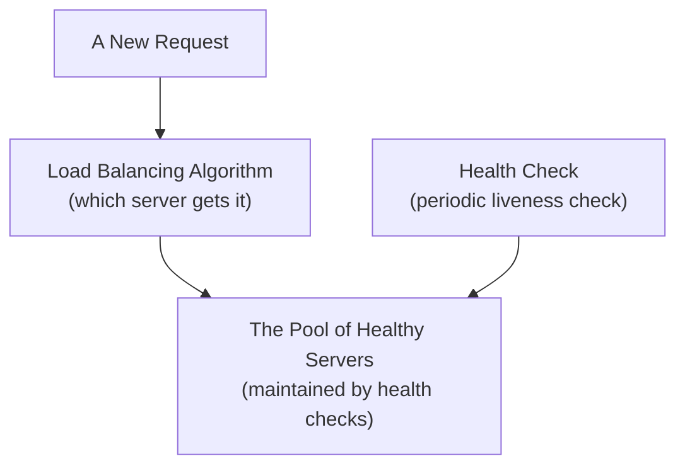

## Introduction

- **What You'll Learn From This Article**: Building on [the L4/L7 distinction](/en/articles/load-balancing-fundamentals-guide), a systematic understanding of the different **algorithms** a load balancer uses to decide which backend server gets the next request (round robin, least connections, IP hash, and similar), and how a **health check** mechanism automatically removes an unhealthy backend server.
- **Intended Audience**: Readers who know a load balancer "distributes traffic across multiple servers," but can't explain what algorithms exist beyond round robin, or how a health check concretely works.
- **Estimated Reading Time**: About 16 minutes

This article is part of the [Top 1% Series Complete Article Guide](/en/sitemap), and the second article in the [Load Balancing Fundamentals Series](/en/sitemap#series-list).

## Prerequisite Knowledge

- **The L4/L7 Load Balancer Distinction**: The fundamentals covered in [The Difference Between L4 and L7 Load Balancers](/en/articles/load-balancing-fundamentals-guide) — what a load balancer actually looks at to make its decision. The algorithms covered in this article apply equally to both L4 and L7 load balancers.

## Getting the Big Picture

The logic a load balancer uses to decide "which backend server gets the next request" is called a **load balancing algorithm**. And the mechanism that decides whether a server is even eligible to be a routing candidate in the first place is called a **health check**. These are two separate mechanisms, with two separate jobs.

## Deep Dive Into the Fundamentals

### Load Balancing Algorithms: What Criteria Decide the Routing

| Algorithm | Routing Criteria | Good Fit For |
|---|---|---|
| **Round Robin** | Distributes evenly, in sequence | When every request's processing time is roughly uniform |
| **Weighted Round Robin** | Distributes by a ratio set per server | Servers with different performance levels (send more to the stronger server) |
| **Least Connections** | Sends to whichever server currently has the fewest active connections | When per-request processing time varies |
| **IP Hash (Source Hash)** | Hashes the client's source IP address and always routes to the same server | When you need to pin a given client to a fixed server (session persistence, covered below) |

**Why isn't round robin enough on its own?** Round robin is the simplest possible scheme, assuming every request takes roughly the same amount of time to process. But if one request takes a long time (say, a large file upload), the server that received it holds that connection open longer than the others. Round robin mechanically keeps sending new requests to the same server anyway, purely because "it's next in the rotation," creating an imbalance where one specific server gets overloaded. **The least-connections algorithm instead makes its decision dynamically, based on the load actually being processed right now**, which is why it's often preferred over round robin in real-world practice, for workloads with varying processing times.

### Session Persistence (Sticky Sessions): Why You'd Ever Need to Pin to the Same Server

If a web application keeps session information, like login state, in a server's own memory, then a given client's requests getting routed to a different backend server each time produces a maddening symptom: **the login that just succeeded appears to vanish the instant the request lands on a different server.** To prevent this, the mechanism that always routes a given client's requests to the same backend server is called **session persistence** (sticky sessions).

- **IP hash method**: Always routes based on the client's source IP address, to the same server. In environments where multiple distinct clients appear to share one IP address — employees at the same company behind the same NAT, for instance — this can produce an unwanted skew toward one server.
- **Cookie method (L7 only)**: The load balancer issues a dedicated cookie recording which backend server it routed to, and uses that cookie for all subsequent routing decisions. Since it doesn't depend on IP address, it's more reliable. Because it requires reading HTTP content (the cookie), this is [an L7 load balancer feature](/en/articles/load-balancing-fundamentals-guide).

Doesn't Session Persistence Contradict the Whole Point of Load Balancing?

Session persistence, by pinning a specific client to a specific server, trades off against load balancing's own goal of distributing load evenly, to some degree. **Ideally, you'd externalize session information into a shared store (Redis, for instance) on the backend side, making the backend "stateless" — any server produces the same result — which eliminates the need for session persistence entirely.** It's best to understand session persistence as a practical compromise for when the backend can't be made stateless.

### Health Checks: How an Unhealthy Server Gets Detected and Removed

Health checks broadly come in two forms.

- **Active health checks**: The load balancer proactively sends a probe (a TCP connection check, an HTTP request to a specific URL, and similar) to a backend server at regular intervals, and checks the response.
- **Passive health checks**: The load balancer itself observes the responses to the ordinary traffic it's already processing (errors, timeouts) and detects problems from that.

Active health checks are usually configured with the following parameters, to prevent **flapping** (the status rapidly flipping back and forth between healthy and unhealthy).

| Parameter | Meaning |
|---|---|
| **Interval** | How often the health check runs |
| **Timeout** | The maximum time to wait for a response on a single check |
| **Fall threshold** | How many consecutive failures before marking the server "unhealthy" |
| **Rise threshold** | How many consecutive successes before marking the server "healthy" again |

**Setting the fall threshold to 1 (marking a server unhealthy after a single failure) means a server gets needlessly pulled out of rotation over a brief network hiccup.** On the other hand, setting the threshold too high means a genuinely failing server keeps receiving traffic for a while. Understanding this trade-off is essential to picking values appropriate to your service's actual characteristics.

## What a Pro Sees Here (Top 1% Understanding)

### Algorithms and Health Checks Are Problems at Two Separate Layers

A common beginner mix-up is conflating "the routing algorithm" with "the health check." **A health check decides which set of servers is even eligible to be a routing candidate in the first place; the algorithm decides which server, from within that set, gets picked.** Without keeping these two layers separate, you end up investigating in the wrong place — fixing the health check configuration, say, when a skew toward one specific server was actually caused by the algorithm's own settings all along.

## Common Misconceptions and Pitfalls

- **Misconception 1: "Round robin is always the fairest way to distribute traffic."**
  For workloads with varying processing times, the least-connections algorithm actually produces a fairer distribution, matched to the real load.
- **Misconception 2: "Configuring session persistence doesn't cost you any load-balancing effectiveness."**
  Session persistence pins a specific client to a specific server, which is a trade-off that sacrifices some degree of load-distribution effectiveness.
- **Misconception 3: "The smaller the health check's fall threshold, the safer it is."**
  Too small, and a server gets needlessly pulled out of rotation over a brief network hiccup — which actually hurts availability.

## Troubleshooting Perspective

1. **One specific backend server is overloaded**: Check the routing algorithm's configuration (round robin vs. least connections) and the weighting settings.
2. **Login state keeps dropping unexpectedly**: Check whether session persistence (sticky sessions) is configured, and whether it uses the cookie or IP-hash method.
3. **Traffic is still being sent to a server that's already down**: Check the health check's fall threshold and interval settings, and whether detection is taking too long.

## Summary

- Multiple load balancing algorithms exist — round robin, weighted round robin, least connections, IP hash, and more — and the choice should match the workload's characteristics.
- Session persistence pins a given client to a given server, trading off against load-distribution effectiveness.
- Health checks come in active and passive forms, and fall/rise thresholds prevent flapping.
- A health check (deciding the routing candidate pool) and an algorithm (choosing from within that pool) are mechanisms at two separate layers.

**Takeaways to Apply Today**
1. When investigating a load imbalance, treat the algorithm's configuration and the health check's configuration as two separate problems to isolate.
2. Before configuring session persistence, first consider whether the backend can be made stateless instead.

## References

- [HAProxy Configuration Manual - Load Balancing Algorithms](https://docs.haproxy.org/)
- [How Elastic Load Balancing Works | AWS](https://docs.aws.amazon.com/elasticloadbalancing/)
