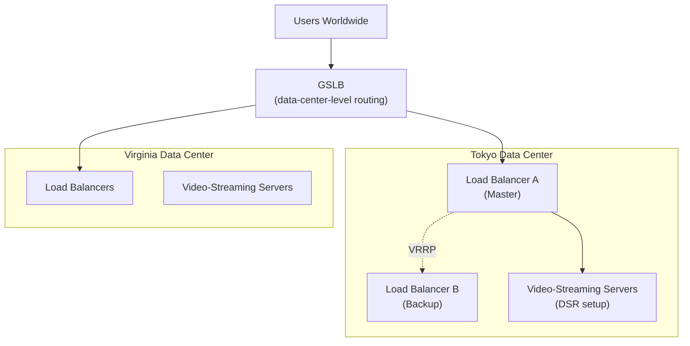

## Introduction

- **What You'll Learn From This Article**: This is the Load Balancing Department's capstone project, where you'll **integrate, on your own, the techniques you've learned one at a time in earlier hands-on labs** (global distribution via GSLB, L7 load balancing with HAProxy, redundancy for the load balancer itself via VRRP/keepalived, TLS certificate placement, addressing bandwidth asymmetry via DSR, preserving the client's real IP via the PROXY protocol, HTTP request smuggling defense) **into a single fictional video-streaming startup's traffic-distribution infrastructure.** Where earlier articles aimed at "following steps to reliably master one technique," this article takes a format much closer to real-world work: **presenting only requirements, and leaving you to design which techniques to combine, and how.**
- **Intended Audience**: Readers who've worked through the Load Balancing Department's Junior, Senior, and Graduate School content and can execute each individual hands-on lab, but have never designed a single traffic-distribution infrastructure combining them.
- **Estimated Reading Time**: Expect several days to about a week, including design, building, and documentation (the heaviest single hands-on in this series).

This article is part of the [Top 1% Series Complete Article Guide](/en/sitemap). It's positioned as the capstone project within the [Load Balancing Department's full curriculum](/en/university#load-balancing-department).

## Prerequisite Knowledge

This hands-on doesn't teach any new technique. **You'll combine and use the techniques you've already mastered in the following completed hands-on labs.**

- [Understanding the Difference Between L4 and L7 Load Balancers From a Top 1% Perspective](/en/articles/load-balancing-fundamentals-guide)
- [Understanding Load Balancing Algorithms and Health Checks From a Top 1% Perspective](/en/articles/load-balancing-algorithms-guide)
- [Understanding SSL Termination vs. SSL Passthrough From a Top 1% Perspective](/en/articles/load-balancing-ssl-termination-guide)
- [A Top 1% Hands-On for Building an L7 Load Balancer With HAProxy and Distributing Traffic Across Multiple Backend Servers](/en/articles/load-balancing-haproxy-handson-guide)
- [Understanding GSLB (Global Server Load Balancing) From a Top 1% Perspective](/en/articles/load-balancing-gslb-guide)
- [Understanding Load Balancer Redundancy Itself From a Top 1% Perspective](/en/articles/load-balancing-vrrp-keepalived-guide)
- [Understanding the PROXY Protocol From a Top 1% Perspective](/en/articles/load-balancing-proxy-protocol-guide)
- [A Top 1% Hands-On for Making Two HAProxy Servers Redundant With keepalived and Experiencing Automatic VIP Failover](/en/articles/load-balancing-keepalived-handson-guide)
- [A Top 1% Hands-On for Building DSR (Direct Server Return) With IPVS and Feeling a Design Where the Response Never Touches the Load Balancer](/en/articles/load-balancing-dsr-handson-guide)
- [A Top 1% Hands-On for Reproducing HTTP Request Smuggling With Curl and Netcat, and Confirming HAProxy's Strict Parsing Defense](/en/articles/load-balancing-request-smuggling-handson-guide)

## The Assignment: a Fictional Video-Streaming Startup's Traffic-Distribution Infrastructure

**You're an infrastructure engineer at a fictional video-streaming startup, "KoiKoi Stream." The company has run a small-scale service out of a single data center, and is now expanding to two data centers, Tokyo and Virginia, to deliver low-latency video streaming to users worldwide. Your assignment is to build, on your own, a traffic-distribution infrastructure that satisfies all of the following requirements.**

### Requirement 1: Route Users to Their Geographically Closest Data Center

**Build a mechanism that routes users worldwide to whichever of Tokyo or Virginia sits geographically closest to them.** Also consider a mechanism that automatically fails over to the remaining data center if the other one goes down entirely.

### Requirement 2: Build L7 Load Balancing Within Each Data Center, With an Appropriate Algorithm

**Build an L7 load balancer within each data center, routing traffic across multiple video-streaming servers.** Assume per-request processing times vary, and select an appropriate distribution algorithm.

### Requirement 3: Make the Load Balancer Itself Redundant

**Make each data center's load balancer redundant across multiple units, so it never becomes a single point of failure.** If one unit goes down, the service needs to keep running with the client side never noticing a thing.

### Requirement 4: Select a TLS Certificate Placement Approach

**Communication with users needs to be encrypted, but you need to select an appropriate placement approach, weighing both certificate management overhead and the load balancer's content-aware routing feature (an L7 feature).**

### Requirement 5: Address the Bandwidth Bottleneck From Video Streaming

**Video content's data volume vastly outweighs the request's, risking the load balancer's own bandwidth becoming the whole service's bottleneck.** Consider a configuration that addresses this bottleneck.

### Requirement 6: Let the Streaming Servers Know the User's Real IP Address

**For detecting unauthorized access and enforcing region-based content-licensing restrictions, the streaming server side needs to know the user's real IP address.** Select an appropriate approach, matched to your load balancer configuration.

### Requirement 7: Prepare for the Risk of HTTP Request Smuggling

**Prepare for the risk of request smuggling arising from a mismatch in how the front end and the backend interpret a request's boundary.**

## Deliverable Requirements: Assemble It as a Portfolio

**This hands-on's final deliverable isn't just a confirmation that the configuration worked.** Put together a repository, on GitHub or similar, containing:

- **README.md**: An overview of this scenario, and the full picture of the traffic-distribution infrastructure you adopted (including diagrams, such as Mermaid).
- **A record of your design decisions**: Why you chose that specific technology or configuration — especially anywhere a bandwidth-versus-availability-versus-security trade-off came up.
- **The steps you actually took**: A record of the config file entries you used and the commands you used to verify them.
- **A retrospective**: What challenges you discovered while doing this, and what you'd additionally consider in genuine real-world work (leveraging a CDN, migrating to a managed load balancer, and similar).

**This deliverable itself is a concrete accomplishment you can present in a job search or as a portfolio piece.** Being able to show "I designed a solution combining multiple techniques under the realistic constraints of multiple data centers and large-content delivery, and can articulate the bandwidth-versus-availability-versus-security trade-offs" is far more persuasive than simply saying "I did the HAProxy hands-on."

## What a Pro Sees Here (Top 1% Understanding)

### "Following Steps" and "Designing From Requirements" Are Entirely Different Skills

Every earlier hands-on in this series took the form of "Step 1, Step 2, ..." — following a fixed, predetermined sequence. **But what actually gets valued in real-world work isn't the ability to execute a procedure exactly as written — it's the ability to look at given requirements (Requirements 1 through 7 in this article) and design, yourself, which techniques to combine, and how.** These are similar-looking but entirely different skills. Completing every individual hands-on doesn't make you immediately effective in real work if you've never designed one coherent traffic-distribution infrastructure combining them. This capstone project is deliberately designed to bridge exactly that gap.

### Why a "Video Streaming Plus Multiple Data Centers" Setting?

There's a reason this hands-on deliberately models a realistic project — delivering content with a bandwidth asymmetry, video streaming, globally across multiple data centers — instead of a single-shot technical demo. **Most real-world traffic-distribution infrastructure never wraps up with a single purpose — it needs to simultaneously satisfy multiple axes: global distribution, availability, bandwidth optimization, and security.** Knowing how to build HAProxy alone doesn't help in a real project if you can't also see ahead to GSLB, redundancy, DSR, and security hardening. The ultimate goal of this capstone is elevating your knowledge of individual techniques into **the design ability to see multiple axes at once.**

## Common Misconceptions and Pitfalls

- **Misconception 1: "This hands-on has one fixed, correct configuration."**
  There's no single correct answer here. Multiple valid approaches exist as long as they satisfy the requirements. Recording the design you chose, and why, in README.md is what matters.
- **Misconception 2: "A confirmation that the configuration worked is sufficient as a deliverable."**
  Confirming it works matters, but it's not enough on its own. Being able to articulate the reasoning behind your design decisions is this hands-on's real value.
- **Misconception 3: "Having completed every individual hands-on means this one will go quickly too."**
  There's a real gap between knowing individual techniques and integrating them into one coherent design. Expect this to take considerable time.

## Troubleshooting Perspective

This hands-on's main challenge isn't individual technical troubleshooting — it's **design rework.**

1. **You thought you satisfied the requirements, but notice a contradiction later**: Before starting implementation, write out only the design section of README.md first, and confirm on paper that all seven requirements are genuinely satisfied.
2. **You've forgotten the steps for an individual hands-on**: Don't hesitate to go back and re-read the prerequisite article for that requirement. This capstone tests design ability, not memorization.
3. **You're not sure how thorough to make this**: Use "could I show this README.md to an interviewer I've never met and explain my design decisions" as your bar for completeness.

## Summary

- This capstone project is an integrative exercise combining the techniques you've learned individually in the Load Balancing Department, into a single fictional video-streaming startup's traffic-distribution infrastructure.
- What's being tested is the ability to design from requirements yourself, not the ability to follow a procedure.
- Assemble your deliverable as a portfolio piece — a document articulating the reasoning behind your design decisions, not just confirmation it worked.

**Takeaways to Apply Today**
1. Even while learning individual hands-on labs, build the habit of asking "under what future requirements would I actually use this?"
2. Beyond the technical deliverable itself, build the habit of articulating bandwidth-versus-availability-versus-security trade-offs in your day-to-day work too.

## References

- [The Load Balancing Department's Full Curriculum](/en/university#load-balancing-department)
