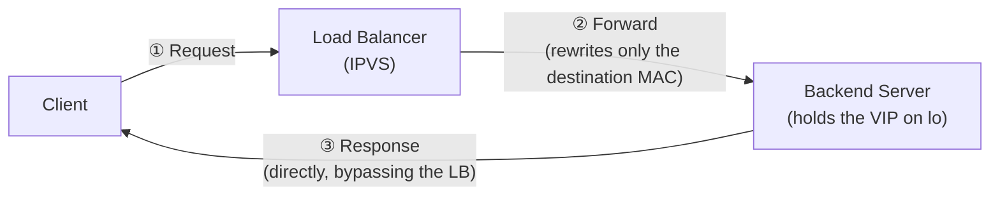

## Introduction

- **What You'll Learn From This Article**: Unlike the setup you built in [the HAProxy hands-on](/en/articles/load-balancing-haproxy-handson-guide), where the load balancer relays both the request and the response, you'll actually build a **DSR (Direct Server Return)** setup using Linux's **IPVS** (IP Virtual Server, controlled with the `ipvsadm` command), and confirm with your own eyes, via `tcpdump`, that response packets never touch the load balancer at all.
- **Intended Audience**: Readers with basic load balancer building experience who want to know how to handle the problem of the load balancer itself becoming a bandwidth bottleneck, in a situation where response traffic volume vastly exceeds request volume.
- **Estimated Reading Time**: About 25 minutes, including the hands-on exercise

This article is part of the [Top 1% Series Complete Article Guide](/en/sitemap), and the tenth article in the [Load Balancing Fundamentals Series](/en/sitemap#series-list). You can follow along with three of the Ubuntu Server environments set up in the [Hands-On Prep Manual](/en/articles/handson-prep-guide) (one for the load balancer, two for the backends), **as long as all three sit on the same L2 network** (DSR only works within the same L2 network, for reasons covered below).

## Prerequisite Knowledge

- **The VIP (Virtual IP) Concept**: The virtual IP address a client directly connects to, covered in [The Difference Between L4 and L7 Load Balancers](/en/articles/load-balancing-fundamentals-guide).
- **The Relationship Between Gratuitous ARP and MAC Addresses**: The fundamental idea, covered in [Load Balancer Redundancy Itself](/en/articles/load-balancing-vrrp-keepalived-guide), that ARP manages the correspondence between an IP address and a MAC address. DSR, covered in this article, is a technique that deliberately manipulates that correspondence.

## Getting the Big Picture

The ordinary load balancer you built in [the HAProxy hands-on](/en/articles/load-balancing-haproxy-handson-guide) relayed **both the client's request and the backend's response.** This is called a "two-arm" configuration. But for a service like video streaming or file downloads, where **the response's data volume vastly outweighs the request's,** the load balancer's own network bandwidth becomes a bottleneck, purely from relaying the response.

**DSR (Direct Server Return)** solves this bottleneck by having the load balancer relay only the request, while **the response returns directly from the backend server to the client.**



## Deep Dive Into the Fundamentals

### How DSR Actually Works: Never Rewrite the IP Address, Only the MAC Address

The core of DSR is that **the load balancer never rewrites the request packet's destination IP address (the VIP) at all — it forwards the packet after rewriting only the destination MAC address, to the chosen backend server's own MAC address.**

- Because the packet's destination IP address matches the VIP the backend server itself holds, **the backend server receives and processes it normally, as a packet addressed to itself.**
- When the backend server sends its response, it sends it directly to the client, with the source IP address kept **as the VIP** (not its own real IP).

**For this mechanism to work, forwarding has to happen without changing the destination IP address, which necessarily restricts DSR to cases where the load balancer and backend server sit within the same L2 network.** A backend on a different network (a different subnet) can't be reached by rewriting only the MAC address, so DSR doesn't work there.

### Backend Server Configuration: the VIP on Loopback, ARP Responses Suppressed

Two settings are required on the backend server side.

1. **Configure the VIP on the loopback interface (`lo`), not a physical interface**: This lets the backend server receive and respond to packets addressed to the VIP, without ever advertising via ARP on the network that the VIP "belongs to it."
2. **Suppress ARP responses on the physical interface** (`arp_ignore`): Without this, not only the load balancer but the backend server itself would respond to ARP requests for the VIP, creating a conflict on the network over which one should actually handle it.

<details>
<summary>Why Does Only the Load Balancer Need to Respond to ARP for the VIP?</summary>

In VRRP, covered in [Load Balancer Redundancy Itself](/en/articles/load-balancing-vrrp-keepalived-guide), the unit actually holding the VIP advertised that fact to nearby equipment via Gratuitous ARP. A DSR setup needs the same idea applied deliberately: **you need to create a state where only the load balancer is the one that should respond to ARP for the VIP.** The backend server needs to receive and process packets addressed to the VIP, but if it also claims via ARP "I'm where the VIP lives," a client's request would reach the backend server directly, bypassing the load balancer entirely, breaking load balancing itself. This delicate asymmetry — receiving the traffic, but never claiming it via ARP — is the single most important point in configuring DSR.

</details>

## Hands-On Steps

### Step 1: Configure the VIP and arp_ignore on Both Backend Servers

Apply the same configuration to both backend servers (say, `10.0.0.31` and `10.0.0.32`), using `192.168.100.10` as the VIP.

```bash
sudo ip addr add 192.168.100.10/32 dev lo
sudo sysctl -w net.ipv4.conf.all.arp_ignore=1
sudo sysctl -w net.ipv4.conf.all.arp_announce=2
```

**Here's what each of these three settings is responsible for.**

| Setting | Role |
|---|---|
| `ip addr add ... dev lo` | Configures the VIP on the loopback interface, so a packet addressed to it gets received as belonging to this machine |
| `arp_ignore=1` | Only responds to an ARP request for an IP address it actually holds, preventing unnecessary responses to the VIP across interfaces |
| `arp_announce=2` | Prevents using an IP address from an unrelated interface as the source when sending an ARP request |

Start a simple web server on both backends.

```bash
sudo python3 -m http.server 80 --bind 192.168.100.10 &
```

### Step 2: Configure IPVS in DR Mode on the Load Balancer

On the server acting as the load balancer, install `ipvsadm`.

```bash
sudo apt install -y ipvsadm
sudo ip addr add 192.168.100.10/32 dev eth0
```

Register the VIP as an IPVS virtual service, and add both backends in DR (Direct Routing) mode.

```bash
sudo ipvsadm -A -t 192.168.100.10:80 -s rr
sudo ipvsadm -a -t 192.168.100.10:80 -r 10.0.0.31:80 -g
sudo ipvsadm -a -t 192.168.100.10:80 -r 10.0.0.32:80 -g
```

**The trailing `-g` flag is what specifies DR (Direct Routing) mode.** Without it, IPVS falls back to a different forwarding method (such as NAT mode, which rewrites the IP address itself), and you wouldn't get DSR at all.

### Step 3: Confirm the Load Balancer Never Sees a Response Packet

On the load balancer, monitor all traffic involving the VIP.

```bash
sudo tcpdump -i eth0 host 192.168.100.10
```

From a different machine (the client), access the VIP.

```bash
curl http://192.168.100.10/
```

**Looking at the load balancer's tcpdump output, only the client's "request" packets get recorded — not a single "response" packet from the backend server to the client ever shows up.** This is concrete proof that the response is returning directly from the backend server to the client, never passing through the load balancer.

Meanwhile, running `tcpdump` on the client side shows the response packet's source MAC address is **the backend server's own MAC address that actually responded**, not the load balancer's. Even so, the source IP address stays `192.168.100.10` (the VIP), so the client-side application can't tell the difference from an ordinary load balancer configuration.

## What a Pro Sees Here (Top 1% Understanding)

### DSR Is Specifically a Fix for Bandwidth Asymmetry — Keeping the Load Balancer's Bandwidth Tied Only to the Request

In the two-arm setup you built in [the HAProxy hands-on](/en/articles/load-balancing-haproxy-handson-guide), the load balancer's bandwidth gets consumed by the combined total of the request and the response. **DSR is a design that completely decouples response bandwidth from the load balancer, letting the load balancer's own specs be optimized purely for request-processing volume.** For services like video streaming or a CDN's origin server, where response data volume vastly outweighs the request, DSR (or a similar technique) is favored precisely because it's a structurally correct fix for this bandwidth asymmetry.

## Common Misconceptions and Pitfalls

- **Misconception 1: "DSR can also be used with a backend server on a different subnet."**
  Because DSR forwards purely by rewriting the destination MAC address, it only works when the load balancer and the backend server sit within the same L2 network.
- **Misconception 2: "Just configuring the VIP on the backend server automatically makes DSR work."**
  Without `arp_ignore`, the backend server itself would respond to ARP for the VIP, causing a different problem — a client's traffic reaching it directly, bypassing the load balancer entirely.
- **Misconception 3: "DSR requires some special handling on the client side."**
  Since the response's source IP address stays the VIP, a client-side application behaves exactly as it would with an ordinary load balancer configuration.

## Troubleshooting Perspective

1. **The backend server never responds to a packet addressed to the VIP**: Check with `ip addr show lo` that `ip addr add ... dev lo` actually ran correctly.
2. **Traffic from certain specific clients reaches the backend directly, bypassing the load balancer**: Check that `arp_ignore` is applied to every physical interface on the backend server.
3. **No distribution happens at all after configuring `ipvsadm`**: Check with `ipvsadm -Ln` whether you forgot the `-g` flag (DR mode) and ended up in the default NAT mode instead.

## Summary

- DSR (Direct Server Return) has the load balancer relay only the request, with the response returning directly from the backend server to the client, decoupling response bandwidth from the load balancer.
- Because DSR forwards purely by rewriting the destination MAC address, it's restricted to cases where the load balancer and the backend server sit within the same L2 network.
- On the backend server side, the VIP needs to be configured on the loopback interface, with `arp_ignore` suppressing ARP responses on the physical interface.
- Since the response's source IP address stays the VIP, a client-side application sees no difference at all from an ordinary load balancer configuration.

**Takeaways to Apply Today**
1. When designing a service where response data volume is dramatically larger than request volume, build the habit of considering a bandwidth-asymmetry fix like DSR.
2. When configuring a load balancer's forwarding method, always explicitly confirm whether you're using NAT mode or DR (DSR) mode.

## References

- [IPVS (IP Virtual Server) Documentation | Linux Virtual Server Project](http://www.linuxvirtualserver.org/software/ipvs.html)
- [ipvsadm(8) Manual Page](https://linux.die.net/man/8/ipvsadm)
