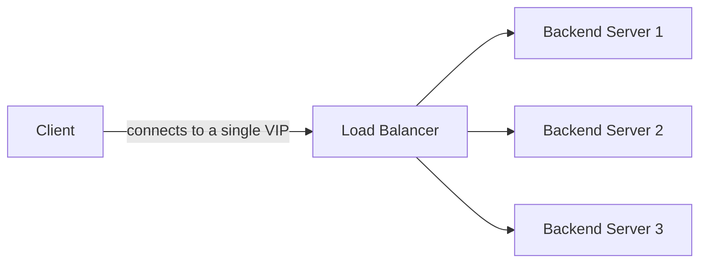
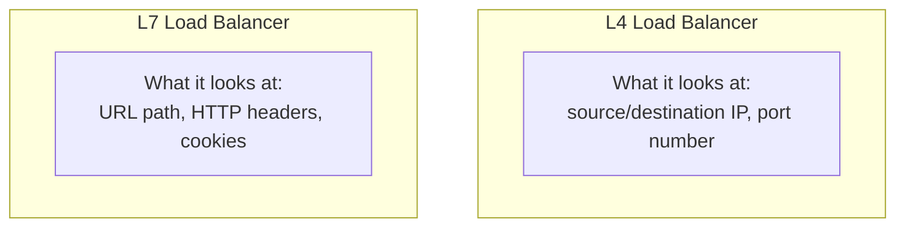

## Introduction

- **What You'll Learn From This Article**: A systematic understanding of the difference between an **L4 load balancer** (transport layer) and an **L7 load balancer** (application layer), framed around which OSI layer's information the load balancer actually looks at to make its decision. You'll also cover the **VIP (Virtual IP)** design — the idea that lets a client never need to know a backend server's real IP address at all.
- **Intended Audience**: Readers who understand "a load balancer is a box that spreads traffic across multiple servers," but haven't untangled what the L4-versus-L7 distinction means, or what product names like F5, AWS ALB/NLB, HAProxy, and nginx actually refer to.
- **Estimated Reading Time**: About 15 minutes

This article is part of the [Top 1% Series Complete Article Guide](/en/sitemap), and the first article in the [Load Balancing Fundamentals Series](/en/sitemap#series-list). Later articles cover more advanced territory: [Load Balancing Algorithms and Health Checks](/en/articles/load-balancing-algorithms-guide) and [SSL Termination vs. SSL Passthrough](/en/articles/load-balancing-ssl-termination-guide).

## Getting the Big Picture

### Why Do We Need a Load Balancer at All?

If a service runs on just one server, the whole service goes down the moment that server does. And once traffic grows, there's a hard limit to how far beefing up a single server can carry you. A load balancer solves this by **spreading traffic across multiple backend servers.**

A client only ever connects to a single IP address — the **VIP (Virtual IP)** — that the load balancer publishes. Which backend server actually handles a given request is decided behind the scenes by the load balancer, completely hidden from the client. The client's connection target (the VIP) never changes, even as backend servers are added or removed. This separation between "the face the client sees" and "the actual entity doing the work" is a different context from [the separation between an authoritative server and a caching server in DNS infrastructure](/en/articles/dns-server-fundamentals-guide), but the underlying idea — separating the visible surface from what's actually running behind it — comes up again and again across distributed systems in general.

## Deep Dive Into the Fundamentals

### L4 Load Balancer: Looking Only at IP Addresses and Port Numbers

An **L4 load balancer** operates at the OSI model's **transport layer (Layer 4)** — it distributes traffic based solely on TCP/UDP header information (source and destination IP addresses and port numbers). It never interprets the packet's actual content, such as an HTTP request.

- **Advantages**: Because it never interprets packet content, it's extremely fast. It also works with any protocol riding on TCP/UDP, not just HTTP.
- **Disadvantages**: It can't route based on a URL path or HTTP header content — for example, "send only requests starting with `/api/` to a different server pool."

AWS's **NLB (Network Load Balancer)** is the canonical example of an L4 load balancer.

### L7 Load Balancer: Reading the HTTP Request's Content

An **L7 load balancer** goes further, up to the OSI model's **application layer (Layer 7)**, and distributes traffic only after interpreting the HTTP request's content — URL path, headers, cookies, and similar.

- **Advantages**: It enables flexible, content-aware routing — "send `/api/` to the API server pool, `/static/` to the static-file server pool." **SSL termination**, covered later, is also an L7 feature, since it requires reading the HTTP content.
- **Disadvantages**: Because it genuinely has to interpret packet content, it costs more to process than L4. It's also limited to protocols the L7 load balancer actually understands, like HTTP/HTTPS.

AWS's **ALB (Application Load Balancer)**, and open-source **HAProxy** (when used in L7 mode) and **nginx**, are canonical examples of L7 load balancers.

Why Does an L7 Load Balancer Hold Two Separate TCP Connections?

An L4 load balancer essentially just relays the TCP connection between the client and a backend server as-is. An L7 load balancer, by contrast, needs to read the HTTP content, so it **establishes a separate TCP connection to the client and a separate TCP connection to the backend server.** The load balancer itself acts as "a server" from the client's perspective and as "a client" from the backend server's perspective — effectively an intermediary proxy. This two-connection structure is the foundation for the SSL termination mechanism covered later.

### Where Real-World Products Fit

| Product | Where It Fits |
|---|---|
| **F5 BIG-IP, Citrix ADC** | Commercial, dedicated hardware/software appliances. Offer both L4 and L7 features, with sophisticated configuration options. |
| **AWS NLB** | An L4 load balancer. Built for use cases needing extremely high throughput and low latency. |
| **AWS ALB** | An L7 load balancer. Supports routing based on HTTP headers or path. |
| **HAProxy, nginx** | Open-source software load balancers. Configurable for both L4 and L7, and you build and run them yourself, on your own server. |

## What a Pro Sees Here (Top 1% Understanding)

### How Much Ground the Single Word "Load Balancer" Actually Covers

The term "load balancer" spans an extremely wide range — from dedicated hardware appliances all the way down to plain software running on Linux, like HAProxy or nginx. **Fundamentally, a load balancer is a special-purpose proxy that picks one destination out of several and relays to it.** With that understanding in hand, you can also see why "DNS round robin" (registering multiple IP addresses in a DNS response and letting the client pick one in sequence — the simplest possible distribution method) isn't considered a "real" load balancer. DNS round robin has no health checks and no fine-grained routing logic — it's merely changing the order of a DNS response.

## Common Misconceptions and Pitfalls

- **Misconception 1: "A load balancer is always using L7 features (reading HTTP content)."**
  An L4 load balancer never looks at HTTP content at all — it distributes traffic using only TCP/UDP header information.
- **Misconception 2: "An L7 load balancer is always better than an L4 load balancer."**
  L7's flexibility comes with higher processing cost. For use cases needing extremely high throughput, L4 can be the better fit.
- **Misconception 3: "A VIP is the IP address of one of the backend servers."**
  A VIP is a virtual IP address published by the load balancer itself, with no real entity behind it on its own. The backend servers' IP addresses are completely hidden from the client.

## Troubleshooting Perspective

1. **Only some requests fail**: Check whether the L7 load balancer is routing to an unintended backend based on a specific URL path or header condition.
2. **Traffic concentrates on one specific backend server**: Check the distribution algorithm's configuration (covered in the next article).
3. **The VIP itself is unreachable**: This could be a failure in the load balancer itself, or a problem with the network configuration tied to the VIP (ARP responses, and similar).

## Summary

- An L4 load balancer distributes traffic quickly, looking only at TCP/UDP header information (IP address, port number).
- An L7 load balancer reads the HTTP request's content (URL path, headers, cookies) for flexible routing, at the cost of higher processing overhead.
- A client only ever needs to know the load balancer's published VIP (virtual IP) — the real backend servers stay hidden.

**Takeaways to Apply Today**
1. When looking at a load balancer's configuration, build the habit of first asking "is this L4 or L7?"
2. When you hear the word "load balancer," distinguish whether it's a dedicated appliance or software.

## References

- [HAProxy Documentation](https://www.haproxy.org/#docs)
- [What is a Load Balancer? | AWS](https://aws.amazon.com/what-is/load-balancing/)
