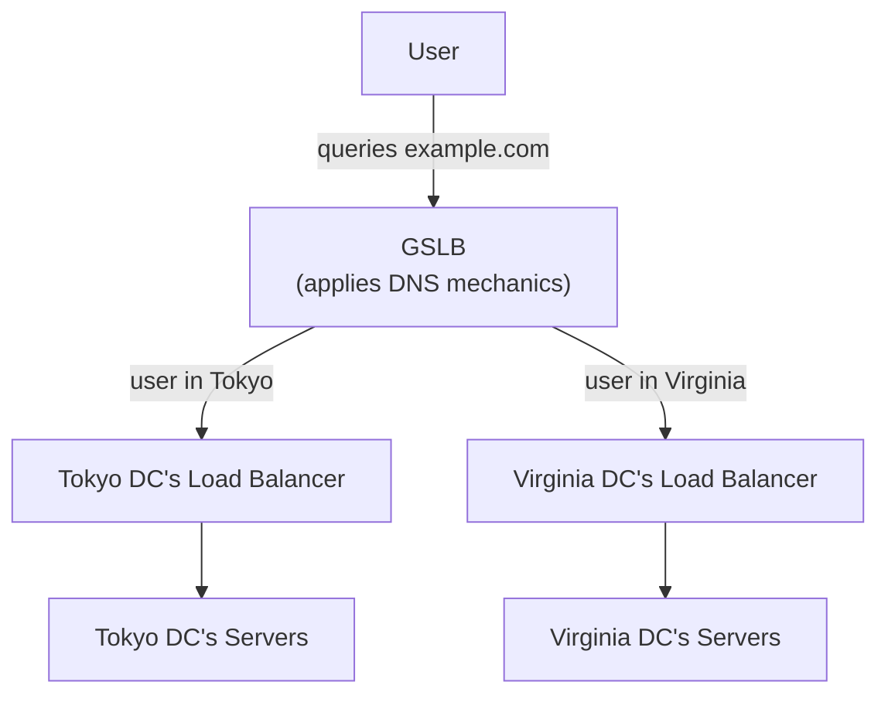

## Introduction

- **What You'll Learn From This Article**: Building on the within-one-data-center load balancing you built in [the HAProxy hands-on](/en/articles/load-balancing-haproxy-handson-guide), a systematic understanding of how **GSLB (Global Server Load Balancing)** — which distributes traffic across geographically distant data centers — applies DNS mechanics to get the job done.
- **Intended Audience**: Readers who understand how a single load balancer distributes traffic across multiple servers, but can't explain "how do users actually get routed to different data centers?"
- **Estimated Reading Time**: About 16 minutes

This article is part of the [Top 1% Series Complete Article Guide](/en/sitemap), and the sixth article in the [Load Balancing Fundamentals Series](/en/sitemap#series-list).

## Prerequisite Knowledge

- **DNS Name Resolution Fundamentals**: The mechanism covered in [DNS Server Fundamentals](/en/articles/dns-server-fundamentals-guide) — how an authoritative server answers a client's query. GSLB is realized as a mechanism that dynamically varies that authoritative answer's content.
- **The L4/L7 Load Balancer Distinction**: The fundamentals covered in [The Difference Between L4 and L7 Load Balancers](/en/articles/load-balancing-fundamentals-guide). GSLB operates one level above the load balancers covered there — it handles **routing at the data-center level.**

## Getting the Big Picture

The load balancer you built in [the HAProxy hands-on](/en/articles/load-balancing-haproxy-handson-guide) distributed traffic across multiple backend servers within one data center (or one region). But once a service serves users worldwide, a question one level up arises: **should this user go to the Tokyo data center, or the Virginia one?** That's exactly what **GSLB (Global Server Load Balancing)** solves.

## Deep Dive Into the Fundamentals

### What GSLB Really Is: an Authoritative DNS Server Answering Differently Based on Who's Asking

GSLB isn't a dedicated, new protocol. It's a design that applies DNS mechanics directly: **instead of always returning the same IP address for a query to `example.com`, the authoritative DNS server returns a different IP address depending on the querying client's situation.** Just as [split-horizon DNS](/en/articles/dns-split-horizon-guide) returns a different answer based on "inside or outside the company," GSLB returns a different answer based on conditions like "where did this geographically come from" and "which data center is currently healthy."

### How Does It Figure Out "Where Did This Geographically Come From"?

The simplest approach is estimating geographic proximity based on **the IP address of the DNS resolver that sent the query.** But this has a limit. Many users rely on a public DNS resolver provided by their ISP (Google Public DNS, say) that sits somewhere other than the user themselves, so **"where the resolver is" and "where the actual user is" can genuinely diverge.**

To address this, an extension spec called **EDNS Client Subnet** (ECS) is used. This mechanism has the resolver **forward part of the user's own IP address along with its query** to the authoritative DNS server. This lets the authoritative server decide which data center's IP address to return based on where the actual user is, rather than where the resolver happens to be.

Why Does EDNS Client Subnet Only Send "Part of" the IP Address?

ECS sends only **the IP address's upper bits** (typically around a /24) to the authoritative DNS server, not the user's full IP address. This is a privacy consideration. GSLB only needs to know roughly which region a query came from — a coarse location — and has no need for the full IP address that could uniquely identify an individual user, passed all the way to the authoritative server. This design — passing only the precision actually needed, and no more — echoes a similar idea, in a different domain, to [the principle of least privilege](/en/articles/aws-least-privilege-policy-handson-guide).

### Tying Into Health Checks: Failover on a Data Center Outage

GSLB's other major role is **health checks at the data-center level.** It applies the same thinking covered in [algorithms and health checks](/en/articles/load-balancing-algorithms-guide) for individual backend servers, but to an entire data center. If the entire Tokyo data center goes down, GSLB detects this and switches to returning only the Virginia data center's IP address for subsequent queries.

**One constraint to watch for here is DNS's own TTL (Time to Live).** Because a previous answer stays cached on the client or resolver side for some amount of time, there's a lag — matched to the TTL value — between a data center outage happening and every user actually switching over to the new data center. The standard practice for GSLB's DNS records is to set a shorter TTL than ordinary records (tens of seconds to a few minutes) to shrink this lag.

## What a Pro Sees Here (Top 1% Understanding)

### GSLB Is "Smart DNS," Not "a Smart Load Balancer"

Because the name GSLB contains the words "load balancing," it's easy to misread it as an extension of a single load balancer like the one covered in [the HAProxy hands-on](/en/articles/load-balancing-haproxy-handson-guide). **But what GSLB actually manipulates is always only the DNS answer's content.** It never sits in the actual communication path between client and server at all. With that understanding, GSLB's limits — the delay in switching over caused by DNS caching and TTL, and dealing with clients (some older applications) that ignore the DNS answer entirely and keep caching an IP address on their own — become clear as persistent, structural challenges, not bugs.

## Common Misconceptions and Pitfalls

- **Misconception 1: "GSLB distributes traffic in real time, just like a load balancer."**
  GSLB only manipulates DNS answers. It never sits in the actual traffic path, so a switchover delay tied to TTL is unavoidable.
- **Misconception 2: "Knowing the resolver's IP address always tells you a user's exact location."**
  For users relying on a public DNS resolver, the resolver's location and the actual user's location can diverge, which is exactly why an extension like EDNS Client Subnet is needed.
- **Misconception 3: "GSLB's TTL can be left at the same value as an ordinary DNS record."**
  A long TTL delays the switchover during a data center outage. The standard practice is setting a short TTL for GSLB records.

## Troubleshooting Perspective

1. **Only some users switch over slowly after a data center outage**: A cached answer, tied to DNS TTL, may still be lingering on the client or resolver side.
2. **A user isn't being routed to the geographically nearby data center they should be**: The DNS resolver they're using may sit somewhere different from their actual location, and EDNS Client Subnet may not be working correctly.
3. **One specific application keeps hitting the old data center even after the switchover**: That application may be caching the IP address on its own, ignoring the DNS TTL entirely.

## Summary

- GSLB isn't a dedicated new protocol — it's a design that applies DNS mechanics, having the authoritative DNS server return a different answer depending on the querying client's situation.
- EDNS Client Subnet is an extension spec that forwards part of the user's IP address to the authoritative DNS server, addressing the mismatch between a resolver's location and the actual user's location.
- GSLB ties into data-center-level health checks for failover on an outage, but a switchover delay tied to DNS TTL is always present.

**Takeaways to Apply Today**
1. Whenever GSLB comes up, come back to the premise that "this is just manipulating a DNS answer."
2. When configuring a GSLB DNS record, check that its TTL value matches the switchover delay you're actually willing to tolerate.

## References

- [RFC 7871 - Client Subnet in DNS Queries](https://datatracker.ietf.org/doc/html/rfc7871)
- [What Is Global Server Load Balancing? | F5](https://www.f5.com/glossary/global-server-load-balancing)
