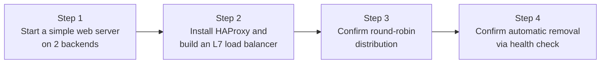

## Introduction

- **What You'll Learn From This Article**: Verify what you learned in [the L4/L7 distinction](/en/articles/load-balancing-fundamentals-guide) and [algorithms and health checks](/en/articles/load-balancing-algorithms-guide) by **actually building an L7 load balancer with HAProxy, the open-source load balancer, that distributes traffic across two backend web servers.** You'll confirm firsthand the behavioral difference between round robin and least connections, and watch a health check automatically remove an unhealthy server.
- **Intended Audience**: Readers who understand load balancing in theory, but have never actually built or configured a load balancer, and want to get hands-on before anything else.
- **Estimated Reading Time**: About 25 minutes, including the hands-on exercise

This article is part of the [Top 1% Series Complete Article Guide](/en/sitemap), and the fourth article in the [Load Balancing Fundamentals Series](/en/sitemap#series-list). You can follow along with three of the Ubuntu Server environments set up in the [Hands-On Prep Manual](/en/articles/handson-prep-guide) (one for the load balancer, two for the backends).

## Prerequisite Knowledge

- **The L4/L7 Load Balancer Distinction**: Read [The Difference Between L4 and L7 Load Balancers](/en/articles/load-balancing-fundamentals-guide) first.
- **Algorithms and Health Checks**: Read [Load Balancing Algorithms and Health Checks](/en/articles/load-balancing-algorithms-guide) first.

## Getting the Big Picture

This hands-on covers four steps.



## Hands-On Steps

### Step 1: Start a Simple Web Server on Both Backend Servers

On your second and third Ubuntu Server machines, each start a simple HTTP server that can identify which backend it is. Python's standard library alone is enough for this verification.

**Run on backend 1 (e.g., `10.0.0.11`):**

```bash
mkdir -p /tmp/web && echo "Response from Backend-1" > /tmp/web/index.html
cd /tmp/web && python3 -m http.server 8080
```

**Run on backend 2 (e.g., `10.0.0.12`):**

```bash
mkdir -p /tmp/web && echo "Response from Backend-2" > /tmp/web/index.html
cd /tmp/web && python3 -m http.server 8080
```

**Having each server return a response that includes its own name** lets you tell, just from the response content alone, which backend answered — a trick you'll rely on in the later steps.

### Step 2: Install HAProxy and Build an L7 Load Balancer

On your third Ubuntu Server (the load balancer), install HAProxy.

```bash
sudo apt update
sudo apt install -y haproxy
```

Append the following to the end of `/etc/haproxy/haproxy.cfg` (replace `10.0.0.11` and `10.0.0.12` with the backend server IP addresses you set up in Step 1).

```
frontend http_front
    bind *:80
    default_backend http_back

backend http_back
    balance roundrobin
    option httpchk GET /
    http-check expect status 200
    server backend1 10.0.0.11:8080 check
    server backend2 10.0.0.12:8080 check
```

**Here's what each line in this configuration is responsible for.**

| Setting | Role |
|---|---|
| `frontend http_front` | Defines the entry point that accepts client connections. `bind *:80` listens on port 80 across every interface. |
| `default_backend http_back` | Specifies which backend pool receives requests arriving at this entry point. |
| `balance roundrobin` | Specifies the round-robin algorithm covered in [the previous article](/en/articles/load-balancing-algorithms-guide). |
| `option httpchk` / `http-check expect` | Configures an active health check. Sends an HTTP GET request to each server and checks whether it returns status code 200. |
| `server backend1 ... check` | Defines a backend server to route to. The trailing `check` marks this server as a health check target. |

Apply the configuration.

```bash
sudo systemctl restart haproxy
sudo systemctl status haproxy
```

<details>
<summary>Why Explicitly Write Out "balance roundrobin"?</summary>

Omitting HAProxy's `balance` directive actually defaults to round robin anyway. **But this hands-on deliberately writes it out explicitly, so you get to feel firsthand the algorithm difference covered in [the previous article](/en/articles/load-balancing-algorithms-guide) by actually rewriting the configuration.** In real-world practice too, writing out the algorithm you're actually using in the config file, rather than relying on a default value, means whoever reads this configuration later (including your own future self) never has to guess at implicit behavior.

</details>

### Step 3: Confirm Round-Robin Distribution

From the load balancer itself (the third server), make repeated requests and confirm the response alternates between the two backends.

```bash
for i in {1..6}; do curl -s http://localhost/; done
```

**Output:**

```
Response from Backend-1
Response from Backend-2
Response from Backend-1
Response from Backend-2
Response from Backend-1
Response from Backend-2
```

As configured, round robin, requests get distributed alternately and evenly across the two backend servers, exactly as expected. Changing the setting to `balance leastconn` (least connections), restarting with `systemctl restart haproxy`, and trying the same command produces the same alternating result, at least for a simple test like this one. **This only confirms that the least-connections algorithm isn't broken** — it doesn't yet show its real value. As covered in [the previous article](/en/articles/load-balancing-algorithms-guide), the least-connections algorithm's real value shows up when one backend is taking longer to process requests (more connections currently open), causing it to preferentially route to the other. If you're curious, try setting up one backend that returns a slow response with `time.sleep()` built in, and observe the behavioral difference.

### Step 4: Confirm Automatic Removal via Health Check

Stop the first backend server and watch the health check automatically make the load balancer stop routing to it.

On backend 1, press `Ctrl+C` to stop the Python HTTP server.

From the load balancer, check HAProxy's log.

```bash
sudo tail -f /var/log/haproxy.log
```

After a few seconds (once the default health check interval elapses), a log line like this appears.

```
Server http_back/backend1 is DOWN, reason: Layer4 connection problem...
```

Try repeated requests again.

```bash
for i in {1..4}; do curl -s http://localhost/; done
```

**Output:**

```
Response from Backend-2
Response from Backend-2
Response from Backend-2
Response from Backend-2
```

Even though backend 1 is down, **you confirmed every request still succeeds, with no errors, routed entirely to the healthy backend 2.** This is [the health check mechanism](/en/articles/load-balancing-algorithms-guide) actually doing its job. Try restarting the stopped backend 1 as well, and confirm it rejoins the rotation.

## What a Pro Sees Here (Top 1% Understanding)

### "No Error Appearing" Is Itself the Health Check's Achievement

The result you confirmed in Step 4 — "even with a backend down, the client never sees a single error" — is itself proof the health check is working correctly. **In a setup where the health check isn't working, a client's request would get sent straight to the down backend anyway, delivering a connection timeout or error directly to the client.** The point of this hands-on is to let you feel, firsthand, that behind the seemingly unremarkable outcome of "a service keeps running even through a failure," a concrete mechanism — the health check — is actually doing the work.

## Common Misconceptions and Pitfalls

- **Misconception 1: "Omitting the balance directive means no distribution happens at all."**
  Omitting it defaults to round robin. Distribution still happens — but without explicitly stating the algorithm, anyone reading the configuration can't tell your intent.
- **Misconception 2: "A single failed health check immediately removes the server."**
  HAProxy's default requires multiple consecutive failures before marking a server "unhealthy" (this is the fall threshold concept covered in [the previous article](/en/articles/load-balancing-algorithms-guide)).
- **Misconception 3: "Least connections always behaves completely differently from round robin."**
  When each request's processing time is roughly uniform, least connections produces nearly the same result as round robin. The difference only shows up when processing times actually vary.

## Troubleshooting Perspective

1. **`systemctl restart haproxy` fails**: Check for a syntax error in the config file with `sudo haproxy -c -f /etc/haproxy/haproxy.cfg`.
2. **No traffic reaches the backends at all**: Check that the IP addresses and port numbers in the `server` lines match the Python HTTP servers you started in Step 1.
3. **The log never shows "DOWN" even after stopping a backend**: Wait for the health check interval (a few seconds by default) to elapse — it doesn't take effect instantly.

## Summary

- HAProxy is open-source software that lets you define an L7 load balancer's frontend (entry point) and backend (routing pool) in a single config file.
- Directives like `balance roundrobin` and `balance leastconn` let you explicitly choose the distribution algorithm.
- An active health check via `option httpchk` detects an unhealthy backend and automatically excludes it from rotation, without ever exposing an error to the client.

**Takeaways to Apply Today**
1. When writing a load balancer's configuration, build the habit of explicitly stating the algorithm instead of leaving it at the default.
2. Before stopping or restarting a backend server for maintenance, build the habit of confirming the health check is actually working correctly first.

## References

- [HAProxy Configuration Manual](https://docs.haproxy.org/)
- [HAProxy Health Check Documentation](https://www.haproxy.org/#docs)
