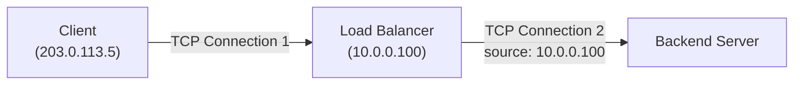

## Introduction

- **What You'll Learn From This Article**: Building on the structure covered in [the L4/L7 distinction](/en/articles/load-balancing-fundamentals-guide) — "an L7 load balancer holds a separate TCP connection to the client and to the backend" — a systematic understanding of **the problem of a client's real IP address getting lost beyond the load balancer**, and two different approaches to solving it: the **X-Forwarded-For header** and the **PROXY protocol**.
- **Intended Audience**: Readers who've run into the symptom where a web server's access log behind a load balancer shows every client at the same (the load balancer's own) IP address.
- **Estimated Reading Time**: About 15 minutes

This article is part of the [Top 1% Series Complete Article Guide](/en/sitemap), and the eighth article in the [Load Balancing Fundamentals Series](/en/sitemap#series-list).

## Prerequisite Knowledge

- **The TCP Connection Structure Behind L4/L7 Load Balancers**: The structure covered in ["Why Does an L7 Load Balancer Hold Two Separate TCP Connections?"](/en/articles/load-balancing-fundamentals-guide), where a client-side and a backend-side TCP connection each get established separately.

## Getting the Big Picture

Looking at a backend server's access log behind a load balancer, you might run into a symptom where **the client IP address that should have been recorded is instead replaced everywhere with the load balancer's own IP address.** This isn't a misconfiguration — it's an inevitable consequence of the load balancer's own structure.



## Deep Dive Into the Fundamentals

### Why Does the Client's IP Address Get Lost?

As covered in [the L4/L7 distinction](/en/articles/load-balancing-fundamentals-guide), an L7 load balancer **establishes a separate TCP connection to the client and to the backend server.** From the backend server's point of view, the party it's communicating with is always the load balancer itself — nothing about the TCP/IP connection information can tell it anything about the real client beyond it. The source IP address recorded in a backend server's access log all being the load balancer's own address is simply an inevitable consequence of this connection structure.

### X-Forwarded-For: the Most Common Solution, Limited to L7

The **X-Forwarded-For (XFF)** header is a mechanism where an L7 load balancer **appends a piece of information to the HTTP request it forwards to the backend server, saying "the real source was this IP address,"** as an HTTP header. An application on the backend server side can read this header to learn the real client IP address.

```
X-Forwarded-For: 203.0.113.5
```

**This approach has a structural limit.** Because XFF is simply part of an application-layer HTTP header, it can only be used by a load balancer that can actually read and write HTTP content — [an L7 feature](/en/articles/load-balancing-fundamentals-guide). An L4 load balancer, which never looks at HTTP content at all, or a configuration like [SSL passthrough](/en/articles/load-balancing-ssl-termination-guide) where the load balancer can't read HTTP content, has no room to append an XFF header at all.

<details>
<summary>What Happens to XFF Across Multiple Load Balancers or Proxies?</summary>

When multiple load balancers or reverse proxies sit in a chain between the client and the backend server, the XFF header **accumulates a comma-separated IP address for each proxy it passed through.**

```
X-Forwarded-For: 203.0.113.5, 198.51.100.10
```

Here, **the most trustworthy "real client IP" is the first entry in the list (the one appended earliest).** The further back a value sits in the list, the more likely it was appended by a proxy under your own control, raising its trustworthiness. On the flip side, if a malicious client sends a forged XFF header from the very start, that forged value risks slipping in as the list's first entry — so **deciding how far into the list you can trust requires accurately knowing how many proxies you yourself actually manage.**

</details>

### PROXY Protocol: a Lower-Layer Solution That Also Works at L4

The **PROXY protocol** takes a lower-layer approach: instead of an HTTP header, **right after a TCP connection gets established, it inserts a header carrying the real source information, before the protocol's own content even begins.** Even an L4 load balancer, which never interprets HTTP content at all, can convey the client's real IP address to a backend server this way.

| Approach | Operates at | Compatible Load Balancers |
|---|---|---|
| **X-Forwarded-For** | An HTTP header (application layer) | L7 load balancers only |
| **PROXY protocol** | Right after a TCP connection (close to the transport layer) | Either L4 or L7 load balancers |

Using the PROXY protocol requires **both the load balancer side and the backend server side to support the protocol.** On the backend server side (nginx, or HAProxy itself, say), you have to explicitly enable the setting that interprets a PROXY protocol header attached to the front of an incoming connection — otherwise its content gets accidentally misinterpreted as part of the HTTP request, producing an error.

## What a Pro Sees Here (Top 1% Understanding)

### How Information Gets Conveyed Is Always Constrained by Which Layer It Rides On

The reason two solutions, XFF and the PROXY protocol, exist is simply **a difference in approach — at which layer (the application layer, or a layer below it) do you convey the same single piece of information, "I want to tell you the client's real IP address."** With this view in hand, the question "why can't I use XFF with an L4 load balancer" becomes structurally explainable: "XFF is an HTTP header, and HTTP is application-layer information, so an L4 load balancer that never interprets it naturally can't use it." Nearly every "why does this work but not that" question about load balancers and proxies resolves once you step back to this view — which layer is the information actually riding on.

## Common Misconceptions and Pitfalls

- **Misconception 1: "A backend server's log recording the load balancer's IP address is a misconfiguration."**
  This is an inevitable consequence of an L7 load balancer's own structure of holding two separate TCP connections. It requires an additional fix, via XFF or the PROXY protocol.
- **Misconception 2: "X-Forwarded-For also works with an L4 load balancer."**
  XFF is an HTTP header, so it doesn't work with an L4 load balancer, which never interprets HTTP content. Conveying the client IP at L4 requires the PROXY protocol instead.
- **Misconception 3: "Enabling the PROXY protocol takes effect automatically."**
  Both the load balancer side and the backend server side need to explicitly enable support. Enabling it on only one side causes the header's content to be misinterpreted, producing an error.

## Troubleshooting Perspective

1. **The client's IP address never shows up in a backend's access log**: Check whether the load balancer is configured to append the XFF header, or, for an L4 setup, whether the PROXY protocol is enabled.
2. **A communication error starts the instant the PROXY protocol is enabled**: Check whether the backend server side has the setting that interprets a PROXY protocol header (like nginx's `proxy_protocol`) actually enabled.
3. **The XFF header contains an untrustworthy value**: Recount exactly how many proxies you yourself actually manage, and recheck how far into the list you should actually trust.

## Summary

- A client's IP address getting lost beyond a load balancer is an inevitable consequence of an L7 load balancer holding separate TCP connections to the client and the backend.
- X-Forwarded-For conveys the client IP as an HTTP header, usable only by an L7 load balancer that can interpret HTTP content.
- The PROXY protocol inserts client IP information right after the TCP connection, a lower-layer approach that also works with an L4 load balancer.
- Both approaches require explicit support configured on both the load balancer side and the backend server side.

**Takeaways to Apply Today**
1. When you run into a lost client IP, first check whether your setup is L4 or L7, and choose the appropriate fix (XFF or the PROXY protocol).
2. When trusting an XFF header, accurately count how many proxies you yourself actually manage, and decide how far into the list you should trust.

## References

- [PROXY protocol Specification | HAProxy](https://www.haproxy.org/download/2.8/doc/proxy-protocol.txt)
- [RFC 7239 - Forwarded HTTP Extension](https://datatracker.ietf.org/doc/html/rfc7239)
