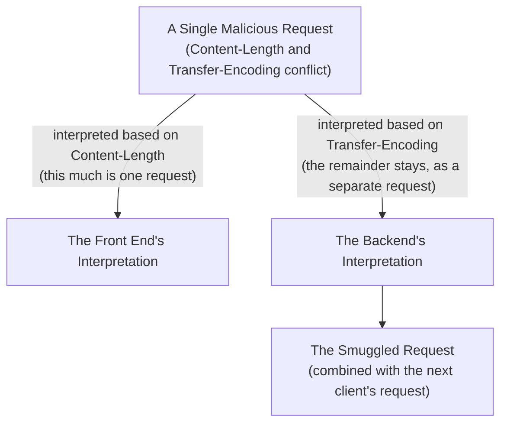

## Introduction

- **What You'll Learn From This Article**: Building on the structure covered in [the PROXY protocol](/en/articles/load-balancing-proxy-protocol-guide) — that a separate TCP connection exists between the load balancer and the backend server — you'll reproduce, entirely within a safe lab, the principle behind **HTTP request smuggling**, an attack that arises when **Content-Length and Transfer-Encoding, two ways of deciding where an HTTP request ends, get interpreted differently by the front end and the backend**, and confirm HAProxy's defense mechanism.
- **Intended Audience**: Readers with basic load balancer building experience who want to understand a security weakness that can affect web applications involving a load balancer or reverse proxy.
- **Important Note**: **This hands-on is educational and defense-focused, meant to strengthen the defenses of a test environment you manage yourself.** Never run this procedure against someone else's live environment without authorization. The test environment used in this article only ever sends traffic to a backend server you yourself set up, and contains no procedure for attacking a third party's system.
- **Estimated Reading Time**: About 25 minutes, including the hands-on exercise

This article is part of the [Top 1% Series Complete Article Guide](/en/sitemap), and the eleventh article in the [Load Balancing Fundamentals Series](/en/sitemap#series-list). You can follow along with two of the Ubuntu Server environments set up in the [Hands-On Prep Manual](/en/articles/handson-prep-guide) (one for the load balancer, one for the backend).

## Prerequisite Knowledge

- **The Load Balancer's Two Separate TCP Connections**: The structure covered in [the PROXY protocol](/en/articles/load-balancing-proxy-protocol-guide), where an L7 load balancer establishes a separate TCP connection to the client and to the backend. HTTP request smuggling, covered in this article, stems from this structure — specifically, from the fact that the connection to the backend gets reused across multiple requests.

## Getting the Big Picture

In HTTP/1.1, it's common to send multiple HTTP requests in sequence over a single TCP connection (**Keep-Alive**, connection reuse). To do this, the server side needs to accurately judge **"where one request ends, and where the next one begins."** Two different specs exist for deciding this boundary: **Content-Length** (stating the body's length explicitly, in bytes) and **Transfer-Encoding: chunked** (splitting the body into variable-length chunks, ending with a zero-length chunk).

**HTTP request smuggling works by including both headers in a single request, in a contradictory way, and getting the front end (the load balancer) and the backend server to each interpret the request's boundary differently.**



## Deep Dive Into the Fundamentals

### CL.TE and TE.CL: the Problem Created by Disagreeing on Which Header to "Trust"

**CL.TE** is the mismatch pattern where the front end judges the boundary based on Content-Length, while the backend judges it based on Transfer-Encoding. The byte sequence left over after the front end decides "one request ended here" — bytes that should rightfully belong to the next request — get interpreted by the backend as "a continuation of the chunked encoding" instead, and **a request that was never supposed to exist gets smuggled into the connection.** That's exactly where the name "smuggling" comes from. **TE.CL** is the reverse pattern.

A smuggled, malicious request like this **gets prepended onto whatever entirely unrelated client's request happens to use that same backend connection (Keep-Alive connection) next.** This is a serious vulnerability — it can inject an attacker's forged headers or path into another user's request, leaking session information or bypassing a WAF's (Web Application Firewall's) checks.

<details>
<summary>Why Is This Problem So Deeply Tied to the Load Balancer's Own Structure?</summary>

As covered in [the PROXY protocol](/en/articles/load-balancing-proxy-protocol-guide), an L7 load balancer manages its connection to the client and its connection to the backend separately. **And for performance reasons, the connection to the backend is typically reused across requests from multiple different clients.** This perfectly ordinary optimization — connection reuse — is exactly the foundation that lets a smuggled request end up combined with an unrelated client's request. If a fresh connection were established every single time, there would be no room at all for a smuggled request to leak into "the next request."

</details>

### How Modern Load Balancers Handle This Problem

[RFC 7230](https://datatracker.ietf.org/doc/html/rfc7230#section-3.3.3) explicitly states that **when both Content-Length and Transfer-Encoding appear in a single request, that request should be rejected.** Modern versions of HAProxy follow this rule, rejecting by default, with a **400 Bad Request**, any request where both headers are present in a contradictory way. This is itself a defensive posture: parse requests strictly according to spec, and never tolerate ambiguity.

## Hands-On Steps

### Step 1: Start a Simple HTTP Server on the Backend

On the Ubuntu Server acting as the backend, start a simple server that prints a request's content as-is.

```bash
python3 -c "
import socketserver, http.server
class Handler(http.server.BaseHTTPRequestHandler):
    def do_POST(self):
        length = int(self.headers.get('Content-Length', 0))
        body = self.rfile.read(length)
        print('--- Received body ---')
        print(body)
        self.send_response(200)
        self.end_headers()
with socketserver.TCPServer(('0.0.0.0', 8080), Handler) as httpd:
    httpd.serve_forever()
"
```

### Step 2: Send a Raw HTTP Request With Contradictory Headers, via Netcat

From the server acting as the load balancer (or a client machine), use `netcat` to send a request with conflicting Content-Length and Transfer-Encoding headers **directly** to the backend server, bypassing the load balancer.

```bash
printf 'POST / HTTP/1.1\r\nHost: backend\r\nContent-Length: 6\r\nTransfer-Encoding: chunked\r\n\r\n0\r\n\r\nX' | nc <backend's IP> 8080
```

This request, **trusting Content-Length, expects "a 6-byte body"** (the 4 bytes of `0\r\n\r\n`, plus the trailing `X`), while **trusting Transfer-Encoding, it's interpreted as "an empty chunked body, terminated by `0\r\n\r\n`."** Checking the backend server's output confirms it **reads the 6 bytes `0\r\n\r\nX` as-is as the body, based on Content-Length.** You've now reproduced the exact structure where, if that leftover `X` were actually the beginning of another malicious HTTP request, it would leak in as part of the next request.

### Step 3: Route Through HAProxy, and Confirm the Default Defense

On the server acting as the load balancer, build HAProxy with a configuration similar to [the HAProxy hands-on](/en/articles/load-balancing-haproxy-handson-guide), and this time send the same contradictory request **through HAProxy.**

```bash
printf 'POST / HTTP/1.1\r\nHost: backend\r\nContent-Length: 6\r\nTransfer-Encoding: chunked\r\n\r\n0\r\n\r\nX' | nc <load balancer's IP> 80
```

**Output:**

```
HTTP/1.1 400 Bad Request
```

**You confirmed HAProxy detects a request with both Content-Length and Transfer-Encoding present in a contradictory way, and rejects it with a 400 Bad Request before ever forwarding it to the backend.** In Step 2, sending directly to the backend server got processed without issue (since the boundary interpretation simply leaned one way or the other), whereas routing through HAProxy never even forwards it at all. This is the defense provided by strict parsing, following [RFC 7230](https://datatracker.ietf.org/doc/html/rfc7230#section-3.3.3).

## What a Pro Sees Here (Top 1% Understanding)

### The Correct Answer Isn't "Which Interpretation Is Right" — It's Eliminating the Room for Interpretation Entirely

One possible response to HTTP request smuggling is **"make the front end and the backend agree on the same interpretation method" — but this never actually solves the underlying problem.** If the backend software ever gets updated and its interpretation changes, the exact same problem resurfaces. [HAProxy's defense](https://datatracker.ietf.org/doc/html/rfc7230#section-3.3.3) takes a more fundamental approach instead: **never letting the question "which interpretation should I trust" arise at all — rejecting the contradictory input itself, on the spot, as a spec violation.** This idea — cutting off the room for ambiguity right at the input stage — echoes a universal defensive principle found across many other security practices that refuse to let untrusted input be interpreted as executable code.

## Common Misconceptions and Pitfalls

- **Misconception 1: "HTTP request smuggling only exists in certain specific vulnerable software."**
  This is a structural problem stemming from HTTP/1.1's own spec offering two different ways to determine a request's boundary. It can theoretically occur with any combination of front-end and backend software whose implementations disagree.
- **Misconception 2: "As long as Content-Length or Transfer-Encoding is always interpreted correctly, there's no problem."**
  The problem isn't "which one is correct" — it's that the front end and the backend trust a "different" one. The modern fix is rejecting the contradictory input itself.
- **Misconception 3: "Using HAProxy means you never need to worry about this problem."**
  Modern default settings protect against it, but an older version, or a deliberately loosened configuration, may not. You need to habitually check your own environment's version and settings.

## Troubleshooting Perspective

1. **A request routed through HAProxy unexpectedly returns 400 Bad Request**: Check whether the request you're sending contains both Content-Length and Transfer-Encoding in a contradictory way. This is usually not a bug — it's the intended defense working.
2. **Behavior differs between a direct connection to the backend and one routed through HAProxy**: This difference is itself proof the front end's strict parsing is working.
3. **You can't confirm this hands-on's defense with an older version of HAProxy**: Default behavior can differ by HAProxy version. Check the official documentation for the behavior of the version you're actually using.

## Summary

- HTTP request smuggling occurs when the front end and the backend interpret Content-Length and Transfer-Encoding — two ways of deciding an HTTP request's boundary — differently from each other.
- A smuggled request is a serious vulnerability: it gets combined with an unrelated client's request through a reused backend connection (Keep-Alive).
- RFC 7230 states a request with both headers present in a contradictory way should be rejected, and modern HAProxy follows this, parsing strictly by default.
- The essence of the fix isn't deciding "which interpretation is correct" — it's rejecting the contradictory input itself, leaving no room for interpretation at all.

**Takeaways to Apply Today**
1. When selecting or configuring a load balancer or reverse proxy, build the habit of checking whether it performs strict, RFC 7230-compliant HTTP parsing.
2. Whenever you run into a design that forces you to decide "which interpretation is correct," consider whether a more fundamental fix exists — eliminating the contradiction from arising in the first place.

## References

- [RFC 7230 - HTTP/1.1 Message Syntax and Routing, Section 3.3.3](https://datatracker.ietf.org/doc/html/rfc7230#section-3.3.3)
- [HTTP Request Smuggling | OWASP](https://owasp.org/www-community/attacks/HTTP_Request_Smuggling)
