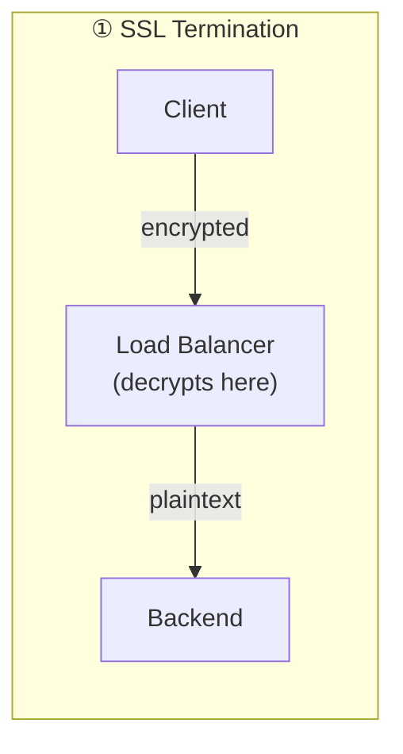
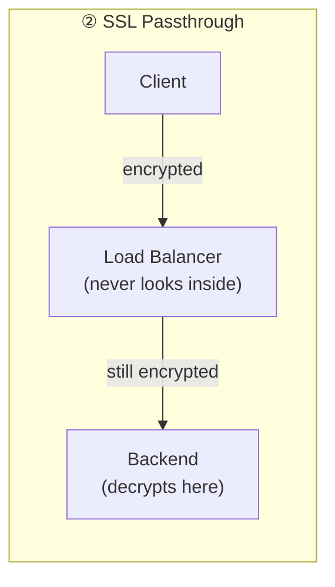
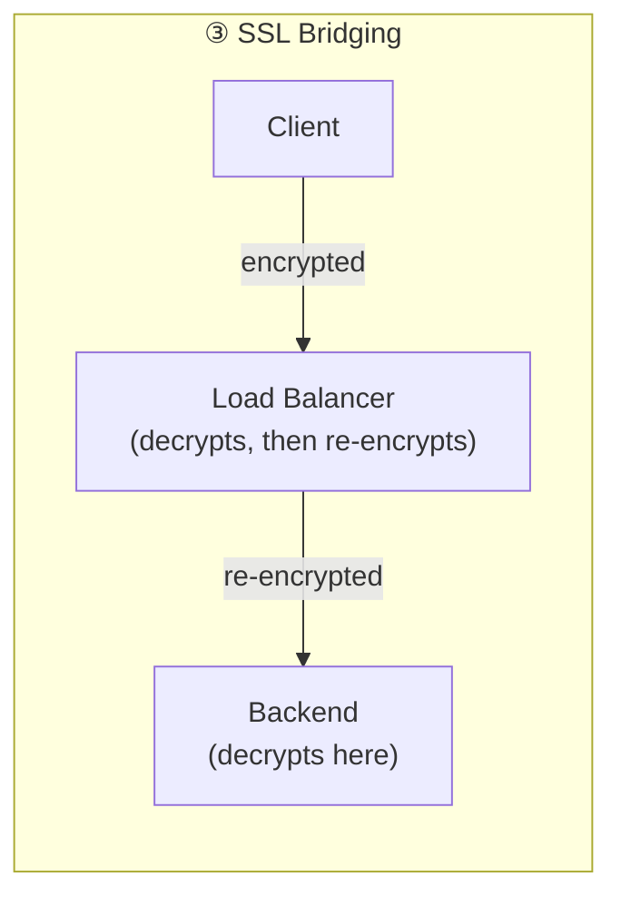

## Introduction

- **What You'll Learn From This Article**: Building on [the L4/L7 distinction](/en/articles/load-balancing-fundamentals-guide), a systematic understanding of the three approaches to configuring a TLS certificate on a load balancer — **SSL termination**, **SSL passthrough**, and **SSL bridging** — and the trade-offs behind each.
- **Intended Audience**: Readers who've configured a TLS certificate on a load balancer before, but can't explain the difference between "termination" and "passthrough," or why multiple approaches exist in the first place.
- **Estimated Reading Time**: About 16 minutes

This article is part of the [Top 1% Series Complete Article Guide](/en/sitemap), and the third article in the [Load Balancing Fundamentals Series](/en/sitemap#series-list).

## Prerequisite Knowledge

- **The L4/L7 Load Balancer Distinction**: The fundamentals covered in [The Difference Between L4 and L7 Load Balancers](/en/articles/load-balancing-fundamentals-guide) — what a load balancer actually looks at to make its decision. SSL termination, covered in this article, requires reading HTTP content, so it's realized as an L7 feature.

## Getting the Big Picture

There are broadly three approaches to how a load balancer handles TLS (SSL)-encrypted traffic. The single question that distinguishes the three — **where does encryption end, and from what point onward is the traffic plaintext (or re-encrypted differently)** — is the key to telling them apart.

## Deep Dive Into the Fundamentals

### ① SSL Termination: Decrypt at the Load Balancer, Relay Plaintext to the Backend

**SSL termination** has the load balancer terminate (decrypt) the TLS connection with the client, then relay to the backend server over plain, unencrypted HTTP.

- **Advantages**: The TLS certificate only needs to live on the load balancer, dramatically simplifying certificate renewal and management. And since the load balancer can read the plaintext HTTP request, it can combine encryption with [L7 features like routing by URL path](/en/articles/load-balancing-fundamentals-guide).
- **Disadvantages**: Traffic between the load balancer and the backend server is plaintext, so you take on responsibility for the network security of that path (such as guaranteeing it stays within a closed network).

### ② SSL Passthrough: the Load Balancer Never Looks Inside, Relaying Still Encrypted

**SSL passthrough** has the load balancer never decrypt the TLS content at all, simply relaying the encrypted packets as-is to the backend server. The backend server itself performs the TLS decryption.

- **Advantages**: Encryption stays end-to-end, all the way to the backend server. It satisfies requirements — common in finance and healthcare compliance — that plaintext must never exist anywhere along the path.
- **Disadvantages**: Since the load balancer can't read the HTTP content, [L7 features](/en/articles/load-balancing-fundamentals-guide) like routing by URL path are unavailable. The certificate also needs to live on, and be renewed on, every individual backend server, which adds operational overhead.

Why Can SSL Passthrough Still Route by Hostname?

SSL passthrough can't decrypt the TLS content (the encrypted part). But **ClientHello**, the very first message of the TLS handshake, contains **SNI (Server Name Indication)** — covered in [the IIS SNI hands-on](/en/articles/windows-server-iis-sni-handson-guide) — information indicating the destination hostname, included unencrypted, in plaintext, before encryption even begins. **The load balancer can peek at just this SNI information and route by hostname without ever decrypting anything.** This is an important exception: while it can't read HTTP content like a URL path, hostname-level routing is achievable even while staying in SSL passthrough.

### ③ SSL Bridging: Decrypt Once at the Load Balancer, Re-Encrypt for the Backend

**SSL bridging** has the load balancer decrypt the TLS connection with the client once, then relay to the backend server over a separate, re-encrypted TLS connection. It resembles SSL termination, but differs in that **the path to the backend also stays encrypted.**

- **Advantages**: The load balancer can read HTTP content (L7 features work), and the path to the backend also stays encrypted — resolving, to some degree, both termination's disadvantage (a plaintext path) and passthrough's disadvantage (no L7 features).
- **Disadvantages**: Both the load balancer and the backend server each need their own certificate management, making this the most complex configuration. It also means plaintext briefly exists on the load balancer itself, so it can't satisfy the strictest requirement that plaintext must never exist anywhere along the path.

## What a Pro Sees Here (Top 1% Understanding)

### Certificate Management Overhead and Security Requirements Are Always a Trade-Off

**SSL termination is the most widely adopted approach in real-world practice because the benefit of consolidating certificate management into one place outweighs the need for end-to-end encryption in most environments.** Deploying and renewing certificates individually across dozens or hundreds of backend servers simply isn't sustainable in practice. On the other hand, when a compliance requirement demands that decrypted plaintext never exist anywhere, you need to accept the operational overhead and choose passthrough or bridging instead. **The question isn't "which approach is better" — it's "which trade-off can my environment's actual requirements tolerate."**

## Common Misconceptions and Pitfalls

- **Misconception 1: "Using SSL termination means the whole connection never gets encrypted."**
  The connection between the client and the load balancer is encrypted. Only the segment between the load balancer and the backend server stays unencrypted.
- **Misconception 2: "SSL passthrough can't even route by hostname."**
  Since SNI information is visible in plaintext before encryption, hostname-based routing is achievable even while staying in SSL passthrough.
- **Misconception 3: "SSL bridging is always more secure than termination."**
  Bridging still has plaintext briefly existing on the load balancer itself, just like termination — neither satisfies the strictest "plaintext must never exist anywhere" requirement.

## Troubleshooting Perspective

1. **L7 routing to the backend (by URL path, and similar) isn't working**: Check whether you're actually in SSL passthrough mode — in passthrough, the load balancer can't read HTTP content.
2. **A certificate renewal only on the load balancer side isn't taking effect**: Check whether you're in passthrough or bridging mode, where the certificate also needs to live on the backend servers.
3. **Traffic between the load balancer and the backend is unexpectedly plaintext**: This is expected behavior if you've adopted the termination approach. Check whether that path's network sits within your security boundary.

## Summary

- SSL termination decrypts at the load balancer and relays plaintext to the backend, consolidating certificate management into one place.
- SSL passthrough has the load balancer never look inside, relaying still encrypted — this keeps encryption end-to-end, but L7 features are unavailable.
- SSL bridging decrypts once at the load balancer and re-encrypts for the backend, balancing both advantages to some degree, at the cost of the most complex configuration.
- Which approach to choose is a judgment call weighing certificate management overhead against how strict your encryption requirement is.

**Takeaways to Apply Today**
1. When looking at a load balancer's TLS configuration, build the habit of first identifying which approach (termination, passthrough, or bridging) is in use.
2. When checking a compliance requirement, concretely confirm one specific thing: whether plaintext is allowed to exist anywhere along the path.

## References

- [HAProxy SSL/TLS Documentation](https://www.haproxy.org/#docs)
- [SSL Offloading, Encryption, and Certificates with ALB | AWS](https://docs.aws.amazon.com/elasticloadbalancing/)
