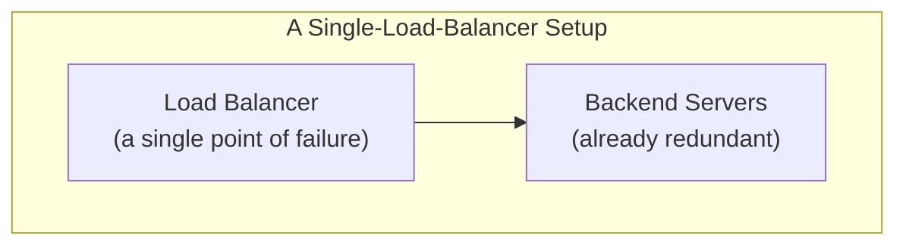
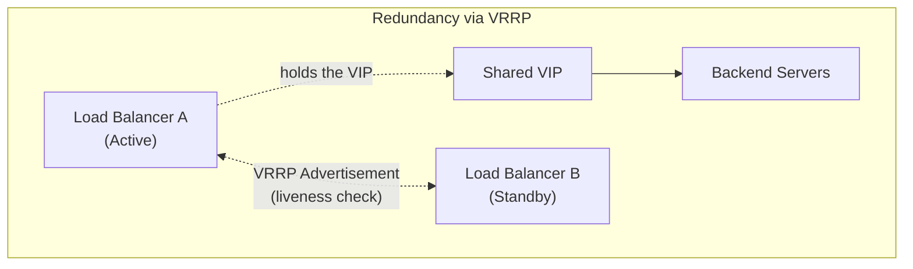

## Introduction

- **What You'll Learn From This Article**: Building on the VIP (Virtual IP) concept covered in [the L4/L7 distinction](/en/articles/load-balancing-fundamentals-guide), a systematic understanding of **VRRP (Virtual Router Redundancy Protocol)** — the mechanism for making the load balancer itself redundant — and **keepalived**, its Linux implementation, including how a VIP actually gets handed off between multiple load balancers.
- **Intended Audience**: Readers who understand how a load balancer makes backend servers redundant, but have never stopped to consider "what happens if the load balancer itself breaks?"
- **Estimated Reading Time**: About 16 minutes

This article is part of the [Top 1% Series Complete Article Guide](/en/sitemap), and the seventh article in the [Load Balancing Fundamentals Series](/en/sitemap#series-list). The following [keepalived + HAProxy hands-on](/en/articles/load-balancing-keepalived-handson-guide) builds what's covered here by hand.

## Prerequisite Knowledge

- **The VIP (Virtual IP) Concept**: The virtual IP address a load balancer publishes, which the client directly connects to, covered in [The Difference Between L4 and L7 Load Balancers](/en/articles/load-balancing-fundamentals-guide). This article covers how that VIP gets handed off between multiple load balancers.

## Getting the Big Picture

The load balancer you built in [the HAProxy hands-on](/en/articles/load-balancing-haproxy-handson-guide) ran as a single unit. But **if that one load balancer itself fails, the whole service goes down no matter how redundant the backend servers are.** A load balancer makes multiple backend servers redundant, but there's no point if it becomes a brand new single point of failure itself.

## Deep Dive Into the Fundamentals

### VRRP: a Mechanism for Multiple Routers (or Load Balancers) to Share One VIP

**VRRP (Virtual Router Redundancy Protocol)** was originally designed for router redundancy, but applies directly to load balancer redundancy too. It's a mechanism where **multiple load balancers notify each other about which one is currently the "real" responder for one shared VIP.**

- **Master (Active)**: The unit currently holding the VIP and actually responding to client traffic.
- **Backup (Standby)**: A standby unit not holding the VIP, monitoring the Master's liveness notifications.

The Master and Backup regularly exchange a liveness packet called a **VRRP Advertisement.** If the Advertisement from the Master stops arriving for a set period (typically a few seconds), the Backup concludes "the Master isn't functioning anymore," and **promotes itself to Master, attaching the VIP to its own interface.**

### keepalived: the Software That Implements VRRP on Linux

**keepalived** is open-source software that implements and runs VRRP on Linux. Where [HAProxy](/en/articles/load-balancing-haproxy-handson-guide) is the software responsible for the load balancing itself, **keepalived plays a different role: making the server HAProxy runs on redundant across multiple units.** These two aren't competing technologies — they're meant to be used together, each solving a separate problem.

What Actually Happens When a VIP Switches Over?

When a VIP switchover occurs, the server newly promoted to Master broadcasts a special ARP packet called a **Gratuitous ARP** across the network. This packet tells nearby network equipment (switches, and similar), "this VIP's MAC address now belongs to this server." This lets the client side switch its traffic to the new Master instantly, at the network layer, with no need to wait for any DNS change or TTL to elapse. In contrast to [how GSLB](/en/articles/load-balancing-gslb-guide) always carries a delay tied to DNS TTL, a VRRP switchover, within the same network, can happen extremely fast — on the order of seconds.

### Split-Brain: Why Two Units Must Never Become Master at the Same Time

The failure mode a VRRP setup must avoid above all else is **split-brain.** This is a state where, for some reason (such as only the network path between Master and Backup getting cut), **both the Master and Backup stop receiving each other's liveness notifications, and both conclude "I'm the Master."**

Split-brain leads to a serious failure where two units both claim the same VIP at once, leaving it undefined which one a client's traffic actually reaches. To prevent this, standard real-world practice is making the communication path used for VRRP's own liveness check redundant on its own — a dedicated network path (or multiple paths) separate from the path the load balancer actually uses to talk to clients.

## What a Pro Sees Here (Top 1% Understanding)

### "It's Redundant" Always Deserves the Follow-Up Question: Redundant Against What, At What Layer?

The backend server redundancy you confirmed in [the HAProxy hands-on](/en/articles/load-balancing-haproxy-handson-guide) and the load-balancer-itself redundancy covered in this article **look similar on the surface, but protect a different layer entirely.** Hearing "this system is redundant" should prompt you to climb back up one layer at a time and ask: "the backend is redundant, but what about the load balancer itself?" "The load balancer is redundant, but what about the network equipment or data center beyond it?" That habit of asking is essential to availability design that's genuinely sound, not just sound-looking.

## Common Misconceptions and Pitfalls

- **Misconception 1: "Making the load balancer's backend redundant makes the whole system redundant."**
  If the load balancer itself remains a single unit, it becomes a brand new single point of failure.
- **Misconception 2: "A VRRP switchover takes about as long as a DNS switchover."**
  A VRRP switchover happens instantly at the network layer via Gratuitous ARP, with no delay tied to DNS TTL.
- **Misconception 3: "Master and Backup are always fixed roles."**
  When the Master goes down, the Backup gets promoted to Master, and once the original Master recovers, the role can return to it depending on configuration (or the recovered unit can be configured to stay as Backup instead).

## Troubleshooting Perspective

1. **Traffic to the VIP isn't reaching the intended load balancer**: Check which unit currently holds the VIP with the `ip addr` command.
2. **A failover happened, but the client's connection never switched over**: An ARP cache on the client side or on equipment along the path (a switch, and similar) may still hold stale information.
3. **Both units appear to be acting as Master at the same time**: This could be split-brain. Check whether a failure has occurred on VRRP's own liveness-check communication path.

## Summary

- Without making the load balancer itself redundant, it becomes a single point of failure no matter how redundant the backend servers are.
- VRRP is a protocol letting multiple load balancers hand off one shared VIP through a Master/Backup division of roles, and keepalived is its Linux implementation.
- A VIP switchover happens instantly at the network layer via Gratuitous ARP, with no delay like DNS TTL.
- Standard real-world practice makes the liveness-check communication path itself redundant, to prevent split-brain (both units becoming Master at once).

**Takeaways to Apply Today**
1. When you hear "it's redundant," build the habit of asking, one layer at a time, exactly which layer is actually redundant.
2. When making a load balancer redundant, check whether VRRP's own liveness-check path has itself become a single point of failure.

## References

- [RFC 5798 - Virtual Router Redundancy Protocol (VRRP) Version 3](https://datatracker.ietf.org/doc/html/rfc5798)
- [Keepalived Documentation](https://www.keepalived.org/manpage.html)
