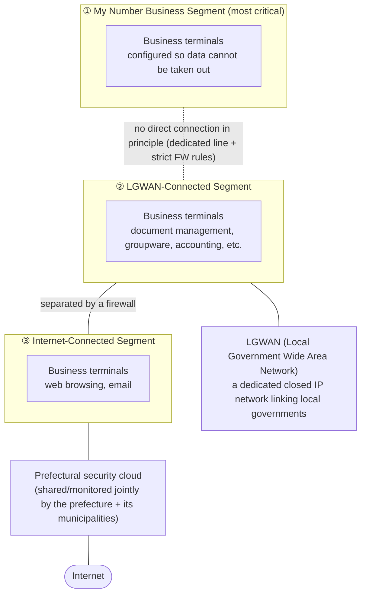
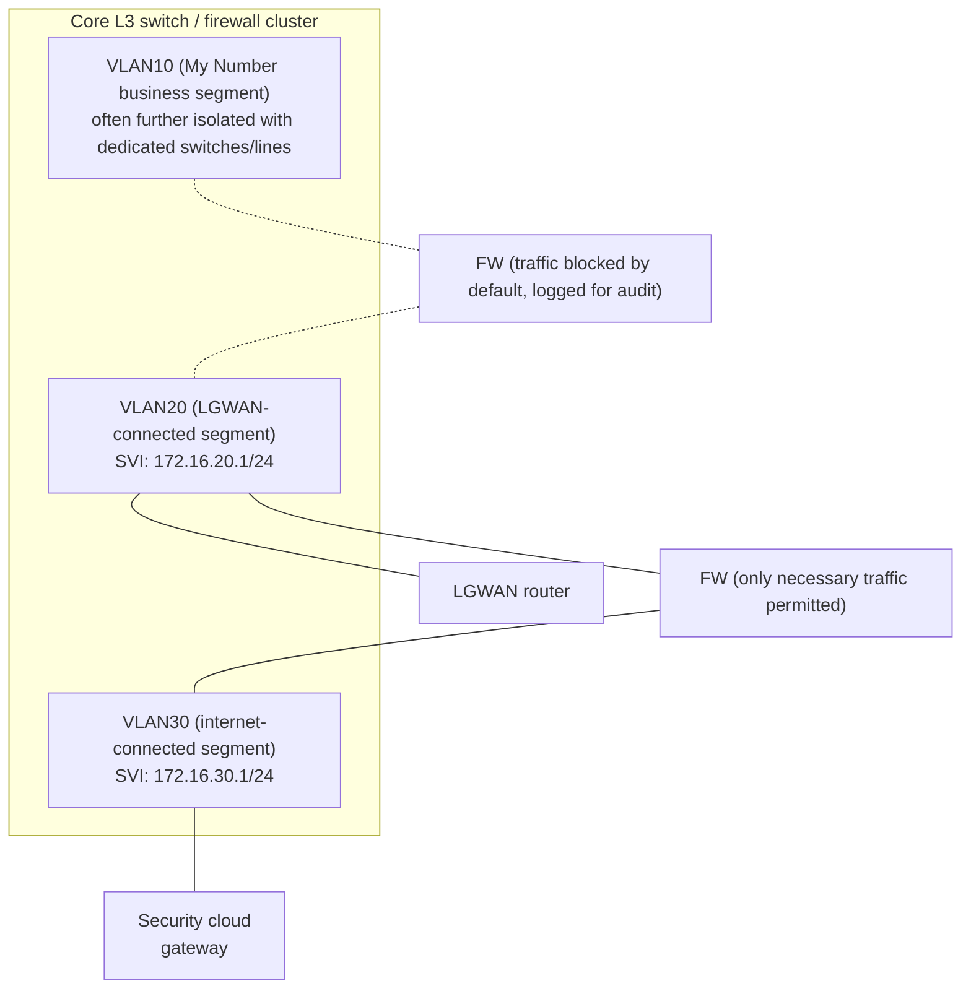

## Introduction

- **What You'll Learn From This Article**: This article systematically explains why Japanese local government (municipal/prefectural) networks are split into three segments — "LGWAN," the "My Number business segment," and the "internet-connected segment" — and how each of those is actually implemented using VLANs, L3 switches, and firewalls. Along the way, it covers how the **prefectural security cloud** shared across municipalities works, the role of the **security-enhancement relay platform** that safely distributes patches inside the closed LGWAN network, and why this three-tier segregation model is now being reconsidered in favor of a zero-trust approach.
- **Intended Audience**: Readers who already understand the basics of network segmentation via VLANs and firewalls, but can't quite picture how those pieces come together in a real government/public-sector network. Also useful if you're getting involved in building systems for Japanese local governments and are running into unfamiliar terms like LGWAN and the My Number business segment for the first time.
- **Estimated Reading Time**: About 25 minutes

This article is part of the [Top 1% Series' full article guide](/en/sitemap).

## Prerequisites

- **VLAN (Virtual LAN)**: A technology that creates multiple independent logical broadcast domains inside a single physical switch. Only ports assigned the same VLAN number belong to the same segment.
- **L3 switch / inter-VLAN routing**: Assigning each VLAN a virtual interface with its own IP address (an SVI), and using routing to relay traffic between different VLANs.
- **Firewall (FW)**: A device that applies rules (ACLs) permitting or denying traffic based on conditions such as source/destination IP address and port number.
- **IDS/IPS (Intrusion Detection/Prevention System)**: A mechanism that inspects traffic content against signatures and either detects (IDS) or detects-and-blocks (IPS) malicious traffic.

## Getting the Big Picture

### In a Nutshell

A Japanese local government's network can be summarized as being protected by **two layers working together: "three segments, logically and physically separated according to the sensitivity of the information involved," plus "a shared defensive platform pooled at the prefectural level."** This segregation regime is called the "three-tier measures" (三層の対策), and it traces back to a sweeping security overhaul that Japan's Ministry of Internal Affairs and Communications (MIC) required local governments to implement following a 2015 personal-data leak at the Japan Pension Service.

In a nutshell, the **My Number business segment is "the layer that must never leak anything outside," the LGWAN-connected segment is "the layer for closed communication between local governments and the national government," and the internet-connected segment is "the layer that touches the outside world."** All three are implemented using the same general-purpose networking building blocks — VLANs and firewalls.

## Fundamentals, Thoroughly Explained

### Why Such Strict Segregation? A 2015 Incident as the Starting Point

In 2015, the Japan Pension Service suffered a targeted email attack that leaked roughly 1.25 million pieces of personal information. In response, MIC required local governments to implement a sweeping security overhaul known as the "three-tier measures," formally reflected in the September 2018 revision of the "Guidelines on Information Security Policy for Local Public Bodies." The three-tier measures rest on three pillars:

1. **In the My Number business segment, implement measures such as blocking data from being taken off terminals, to thoroughly prevent resident information from leaking.**
2. **Split the LGWAN-connected segment from the internet-connected segment, to secure the LGWAN environment.**
3. **Have prefectures and municipalities jointly build a shared prefectural security cloud, to implement advanced security measures.**

The rest of this article maps these three pillars onto an actual network design.

### The My Number Business Segment: The Strictest Layer, Handling Resident Data

The **My Number business segment** is the network segment used for business processes — tax, social security, disaster response, and similar domains — that directly handle resident personal information tied to an individual's "My Number" (Japan's national ID number). It's worth noting this term refers to the network segment where these systems run, not to the My Number card itself or its issuance.

This segment is configured to restrict data from being taken off terminals (copying to USB media, printing, screen capture, and so on), and it's not directly connected to other segments or external networks as a rule. Of the three tiers, this is the one held to the strictest standard.

### The LGWAN-Connected Segment: The Closed Network Linking Local Governments

**LGWAN (Local Government Wide Area Network)** is a dedicated IP network — physically and logically independent of the internet — that interconnects prefectures, municipalities, and national government agencies. Internal administrative work such as document exchange between local governments, receiving electronic applications, groupware, and accounting systems runs over LGWAN.

Terminals in the **LGWAN-connected segment** communicate with other local governments and related organizations via LGWAN, and under the traditional model (the "α model," described below) they don't access the internet directly. It's important to understand that LGWAN is neither "part of the internet" nor "a VPN running over the internet" — it's an independent, dedicated-line-based closed network.

### The Internet-Connected Segment, and the α/β/β' Models

The **internet-connected segment** is where terminals that communicate with the outside world — browsing the web, sending and receiving email — are placed. A 2020 revision to the guidelines defined three models for where business terminals can be placed:

| Model | Where business terminals are placed | Efficiency/usability | Required level of security measures |
|---|---|---|---|
| α model (traditional) | Primary business terminals in the LGWAN-connected segment | Low | Low–medium |
| β model | Primary business terminals in the internet-connected segment (no critical information assets placed there) | Medium | Medium |
| β' model | Same as β, plus document management, accounting, and similar business systems (excluding the My Number segment) also placed in the internet-connected segment | High | High |

Adopting the β model is conditional on implementing technical measures like EDR (endpoint detection and response) as well as organizational/human measures such as building an incident-response team ready to react quickly. The β' model adds further conditions: access control at the level of individual information assets, adherence to organizational security policy, and building continuous detection/monitoring capability. In other words, **the more usability you gain, the higher the bar for the technical and organizational measures required of the local government.**

### Implementing the Three Segments with VLANs, L3 Switches, and Firewalls

Everything up to this point has been about "logical segregation by the sensitivity of the information/business involved." Translating that into an actual network, most local governments adopt roughly the following structure.

It's technically possible to combine all three tiers on a single physical switch using VLANs alone. But for the My Number segment, a single ACL misconfiguration on a shared L3 switch could directly cause a serious leak of resident information, so many local governments layer **dedicated physical switches and dedicated lines on top of VLAN-based logical separation**, giving that boundary double protection. Between the LGWAN-connected and internet-connected segments, logical separation via VLANs and a firewall is more typical.

Whichever the case, the firewall placed at each boundary generally follows a **whitelist approach**: every permitted flow is explicitly written as its own rule, asking "is this traffic actually necessary?" Between the My Number segment and everything else in particular, the default posture is to deny all traffic, with narrowly scoped exceptions added only for connections that are genuinely required (for example, a specific integration with the resident registry system).

### The Prefectural Security Cloud: A Shared Defense Platform Consolidated at the Prefecture Level

Because the internet-connected segment communicates directly with the outside world, it's constantly exposed to threats such as malware infection and attacks against web servers. This is addressed by the **prefectural security cloud**: a shared arrangement where a prefecture and its municipalities jointly consolidate web servers, mail servers, and similar infrastructure, and run advanced security measures together — monitoring, log collection, and analysis chief among them. All 47 of Japan's prefectures have built one of these.

The main functional requirements can be organized as follows.

| Category | Main functions | Status |
|---|---|---|
| Monitoring internet traffic | Monitoring web servers, mail relay servers, proxy servers, external DNS servers | Required |
| Incident prevention (gateway controls) | Firewall, IDS/IPS, malware protection, URL filtering | Required |
| Email security | Antivirus/spam filtering, behavioral detection (running attachments in a sandboxed environment to catch abnormal behavior) | Required |
| Web server security | WAF (detecting/blocking malicious traffic against web applications), CDN (load balancing) | Required |
| Advanced monitoring by security specialists | Log collection/analysis, event monitoring, managed security services via a SOC (Security Operation Center) | Required |
| Response and recovery | Vulnerability management, early detection coordinated with a CSIRT, backups, help desk | Required |
| Optional requirements | Decrypting encrypted traffic for inspection, sanitizing email/files, EDR monitoring (for local governments adopting the β model), remote-desktop access to the internet-connected segment (VDI) | At each local government's discretion |

Adoption rates for optional requirements (as of 2024)

A survey of all 47 prefectures found that 94% had adopted the "decrypting encrypted traffic" option, and 72% had adopted "email/file sanitization." Because Japan's unified government security baseline also calls for decrypting monitored traffic, there's discussion of upgrading "decrypting encrypted traffic" from optional to required.

The impact of the prefectural security cloud is backed by published figures. In one prefecture's fiscal 2023 results, the firewall blocked 1.51 billion sessions per month, IPS blocked 2.01 million sessions per month, malware-laden email attachments were removed 6,988 times per month, and spam email was flagged 3.47 million times per month. All 47 prefectures reported that their current security cloud is effective against cyberattacks, and it's estimated that over 99% of day-to-day attacks are blocked at this shared-defense layer.

### The Security-Enhancement Relay Platform: Safely Delivering Patches Inside LGWAN

Three-tier segregation creates one structural dilemma. My Number business segment and LGWAN-connected segment terminals are restricted from accessing the internet directly to keep them secure — but OS and antivirus security patches and pattern-file updates are normally distributed over the internet. **The very act of segregating the network makes it harder to keep those terminals patched with the latest security updates** — a contradiction baked into the design.

This is resolved by a relay service operated by J-LIS (Japan Agency for Local Authority Information Systems) called the **local government security-enhancement platform**. It safely relays update programs — Windows Update packages, antivirus pattern files, and the like — obtained on the internet side, and distributes them over LGWAN to terminals in the LGWAN-connected and My Number business segments. It also relays Microsoft 365 activation traffic, and went into pilot operation in December 2017. It's easiest to understand as a way to **build a bridge across the closed LGWAN network without punching a hole in it** — reconciling the seemingly conflicting goals of "keeping things segregated" and "keeping things up to date."

## The View from the Top 1% (What Experts See)

### Why Three-Tier Segregation Wasn't the End of the Story: The Background Behind the 2020 Revision

While the three-tier measures were highly effective at preventing resident-data leaks, they also came with real drawbacks: exchanging email attachments became cumbersome, remote work became structurally difficult, and SaaS-style cloud services tended to be restricted to the internet-connected segment, holding back operational efficiency. In response, the December 2020 guideline revision introduced the β/β' models described above, explicitly aiming to "balance security assurance with improved efficiency and usability." Three-tier segregation isn't a fixed design that was finished once and left alone — it's a **living design that continues to be revised, balancing the changing threat landscape against demands for usability**.

### The Connection to Zero-Trust Architecture

Japan's Digital Agency published its "Zero Trust Architecture Application Policy" on June 30, 2022, laying out an approach that assumes threats can exist both inside and outside the network, and aims to minimize implicit trust zones. Because the prefectural security cloud detects and responds to threats originating outside the network, it's positioned as already fulfilling part of this policy's "observe resources and access" element. According to MIC's study-group reports, looking toward a target state around 2030, work is underway to verify shared national/local network infrastructure and a full rollout of zero-trust architecture at the local-government level — meaning **the current three-tier segregation model is increasingly understood as a transitional arrangement on the path toward a future zero-trust model**, rather than an end state.

### Structural Challenges Facing the Prefectural Security Cloud

Because this is a platform jointly used by multiple municipalities within a prefecture, some structural challenges have become apparent as well.

- **Rising financial burden**: The cost borne by prefectures and municipalities has been increasing year over year, and many local governments cite this as a challenge.
- **Structural risk from shared use**: A shared data-center outage has a wide blast radius; one municipality generating unusually heavy traffic can degrade connectivity for others; and the platform's original design leaves little room to add new capabilities later.
- **Side effects of traffic decryption**: The process of decrypting encrypted traffic for inspection can introduce delay or failures in latency-sensitive traffic like online meetings, or in short-lived one-time-password emails.
- **Contract expirations clustering together**: A majority of prefectures have security-cloud contracts expiring around the end of fiscal 2026, creating a structural bind where the next contract cycle has to be renewed before the transition to the 2030-era target state is actually complete.

### The Relationship to Japan's Government Cloud (Gov-Cloud)

Core "standardized systems" — resident registry, taxation, social security — are being migrated onto Japan's national Government Cloud. The March 2023 guideline revision established that Government Cloud, and any cloud service maintaining an equivalent security level, is **prohibited from internet connectivity in principle**, with narrow exceptions carved out for exactly three cases: applying patches, activating software licenses, and connecting to a management console. This mirrors the same underlying idea as the security-enhancement relay platform discussed above — "stay segregated, but still stay current" — now applied to the Government Cloud domain as well.

## Common Misconceptions and Pitfalls

- **Misconception 1: "The My Number business segment is about My Number cards"**
  The My Number business segment is the name of the network segment where internal administrative processes — tax, social security, and similar work tied to a resident's My Number (national ID number) — actually run. It's a different topic from issuing My Number cards or using their electronic certificates.
- **Misconception 2: "LGWAN is part of the internet, or something like a VPN over the internet"**
  LGWAN is a dedicated closed IP network (the Local Government Wide Area Network), independent of the internet. It's built on physically separate lines, which is a different mechanism from a VPN that tunnels encrypted traffic over the public internet.
- **Misconception 3: "Once the prefectural security cloud is in place, individual local governments don't need to do anything else"**
  Local governments adopting the β model are required to implement measures on their own end too, such as deploying EDR on terminals and standing up an incident-response capability, as a condition of adoption. The shared defense platform and each local government's own measures aren't a substitute for each other — they're two halves of the same whole.
- **Misconception 4: "Three-tier segregation makes the network structurally invulnerable"**
  Email-borne malware like Emotet can still reach terminals in the LGWAN-connected segment. Three-tier segregation is a measure that limits how far an attack can spread and what information it can reach once inside — it's not a mechanism that reduces the probability of intrusion itself to zero.

## Troubleshooting Perspective

1. **Legitimate websites or emails get blocked incorrectly**: Often caused by a false positive in the security cloud's URL filter or spam classifier. Most local governments have a help-desk process for requesting that a block be lifted.
2. **Online meetings or one-time-password emails are delayed or fail**: Suspect the security cloud's "traffic decryption" (SSL/TLS inspection) processing, which can affect latency-sensitive traffic or short-lived emails.
3. **Connectivity becomes unstable during certain time windows**: Because this is a shared platform, heavy traffic from another municipality within the same prefecture may be affecting your own connection quality.
4. **Terminals in the LGWAN-connected or My Number segments aren't getting the latest security patches**: Since ordinary internet-based Windows Update and similar mechanisms can't reach them, first check the delivery configuration and connectivity status of the security-enhancement relay platform.
5. **Unintended reachability from the My Number segment into other segments**: Often caused by a misconfigured ACL on an L3 switch/firewall, or a VLAN assignment mistake. Because this can lead directly to a leak of resident information, treat it as the highest-priority incident and audit the configuration immediately.

### Prevention and Long-Term Countermeasures

- Periodically audit the ACL/firewall rules configured at each of the three tier boundaries, to confirm no unintended communication path has emerged.
- Regularly review the monthly operational reports the security cloud provides, to catch changes in attack patterns or false-positive rates early.
- Given the trajectory toward Government Cloud migration and zero-trust architecture, use each security-cloud contract renewal as an opportunity to reconsider the requirements against that future direction, rather than simply rolling over the existing spec.

## Summary

- Japan's local-government "three-tier measures" grew out of the 2015 Japan Pension Service incident, and rest on three pillars: (1) preventing data from leaving the My Number business segment, (2) splitting the LGWAN-connected and internet-connected segments, and (3) building a shared prefectural security cloud.
- Where business terminals are placed offers a choice beyond the traditional α model: the β and β' models, which trade off usability against the required level of security measures.
- The three-tier split is implemented with VLAN-based logical separation and firewall ACLs, though the My Number segment is often further protected with dedicated physical switches and lines layered on top.
- The prefectural security cloud serves as a shared defense platform providing IDS/IPS, WAF, and SOC monitoring, with a track record of blocking over 99% of daily attacks — but it also faces structural challenges around cost and the risks of shared use.
- Three-tier segregation isn't a fixed design; it's continuously revised as a transitional arrangement on the way toward a future zero-trust architecture.

**Starting Today**
1. When you encounter a local-government or public-sector network design, get in the habit of first asking "which segment does this belong to — My Number business, LGWAN-connected, or internet-connected?"
2. When you see a boundary between segments (a firewall/ACL), get in the habit of asking "why is exactly this traffic permitted?" — it's a quick way to internalize the whitelist-based design philosophy behind it.

## References

- [Overview and Recent Revisions of the Guidelines on Information Security Policy for Local Public Bodies (MIC, October 10, 2023)](https://www.soumu.go.jp/main_content/000907086.pdf)
- [About the Prefectural Security Cloud (MIC, September 4, 2024)](https://www.soumu.go.jp/main_content/000972052.pdf)
- [Guidelines on Information Security Policy for Local Public Bodies (MIC, revised March 28, 2023)](https://www.soumu.go.jp/menu_news/s-news/01gyosei07_050328.html)
- [Local Government Security-Enhancement Platform Project (J-LIS)](https://www.j-lis.go.jp/spd/security/jithitaijyohosecuritykoujoupf/jyohou_security_pf.html)
- [Zero Trust Architecture Application Policy (Digital Agency, June 30, 2022)](https://www.digital.go.jp/assets/contents/node/basic_page/field_ref_resources/e2a06143-ed29-4f1d-9c31-0f06fca67afc/5efa5c3b/20220630_resources_standard_guidelines_guidelines_04.pdf)
