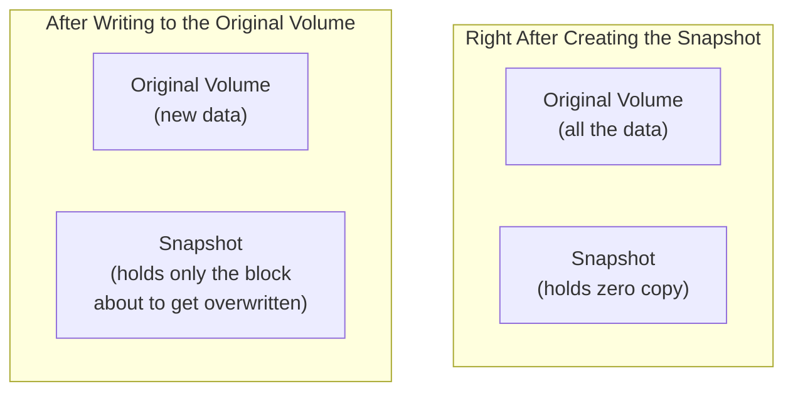

## Introduction

- **What You'll Learn From This Article**: Building on the idea you learned in [How Thin Provisioning Works](/en/articles/thin-provisioning-guide) — "allocate physical space only for the portion that's actually been written" — **confirm with your own hands that an LVM (Logical Volume Manager) snapshot holds zero copy of the original volume the instant it's created, and preserves only the changed portions through a mechanism called copy-on-write.**
- **Intended Audience**: Readers who've worked through [the mdadm RAID5 hands-on](/en/articles/mdadm-raid5-handson-guide), but can't explain exactly what mechanism makes "restoring a past state from a snapshot" possible.
- **Estimated Reading Time**: About 25 minutes, including the hands-on exercise

This article is part of the [Top 1% Series Complete Article Guide](/en/sitemap), and the eleventh article in the [Storage Fundamentals Series](/en/sitemap#series-list). You can follow along with one of the Ubuntu Server environments set up in the [Hands-On Prep Manual](/en/articles/handson-prep-guide).

## Prerequisite Knowledge

- **The Thin Provisioning Idea**: The idea covered in [How Thin Provisioning Works](/en/articles/thin-provisioning-guide) — separating "apparent capacity" from "actual consumption." An LVM snapshot takes this idea one step further.
- **Basic mdadm Operations**: How to create a loopback device, covered in [the mdadm RAID1 hands-on](/en/articles/mdadm-raid-handson-guide).

## Getting the Big Picture

Mistaking a snapshot for "a complete duplicate of the original volume" makes everything that follows impossible to explain. A real LVM snapshot actually behaves like this:



## Hands-On Steps

### Step 1: Create an LVM Logical Volume on a Loopback Device

```bash
sudo apt install -y lvm2
sudo dd if=/dev/zero of=/disk-lvm.img bs=1M count=500
sudo losetup /dev/loop5 /disk-lvm.img
sudo pvcreate /dev/loop5
sudo vgcreate vg_test /dev/loop5
sudo lvcreate -L 300M -n lv_data vg_test
sudo mkfs.ext4 /dev/vg_test/lv_data
sudo mkdir -p /mnt/lvdata
sudo mount /dev/vg_test/lv_data /mnt/lvdata
echo "original data v1" | sudo tee /mnt/lvdata/file.txt
```

### Step 2: Create a Snapshot

```bash
sudo lvcreate -L 100M -s -n lv_snap /dev/vg_test/lv_data
sudo lvs
```

**Output (relevant part):**

```
LV       VG      Attr       LSize   Pool Origin  Data%
lv_data  vg_test owi-aos--- 300.00m
lv_snap  vg_test swi-a-s--- 100.00m      lv_data  0.01
```

**Notice `Data%` is a mere `0.01`.** The snapshot's allocated size is 100MB, but **at this point, the snapshot side holds almost no data at all.** This is the same separation you learned in [thin provisioning](/en/articles/thin-provisioning-guide) — "apparent capacity" versus "actual consumption."

### Step 3: Write to the Original Volume and Confirm How the Snapshot's Consumption Changes

```bash
echo "modified data v2" | sudo tee /mnt/lvdata/file.txt
sudo lvs
```

**Output (relevant part):**

```
LV       VG      Attr       LSize   Pool Origin  Data%
lv_data  vg_test owi-aos--- 300.00m
lv_snap  vg_test swi-a-s--- 100.00m      lv_data  2.73
```

**`Data%` rose from 0.01 to 2.73.** The instant the original volume's data got rewritten, **only the block about to be overwritten — the one targeted for the change — got preserved into the snapshot, through copy-on-write.** The entire original volume was never duplicated onto the snapshot.

<details>
<summary>Where the Name "Copy-on-Write" Comes From</summary>

**The name "copy-on-write" literally describes the timing of the operation itself: "a copy only happens upon a write."** Every time a write occurs against the original volume, LVM first copies only "the pre-change content of the block about to be overwritten" into the snapshot, before actually performing that write. For blocks that never get changed, both the original volume and the snapshot keep referencing the exact same underlying data, even after the snapshot was created.

</details>

### Step 4: Restore a Past State From the Snapshot

```bash
sudo umount /mnt/lvdata
sudo lvconvert --merge /dev/vg_test/lv_snap
sudo mount /dev/vg_test/lv_data /mnt/lvdata
cat /mnt/lvdata/file.txt
```

**Output:**

```
original data v1
```

**It was restored accurately to "original data v1," the content at the moment the snapshot was created.** `lvconvert --merge` is **the process of writing the pre-change block contents, preserved on the snapshot side, back onto the original volume.** Because the snapshot only ever held "the pre-change blocks," this restore is an efficient process that writes back only the changed portions, rather than overwriting the entire volume.

## What a Pro Sees Here (Top 1% Understanding)

### A Snapshot Is Never a Substitute for a Backup

As you confirmed in this hands-on, **an LVM snapshot is a dependent entity, tied to the original volume through a copy-on-write difference relationship.** If the original volume physically fails, the snapshot — which keeps referencing the parts that were never changed — gets lost right along with it. **This mirrors the exact same structure as [RAID being effective against a physical disk failure but powerless against an accidental deletion](/en/articles/mdadm-raid-handson-guide): the idea "I'm fine, I have a snapshot" never holds up against a physical failure.** A snapshot is a mechanism for "quickly reverting to a state from minutes or hours ago," and needs to be understood as serving an entirely different purpose from a real backup, which stores data in a physically independent location.

## Common Misconceptions and Pitfalls

- **Misconception 1: "The instant you create a snapshot, a complete duplicate of the original volume gets made."**
  Right after creation, a snapshot holds almost no data at all; only the block about to be overwritten gets preserved via copy-on-write, each time the original volume is written to.
- **Misconception 2: "A snapshot is a substitute for a backup."**
  Since a snapshot is dependent on the original volume, a physical failure of the original volume takes the snapshot down with it. A real backup stores data in a physically independent location.
- **Misconception 3: "Restoring from a snapshot is a heavy process that overwrites the entire volume."**
  Since a snapshot only holds the pre-change blocks, a restore is an efficient process that writes back only the changed portions.

## Troubleshooting Perspective

1. **A snapshot's Data% is climbing toward 100%**: Heavy writes to the original volume are pushing the copy-on-write preserved data close to the snapshot's allocated capacity. Consider extending the allocated capacity or deleting the snapshot.
2. **A snapshot's allocated capacity ran out**: The snapshot itself becomes corrupted and unusable. A snapshot kept for a long time needs enough allocated capacity to spare.
3. **The original volume's read/write performance degraded after creating a snapshot**: This is expected behavior, since copy-on-write itself adds extra write overhead.

## Summary

- An LVM snapshot holds zero copy of the original volume the instant it's created.
- Every time the original volume gets written to, only the block about to be overwritten gets preserved into the snapshot, through copy-on-write.
- Restoring from a snapshot is an efficient process, writing the preserved pre-change blocks back onto the original volume.
- Because a snapshot is dependent on the original volume, it offers no protection against a physical failure, and is never a substitute for a real backup.

**Takeaways to Apply Today**
1. When operating snapshots, monitor Data% (consumption) and prevent allocated capacity from running out ahead of time.
2. Always treat a snapshot and a real backup stored in a physically independent location as features serving entirely different purposes.

## References

- [lvcreate(8) Manual Page](https://man7.org/linux/man-pages/man8/lvcreate.8.html)
- [LVM — Red Hat Documentation](https://access.redhat.com/documentation/)
