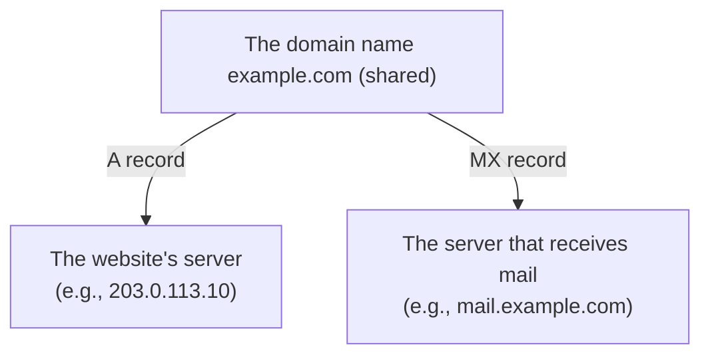
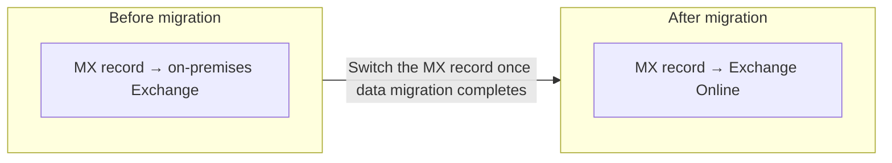

## Introduction

- **What You'll Learn From This Article**: This article explains what the **"domain"** after the `@` in an email address is actually tied to in DNS. It also systematically organizes what an **Exchange server** concretely handles, and what migrating mail from an on-premises Exchange Server to M365 (Exchange Online) **concretely switches over.**
- **Intended Audience**: This article is aimed at engineers who've been involved in migrating mail to M365, but who can't concretely explain what "domain" means for email, or Exchange server's role.
- **Estimated Reading Time**: About 17 minutes

This article is part of the [Top 1% Series' full article guide](/en/sitemap), and the first article in a new series on messaging fundamentals. It assumes you understand general DNS mechanics (particularly MX records) from [Understanding How DNS Works from a "Top 1%" Perspective](/en/articles/dns-guide).

## Prerequisites

- **MX record**: A DNS record specifying "the mail server that receives mail addressed to this domain." See [Understanding How DNS Works from a "Top 1%" Perspective](/en/articles/dns-guide) for details.
- **SMTP**: The protocol used to relay mail between servers.

## Getting the Big Picture

### What "Domain" Means for Email: A Namespace Tied Together via the MX Record

The `example.com` part of the email address `user@example.com` is **the same domain name, existing in the same DNS zone**, as the `example.com` in a website's `https://example.com`. **Even though the two share the same name, which server actual traffic reaches is decided by separate DNS records for each.** Access to a website goes (in most cases) to a specific IP address via an A record, while mail delivery is directed, via an **MX record**, to the hostname of the mail server responsible for receiving mail addressed to that domain.

## Fundamentals, Explained Thoroughly

### How MX Records Work: Redundancy via Priority

An MX record doesn't just specify a single mail server — it **can specify multiple mail servers, each with a priority (lower numbers are higher priority).** The sending mail server first tries delivering to the highest-priority (lowest-numbered) server, and tries the next-priority server if there's no response. This is how mail server redundancy is achieved.

Sender authentication mechanisms (SPF, DKIM, DMARC)

The email world has several mechanisms, using DNS's **TXT record**, as countermeasures against spoofed mail impersonating a sender domain. **SPF** publishes, as a TXT record, "the list of IP addresses of servers allowed to send mail from this domain." **DKIM** publishes, also as a TXT record, "a digital signature attached to the mail, and the public key used to verify it." **DMARC** specifies a policy, based on the SPF/DKIM verification results, for how to handle mail that fails authentication (reject it, quarantine it, and so on). All of these are mechanisms for verifying the legitimacy of the sender, separate from mail delivery itself (the MX record).

### The Two Roles an Exchange Server Handles

**Exchange server** (Microsoft Exchange Server) is a server product from Microsoft that integrates mail, calendar, and contacts management. Its role broadly splits into two:

- **Mail relaying (SMTP relay)**: Sending, receiving, and relaying mail with other mail servers, via the SMTP protocol.
- **Mailbox storage**: Actually storing each user's mail, calendar, and contacts data.

**An on-premises Exchange Server is closely tied to Active Directory, associating an AD user account with an Exchange mailbox to manage it.** The AD DS schema, covered in [Understanding the Difference Between AD and DC, and Domains vs. Forests, from a "Top 1%" Perspective](/en/articles/ad-dc-fundamentals-guide), gets extended with mailbox-related attributes when Exchange Server is deployed.

### What Migrating to M365 (Exchange Online) Concretely Switches Over

**Migrating mail to M365 (Microsoft 365) is the work of moving the two functions previously handled by an on-premises Exchange Server — "mail relaying" and "mailbox storage" — to Exchange Online, a cloud-hosted platform Microsoft operates.** In practice, this migration involves the following main elements:

1. **Migrating existing mailbox data**: Copying each user's mail, calendar, and contacts data from the on-premises Exchange Server to Exchange Online.
2. **Switching the MX record**: Once the migration completes, rewriting the MX record — pointing to the server that receives mail addressed to that domain — from the on-premises Exchange Server to the Exchange Online address. **From this switch onward, newly arriving mail gets received on the Exchange Online side.**
3. **The option of a hybrid configuration**: If you want to migrate in stages, or need to keep some mailboxes on-premises for some reason (such as a compliance requirement), you can choose a **"hybrid configuration"**, letting the on-premises Exchange Server and Exchange Online coexist for a period. In this configuration, mailboxes on both the on-premises and cloud sides can mutually handle mail delivery and calendar free/busy lookups, as if they were a single organization's mail system.

## The View From the Top 1% Perspective

### TTL Management When Switching the MX Record

As covered in [Understanding How DNS Works from a "Top 1%" Perspective](/en/articles/dns-guide), a DNS record has a caching validity period called **TTL (Time To Live)**. **If you're planning to switch an MX record, it's practical convention to set that record's TTL short ahead of time.** If the TTL stays long, some senders may keep referencing a cached, stale MX record (the on-premises one) even after the switch, causing mail to keep arriving on the on-premises side — a source of confusion.

### Typical Reasons a Hybrid Configuration Becomes Necessary

Typical reasons you can't (or don't want to) migrate every mailbox at once include **constraints on time and bandwidth when migrating a large number of mailboxes at once**, and **needing to keep some mailboxes on-premises due to a specific business or compliance requirement.** A hybrid configuration is a realistic option for achieving this kind of staged migration, or a permanent coexistence configuration.

## Common Misconceptions and Pitfalls

- **Misconception 1: "An email domain and a website domain are managed by entirely separate systems"**
  Both exist as the same domain name within the same DNS zone. Access to the website and mail delivery are simply routed to different servers via different record types (A record and MX record).
- **Misconception 2: "Migrating to M365 is just a simple matter of copying mailbox data"**
  Beyond data migration, you need to plan a combination of elements — the timing of switching the MX record, and, if needed, the design of a hybrid configuration.
- **Misconception 3: "An Exchange server is just software that sends and receives mail"**
  An Exchange server handles not just mail relaying (SMTP relay) but also mailbox storage (mail, calendar, contacts), and is closely tied to Active Directory as well.

## The Troubleshooting Perspective

For email-related issues, the basic approach is to **isolate whether the problem is with delivery (the MX record/SMTP), or with sender authentication (SPF/DKIM/DMARC).**

1. **Mail keeps arriving at the old (on-premises) server even after switching the MX record**: The sender's DNS cache may still hold the pre-switch TTL. Wait for it to expire, or check the scope of impact.
2. **Mail appears to send successfully, but the recipient never receives it**: Check whether SPF/DKIM verification failed, causing the receiving side to flag it as spam or reject it.
3. **In a hybrid configuration, mail doesn't get delivered, or loops**: Check the connector configuration between on-premises and Exchange Online (the rule determining which side is the final delivery destination).

### Preventive Measures and Permanent Fixes

- If you're planning to switch an MX record, set its TTL short ahead of time.
- For a large-scale mailbox migration, consider a staged migration plan and the need for a hybrid configuration early on.
- Always revisit SPF, DKIM, and DMARC settings alongside a mail server migration.

## Summary

- "Domain" for email is the same name, within the same DNS zone, as for a website — mail delivery's destination is separately specified via an MX record.
- An Exchange server handles two roles — mail relaying (SMTP relay) and mailbox storage — and is closely tied to Active Directory.
- Migrating to M365 is work combining existing mailbox data migration and switching the MX record, with a hybrid configuration as an option when a staged migration is needed.

**What to Keep in Mind From Today**
1. When you encounter the phrase "email domain," remember its delivery destination is decided by a specific DNS record type — the MX record.
2. When planning to switch an MX record, always set its TTL short ahead of time.

How the MTA and mailbox-management roles that Exchange bundles into a single product can actually be split apart is covered in more depth in [Understanding Mail Server Fundamentals](/en/articles/mail-server-fundamentals-guide), using Postfix and Dovecot as an example. If you want to build one with your own hands, check out [A "Top 1%" Hands-On Lab: Building a Mail Server with Postfix and Dovecot](/en/articles/mail-server-handson-guide) too.

## References

- [Exchange Online Overview | Microsoft Learn](https://learn.microsoft.com/en-us/exchange/exchange-online)
- [How Exchange Hybrid works | Microsoft Learn](https://learn.microsoft.com/en-us/exchange/exchange-hybrid)
- [Sender Policy Framework (SPF) | RFC 7208](https://datatracker.ietf.org/doc/html/rfc7208)
- [DomainKeys Identified Mail (DKIM) Signatures | RFC 6376](https://datatracker.ietf.org/doc/html/rfc6376)
