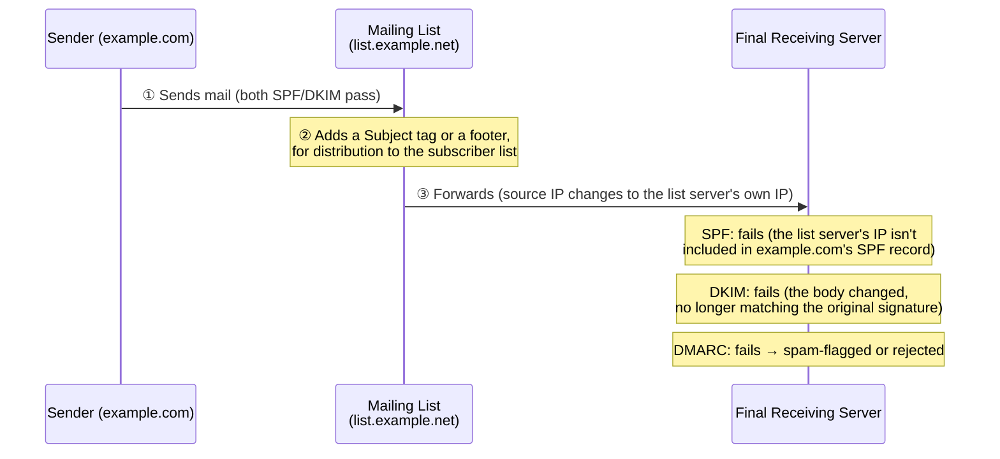
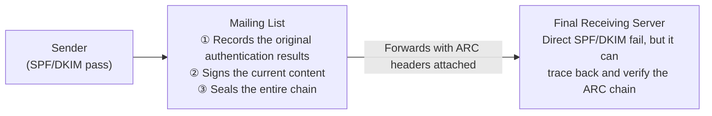

## Introduction

- **What You'll Learn From This Article**: The sender-authentication mechanisms covered in [How SPF, DKIM, and DMARC Work](/en/articles/mail-spf-dkim-dmarc-guide) carry a structural weakness: "**merely passing through a mailing list or a forwarding rule can make both SPF and DKIM fail, even for an email from a completely legitimate sender.**" Understand how **ARC** (Authenticated Received Chain) — a mechanism where the forwarder itself (a mailing list or forwarding service) signs the authentication results it actually observed, and hands that record off to the next destination — addresses this exact problem.
- **Intended Audience**: Readers who understand SPF, DKIM, and DMARC, but have hit the phenomenon of "only mail that went through a mailing list gets rejected by DMARC," and can't explain why.
- **Estimated Reading Time**: About 18 minutes

This article is part of the [Top 1% Series Complete Article Guide](/en/sitemap), and article 4.1 in the [Mail Infrastructure Series](/en/sitemap#series-list).

## Prerequisite Knowledge

- [How SPF, DKIM, and DMARC Work](/en/articles/mail-spf-dkim-dmarc-guide): The premise that SPF verifies the source IP address, while DKIM verifies the body and headers haven't been tampered with.

## Getting the Big Picture

Passing through a mailing list, or a personal forwarding rule (like `.forward`), can **structurally break both SPF and DKIM — even for a completely legitimate email from a legitimate sender.**

## Deep Dive Into the Fundamentals

### Why Forwarding Breaks Both SPF and DKIM

**Why SPF breaks**: SPF verifies [whether the source IP address falls within the range the domain's owner has authorized](/en/articles/mail-spf-dkim-dmarc-guide). Once a message passes through a mailing list, **the source IP visible to the final receiving server changes from the original sender's own IP to the mailing list server's own IP.** That IP, naturally, isn't included in the original sender's domain's SPF record, so SPF fails.

**Why DKIM breaks**: DKIM verifies [whether the body and headers have been tampered with since signing](/en/articles/mail-spf-dkim-dmarc-guide). Many mailing lists **add a footer identifying it as a distribution list, or tag the `Subject` header** (like `[list-name]`), but this is **an operation that changes the message's actual content** — it no longer matches what the original DKIM signature covered, so DKIM verification fails too.

**If both SPF and DKIM fail, [DMARC naturally fails too](/en/articles/mail-spf-dkim-dmarc-guide).** As a result, a completely benign email from a legitimate sender ends up spam-flagged or rejected at the final recipient, for no reason other than "it happened to pass through a mailing list."

### ARC: An Intermediary Signs and Hands Off "the Authentication Results It Observed"

**ARC** (Authenticated Received Chain) addresses this problem with the idea that "**the forwarder itself (a mailing list or forwarding service) records what the original SPF/DKIM/DMARC verification results looked like at the moment it received the message, signs that record, and hands it off to the next destination.**" ARC is built from three main header types.

| Header | Role |
|---|---|
| `ARC-Authentication-Results` | A record of how SPF/DKIM/DMARC were judged, at the moment this intermediary received the message |
| `ARC-Message-Signature` | A DKIM-like signature over the current message content (as it stands after modification), as this intermediary forwards it |
| `ARC-Seal` | A sealing signature over the entire accumulated ARC chain so far (including earlier intermediaries' records) |

**Although direct SPF/DKIM verification does fail, the final receiving server can trace back the ARC chain attached to the message, and confirm, in a verifiable form, the fact that "at the moment this mailing list received it, the original sender's SPF/DKIM genuinely passed."**

Does ARC Mean a Forwarded Email Always Gets Trusted?

**This is an easily misunderstood, important caveat. ARC only carries "a record of the authentication results an intermediary observed," in a verifiable form — the decision of whether to actually trust that record is ultimately left to the receiving mail server's own policy.** A receiving server that doesn't support ARC simply ignores the ARC headers entirely. And even a receiving server that does support ARC still needs to individually manage "which intermediary's ARC signature should actually be trusted." **Adopting ARC never means every forwarded email automatically gets rescued** — that's a point worth keeping in mind.

## What a Pro Sees Here (Top 1% Understanding)

### Consider Adopting ARC With the Awareness That It's Still an "Experimental" Spec

[RFC 8617](https://datatracker.ietf.org/doc/html/rfc8617), which defines ARC, **isn't published as a formal standard — it's positioned as "Experimental."** That said, major mail services like Gmail, Microsoft 365, and Yahoo already support ARC, and it genuinely has a real-world effect. **A top-1% engineer evaluates "the spec's formal status (experimental or a finalized standard)" and "how widely major players actually support it in practice (its real-world effect)" as two separate axes.** ARC needs to be understood as a technology in a somewhat unusual position: still a work in progress on paper, while already carrying real weight in practice.

## Common Misconceptions and Pitfalls

- **Misconception 1: "ARC is a new authentication method that replaces SPF, DKIM, and DMARC."**
  ARC never replaces SPF/DKIM/DMARC — it's a complementary mechanism that compensates for the specific problem of "forwarding breaking these mechanisms."
- **Misconception 2: "Configuring ARC on my own mailing list server automatically resolves every DMARC failure downstream."**
  Whether an ARC record actually gets trusted is up to the final receiving mail server's own policy. If the receiving side doesn't support ARC, it has no effect at all.
- **Misconception 3: "Mail from a mailing list getting rejected by DMARC is a bug in the mailing list software."**
  This isn't a software bug — it's the inevitable, protocol-level result of SPF and DKIM, by design, detecting the source-IP change and content modification inherent to forwarding as a "failure."

## Troubleshooting Perspective

1. **Only mail routed through a mailing list gets rejected or spam-flagged by DMARC**: Check whether the mailing list software supports ARC, and whether the final receiving side is configured to trust ARC.
2. **ARC headers are attached, but it has no effect**: The receiving mail service may not support ARC at all, or it may not be configured to trust that particular intermediary's ARC signature.
3. **DMARC reports show many forwarding-related failures**: This is a classic signal that ARC is actually needed. Check the mailing list software's ARC support status.

## Summary

- Passing through a mailing list or a forwarding rule changes the source IP and modifies the body, structurally breaking both SPF and DKIM, even for a legitimate email — and this can end up getting it rejected by DMARC at the end.
- ARC compensates for this by having the intermediary itself record the authentication results observed at receipt, sign them, and hand them off to the next destination.
- Whether an ARC record actually gets trusted is up to the final receiving mail server's own policy — configuring ARC alone never automatically rescues every forwarded email.
- ARC is still positioned as an "experimental" spec, but major mail services like Gmail already support it, and it already has a real-world effect.

**Takeaways to Apply Today**
1. When you hit mail routed through a mailing list getting rejected by DMARC, first check whether ARC support is in place.
2. When evaluating a new authentication technology, evaluate "its formal spec status" and "how widely major players actually support it" as two separate axes.

## References

- [RFC 8617 - The Authenticated Received Chain (ARC) Protocol](https://datatracker.ietf.org/doc/html/rfc8617)
- [Understanding How SPF, DKIM, and DMARC Work From a Top 1% Perspective](/en/articles/mail-spf-dkim-dmarc-guide)
