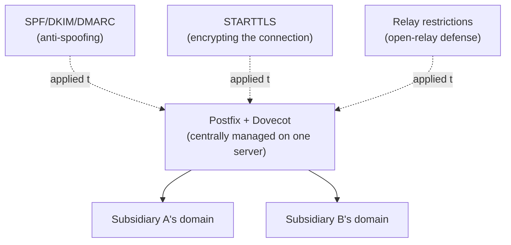

## Introduction

- **What You'll Learn From This Article**: This is the Mail Infrastructure Department's capstone project, where you'll **integrate, on your own, the techniques you've learned one at a time in earlier hands-on labs** (building Postfix/Dovecot, virtual domains for handling multiple domains, SPF/DKIM/DMARC against spoofing, encryption via STARTTLS, open-relay defense, bounce handling) **into a single fictional company's mail infrastructure.** Where earlier articles aimed at "following steps to reliably master one technique," this article takes a format much closer to real-world work: **presenting only requirements, and leaving you to design which techniques to combine, and how.**
- **Intended Audience**: Readers who've worked through the Mail Infrastructure Department's Junior, Senior, and Graduate School content and can execute each individual hands-on lab, but have never designed a single mail infrastructure combining them.
- **Estimated Reading Time**: Expect several days to about a week, including design, building, and documentation (the heaviest single hands-on in this series).

This article is part of the [Top 1% Series Complete Article Guide](/en/sitemap). It's positioned as the capstone project within the [Mail Infrastructure Department's full curriculum](/en/university#mail-infrastructure-department).

## Prerequisite Knowledge

This hands-on doesn't teach any new technique. **You'll combine and use the techniques you've already mastered in the following completed hands-on labs.**

- [The Top 1% Hands-On for Building a Mail Server With Postfix and Dovecot](/en/articles/mail-server-handson-guide)
- [Understanding How SPF, DKIM, and DMARC Work From a Top 1% Perspective](/en/articles/mail-spf-dkim-dmarc-guide)
- [Understanding How STARTTLS Works in SMTP From a Top 1% Perspective](/en/articles/mail-tls-encryption-guide)
- [Understanding How the Mail Queue and Bounces Work From a Top 1% Perspective](/en/articles/mail-queue-bounce-guide)
- [The Top 1% Hands-On for Implementing SPF Checks and DKIM Signing in Postfix and Watching a Spoofed Email Get Rejected](/en/articles/mail-spf-dkim-dmarc-handson-guide)
- [The Top 1% Hands-On for Building a Virtual Domain Setup That Relays Multiple Domains' Mail From One Postfix Server](/en/articles/mail-virtual-domains-handson-guide)
- [The Top 1% Hands-On for Reproducing an Open Relay Yourself and Defending With Correct Restriction Settings](/en/articles/mail-open-relay-handson-guide)

## The Assignment: a Fictional Company's Mail Infrastructure

**You're an infrastructure engineer at a fictional corporate group, "KoiKoi Holdings." This group holds several subsidiaries, each with its own domain, each currently contracting its own separate mail service — and it's migrating to a setup centrally managed on a single server. Your assignment is to build, on your own, a mail infrastructure that satisfies all of the following requirements.**

### Requirement 1: Centrally Manage Mail for Multiple Domains on One Server

**Set up each subsidiary's distinct domain to receive and deliver mail through a single server, without a dedicated server per subsidiary.**

### Requirement 2: Be Able to Reject Spoofed Email

**Spoofed emails impersonating business partners are a growing problem across the industry. Configure the sending side so that email spoofing your own domain gets correctly rejected on the receiving end.**

### Requirement 3: Encrypt the Mail Transmission Path

**In case email content gets eavesdropped on in plaintext over the transmission path, apply encryption. Be mindful of compatibility too, though — connections to older servers that don't support encryption should never be rejected outright.**

### Requirement 4: Eliminate the Risk of Being Abused as a Third-Party Relay

**Structurally eliminate the risk of this server being used, without authorization, as a relay server by a third party, and abused as a spam-sending source.**

### Requirement 5: Properly Handle Mail That Couldn't Be Delivered

**When mail can't be delivered, distinguish whether the problem is temporary or permanent, and set up a system that handles each appropriately (retrying, notifying the sender, and similar).**

### Requirement 6: Keep Operations Staff From Getting Lost During an Incident

**Document, as a runbook, which logs to check and in what order, so you can rapidly identify the cause when someone reports that mail isn't arriving.**

## Deliverable Requirements: Assemble It as a Portfolio

**This hands-on's final deliverable isn't just a record confirming mail could be sent and received.** Put together a repository, on GitHub or similar, containing:

- **README.md**: An overview of this scenario, and the full picture of the mail infrastructure you adopted (including diagrams, such as Mermaid).
- **A record of your design decisions**: Why you chose that specific configuration — especially anywhere a compatibility-versus-security trade-off came up.
- **The steps you actually took**: A record of the Postfix/Dovecot config entries you used and the commands you used to verify them.
- **A retrospective**: What challenges you discovered while doing this, and what you'd additionally consider in genuine real-world work (migrating to a managed mail service, monitoring sender reputation, and similar).

**This deliverable itself is a concrete accomplishment you can present in a job search or as a portfolio piece.** Being able to show "I designed a solution combining multiple techniques under the realistic constraints of multiple coexisting domains, and can articulate the compatibility-versus-security trade-offs" is far more persuasive than simply saying "I did the SPF/DKIM/DMARC hands-on."

## What a Pro Sees Here (Top 1% Understanding)

### "Following Steps" and "Designing From Requirements" Are Entirely Different Skills

Every earlier hands-on in this series took the form of "Step 1, Step 2, ..." — following a fixed, predetermined sequence. **But what actually gets valued in real-world work isn't the ability to execute a procedure exactly as written — it's the ability to look at given requirements (Requirements 1 through 6 in this article) and design, yourself, which techniques to combine, and how.** These are similar-looking but entirely different skills. Completing every individual hands-on doesn't make you immediately effective in real work if you've never designed one coherent mail infrastructure combining them. This capstone project is deliberately designed to bridge exactly that gap.

### Why a "Centralized Multi-Domain Management" Setting?

There's a reason this hands-on deliberately models a realistic project — centrally managing multiple subsidiaries and multiple domains on one server — instead of a single-shot technical demo. **Most real-world mail infrastructure rollouts never wrap up with a single setting on a single domain — they need to simultaneously satisfy multiple elements: multiple domains, anti-spoofing, encryption, and relay restrictions.** Knowing the basics of setting up Postfix alone doesn't help in a real project if you can't also see ahead to anti-spoofing, encryption, and relay restriction. The ultimate goal of this capstone is elevating your knowledge of individual techniques into **the design ability to see multiple domains at once.**

## Common Misconceptions and Pitfalls

- **Misconception 1: "This hands-on has one fixed, correct configuration."**
  There's no single correct answer here. Multiple valid approaches exist as long as they satisfy the requirements. Recording the design you chose, and why, in README.md is what matters.
- **Misconception 2: "A confirmation that mail could be sent and received is sufficient as a deliverable."**
  Confirming it works matters, but it's not enough on its own. Being able to articulate the reasoning behind your design decisions is this hands-on's real value.
- **Misconception 3: "Having completed every individual hands-on means this one will go quickly too."**
  There's a real gap between knowing individual techniques and integrating them into one coherent design. Expect this to take considerable time.

## Troubleshooting Perspective

This hands-on's main challenge isn't individual technical troubleshooting — it's **design rework.**

1. **You thought you satisfied the requirements, but notice a contradiction later**: Before starting implementation, write out only the design section of README.md first, and confirm on paper that all six requirements are genuinely satisfied.
2. **You've forgotten the steps for an individual hands-on**: Don't hesitate to go back and re-read the prerequisite article for that requirement. This capstone tests design ability, not memorization.
3. **You're not sure how thorough to make this**: Use "could I show this README.md to an interviewer I've never met and explain my design decisions" as your bar for completeness.

## Summary

- This capstone project is an integrative exercise combining the techniques you've learned individually in the Mail Infrastructure Department, into a single fictional company's mail infrastructure.
- What's being tested is the ability to design from requirements yourself, not the ability to follow a procedure.
- Assemble your deliverable as a portfolio piece — a document articulating the reasoning behind your design decisions, not just confirmation it worked.

**Takeaways to Apply Today**
1. Even while learning individual hands-on labs, build the habit of asking "under what future requirements would I actually use this?"
2. Beyond the technical deliverable itself, build the habit of articulating compatibility-versus-security trade-offs in your day-to-day work too.

## References

- [The Mail Infrastructure Department's Full Curriculum](/en/university#mail-infrastructure-department)
