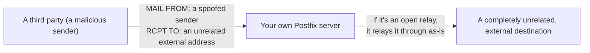

## Introduction

- **What You'll Learn From This Article**: Building on the MTA role covered in [Understanding Mail Server Fundamentals](/en/articles/mail-server-fundamentals-guide), this hands-on deliberately reproduces, inside a test environment, an **open relay** — a dangerous state where an abused MTA lets anyone relay freely through it. You'll then confirm how correctly configuring `smtpd_relay_restrictions` prevents this state.
- **Intended Audience**: Readers who know "open relays are dangerous" as a fact, but have never confirmed firsthand what specific misconfiguration actually creates one. **This hands-on is for educational, defensive purposes — to strengthen the defenses of a test environment you manage yourself. Do not run these steps against someone else's production environment without authorization.**
- **Estimated Reading Time**: About 30 minutes

This article is part of the [Top 1% Series Complete Article Guide](/en/sitemap).

## Prerequisite Knowledge

- **MTA and Relaying via SMTP**: This assumes the mechanism of MTAs forwarding mail to each other over SMTP, covered in [Understanding Mail Server Fundamentals](/en/articles/mail-server-fundamentals-guide).

## The Big Picture



## Hands-On Steps

### Step 1: Deliberately Create an Open Relay State

In `/etc/postfix/main.cf`, deliberately rewrite `smtpd_relay_restrictions` to an overly permissive setting.

```
smtpd_relay_restrictions = permit
```

```bash
sudo systemctl restart postfix
```

**`permit` means unconditionally allowing every relay request, checking neither the sender's nor the recipient's conditions at all.** No one deliberately sets something this permissive in practice, but a real-world incident can arise where a stack of complex conditions effectively ends up equivalent to this.

### Step 2: Try Relaying Mail to an Unrelated External Domain

Try sending mail via telnet, addressed to an external destination entirely unrelated to `mailtest.local`.

```bash
telnet localhost 25
```

```
HELO attacker.example
MAIL FROM:<spoofed@somewhere-else.example>
RCPT TO:<victim@totally-unrelated-domain.example>
DATA
Subject: This should never be relayed

If this succeeds, your server is an open relay.
.
QUIT
```

**If you get back `250`, your server is in a state where it unconditionally relays traffic between two third parties, with neither the sender nor the recipient related to it at all.** This is the real substance of an open relay abused on the actual internet. A malicious sender can use a server in this state as a launchpad, sending bulk spam or phishing mail while keeping their own identity hidden.

### Step 3: Correctly Configure smtpd_relay_restrictions to Defend Against It

Restore `main.cf` to a correct restriction setting.

```
smtpd_relay_restrictions =
    permit_mynetworks,
    permit_sasl_authenticated,
    reject_unauth_destination
```

```bash
sudo systemctl restart postfix
```

Send the exact same query from Step 2 again.

```bash
telnet localhost 25
```

```
HELO attacker.example
MAIL FROM:<spoofed@somewhere-else.example>
RCPT TO:<victim@totally-unrelated-domain.example>
```

**This time, you should get back an error like `554 5.7.1 Relay access denied`, with the relay rejected.**

## What a Pro Sees Here (Top 1% Understanding)

### reject_unauth_destination Is the Real Core of the Defense

Look at Step 3's setting line by line: `permit_mynetworks` (allow from trusted internal networks), `permit_sasl_authenticated` (allow from authenticated users), `reject_unauth_destination` (reject anything else, unless the destination is a domain you're authoritative for). **Of these, the one actually doing the real work of preventing an open relay is the last one, `reject_unauth_destination`.** The two `permit` lines before it are purely an optimization, "quickly allowing legitimate users early" — **keeping this order, with `reject_unauth_destination` last, is what guarantees every other relay request (from outside a trusted network, to a domain you don't manage) gets reliably rejected.**

### Why "Becoming an Open Relay Without Noticing" Happens

The classic real-world pattern that creates an open relay isn't deliberately setting something as extreme as `smtpd_relay_restrictions = permit` — **it's letting the range of `permit_mynetworks` get too broad.** Register your internal network's IP range in `mynetworks`, say, and accidentally specify an overly broad CIDR notation (something close to `0.0.0.0/0`), and **effectively every IP address on the internet gets treated as a "trusted internal network,"** getting allowed by `permit_mynetworks` before `reject_unauth_destination` ever runs. When auditing for an open relay, you always need to check not just what `smtpd_relay_restrictions` says, but **the actual CIDR range registered in `mynetworks`** as well.

## Common Misconceptions and Pitfalls

- **Misconception 1: "An open relay never happens unless you explicitly write permit."**
  In practice, an indirect misconfiguration — an overly broad mynetworks range, for example — can produce the same effective state as an open relay.
- **Misconception 2: "Writing reject_unauth_destination alone is safe regardless of order."**
  Postfix's access control is evaluated top to bottom, so an unintended permit in a line before reject_unauth_destination means execution never reaches it.
- **Misconception 3: "Becoming an open relay causes no real harm to my own server."**
  Once your server gets widely recognized as a spam source, even your legitimate mail can get registered on blacklists and rejected — a genuinely serious consequence.

## Troubleshooting Perspective

1. **Checking whether your own server has become an open relay**: From an external network, attempt to relay to a domain you don't manage, and confirm it gets rejected with `554`.
2. **Legitimate internal users' sends started getting rejected too**: Check whether `mynetworks` correctly includes the legitimate sending IP range.
3. **Your server got registered on an external blacklist**: First check whether it's being abused as an open relay, fix the configuration if so, and then apply to the blacklist operator for removal.

## Summary

- An open relay is a dangerous state where a server unconditionally relays traffic between two third parties, unrelated to either the sender or recipient.
- Placing `reject_unauth_destination` last in `smtpd_relay_restrictions` is the real core of the defense.
- Beyond a deliberate `permit` setting, an overly broad `mynetworks` range can also effectively create the same open-relay state.
- Getting abused as an open relay leads to genuinely serious harm — even legitimate mail getting rejected via blacklists.

**Takeaways to Apply Today**
1. Always verify the order of `smtpd_relay_restrictions` and confirm `reject_unauth_destination` is last.
2. Keep the CIDR range registered in `mynetworks` as narrow as genuinely necessary.

## References

- [Postfix SMTP Relay and Rejection Settings](https://www.postfix.org/SMTPD_ACCESS_README.html)
- [Open Mail Relay | Wikipedia](https://en.wikipedia.org/wiki/Open_mail_relay)
