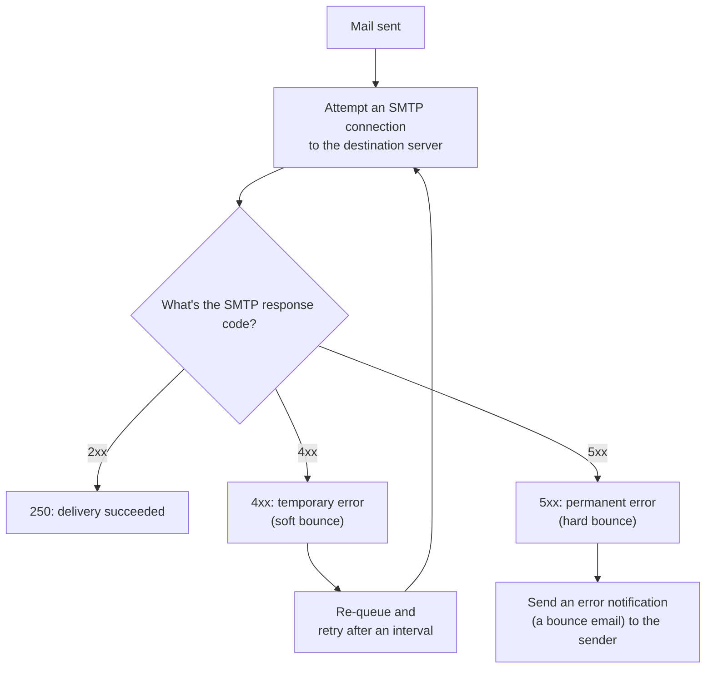

## Introduction

- **What You'll Learn From This Article**: Beyond the SMTP commands covered in [The Top 1% Hands-On for Building a Mail Server With Postfix and Dovecot](/en/articles/mail-server-handson-guide), this article gives you a systematic understanding of **what Postfix actually does internally when a sent email doesn't arrive right away.** It covers how mail gets temporarily placed in a **queue**, and the difference between a **soft bounce** (a temporary error) and a **hard bounce** (a permanent error).
- **Intended Audience**: Readers who've seen mail "fail to arrive" before, but can't explain how Postfix retries behind the scenes, or when it gives up.
- **Estimated Reading Time**: About 15 minutes

This article is part of the [Top 1% Series Complete Article Guide](/en/sitemap), the 5th article in the [Mail Infrastructure Series](/en/sitemap#series-list).

## Prerequisite Knowledge

- **Mail Forwarding via SMTP**: This assumes the MTA-to-MTA forwarding mechanics via SMTP covered in [Understanding Mail Server Fundamentals](/en/articles/mail-server-fundamentals-guide).

## The Big Picture



## A Thorough, Grounds-Up Explanation

### The Mail Queue: Not Giving Up Right Away, Even Without Immediate Delivery

When Postfix accepts a piece of mail, it first stores it temporarily in a **queue** (under `/var/spool/postfix/`). Even if it attempts a connection to the destination server and fails, **it doesn't discard the mail on the spot — it keeps it in the queue and retries after an interval.** The `mailq` command lets you list mail currently sitting in the queue.

```bash
mailq
```

### Soft Bounce vs. Hard Bounce: The First Digit of the SMTP Response Code Decides Its Fate

The response code from the destination server carries **an entirely different meaning depending on its leading digit.**

| Response Code | Category | Meaning | Postfix's Behavior |
|---|---|---|---|
| **2xx** | Success | Delivery completed normally | Removed from the queue |
| **4xx** | Temporary error (soft bounce) | The recipient's mailbox is full, temporary overload, and similar | Kept in the queue, retried later |
| **5xx** | Permanent error (hard bounce) | The destination address doesn't exist, the domain doesn't exist, and similar | Not retried; an error notification (a bounce email) is sent to the sender |

**Remembering the distinction — 4xx (soft bounce) is a temporary state, "no good right now, but might succeed later," while 5xx (hard bounce) is a permanent state, "will never succeed no matter how many times you try"** — lets you predict how Postfix will behave next just by seeing the response code.

### An Expiration: Retries Don't Continue Forever

Even soft-bounce retries have an upper limit, **`maximal_queue_lifetime`** (5 days by default). If delivery still hasn't succeeded once this period elapses, Postfix gives up and sends a bounce email back to the sender.

## What a Pro Sees Here (Top 1% Understanding)

### Why a Bounce Email's Sender Address Is "Blank"

Look closely at a bounce email, and you'll notice **its sender address (`MAIL FROM`) is empty (`<>`).** This is a deliberate design choice, distinct from an ordinary mail send, as covered in [The Top 1% Hands-On for Building a Mail Server With Postfix and Dovecot](/en/articles/mail-server-handson-guide)'s treatment of SMTP and `MAIL FROM`. **If a bounce email itself carried a normal sender address, delivery of that bounce email failing would produce a bounce-of-a-bounce, and that chain could repeat infinitely.** Using an empty sender address (the null sender, `<>`) **deliberately forbids generating a bounce for a bounce, at the protocol level.**

### Why Bounce Rate Directly Determines a Bulk Sender's Reputation

Major mail providers like Gmail and Outlook **monitor the rate of hard bounces, per sending domain and IP address, as a key signal for judging a sender's reputation.** A source that keeps sending large volumes to nonexistent addresses gets judged as likely running sloppy list management — a probable spammer — and **even a legitimate newsletter can end up routed to spam, or rejected outright.** Anyone handling email marketing in real-world work needs to promptly remove any address that produces a hard bounce from future send lists, to protect their sender reputation.

## Common Misconceptions and Pitfalls

- **Misconception 1: "A single delivery failure means an error goes back to the sender right away."**
  For a temporary error (a soft bounce, 4xx), Postfix doesn't give up right away — it keeps the mail queued and keeps retrying.
- **Misconception 2: "A bounce email carries a normal sender address, just like an ordinary email."**
  To prevent an infinite chain of bounces, the sender address is deliberately set empty (the null sender).
- **Misconception 3: "Bounce rate is just a statistic, with no effect on future delivery."**
  Major providers monitor bounce rate as a signal for sender reputation, and a high bounce rate hurts future deliverability.

## Troubleshooting Perspective

1. **Mail isn't arriving for a while**: Check `mailq` for anything stuck in the queue, and use `postqueue -p` to check the detailed status.
2. **Mail to a specific address never seems to arrive**: Check the response code in `mail.log` to separate 4xx (a temporary error, possibly still retrying) from 5xx (a permanent error, likely already bounced).
3. **Legitimate marketing email started landing in spam**: Check whether your recent hard-bounce rate has risen, and remove invalid addresses from the list.

## Summary

- Even when delivery fails right away, Postfix keeps mail in the queue and retries at intervals.
- SMTP response codes distinguish a soft bounce (4xx, a temporary error subject to retry) from a hard bounce (5xx, a permanent error, bounced immediately).
- A bounce email's sender address is deliberately set to empty (the null sender) to prevent an infinite chain.
- Hard bounce rate is a key signal directly tied to sender reputation, making removing invalid addresses genuinely important in practice.

**Takeaways to Apply Today**
1. When troubleshooting mail delivery, first separate whether the response code is 4xx or 5xx.
2. If you handle email marketing, promptly remove any address that produces a hard bounce from your list.

## References

- [Postfix Queue Management](https://www.postfix.org/QSHAPE_README.html)
- [Simple Mail Transfer Protocol | RFC 5321](https://datatracker.ietf.org/doc/html/rfc5321)
