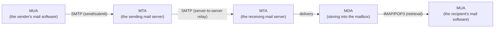
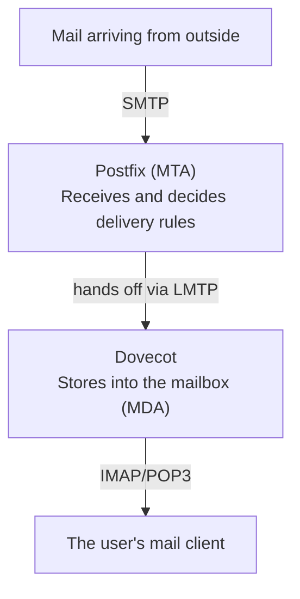

## Introduction

- **What you'll get from this article**: A systematic understanding of the three-way division of labor in a mail system — **MTA, MDA, and MUA** — the difference between **SMTP** (transfer between mail servers) and **IMAP/POP3** (retrieval from a mailbox), and what the commonly-mentioned **Postfix** (an MTA) and **Dovecot** (an IMAP/POP3 server) each actually do.
- **Intended audience**: Anyone who read [Understanding Email Migration to M365 from a "Top 1%" Perspective](/en/articles/m365-email-fundamentals-guide) and understands Exchange Server and M365 migration, but has zero hands-on experience building or migrating a mail server, has only heard names like Postfix and Dovecot in passing, and can't concretely explain what each piece of software actually does.
- **Estimated reading time**: About 17 minutes

This article is part of the [Top 1% Series' full article guide](/en/sitemap), the 2nd in the [Messaging Fundamentals Series](/en/sitemap#series-list). The [mail server hands-on lab](/en/articles/mail-server-handson-guide) that follows builds everything covered here with your own hands.

## Prerequisite Knowledge

- **SMTP and MX records**: The basics of how mail gets routed to a domain are covered in [Understanding Email Migration to M365](/en/articles/m365-email-fundamentals-guide).

## Getting the Big Picture

### The three roles that make up a mail system: MTA, MDA, and MUA

Getting mail from a sender to a recipient actually involves **three distinct roles.**

| Role | Full name | What it does | Representative software |
|---|---|---|---|
| **MUA** | Mail User Agent | The software a user actually operates to compose and read mail | Outlook, Thunderbird, a smartphone's mail app |
| **MTA** | Mail Transfer Agent | Transfers (relays) mail between mail servers using SMTP | **Postfix**, Sendmail, Exchange (its SMTP relay function) |
| **MDA** | Mail Delivery Agent | Actually stores mail that's been transferred into a user's mailbox | **Dovecot** (its LMTP function), procmail |

The **Exchange server** covered in [Understanding Email Migration to M365](/en/articles/m365-email-fundamentals-guide) **bundles this MTA role (mail transfer) together with the MDA-equivalent function (mailbox storage) into a single product.** When building a mail server on Linux, though, these roles are typically realized as **a combination of Postfix (the MTA) and Dovecot (the MDA plus retrieval from the mailbox) — separate, specialized pieces of software.**

## A Thorough, Grounds-Up Explanation

### SMTP's job stops at "transfer" — "retrieval" is a different protocol's job entirely

This is the point that gets misunderstood the most. **SMTP (Simple Mail Transfer Protocol) is the protocol for "transferring" mail from a sender to the receiving mail server — the part after that, where a user "retrieves" the contents of their own mailbox, is outside SMTP's scope entirely.** Retrieving from a mailbox uses a completely different protocol: **IMAP** or **POP3**.

| Protocol | Role | Characteristics |
|---|---|---|
| **SMTP** | Sending mail, server-to-server transfer | Port 25 (server-to-server relay), 587 (authenticated submission) |
| **IMAP** | Retrieving/syncing a mailbox | Leaves mail on the server, letting multiple devices view a synced copy of the same mailbox. Port 143 (plaintext) / 993 (encrypted). |
| **POP3** | Retrieving from a mailbox | Basically downloads mail to the device and deletes it from the server (today, "leave on server" is the common setting). Poor fit for syncing across multiple devices. Port 110 (plaintext) / 995 (encrypted). |

**Much of the "mail can be sent but doesn't show up in the inbox" class of problem starts by figuring out, using exactly this division of roles, whether the issue is on the SMTP (transfer) side or the IMAP/POP3 (retrieval) side.**

### The division of labor between Postfix and Dovecot, and what connects them

Postfix receives mail arriving from outside via SMTP and **hands it off to the destination user's mailbox**, but **Postfix itself doesn't speak IMAP or POP3.** Managing the mailbox and handling IMAP/POP3 retrieval is Dovecot's job. The typical setup has these two pieces of software cooperate internally via **LMTP** (Local Mail Transfer Protocol), a lightweight protocol similar to SMTP.

**Once you understand "Postfix handles send/receive, Dovecot handles storage and retrieval," you can immediately tell, when something breaks, whether you should be investigating mail transfer (Postfix's logs) or mailbox retrieval (Dovecot's logs) — no more guessing.**

### Mailbox storage formats: Maildir vs. mbox

Dovecot stores mail on disk in one of two broad formats.

| Format | Mechanism | Characteristics |
|---|---|---|
| **mbox** | One mailbox = one giant text file | An old-established format. Requires lock management when multiple processes write concurrently, and carries a risk of file corruption. |
| **Maildir** | One message = one independent file | The current mainstream choice. No locking needed — adding or deleting a message is self-contained per file, making it robust and resilient to concurrent access. |

Current setups widely adopt **Maildir for its robustness.**

### The authentication mechanism: SASL, and Dovecot's surprising role

When it comes to sending mail, **letting "anyone freely relay mail through this server" (an open relay) is a serious security risk that gets your server used as a spam launchpad.** To prevent this, an authentication mechanism called **SASL** (Simple Authentication and Security Layer) is used, so that only legitimate users can send (submit) mail.

What's easy to overlook in practice here is that **Postfix doesn't have its own SASL authentication feature — the typical setup borrows the "Dovecot SASL" authentication feature that Dovecot provides.** In other words, **Dovecot's user database, which already handles IMAP/POP3 user authentication, gets reused for SMTP submission authentication too**, centralizing username/password management in one place.

## The View From the Top 1% Perspective

### Why doesn't the open-source world bundle everything into one product like Exchange?

Exchange's approach — bundling MTA, mailbox management, and groupware features into a single product — has the advantage of **operational simplicity.** By contrast, the Postfix+Dovecot approach — **combining specialized software, each for a specific function** — reflects the design philosophy traditionally prized in Unix-like OSes: "give each program one job, and combine them." This setup has the advantage of **high flexibility for partial replacement** — you can swap out just the MTA for a different implementation (like Sendmail), or freely choose where mailboxes are stored. This connects to the same idea covered in [What Is a Framework?](/en/articles/software-framework-guide) — that "swapping out a library is comparatively easy" — a benefit of loose coupling in design.

### Sender authentication (SPF/DKIM/DMARC) belongs to neither Postfix nor Dovecot

SPF, DKIM, and DMARC, covered in [Understanding Email Migration to M365](/en/articles/m365-email-fundamentals-guide), are **a mechanism that belongs to neither Postfix nor Dovecot — it's completed entirely on the DNS side.** That said, actually attaching a DKIM signature is typically achieved by integrating an external module like `OpenDKIM` into Postfix. It's important to understand "the role of the server software" and "the DNS-based sender-verification mechanism" as independent layers.

## Common Misconceptions and Pitfalls

- **Misconception 1: "Configuring SMTP alone is enough to handle sending and receiving mail entirely"**
  SMTP's job stops at transfer — a user retrieving the contents of their mailbox requires a different protocol, IMAP or POP3.
- **Misconception 2: "Postfix and Dovecot are competing pieces of software — you pick one or the other"**
  They aren't competitors — they're complementary software, dividing the MTA role (Postfix) from mailbox management/retrieval (Dovecot).
- **Misconception 3: "Postfix manages user authentication for sending mail entirely on its own"**
  In the typical setup, Postfix borrows the SASL authentication feature Dovecot provides, centralizing the user database on the Dovecot side.

## The Troubleshooting Perspective

For mail server issues, the basic approach is to **isolate whether the problem is on the transfer side (Postfix/SMTP) or the retrieval side (Dovecot/IMAP).**

1. **Mail from outside isn't arriving**: Check Postfix's logs (e.g. `/var/log/mail.log`) to confirm whether SMTP reception is even happening.
2. **Mail should have arrived, but it's not showing up in the mail client**: Check Dovecot's logs to confirm whether IMAP/POP3 authentication and retrieval are working correctly.
3. **Can't send mail (an authentication error)**: Check the SASL authentication configuration (the integration between Postfix and Dovecot SASL).

### Preventive Measures and Permanent Fixes

- Know where Postfix's and Dovecot's logs live ahead of time, so you're never unsure which one to investigate first when something breaks.
- Adopt the Maildir format for mailbox storage, for its robustness.
- Keep the SASL authentication configuration consistent with Dovecot's user database.

## Summary

- A mail system is made up of three roles — MTA (transfer), MDA (storage), and MUA (viewing) — and Exchange bundles the MTA and MDA-equivalent functions into a single product.
- SMTP handles transfer only; retrieving from a mailbox uses a different protocol, IMAP or POP3.
- Postfix (the MTA) and Dovecot (MDA plus IMAP/POP3) are complementary software that cooperate via LMTP, and SASL authentication typically borrows Dovecot's feature too.
- Maildir is now widely adopted for mailbox storage, for its superior robustness.

**What to Keep in Mind From Today**
1. When you hit a mail-related problem, start by isolating whether it's a transfer issue (SMTP/Postfix) or a retrieval issue (IMAP/POP3/Dovecot).
2. When you hear the names "Postfix" and "Dovecot," remember they handle two different roles: the MTA, and mailbox management.

## References

- [Postfix Documentation](https://www.postfix.org/documentation.html)
- [Dovecot Documentation](https://doc.dovecot.org/)
- [Simple Mail Transfer Protocol | RFC 5321](https://datatracker.ietf.org/doc/html/rfc5321)
- [Internet Message Access Protocol (IMAP) - Version 4rev2 | RFC 9051](https://datatracker.ietf.org/doc/html/rfc9051)
