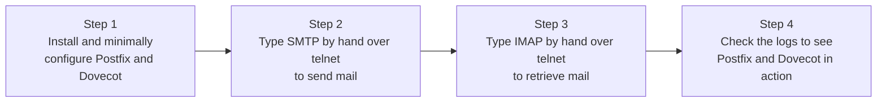

## Introduction

- **What you'll get from this article**: You'll verify, with your own eyes, the MTA/MDA/SMTP/IMAP knowledge from [Understanding Mail Server Fundamentals](/en/articles/mail-server-fundamentals-guide) by **actually installing and configuring Postfix and Dovecot, and typing raw protocol commands by hand over telnet to send and receive mail.**
- **Intended audience**: Anyone with no real-world experience building or migrating a mail server, who wants to first build a minimal mail server on a single VM and confirm how it behaves.
- **Estimated reading time**: About 20 minutes (including doing the hands-on steps)

This article is part of the [Top 1% Series' full article guide](/en/sitemap), the 3rd in the [Messaging Fundamentals Series](/en/sitemap#series-list). If you already have the Ubuntu Server environment from the [Hands-On Prep Manual](/en/articles/handson-prep-guide), you can do this without building an additional VM.

## Prerequisite Knowledge

- **The MTA/MDA, SMTP/IMAP, and Postfix/Dovecot division of roles**: Read [Understanding Mail Server Fundamentals](/en/articles/mail-server-fundamentals-guide) first.

## Getting the Big Picture

Everything you'll do in this hands-on lab is just these 4 steps.



## Hands-On Steps

### Step 1: Install and minimally configure Postfix and Dovecot

On Ubuntu Server, install Postfix and Dovecot (an IMAP server).

```bash
sudo apt update
sudo apt install -y postfix dovecot-imapd
```

When Postfix's configuration wizard appears during installation, select "**Internet Site**" and enter a system mail name (e.g., `mailtest.local`).

Next, configure the mailbox storage format to **Maildir** (one message per file).

```bash
sudo postconf -e 'home_mailbox = Maildir/'
sudo systemctl restart postfix
```

Configure Dovecot to reference the same Maildir format. Edit `/etc/dovecot/conf.d/10-mail.conf` and add (or change) the following line.

```
mail_location = maildir:~/Maildir
```

Restart Dovecot after making the change.

```bash
sudo systemctl restart dovecot
```

Finally, create two local users to test sending and receiving mail.

```bash
sudo useradd -m alice
sudo useradd -m bob
sudo passwd bob   # set a password for bob, which you'll use to log in via IMAP later
```

### Step 2: Type raw SMTP commands by hand over telnet to send mail

As explained in [Mail Server Fundamentals](/en/articles/mail-server-fundamentals-guide), SMTP is a text-based protocol. Rather than using a convenient tool like the `mail` command, **deliberately connect directly to port 25 with telnet and type SMTP commands by hand, one line at a time**, to feel its true nature.

```bash
telnet localhost 25
```

After connecting, type the following commands in order (`S:` lines are the server's responses; everything else is a line you type).

```
S: 220 mailtest.local ESMTP Postfix
HELO client.local
MAIL FROM:<alice@mailtest.local>
RCPT TO:<bob@mailtest.local>
DATA
Subject: Hello from telnet

This is a test message typed by hand over raw SMTP.
.
QUIT
```

After `DATA`, the body must end with **a line containing only a single `.`**. This is SMTP's delimiter marking "the end of the message body." A response of `250 2.0.0 Ok: queued as ...` means Postfix accepted the mail successfully.

### Step 3: Confirm it was saved as a file in Maildir

As explained in [Mail Server Fundamentals](/en/articles/mail-server-fundamentals-guide), the Maildir format stores **one message as one independent file.** Let's actually confirm this.

```bash
sudo ls -la /home/bob/Maildir/new/
```

The mail you just sent should exist as a single file. You can see, with your own eyes, that mail is being "delivered" through **the extremely simple mechanism of one more file appearing in this directory.**

### Step 4: Type raw IMAP commands by hand over telnet to retrieve mail

Next, retrieve the mail that just arrived, using IMAP — a different protocol from SMTP.

```bash
telnet localhost 143
```

```
S: * OK [CAPABILITY ...] Dovecot ready.
a LOGIN bob (bob's password)
a SELECT INBOX
a FETCH 1 BODY[]
a LOGOUT
```

**IMAP commands, unlike SMTP, require prefixing an arbitrary tag (identifier) like `a` at the start.** If `FETCH 1 BODY[]` returns the exact content of the message you sent in Step 2, you've confirmed with your own hands the full flow: mail "delivered" via SMTP, then "retrieved" via IMAP.

### Step 5: Check the logs to see Postfix's and Dovecot's activity separately

Finally, do the single most important thing in real-world practice: **checking the logs.**

```bash
sudo tail -n 30 /var/log/mail.log
```

Confirm that this log contains **a record of mail reception from Postfix's process (like `postfix/smtpd`)** and **a record of an IMAP login from Dovecot's process (like `dovecot`)**, as separate lines. You'll experience, firsthand, what the "transfer (Postfix) or retrieval (Dovecot)" isolation from [Mail Server Fundamentals](/en/articles/mail-server-fundamentals-guide) actually looks like in the real logs.

<details>
<summary>Stepping up: try authenticated submission with SASL (port 587)</summary>

If you have energy left, try setting up authenticated mail submission using Dovecot SASL (port 587). Enabling a SASL socket for Postfix in `/etc/dovecot/conf.d/10-master.conf`, combined with the `smtpd_sasl_auth_enable`-related settings on the Postfix side, lets you actually configure the "Postfix borrows Dovecot SASL" integration covered in [Mail Server Fundamentals](/en/articles/mail-server-fundamentals-guide).

</details>

## The View From the Top 1% Perspective

### Don't stop at "it worked" — review what each command actually meant

The value of this hands-on lab isn't just the result of "mail could be sent and received" — it's **reviewing, one by one, what each SMTP command (`HELO`, `MAIL FROM`, `RCPT TO`, `DATA`) and each IMAP command (`LOGIN`, `SELECT`, `FETCH`) actually declares or requests.** When you hit a real mail server problem in practice, typing these commands by hand via `telnet` or `openssl s_client` to check the response is a genuinely effective diagnostic technique — it **isolates the problem at the protocol level, without going through the black box of a mail client.**

## Common Misconceptions and Pitfalls

- **Misconception 1: "Verifying a mail server's operation always requires a real mail client (like Outlook)"**
  You can verify a mail server's basic operation just by typing raw SMTP/IMAP commands by hand with `telnet` or a similar tool.
- **Misconception 2: "After the `DATA` command, you can keep typing the body freely, indefinitely"**
  The end of the body must be explicitly signaled with a line containing only a single `.`.

## The Troubleshooting Perspective

1. **Can't even connect with `telnet localhost 25`**: Check whether Postfix is running (`sudo systemctl status postfix`) and whether a firewall is blocking port 25.
2. **Sending over SMTP appears to succeed, but no file appears in Maildir**: Confirm the `home_mailbox = Maildir/` setting took effect, using `postconf home_mailbox`.
3. **Can't log in via IMAP**: Check whether Dovecot is running, and whether the user's password is set correctly (`sudo passwd bob`).

### Preventive Measures and Permanent Fixes

- When building a new mail server environment, always do a manual SMTP/IMAP connectivity check like this hands-on lab before sending real mail through it.
- Know Postfix's and Dovecot's log locations, and what their normal-operation log patterns look like, ahead of time.

## Summary

- A minimal Postfix/Dovecot setup can be built with just a package install and Maildir configuration.
- Typing SMTP commands by hand over telnet lets you directly confirm that "sending" mail happens through a text-based protocol.
- With the Maildir format, you can see with your own eyes that a sent message is saved as a single independent file.
- Typing IMAP commands by hand over telnet confirms that "retrieval" happens through a different protocol than SMTP.

**What to Keep in Mind From Today**
1. When you hit a mail server problem, build the habit of first checking raw protocol-level connectivity with `telnet` or `openssl s_client`, rather than relying on a mail client.
2. Always confirm Postfix's and Dovecot's log locations at the time you build the server.

## References

- [Postfix Documentation](https://www.postfix.org/documentation.html)
- [Dovecot Documentation](https://doc.dovecot.org/)
- [Simple Mail Transfer Protocol | RFC 5321](https://datatracker.ietf.org/doc/html/rfc5321)
