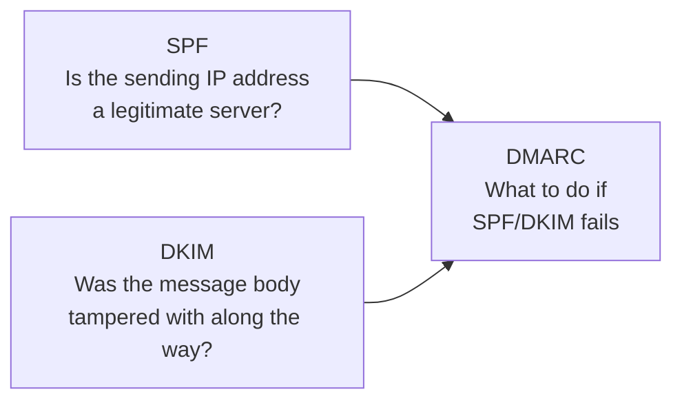

## Introduction

- **What You'll Learn From This Article**: Building on the SMTP mechanics covered in [Understanding Mail Server Fundamentals](/en/articles/mail-server-fundamentals-guide), this article gives you a systematic understanding of the structural weakness SMTP has — letting a sender's domain be spoofed — and how **SPF, DKIM, and DMARC** compensate for it, each with a distinct role.
- **Intended Audience**: Readers who've heard the terms SPF, DKIM, and DMARC, but can't explain what each one actually proves, or why three separate mechanisms are needed instead of just one.
- **Estimated Reading Time**: About 16 minutes

This article is part of the [Top 1% Series Complete Article Guide](/en/sitemap), the 4th article in the [Mail Infrastructure Series](/en/sitemap#series-list).

## Prerequisite Knowledge

- **MTA, SMTP, and DNS Records**: This assumes the mail-forwarding mechanics of SMTP covered in [Understanding Mail Server Fundamentals](/en/articles/mail-server-fundamentals-guide).

## The Big Picture

### SMTP Has a Structural Weakness: the Sender Can Be Spoofed

As covered in the hands-on for [Understanding Mail Server Fundamentals](/en/articles/mail-server-fundamentals-guide), SMTP's `MAIL FROM` command **lets you write essentially any address you want as the claimed sender.** The receiving server never verifies, at the protocol level, whether this command genuinely came from that domain's legitimate sender. This weakness is exactly what makes spoofed-sender attacks — phishing, for example — possible.



## A Thorough, Grounds-Up Explanation

### SPF: A Declaration of "Mail From This Domain Should Come From This IP"

**SPF** (Sender Policy Framework) is a mechanism for **declaring, as a DNS TXT record, which IP addresses mail from a given domain is legitimately expected to come from.**

```
example.com.  IN  TXT  "v=spf1 ip4:203.0.113.10 include:_spf.google.com -all"
```

The receiving mail server queries DNS for the SPF record matching the domain in the incoming mail's `MAIL FROM` (`example.com`), and **checks whether the actual sending IP address is included in that declaration.** If it isn't, SPF validation fails.

### DKIM: Attaching a Digital Signature to the Message Body and Some Headers

**DKIM** (DomainKeys Identified Mail) is a mechanism where the sending mail server **creates a digital signature, using a private key, over the message body and some headers, attaching it as a `DKIM-Signature` header.** The receiver verifies this signature using the public key (the DKIM record) published in the sending domain's DNS. **Where SPF verifies "the path" (the sending IP address), DKIM verifies "the content" — whether the body and headers were tampered with along the way** — an entirely different concern.

### DMARC: The Policy for What to Do If SPF/DKIM Fails

SPF and DKIM each return their own independent verification result (pass or fail), but **neither specifies what the receiver should actually do with that result** — accept it, send it to spam, or reject it. **DMARC** (Domain-based Message Authentication, Reporting, and Conformance) is the mechanism letting the sending domain's own owner declare that "what to do on failure" policy.

```
_dmarc.example.com.  IN  TXT  "v=DMARC1; p=reject; rua=mailto:report@example.com"
```

`p=reject` is an explicit request from the sending domain's owner: "please reject any mail where both SPF and DKIM (or either, depending on the alignment setting) fail."

## What a Pro Sees Here (Top 1% Understanding)

### "Alignment," DMARC's Other Crucial Verification Axis

DMARC's core isn't simply checking whether SPF/DKIM passed or failed. **It has another verification axis, called "alignment": whether the domain in the `From` header matches the domain that SPF/DKIM actually verified.** Say an attacker sends mail from `attacker.com`, a domain they fully control, where that domain's own SPF/DKIM pass legitimately, while spoofing only the display name in the `From` header to look like `example.com`. **SPF/DKIM themselves pass, but since alignment doesn't match, DMARC still fails.** Not knowing this leads to the seemingly contradictory experience of "SPF and DKIM should both be passing — why is DMARC rejecting it?"

### Why Rolling Out SPF/DKIM/DMARC Should Be Gradual, Not "Straight to Reject"

DMARC's `p` tag has three levels: `none` (do nothing, reports only), `quarantine` (send to spam), and `reject` (reject outright). **In practice, the standard approach isn't starting straight at `p=reject` — it's starting with `p=none`, first collecting reports (aggregate reports sent to the address specified in `rua`), confirming every legitimate sender is passing SPF/DKIM, and only then gradually raising it to `quarantine`, then `reject`.** Skip this, and mail from a legitimate sender you didn't even know about (a marketing tool, say) can end up getting rejected by DMARC — a genuine incident.

## Common Misconceptions and Pitfalls

- **Misconception 1: "Setting up either SPF or DKIM alone is enough for anti-spoofing defense."**
  SPF verifies the path and DKIM verifies the content — different concerns — and some spoofing patterns get through if you only set up one.
- **Misconception 2: "Passing SPF/DKIM guarantees passing DMARC too."**
  DMARC also checks alignment (matching against the From header), so DMARC can still fail even when SPF/DKIM themselves pass.
- **Misconception 3: "You should start with p=reject from day one when adopting DMARC."**
  Jumping straight to reject before fully accounting for every legitimate sender risks rejecting mail unintentionally — a gradual rollout starting from p=none is standard practice.

## Troubleshooting Perspective

1. **Legitimate mail is getting rejected as spoofed**: Check whether the SPF record includes every actual sending IP address, including easily-forgotten senders like marketing tools.
2. **SPF/DKIM should be passing, but DMARC fails**: Check whether the domain in the `From` header matches the domain SPF/DKIM actually verified (alignment).
3. **DMARC reports never arrive**: Check whether the address specified in the DMARC record's `rua` tag can actually receive mail correctly.

## Summary

- SPF verifies the sending IP address, and DKIM verifies whether the body and headers were tampered with — independently of each other.
- DMARC combines the SPF/DKIM verification results with alignment (matching against the From header), letting the sending domain's owner declare what to do on failure.
- Rolling out DMARC starts with report collection at p=none, gradually raised to quarantine, then reject.

**Takeaways to Apply Today**
1. Treat SPF, DKIM, and DMARC as independent mechanisms verifying different things.
2. When adopting DMARC, don't jump straight to reject — start by collecting reports at p=none.

## References

- [Sender Policy Framework (SPF) | RFC 7208](https://datatracker.ietf.org/doc/html/rfc7208)
- [DomainKeys Identified Mail (DKIM) Signatures | RFC 6376](https://datatracker.ietf.org/doc/html/rfc6376)
- [Domain-based Message Authentication, Reporting, and Conformance (DMARC) | RFC 7489](https://datatracker.ietf.org/doc/html/rfc7489)
