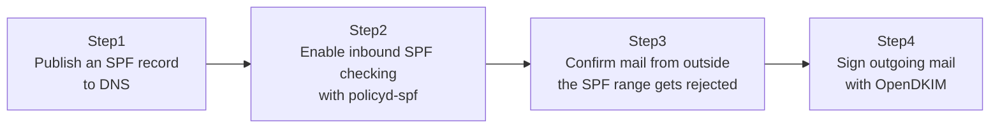

## Introduction

- **What You'll Learn From This Article**: This verifies what you learned in [Understanding How SPF, DKIM, and DMARC Work](/en/articles/mail-spf-dkim-dmarc-guide) by actually wiring **SPF checking (policyd-spf)** and **DKIM signing (OpenDKIM)** into the `mailtest.local` environment you built in [The Top 1% Hands-On for Building a Mail Server With Postfix and Dovecot](/en/articles/mail-server-handson-guide). You'll watch firsthand as mail from a sender outside the SPF record actually gets rejected, and as outgoing mail automatically gets a `DKIM-Signature` header attached.
- **Intended Audience**: Readers who've already finished [The Top 1% Hands-On for Building a Mail Server With Postfix and Dovecot](/en/articles/mail-server-handson-guide) and [Understanding How SPF, DKIM, and DMARC Work](/en/articles/mail-spf-dkim-dmarc-guide).
- **Estimated Reading Time**: About 45 minutes

This article is part of the [Top 1% Series Complete Article Guide](/en/sitemap).

## Prerequisite Knowledge

- **The Division of Roles Between SPF, DKIM, and DMARC**: This assumes [Understanding How SPF, DKIM, and DMARC Work](/en/articles/mail-spf-dkim-dmarc-guide).
- **Sending and Receiving Mail With Postfix**: This assumes the environment from [The Top 1% Hands-On for Building a Mail Server With Postfix and Dovecot](/en/articles/mail-server-handson-guide).
- **Managing a Zone in BIND**: This assumes [The Top 1% Hands-On Lab for Building a DNS Server With BIND](/en/articles/dns-server-handson-guide). You'll reuse the same approach for adding and applying DNS records.

## The Big Picture



**This hands-on also repurposes the BIND environment for `lab.example.test` from [The Top 1% Hands-On Lab for Building a DNS Server With BIND](/en/articles/dns-server-handson-guide) as the DNS server for `mailtest.local` too.**

## Hands-On Steps

### Step 1: Publish an SPF Record to DNS

Add an SPF record for `mailtest.local` to the BIND server's zone file.

```
mailtest.local.   IN  TXT  "v=spf1 ip4:10.0.20.50 -all"
```

**`-all` is a strict declaration, explicitly asking for mail from any IP address other than the one declared to be treated as "invalid."** Bump the serial number and restart BIND.

```bash
sudo named-checkzone mailtest.local /etc/bind/db.mailtest.local
sudo systemctl restart bind9
```

Confirm it's published correctly with `dig`.

```bash
dig mailtest.local TXT
```

### Step 2: Install policyd-spf and Enable Inbound SPF Checking

On the Postfix server (the mail server itself), install the policy daemon for SPF checking.

```bash
sudo apt install -y postfix-policyd-spf-python
```

Add the policy service to `/etc/postfix/master.cf`.

```
policyd-spf  unix  -       n       n       -       0       spawn
    user=policyd-spf argv=/usr/bin/policyd-spf
```

Wire this service in as an inbound policy check in `/etc/postfix/main.cf`.

```
smtpd_recipient_restrictions =
    permit_mynetworks,
    permit_sasl_authenticated,
    check_policy_service unix:private/policyd-spf,
    reject_unauth_destination
```

```bash
sudo systemctl restart postfix
```

**With this setting, every time Postfix receives mail, it queries DNS for the SPF record of the `MAIL FROM` domain, and cross-checks it against the actual connecting IP address.**

### Step 3: Confirm Mail From Outside the SPF Range Actually Gets Rejected

First, try a legitimate send via telnet from `10.0.20.50`, the address permitted by the SPF record.

```bash
telnet localhost 25
```

```
HELO client.local
MAIL FROM:<alice@mailtest.local>
RCPT TO:<bob@mailtest.local>
```

You should get back `250`, accepted normally. Next, check `policyd-spf`'s log.

```bash
sudo tail -n 5 /var/log/mail.log
```

You'll see a record like `Sender-IP 10.0.20.50 Sender-Domain mailtest.local Recipient bob@mailtest.local ... Pass` — **confirmation the SPF check passed.**

Next, deliberately rewrite the SPF record to permit only a different IP address (`10.0.20.99`).

```
mailtest.local.   IN  TXT  "v=spf1 ip4:10.0.20.99 -all"
```

```bash
sudo systemctl restart bind9
```

Try sending the same way again, still from `10.0.20.50`.

```bash
telnet localhost 25
```

```
HELO client.local
MAIL FROM:<alice@mailtest.local>
RCPT TO:<bob@mailtest.local>
```

**This time, you get back an error like `550 5.7.1 SPF Authentication Failed`, and Postfix rejects receiving the mail entirely, right at this stage.** You've confirmed, firsthand, mail getting bounced right at the `RCPT TO` stage the moment it falls outside the SPF record.

### Step 4: Install OpenDKIM and Sign Outgoing Mail

Restore the SPF record to the original `10.0.20.50`, then install OpenDKIM.

```
mailtest.local.   IN  TXT  "v=spf1 ip4:10.0.20.50 -all"
```

```bash
sudo apt install -y opendkim opendkim-tools
sudo mkdir -p /etc/opendkim/keys/mailtest.local
cd /etc/opendkim/keys/mailtest.local
sudo opendkim-genkey -s mail -d mailtest.local
sudo chown opendkim:opendkim mail.private
```

Check the content of `mail.txt`.

```bash
sudo cat mail.txt
```

Publish this file's content as a DNS TXT record, under the name `mail._domainkey.mailtest.local`.

```
mail._domainkey.mailtest.local.   IN  TXT  "v=DKIM1; h=sha256; k=rsa; p=<the public key string from mail.txt>"
```

In `/etc/opendkim.conf` and `/etc/postfix/main.cf`, wire Postfix and OpenDKIM together as a milter (a mail filter).

```
# add to /etc/opendkim.conf
Domain                  mailtest.local
KeyFile                 /etc/opendkim/keys/mailtest.local/mail.private
Selector                mail
Socket                  inet:8891@localhost
```

```
# add to /etc/postfix/main.cf
milter_default_action = accept
milter_protocol = 6
smtpd_milters = inet:localhost:8891
non_smtpd_milters = inet:localhost:8891
```

```bash
sudo systemctl restart opendkim postfix
```

Send mail again via telnet, and check the arriving message's content directly in the Maildir.

```bash
sudo cat /home/bob/Maildir/new/*
```

**Near the top of the message, you should see a header automatically added, starting with `DKIM-Signature:`, containing a long string.** This confirms OpenDKIM created a signature over the outgoing message's body and some headers, using the private key generated in Step 4, and inserted it as this header.

## What a Pro Sees Here (Top 1% Understanding)

### SPF's "Reject" Isn't Actually the Default Behavior

The immediate `550` rejection confirmed in Step 3 can actually be changed, depending on `policyd-spf`'s configuration. **The SPF spec itself only returns a verification result (Pass/Fail/SoftFail/Neutral, and so on) — what to do with it, whether to reject or merely record it in a header, is entirely up to the receiving side's operational policy.** In practice, there are plenty of cases where you don't immediately reject on SPF Fail — you first stick to recording it in a header (`Received-SPF`), identify every legitimate sender, and only then gradually move to rejection. That's exactly the same idea as [DMARC's gradual rollout (starting from p=none)](/en/articles/mail-spf-dkim-dmarc-guide).

### DKIM Signing Is a "Sending" Setting, SPF Checking Is a "Receiving" Setting — an Asymmetry

What you built in this hands-on was **SPF checking when receiving mail addressed to your own domain (`mailtest.local`), and DKIM signing on mail sent from your own domain.** **SPF and DKIM are both settings related to your own domain, but they play asymmetric roles: SPF is a receiving-side feature verifying "traffic from someone else to you," while DKIM is a sending-side feature protecting "traffic from you to someone else."** Keep in mind there are two distinct goals here: SPF/DMARC's receiving-side settings protect your organization from mail spoofing your own domain, while DKIM's sending-side setting keeps mail your organization actually sent from getting flagged as spoofed by someone else's anti-spoofing checks.

## Common Misconceptions and Pitfalls

- **Misconception 1: "Failing an SPF check always gets mail rejected immediately."**
  Whether to reject is up to the receiving side's configuration — sticking to recording it in a header first is common practice too.
- **Misconception 2: "DKIM signing gets enabled through a receiving-side setting."**
  DKIM signing is a sending-side setting (on whichever side sends mail from your domain); the receiving side just verifies the signature it receives using the public key in DNS.
- **Misconception 3: "Publishing an SPF record alone completes anti-spoofing defense."**
  Even with an SPF record published, actual verification never happens unless the receiving side wires in a check (something like policyd-spf).

## Troubleshooting Perspective

1. **A legitimate sender is getting rejected by the SPF check**: Use `dig` to check whether that IP address is actually included in the SPF record.
2. **The DKIM-Signature header never gets attached**: Check whether `opendkim` is running, and whether the `smtpd_milters` setting is correct. Also check `sudo systemctl status opendkim` for errors.
3. **Wanting to verify a DKIM signature, but not sure how**: `opendkim-testkey -d mailtest.local -s mail -vvv` lets you verify whether the public key published to DNS and the private key correctly match.

## Summary

- Wiring in policyd-spf lets Postfix validate the SPF record at receive time, rejecting mail from a sender outside the declared range.
- SPF rejection isn't the default behavior — depending on the receiving side's operational policy, it can stick to recording only.
- Wiring in OpenDKIM automatically attaches a DKIM-Signature header to outgoing mail.
- SPF and DKIM play asymmetric roles — receiving-side versus sending-side.

**Takeaways to Apply Today**
1. When introducing SPF rejection, consider starting with recording only, rather than rejecting immediately.
2. Treat SPF (receiving-side defense) and DKIM (sending-side defense) as settings serving distinct purposes.

## References

- [postfix-policyd-spf-python (GitHub)](https://github.com/sdgathman/pypolicyd-spf)
- [OpenDKIM Documentation](http://www.opendkim.org/docs.html)
