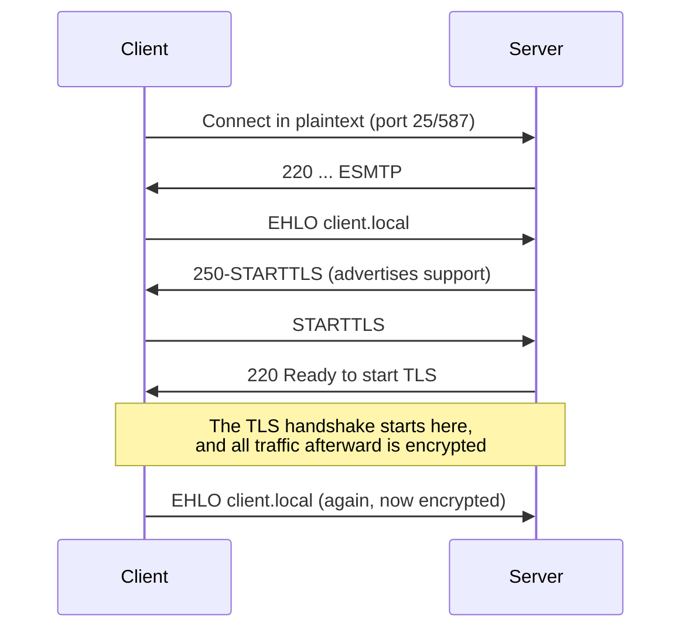

## Introduction

- **What You'll Learn From This Article**: Building on the reality of **SMTP being exchanged in plaintext**, observed via telnet in [The Top 1% Hands-On for Building a Mail Server With Postfix and Dovecot](/en/articles/mail-server-handson-guide), this article gives you a systematic understanding of **STARTTLS**, the mechanism for upgrading that plaintext connection into an encrypted one after the fact, and the "opportunistic encryption" weakness that still remains despite it.
- **Intended Audience**: Readers who know encrypted communication is the norm on the web, via HTTPS, but can't explain how TLS is handled differently in the world of email.
- **Estimated Reading Time**: About 15 minutes

This article is part of the [Top 1% Series Complete Article Guide](/en/sitemap), the 6th article in the [Mail Infrastructure Series](/en/sitemap#series-list).

## Prerequisite Knowledge

- **Plaintext SMTP Communication**: This assumes the experience of typing SMTP commands directly over telnet in [The Top 1% Hands-On for Building a Mail Server With Postfix and Dovecot](/en/articles/mail-server-handson-guide).

## The Big Picture

### Why Did Encryption Become "Bolted On" in the World of Email?

SMTP is **a protocol that was never designed with encryption in mind in the first place**, back in the 1980s. Unlike the web, where the protocol itself was redesigned around encryption from the start, as with HTTPS, the world of email faced a different challenge: **how do you encrypt SMTP, already widely deployed in plaintext, while preserving backward compatibility?** **STARTTLS** is the answer to that challenge.

## A Thorough, Grounds-Up Explanation

### STARTTLS: "Upgrading" an Existing Plaintext Connection Into an Encrypted One

Rather than starting an encrypted connection on a dedicated port from the outset, like HTTPS, **STARTTLS** is designed to **first establish an ordinary plaintext SMTP connection, then use the `STARTTLS` command to upgrade that same connection into an encrypted TLS one.** This "upgrade after the fact" design allowed a gradual transition: compatibility with older servers that don't support STARTTLS is preserved, while servers that do support it on both ends can still encrypt.

### Opportunistic TLS: Sending in Plaintext Anyway, If Encryption Isn't Available

STARTTLS's biggest weakness is its default behavior: **"if the other side doesn't support STARTTLS, keep sending in plaintext anyway."** This is called **Opportunistic TLS.** If an attacker deliberately strips the `STARTTLS` response itself somewhere along the path (a STRIPTLS attack), the sending side wrongly concludes "the other side doesn't support it," and **gives up on encryption, continuing to send in plaintext.** This is a structurally similar weakness to the early days of HTTPS, where a connection would keep happening over plain HTTP unless explicitly redirected to HTTPS.

## What a Pro Sees Here (Top 1% Understanding)

### MTA-STS: Reinforcing Opportunistic TLS's Weakness With DNS and HTTPS

A relatively recent countermeasure to opportunistic encryption's weakness is **MTA-STS** (SMTP MTA Strict Transport Security). A sending domain **combines two things** — a DNS TXT record and a policy file served over HTTPS at `https://mta-sts.<domain>/.well-known/mta-sts.txt` — to declare "mail to this domain must only be sent over TLS, to a server holding a valid certificate." **The core design insight of MTA-STS is distributing that policy over HTTPS, an already-established, encrypted, and verified channel — hardening it against a man-in-the-middle attack that DNS alone can't fully prevent.** Unlike [Understanding How SPF, DKIM, and DMARC Work](/en/articles/mail-spf-dkim-dmarc-guide), which relies entirely on DNS TXT records, MTA-STS's combination with HTTPS is what sets it apart.

### Why Skipping Certificate Verification Is a Common Real-World Setting

Postfix's `smtp_tls_security_level` has tiers: `may` (opportunistic encryption), `encrypt` (encryption required, certificate verification optional), `verify` (certificate verification also required), and `secure` (even stricter verification). **In practice, it's common to see configurations only go as far as `encrypt` (skipping verification), to communicate with a server using a self-signed certificate, in something like internal system-to-system integration.** It's worth keeping in mind that this stops traffic from being eavesdropped on, but **it does nothing to prevent a man-in-the-middle from impersonating the legitimate server itself** — a genuinely limited form of protection.

## Common Misconceptions and Pitfalls

- **Misconception 1: "Configuring STARTTLS means mail always gets sent encrypted."**
  Under the default opportunistic encryption, if the other side doesn't support STARTTLS, sending continues in plaintext.
- **Misconception 2: "STARTTLS starts an encrypted connection on a dedicated port from the outset, just like HTTPS."**
  STARTTLS is a different design — it first establishes a plaintext connection, then upgrades that same connection to an encrypted one.
- **Misconception 3: "Setting smtp_tls_security_level = encrypt also prevents communicating with a spoofed mail server."**
  encrypt prevents eavesdropping, but since it involves no certificate verification, it doesn't prevent a man-in-the-middle's impersonation itself.

## Troubleshooting Perspective

1. **STARTTLS is configured, but traffic isn't encrypted**: Check whether the destination server supports STARTTLS, and whether the STARTTLS response is being stripped somewhere along the path (possibly a STRIPTLS attack).
2. **An MTA-STS policy is configured, but senders aren't honoring it**: Check whether the sending mail server actually supports MTA-STS — it has no effect on a sender that doesn't.
3. **Can't communicate with a server using a self-signed certificate**: If `smtp_tls_security_level` is set to `verify` or `secure`, a self-signed certificate fails verification. Consider switching to `encrypt` if the environment is otherwise trusted.

## Summary

- Since SMTP was designed around plaintext, STARTTLS is designed to upgrade an existing plaintext connection into an encrypted one after the fact.
- Opportunistic TLS carries the weakness of continuing to send in plaintext if the other side doesn't support encryption.
- MTA-STS is a relatively recent mechanism that reinforces opportunistic encryption's weakness by combining DNS and HTTPS.
- A setting that skips certificate verification prevents eavesdropping but offers only limited protection, since it doesn't prevent impersonation itself.

**Takeaways to Apply Today**
1. Don't mistake STARTTLS for "always encrypted" — keep opportunistic encryption's weakness in mind.
2. If you operate an important domain, consider adopting MTA-STS.

## References

- [SMTP Service Extension for Secure SMTP over TLS | RFC 3207](https://datatracker.ietf.org/doc/html/rfc3207)
- [SMTP MTA Strict Transport Security (MTA-STS) | RFC 8461](https://datatracker.ietf.org/doc/html/rfc8461)
