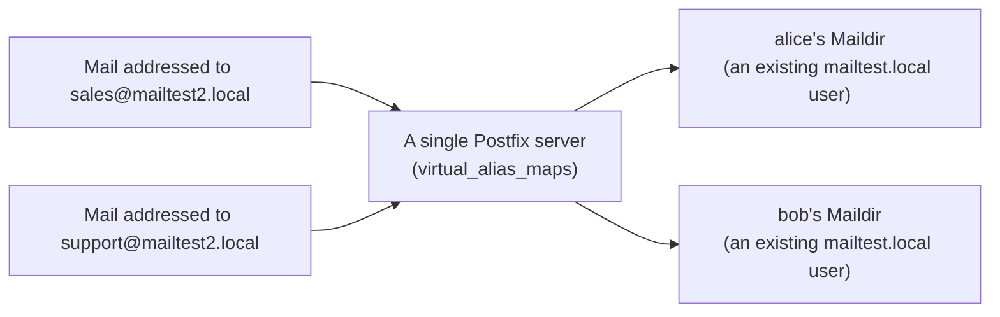

## Introduction

- **What You'll Learn From This Article**: Add a second, different domain, `mailtest2.local`, to the `mailtest.local` environment you built in [The Top 1% Hands-On for Building a Mail Server With Postfix and Dovecot](/en/articles/mail-server-handson-guide), and actually build a virtual alias domain setup — **a single Postfix server accepting mail for multiple domains.**
- **Intended Audience**: Readers who've already finished [The Top 1% Hands-On for Building a Mail Server With Postfix and Dovecot](/en/articles/mail-server-handson-guide) and have run into a need to consolidate mail for multiple customers or brands onto a single server.
- **Estimated Reading Time**: About 30 minutes

This article is part of the [Top 1% Series Complete Article Guide](/en/sitemap).

## Prerequisite Knowledge

- **Receiving Mail With Postfix**: This assumes the environment from [The Top 1% Hands-On for Building a Mail Server With Postfix and Dovecot](/en/articles/mail-server-handson-guide), with two Unix users, `alice` and `bob`.

## The Big Picture



## Hands-On Steps

### Step 1: Register the Second Domain as a Virtual Domain

Add `mailtest2.local` as a virtual alias domain in `/etc/postfix/main.cf`.

```
virtual_alias_domains = mailtest2.local
virtual_alias_maps = hash:/etc/postfix/virtual
```

**What matters here is that `mailtest2.local` is never added to `mydestination` (an ordinary domain) at all.** `virtual_alias_domains` is treated as **a domain that exists purely for redirecting destinations, with no real Unix user or mailbox of its own.**

### Step 2: Create the Destination Mapping (virtual_alias_maps)

In `/etc/postfix/virtual`, write the mapping between `mailtest2.local` addresses and their actual delivery destination (an existing Unix user).

```
sales@mailtest2.local      alice
support@mailtest2.local    bob
```

Compile it into a format Postfix can reference.

```bash
sudo postmap /etc/postfix/virtual
sudo systemctl restart postfix
```

### Step 3: Send Mail via telnet and Confirm It's Actually Delivered

Send mail addressed to `sales@mailtest2.local`.

```bash
telnet localhost 25
```

```
HELO client.local
MAIL FROM:<test@example.com>
RCPT TO:<sales@mailtest2.local>
DATA
Subject: Test to virtual domain

This is a test message to the virtual domain.
.
QUIT
```

Check `alice`'s Maildir.

```bash
sudo ls -la /home/alice/Maildir/new/
```

**Mail sent to `sales@mailtest2.local`, a destination that shouldn't exist at all, should now be sitting right in `alice`'s mailbox, a real Unix user.** You never had to create a new Unix user named `sales` for that email address.

## What a Pro Sees Here (Top 1% Understanding)

### Freedom From "Adding a Server for Every Domain"

The biggest real-world value of a virtual alias domain is that **it eliminates the need for a separate mail server per domain, for the common need of running mail under a different domain per customer or per brand.** Hosting providers and organizations running multiple brand sites commonly consolidate mail for dozens to hundreds of domains onto a small number of Postfix servers. `virtual_alias_maps` — **a plain text-based mapping table** — is the actual mechanism enabling that consolidation.

### The Difference Between Virtual Aliases and Virtual Mailboxes

The `virtual_alias_domains` covered in this hands-on is purely a mechanism for **redirecting a destination to an existing Unix user.** Separately, Postfix also has `virtual_mailbox_domains`, a more fully-fledged mechanism for **holding a dedicated mailbox entirely independent of any Unix user.** It's important to understand these serve different purposes: **a virtual alias adds a delivery destination to an existing mailbox, while a virtual mailbox creates large numbers of independent mailboxes without creating any Unix account at all.** A virtual alias is plenty for consolidating a small number of destinations, but for hosting mail at a scale of thousands of users, adopting virtual mailboxes is standard practice.

## Common Misconceptions and Pitfalls

- **Misconception 1: "Using a virtual domain requires creating a Unix user dedicated to that domain."**
  A virtual alias domain never requires creating a new Unix user — it simply redirects to an existing one.
- **Misconception 2: "A domain added to virtual_alias_domains must also be added to mydestination."**
  Adding the same domain to both makes Postfix error out at startup. A virtual domain is a separate, independent setting from mydestination.
- **Misconception 3: "Virtual aliases and virtual mailboxes are just two names for the same feature."**
  A virtual alias redirects to an existing mailbox, while a virtual mailbox creates a new, independent mailbox — entirely different purposes.

## Troubleshooting Perspective

1. **Mail to a virtual domain isn't arriving**: Check whether you recompiled with `postmap`, and whether `virtual_alias_maps`'s path is correct.
2. **Postfix errors out at startup**: Check whether the same domain appears in both `mydestination` and `virtual_alias_domains`.
3. **Only some destinations aren't being delivered**: Check whether that destination is correctly registered in `/etc/postfix/virtual`'s mapping.

## Summary

- A virtual alias domain redirects mail for a domain with no real Unix user to an existing user for delivery.
- A single mapping table, `virtual_alias_maps`, lets you consolidate mail for multiple domains onto one server, with no need for a server per domain.
- Virtual aliases and virtual mailboxes serve different purposes — redirecting to an existing user versus creating a new, independent mailbox.

**Takeaways to Apply Today**
1. When handed multi-domain mail operations, consider consolidating with virtual alias domains before adding a server per domain.
2. As the destination scale grows, consider adopting virtual mailboxes instead of virtual aliases.

## References

- [Postfix Virtual Domain Hosting Howto](https://www.postfix.org/VIRTUAL_README.html)
